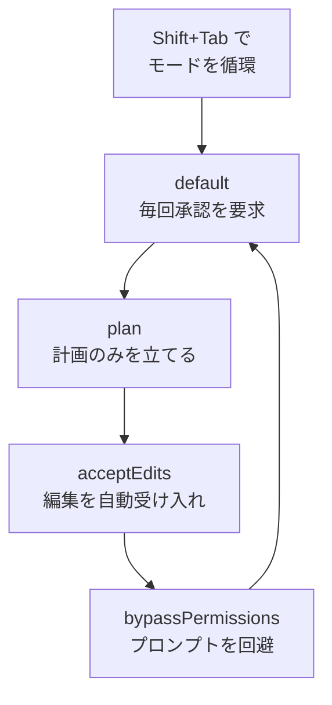

Claude Code をターミナルで実行すると現れる対話型セッション（REPL）の入力方法やショートカット、権限モードを整理します。


**ひとことで言うと**: 対話型モードは Claude Code の **コックピット** であり、1 行のプロンプトから `/` コマンド、`!` による bash 実行、`@` によるファイル参照、画像の貼り付けまで、すべての入力が集まる場所です。


## 対話型セッション（REPL）の基本的な流れ

`claude` コマンドを実行すると、対話型 REPL（Read-Eval-Print Loop）が開きます。ここでは自然言語でリクエストを送り、Claude がコードを読み込み・修正し、コマンドを実行して応答します。1 回のリクエストと応答を **ターン（turn）** と呼び、セッションが生きている間は会話のコンテキストが蓄積されていきます。

基本的な流れはシンプルです。

```text
1. claude を実行 → 対話型セッションを開始
2. プロンプトを入力 → Enter で送信
3. Claude が応答（ツール呼び出し + 結果）
4. 後続のリクエストを繰り返す → コンテキストが蓄積
5. /clear で新しいセッション、Ctrl+D で終了
```

セッションの進行中は作業ディレクトリごとに入力履歴が保存され、複雑な多段階タスクでは Claude がタスクリストを作成して進捗を追跡します。

## 5 つの入力方法

対話型セッションの入力欄は、単なるテキスト入力器ではありません。先頭の文字によって動作が変わります。

| 入力方法 | トリガー | 説明 |
|-----------|--------|------|
| **通常のプロンプト** | そのまま入力 | 自然言語のリクエスト。Claude が解釈して作業します。 |
| **スラッシュコマンド** | `/` で始める | 組み込みコマンド、スキル、プラグイン/MCP コマンドを呼び出します。 |
| **bash 実行** | `!` で始める | Claude を介さずにシェルコマンドを直接実行します。 |
| **ファイル参照** | `@` を入力 | ファイルパスの自動補完を表示し、特定のファイルをコンテキストに追加します。 |
| **画像の貼り付け** | `Ctrl+V`（貼り付け） | クリップボードの画像を `[Image #N]` チップとして挿入します。 |

### スラッシュコマンド (/)

入力欄の先頭で `/` を打つと、利用可能なすべてのコマンドメニューが表示されます。組み込みコマンドだけでなく、バンドルスキル、ユーザー作成スキル、プラグインや MCP サーバーが提供するコマンドまでが 1 つのメニューに集まります。`/` の後に文字を続けて入力すると、リアルタイムで候補が絞り込まれます。詳しい一覧は [スラッシュコマンド](/claude-code/foundations/commands) のドキュメントを参照してください。

### bash 実行 (!)

`!` で始めるとシェルモードに切り替わり、コマンドが Claude の解釈なしにすぐに実行されます。

```bash
! npm test
! git status
! ls -la
```

シェルモードはコマンドとその出力を会話のコンテキストに追加するため、素早いシェル作業をしながらも Claude が結果を把握できるようにします。長いコマンドは `Ctrl+B` でバックグラウンドに送ることができ、空の入力状態で `Escape` や `Backspace` を押すとシェルモードから抜けられます。

### ファイル参照 (@)

`@` を入力するとファイルパスの自動補完が表示されます。目的のファイルを選択すると、そのファイルが Claude のコンテキストに取り込まれ、「このファイルを直して」といったリクエストを正確に送れるようになります。

### 画像の貼り付け

スクリーンショットやデザイン案を `Ctrl+V` で貼り付けると、カーソル位置に `[Image #N]` チップが挿入されます。チップはプロンプト内で位置を基準に参照できるため、テキストと画像を混ぜて説明できます。

| 環境 | 画像の貼り付けキー |
|------|---------------------|
| デフォルト | `Ctrl+V` |
| iTerm2 (macOS) | `Cmd+V` |
| Windows / WSL | `Alt+V` |

## キーボードショートカット

対話型セッションの主要なショートカットです。プラットフォームやターミナルによって一部の動作が異なる場合があります。

| ショートカット | 動作 |
|--------|------|
| `Esc` | Claude の応答を中断（途中で止めて方向転換、作業物は維持） |
| `Esc` `Esc` | 入力があれば下書きをクリア、空ならば巻き戻しメニューを開く |
| `Ctrl+C` | 実行を中断または入力をクリア（2 回押すと終了） |
| `Ctrl+D` | セッション終了（EOF） |
| `Shift+Tab` | 権限モードを循環的に切り替え |
| `Ctrl+R` | コマンド履歴を逆方向に検索 |
| `Ctrl+O` | トランスクリプトビューアーの切り替え（ツール使用の詳細表示） |
| `Ctrl+T` | タスクリストの切り替え |
| `Ctrl+B` | 実行中のタスクをバックグラウンドへ移行 |
| `Ctrl+L` | 画面を再描画（崩れた出力を復旧） |
| `Up` / `Down` | カーソル移動、末尾に達すると履歴を探索 |

### 巻き戻し (Esc Esc)

入力欄が空のときに `Esc` を 2 回押すと、**巻き戻しメニュー（rewind menu）** が開きます。以前の時点へコードと会話を復元したり要約したりできる機能で、詳細は [チェックポイント](/claude-code/context-memory/checkpointing) のドキュメントで扱います。

### 履歴検索 (Ctrl+R)

`Ctrl+R` で以前のコマンドを対話的に検索します。検索語を入力すると一致部分が強調され、`Ctrl+R` をもう一度押すとより古い一致項目へ移動します。`Ctrl+S` で検索範囲（このセッション / このプロジェクト / すべてのプロジェクト）を切り替え、`Tab` や `Esc` で受け入れてから編集、`Enter` で即時実行します。

### macOS の Option キーに関する注意

`Alt+B`、`Alt+F`、`Alt+P` といった Option キーの組み合わせは、macOS ではターミナルの Option を Meta に設定しないと動作しません。iTerm2 では Keys 設定で Option を「Esc+」に、Apple Terminal では「Use Option as Meta Key」をオンにする必要があります。

## 権限モード

Claude Code は、ファイルの修正やコマンドの実行をどこまで自動的に許可するかを **権限モード（permission mode）** で調整します。`Shift+Tab` でモードを循環的に切り替えられます。

| モード | 動作 | 適した状況 |
|------|------|-------------|
| **default** | 操作ごとにユーザーへ承認を要求 | 慎重に進める日常的な作業 |
| **plan** | コードを修正せず計画のみを立てる | 変更前にアプローチを検討 |
| **acceptEdits** | ファイル編集を自動的に受け入れる | 信頼できる反復的な編集 |
| **bypassPermissions** | 権限プロンプトを回避 | 隔離されたサンドボックス環境などでの限定的な使用 |



bypass モードは権限確認をスキップするため、信頼できる隔離環境でのみ使用するのが安全です。MoAI-ADK もワークフローの段階に合わせてこれらのモードを活用しており、特に plan モードは計画検討ゲートとよく合います。

## 複数行入力、vim モード、出力スタイル

### 複数行入力

1 つのプロンプトに複数行を入力する方法はターミナルごとに異なります。

| 方法 | ショートカット | 備考 |
|------|--------|------|
| 素早い改行 | `\` + `Enter` | すべてのターミナルで動作 |
| Shift+Enter | `Shift+Enter` | iTerm2、WezTerm、Ghostty、Kitty、Warp などで標準サポート |
| 制御シーケンス | `Ctrl+J` | 設定なしでどこでも動作 |
| 貼り付けモード | 直接貼り付け | コードブロックやログに最適 |

VS Code、Cursor、Windsurf、Zed などで `Shift+Enter` のバインドが必要な場合は `/terminal-setup` を実行すれば設定できます。

### vim モード

`/config` の Editor mode で vim スタイルの編集を有効にできます。NORMAL モードと INSERT モードを `Esc` と `i`/`a` で行き来し、`h`/`j`/`k`/`l` の移動、`dd`/`yy`/`p` の編集、`iw`/`a"` のようなテキストオブジェクトまで、慣れ親しんだ vim の操作をそのまま使えます。ただし、`Ctrl+V` のブロックビジュアルモードはサポートされていません。

### 出力スタイルと付加機能

`/config` でテーマや表示オプション、セッションサマリー（Session recap）といった設定を調整します。そのほか、よく使う付加機能は次のとおりです。

- **`/btw`**: 会話履歴を汚染することなく、現在のタスクについて素早く質問します。回答は一時的なオーバーレイとしてのみ表示されます。
- **タスクリスト**: 多段階タスクで Claude が作成したタスクリストを `Ctrl+T` で展開・折りたたみします。
- **拡張思考の切り替え**: `Option+T`（macOS）または `Alt+T` で拡張思考モードをオン・オフします。

## 関連ドキュメント

- [スラッシュコマンド](/claude-code/foundations/commands)
- [チェックポイント](/claude-code/context-memory/checkpointing)
- [クイックスタート](/getting-started/quickstart)

## 参考資料

- [Claude Code Interactive mode（公式ドキュメント）](https://code.claude.com/docs/en/interactive-mode)


最初は `Shift+Tab` で plan モードから始めて Claude のアプローチを確認し、信頼が積み重なったら acceptEdits に切り替える流れが、最も安全かつ高速です。

