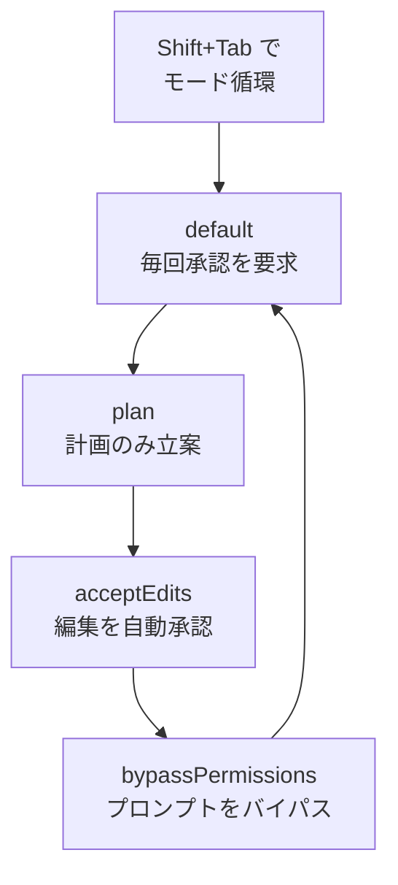

# 対話モード

Claude Code をターミナルで実行すると出会う対話型セッション (REPL) の入力方式とショートカット、権限モードを整理します。


**ひとことで言うと**: 対話モードは Claude Code の **コックピット** であり、プロンプト 1 行から `/` コマンド、`!` の bash 実行、`@` のファイル参照、画像の貼り付けまで、すべての入力が集まる場所です。


## 対話型セッション (REPL) の基本フロー

`claude` コマンドを実行すると対話型 REPL (Read-Eval-Print Loop) が開きます。ここでは自然言語でリクエストを送り、Claude がコードを読み、修正し、コマンドを実行しながら応答します。1 回のリクエストと応答を **ターン** (turn) と呼び、セッションが生きている間は会話のコンテキストが蓄積されます。

基本フローはシンプルです。

```text
1. claude 実行 → 対話型セッション開始
2. プロンプト入力 → Enter で送信
3. Claude が応答 (ツール呼び出し + 結果)
4. 後続リクエストを繰り返す → コンテキスト蓄積
5. /clear で新しいセッション、Ctrl+D で終了
```

セッション中は作業ディレクトリごとに入力履歴が保存され、複雑な多段階作業では Claude がタスクリストを作って進捗を追跡します。

## 5 つの入力方式

対話型セッションの入力欄は、単純なテキスト入力ではありません。最初の文字によって動作が変わります。

| 入力方式 | トリガー | 説明 |
|-----------|--------|------|
| **通常プロンプト** | そのまま入力 | 自然言語のリクエスト。Claude が解釈して作業します。 |
| **スラッシュコマンド** | `/` で始める | 組み込みコマンド、スキル、プラグイン/MCP コマンドを呼び出します。 |
| **bash 実行** | `!` で始める | Claude を介さずシェルコマンドを直接実行します。 |
| **ファイル参照** | `@` を入力 | ファイルパスの補完を表示し、特定のファイルをコンテキストに追加します。 |
| **画像の貼り付け** | `Ctrl+V` (貼り付け) | クリップボードの画像を `[Image #N]` チップとして挿入します。 |

### スラッシュコマンド (/)

入力欄の先頭で `/` を打つと、使用可能なすべてのコマンドメニューが表示されます。組み込みコマンドだけでなく、バンドルスキル、ユーザー作成スキル、プラグインや MCP サーバーが提供するコマンドまでが 1 つのメニューに集まります。`/` の後に文字を続けて入力すると、候補がリアルタイムで絞り込まれます。詳しい一覧は [スラッシュコマンド](/ja/claude-code/foundations/commands) を参照してください。

### bash 実行 (!)

`!` で始めるとシェルモードに切り替わり、コマンドが Claude の解釈なしにそのまま実行されます。

```bash
! npm test
! git status
! ls -la
```

シェルモードはコマンドとその出力を会話コンテキストに追加するため、素早いシェル作業をしながらも Claude が結果を把握できます。長いコマンドは `Ctrl+B` でバックグラウンドへ送れ、空の入力で `Escape` か `Backspace` を押すとシェルモードを抜けます。

### ファイル参照 (@)

`@` を入力するとファイルパスの補完が表示されます。目的のファイルを選択すると、そのファイルを Claude のコンテキストに取り込み、「このファイルを直して」のようなリクエストを正確に送れます。

### 画像の貼り付け

スクリーンショットやデザイン案を `Ctrl+V` で貼り付けると、カーソル位置に `[Image #N]` チップが挿入されます。チップはプロンプト内で位置基準で参照できるため、テキストと画像を混ぜて説明できます。

| 環境 | 画像貼り付けキー |
|------|---------------------|
| デフォルト | `Ctrl+V` |
| iTerm2 (macOS) | `Cmd+V` |
| Windows / WSL | `Alt+V` |

## キーボードショートカット

対話型セッションの主要ショートカットです。プラットフォームやターミナルによって一部の動作が異なる場合があります。

| ショートカット | 動作 |
|--------|------|
| `Esc` | Claude の応答を中断 (途中で止めて方向転換、作業物は保持) |
| `Esc` `Esc` | 入力があれば下書きをクリア、空なら巻き戻しメニューを開く |
| `Ctrl+C` | 実行の中断または入力のクリア (2 回押すと終了) |
| `Ctrl+D` | セッション終了 (EOF) |
| `Shift+Tab` または `Alt+M` | 権限モードの循環切り替え |
| `Ctrl+R` | コマンド履歴の逆方向検索 |
| `Ctrl+B` | 実行中の作業をバックグラウンドへ切り替え |
| `Ctrl+T` | タスクリストのトグル |
| `Ctrl+O` | トランスクリプトビューアのトグル (ツール使用の詳細表示) |
| `Ctrl+X` `Ctrl+K` | すべてのバックグラウンドサブエージェントを中断 |
| `Ctrl+L` | 画面の再描画 (崩れた出力の復旧) |
| `Opt+P` | モデル切り替え |
| `Opt+T` | 拡張思考 (extended thinking) モードのトグル |
| `Opt+O` | クイックモード切り替え |
| `Up` / `Down` | カーソル移動、端に達すると履歴を探索 |

### 巻き戻し (Esc Esc)

入力欄が空のときに `Esc` を 2 回押すと **巻き戻しメニュー** (rewind menu) が開きます。以前の時点へコードと会話を復元したり要約したりできる機能で、詳細は [チェックポインティング](/ja/claude-code/context-memory/checkpointing) で扱います。

### 履歴検索 (Ctrl+R)

`Ctrl+R` で過去のコマンドを対話的に検索します。検索語を入力すると一致部分がハイライトされ、`Ctrl+R` を再度押すとより古い一致項目へ移動します。`Ctrl+S` で検索範囲 (このセッション / このプロジェクト / すべてのプロジェクト) を切り替え、`Tab` や `Esc` で受け入れて編集、`Enter` で即実行します。

### macOS の Option キーに関する注意

`Alt+B`、`Alt+F`、`Alt+P` のような Option キーの組み合わせは、macOS ではターミナルの Option を Meta に設定しないと動作しません。iTerm2 では Keys 設定で Option を「Esc+」に、Apple Terminal では「Use Option as Meta Key」を有効にする必要があります。

## 権限モード

Claude Code は、ファイル修正とコマンド実行をどこまで自動で許可するかを **権限モード** (permission mode) で調整します。`Shift+Tab` でモードを循環切り替えできます。

| モード | 動作 | 適した状況 |
|------|------|-------------|
| **default** | 操作ごとにユーザーへ承認を要求 | 慎重な日常作業 |
| **plan** | コードを修正せず計画のみを立案 | 変更前のアプローチ検討 |
| **acceptEdits** | ファイル編集を自動承認 | 信頼できる反復編集 |
| **bypassPermissions** | 権限プロンプトをバイパス | 分離されたサンドボックス環境など限定的な使用 |


```mermaid
flowchart TD
    A[Shift+Tab で<br>モード循環] --> B[default<br>毎回承認を要求]
    B --> C[plan<br>計画のみ立案]
    C --> D[acceptEdits<br>編集を自動承認]
    D --> E[bypassPermissions<br>プロンプトをバイパス]
    E --> B
```

bypass モードは権限確認をスキップするため、信頼できる分離環境でのみ使うのが安全です。MoAI-ADK もワークフローの段階に合わせてこれらのモードを活用します。特に plan モードは、MoAI-ADK の「計画は深くレビューし、実装は承認後に始める」という実装着手承認ゲート (plan→run ヒューマンゲート) とまったく同じ哲学の上にあります — 高価な実装ターンに入る前に、安価な読み取り専用ターンで方向を確定するのが、トークンの観点でも最も経済的です。

## マルチライン入力、vim モード、出力スタイル

### マルチライン入力

1 つのプロンプトに複数行を入力する方法はターミナルごとに異なります。

| 方法 | ショートカット | 備考 |
|------|--------|------|
| クイック改行 | `\` + `Enter` | すべてのターミナルで動作 |
| Shift+Enter | `Shift+Enter` | iTerm2、WezTerm、Ghostty、Kitty、Warp などでデフォルト対応 |
| コントロールシーケンス | `Ctrl+J` | 設定なしでどこでも動作 |
| 貼り付けモード | 直接貼り付け | コードブロック、ログに適する |

VS Code、Cursor、Windsurf、Zed などで `Shift+Enter` バインディングが必要なら `/terminal-setup` を実行すれば設定されます。

### vim モード

`/config` の Editor mode で vim スタイルの編集を有効にできます。NORMAL モードと INSERT モードを `Esc` と `i`/`a` で行き来し、`h`/`j`/`k`/`l` の移動、`dd`/`yy`/`p` の編集、`iw`/`a"` のようなテキストオブジェクトまで、慣れ親しんだ vim の動作をそのまま使えます。ただし `Ctrl+V` の矩形ビジュアルモードには対応していません。

### 出力スタイルと付加機能

`/config` でテーマや表示オプション、セッション要約 (Session recap) といった設定を調整します。そのほかよく使う付加機能は次のとおりです。

- **`/btw`**: 会話履歴を汚さずに現在の作業について素早く質問します。回答は一時的なオーバーレイとしてのみ表示されます。
- **`/recap`**: セッションの要約 (session recap) を生成します。自動では 3 分以上または 3 ターン以上進行したセッションで有効になります。
- **タスクリスト**: 多段階作業で Claude が作ったタスクリストを `Ctrl+T` で展開・折りたたみします。タスクリストはコンテキスト圧縮の間も維持されます。
- **拡張思考トグル**: `Option+T` (macOS) または `Alt+T` で拡張思考モードをオン/オフします。

## 関連ドキュメント

- [スラッシュコマンド](/ja/claude-code/foundations/commands)
- [チェックポインティング](/ja/claude-code/context-memory/checkpointing)
- [クイックスタート](/ja/getting-started/quickstart)

## 参考資料

- [Claude Code Interactive mode (公式ドキュメント)](https://code.claude.com/docs/en/interactive-mode)


最初は `Shift+Tab` で plan モードから始めて Claude のアプローチを確認し、信頼が積み上がったら acceptEdits へ切り替える流れが、最も安全かつ速い方法です。

