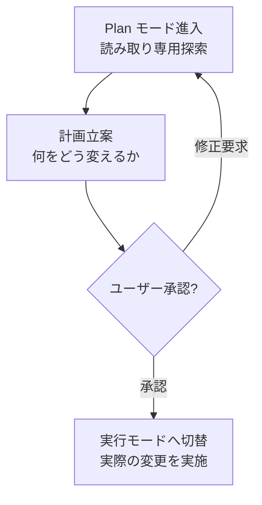

# 権限と Plan モード

Claude Code は、ツールを呼び出すたびにそれを許可するかどうかを尋ねる門番を置きます。このページでは、その権限システムと、実行前に計画をまず承認してもらう Plan モードをまとめます。


**一言でいうと**: 権限システムは建物の入口の **門番**です。誰が (どのツールが) 何をしようとしているかを確認し、通過・質問・遮断を決めます。Plan モードは工事を始める前に **見積書をまず承認してもらう**手続きで、読むだけで計画を立てたあと、ユーザーの承認を得てはじめて実際の変更に入ります。


## 権限システム

Claude がファイルを修正したりコマンドを実行したりするなど、副作用のあるツールを使おうとするたびに、権限システムがその呼び出しを横取りしてどう処理するかを決めます。決定は 3 つのルール種別で表現されます。

| ルール | 動作 |
|------|------|
| allow | 尋ねずに許可 |
| ask | ユーザーにプロンプトで確認 |
| deny | 常に遮断 |

これらのルールは `settings.json` の `permissions` ブロックに、ツール・パターン単位で宣言します。

```json
{
  "permissions": {
    "allow": ["Read", "Grep", "Bash(go test:*)"],
    "ask": ["Bash"],
    "deny": ["Read(./.env)"]
  }
}
```

よく繰り返す安全な読み取り専用コマンドを `allow` に事前登録しておくと、プロンプトの頻度を大きく減らせます。 逆に、機微なファイルや危険なコマンドは `deny` で確実に止めておきます。

## 権限モード

セッション全体の基本姿勢は権限モードで決めます。4 つのモードがあり、対話型セッションでは `Shift+Tab` で循環できます。

| モード | 動作 |
|------|------|
| `default` | 副作用のあるツールごとに確認 (最も安全なデフォルト) |
| `acceptEdits` | ファイル編集は自動承諾、それ以外の危険な動作は依然として確認 |
| `plan` | 読み取り専用。変更なしで探索・計画のみ実行 |
| `bypassPermissions` | すべての確認をスキップ |


`bypassPermissions` はすべての確認を省くので、信頼できる隔離環境でのみ使ってください。検証されていないコードやプロンプトが、危険なコマンドを無確認で実行させる可能性があります。


サブエージェントも `permissionMode` フィールドで自身の基本権限姿勢を宣言できます (詳しい値は[サブエージェント](/ja/claude-code/agentic/sub-agents)参照)。

## Plan モード

Plan モードは、上の表の `plan` 権限モードが生み出す作業フローです。Claude はまず **読み取り専用だけで**コードベースを探索し、何をどう変えるかの計画を立て、その計画をユーザーに提示します。ユーザーが承認してはじめて実際の変更に入ります。



工事の見積書をまず承認してもらってから施工に入るのと同じです。大きな変更ほど、コードに触れる前に計画を目で確認するこの段階がミスを大きく減らしてくれます。

## MoAI-ADK の実装着手承認

MoAI-ADK は、この「計画をまず承認する」という文化をワークフローに明示的なゲートとして刻み込みます。Plan 段階の成果物が監査を通過していても、Run 段階 (実際の実装) へ進む直前にオーケストレーターは自律フローを止め、**実装着手承認** (Implementation Kickoff Approval) をユーザーから受け取らなければなりません。

このゲートは Claude Code の Plan モード承認文化を SPEC ライフサイクルの次元で実装したもので、計画監査のスコアとは無関係にユーザーの進行意思を別途確認する手続きです。つまり Plan モードが「コードを変える前に計画を承認してもらう」という原則をセッション単位で提供するなら、MoAI-ADK は同じ原則を plan→run 境界の必須ヒューマンゲートに拡張します。

## 関連ドキュメント

- [対話型モード](/ja/claude-code/foundations/interactive-mode)
- [ツールリファレンス](/ja/claude-code/foundations/tools-reference)
- [.claude ディレクトリ](/ja/claude-code/foundations/claude-directory)

## 参考資料

- [Claude Code Docs — Permissions](https://code.claude.com/docs/en/permissions)
- [Claude Code Docs — Permission modes](https://code.claude.com/docs/en/permission-modes)


大きな変更を任せるときは、まず `Shift+Tab` で Plan モードに入って計画を受け取ってみましょう。計画を読んで方向が合っているときに承認すれば、コードに触れたあとで問題を見つける高くつくやり直しを避けられます。

