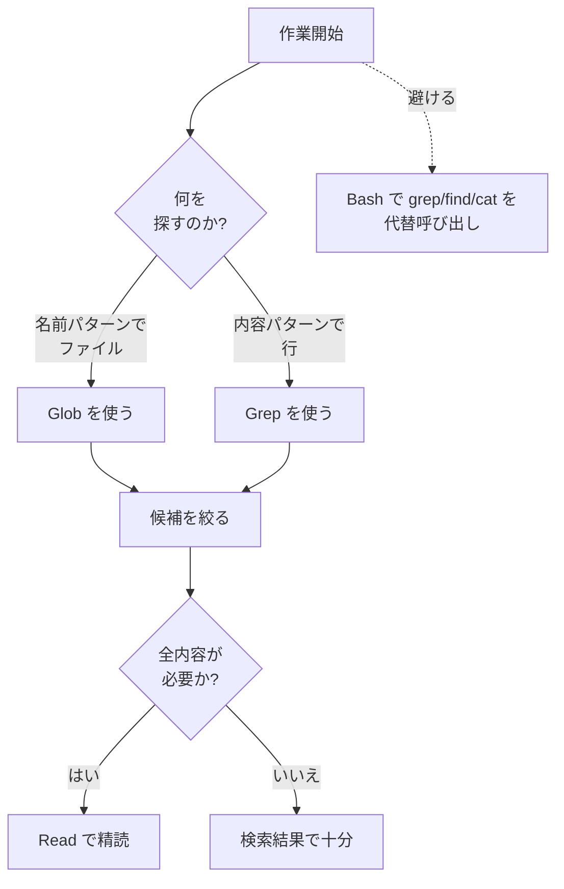

Claude Code がコードベースを理解し修正するときに使う組み込みツールと、各ツールに権限がどのように結びつくのかを整理します。


**ひとことで言うと**: ツール名は権限ルール、サブエージェントのツール一覧、hook のマッチャーでそのまま使われる識別子です。ツールの読み取り/書き込みの性質と権限の挙動を知れば、Claude Code の安全境界を自分で設計できます。


## 組み込みツールと権限の関係

Claude Code はコードを読み書きするための **組み込みツール** (built-in tools) の一式を標準で備えています。ここで重要なのは、ツール名そのものが識別子であるという点です。`Read`、`Bash`、`Edit` のような正確な文字列が、次の 3 か所で同じように使われます。

- 権限ルール (`settings.json` の `permissions.allow` / `permissions.deny`)
- サブエージェント定義の `tools` / `disallowedTools` 項目
- hook のマッチャー (matcher)

ツールは大きく **権限が不要なもの** と **権限が必要なもの** に分かれます。おおむね読み取り専用 (read-only) のツールは権限なしで動作し、ファイルを作成・修正したりコマンドを実行したりするツールは権限確認を経ます。ツールを完全に無効化するには、その名前を `deny` 配列に追加します。

## 主な組み込みツール一覧

次は日常的なコーディング作業でもっとも頻繁に使われるツールです。読み取り/書き込みの区別と権限の要否を併せて整理しました。

| ツール | 用途 | 性質 | 権限の要否 |
| :--- | :--- | :--- | :--- |
| `Read` | ファイル内容を行番号付きで読み取り (画像・PDF・ノートブックを含む) | 読み取り | - |
| `Write` | 新規ファイル作成または全体上書き | 書き込み | 必要 |
| `Edit` | 既存ファイルの正確な文字列置換 | 書き込み | 必要 |
| `Bash` | シェルコマンドの実行 | 実行 | 必要 |
| `Glob` | 名前パターンでファイルを探す | 読み取り | - |
| `Grep` | ファイル内容からパターンを検索 (ripgrep ベース) | 読み取り | - |
| `WebFetch` | URL を取得し Markdown に変換して抽出 | 読み取り (外部) | 必要 |
| `WebSearch` | Web 検索後にタイトル・URL を返す | 読み取り (外部) | 必要 |
| `Agent` | 別のコンテキストウィンドウを持つサブエージェントを生成 | 委譲 | - |
| `TaskCreate` / `TaskUpdate` / `TaskList` / `TaskGet` | セッションのタスク一覧を管理 | 管理 | - |
| `LSP` | 言語サーバーベースのコードインテリジェンス (定義へ移動、参照検索、型エラー報告) | 読み取り | - |
| `Skill` | メイン会話内でスキルを実行 | 実行 | 必要 |

`TodoWrite` は v2.1.142 以降でデフォルト無効化され、その役割を `TaskCreate` 系のツールが引き継いでいます。再び有効にするには `CLAUDE_CODE_ENABLE_TASKS=1` を設定します。

### 読み取りツールの小さな違い

同じ読み取りツールでも、挙動には微妙な違いがあります。

- `Glob` は基本的に `.gitignore` を無視せず、追跡されていないファイルも併せて探します。結果は更新時刻順にソートされ、100 件で切り捨てられます。
- `Grep` は反対に `.gitignore` を尊重し、無視されたファイルはスキップします。出力モードは `files_with_matches` (デフォルト)、`content`、`count` の 3 種類です。
- `Read` は常に絶対パスを受け取るよう案内され、トークン上限を超える大きなファイルは `offset`・`limit` でページを分けて読みます。

## 権限設定: allow / deny / ask

ツール権限は `settings.json` の `permissions` 項目、`/permissions` インターフェース、CLI フラグ (`--allowedTools`、`--disallowedTools`) で同じルール形式として扱われます。ルール形式は `ToolName(specifier)` です。

```json
{
  "permissions": {
    "allow": [
      "Read(~/project/**)",
      "Bash(npm run *)",
      "WebFetch(domain:docs.example.com)"
    ],
    "deny": [
      "Read(~/.ssh/**)",
      "Bash(rm -rf *)"
    ]
  }
}
```

指定子 (specifier) はツールの種類によって異なり、複数のツールが形式を共有します。

| ルール形式 | 適用ツール | 説明 |
| :--- | :--- | :--- |
| `Bash(npm run *)` | Bash, Monitor | コマンドパターンのマッチング |
| `Read(~/secrets/**)` | Read, Grep, Glob, LSP | パスパターンのマッチング |
| `Edit(/src/**)` | Edit, Write, NotebookEdit | パスパターンのマッチング |
| `WebFetch(domain:example.com)` | WebFetch | ドメインのマッチング |
| `WebSearch` | WebSearch | 指定子なし、ツール全体の許可/拒否 |
| `Agent(Explore)` | Agent | サブエージェント種別のマッチング |

ルールにおいて覚えておくと便利な挙動が 2 つあります。

- `Edit(...)` の許可ルールは同じパスに対する読み取り権限も併せて付与するため、対となる `Read(...)` ルールを別途置く必要はありません。
- `WebFetch` はデフォルト・`acceptEdits` モードで新しいドメインに初めてアクセスするとき一度尋ねます。あらかじめ `WebFetch(domain:...)` ルールを置いておけば、尋ねられずに許可されます。

`ask` の挙動は別個のキーではなく、許可/拒否ルールのいずれにも該当しない場合にユーザーへ尋ねるデフォルトの流れとして現れます。つまり `allow` でも `deny` でもなければ、そのツール呼び出しはユーザーに確認を求めます。

## ツール選択のベストプラクティス

Claude はおおむね自分で適切なツールを選びますが、同じ目的を達成するためのより正確で効率的な道筋が存在します。次の流れは検索作業で推奨される優先順位です。



核となる原則は次のとおりです。

- **名前でファイルを探す** には `Glob` を、**内容で行を探す** には `Grep` を使います。2 つのツールは専用のインデックスと安全な出力形式を備えています。
- **`Bash` で `grep`・`find`・`cat` を代替呼び出しすることは避けます。** Bash は権限確認を経て、出力が長くなるほどコンテキストを圧迫し、専用ツールが提供するソート・切り捨て・行番号といった構造を失います。
- ファイルを修正するときは、全体を上書きする `Write` よりも、変更部分だけを送る `Edit` を優先します。`Edit` は読み取り後に修正するルールで、意図しない上書きを防いでくれます。
- コードベース構造の把握のように範囲が広い探索は `Agent` でサブエージェントに委譲し、メインコンテキストを温存します。

## 組み込みツール vs MCP ツール

2 種類のツールは出所と登録方式が異なります。

| 区分 | 組み込みツール | MCP ツール |
| :--- | :--- | :--- |
| 出所 | Claude Code が標準提供 | 外部 MCP サーバー接続で追加 |
| 名前形式 | `Read`、`Bash` など固定名 | サーバーが公開するツール名 |
| 追加方法 | 別途インストール不要 | MCP サーバー接続 |
| 確認方法 | 「どのツールを使える?」と質問 | `/mcp` コマンドで正確な名前を確認 |

新しいツールが必要なら MCP サーバーを接続します。反対に再利用可能なプロンプトベースのワークフローが必要ならスキルを作成しますが、スキルは新しいツール項目を追加するのではなく、既存の `Skill` ツールを通じて実行されます。

セッションに実際にロードされたツール集合は、使用中のプロバイダー・プラットフォーム・設定によって変わります。現在のセッションのツールが気になるなら Claude に直接尋ね、MCP ツールの正確な名前は `/mcp` で確認します。

## 関連ドキュメント

- [フック (Hooks)](/claude-code/extensibility/hooks)
- [.claude ディレクトリ](/claude-code/foundations/claude-directory)

## 参考資料

- [Claude Code Tools reference](https://code.claude.com/docs/en/tools-reference)


検索の権限プロンプトが頻繁なら、よく使う読み取り専用コマンドを `settings.json` の `permissions.allow` に先に登録しておくと、流れが途切れません。ただし `Bash(rm -rf *)` のような破壊的パターンは必ず `deny` に置き、安全境界を明示してください。

