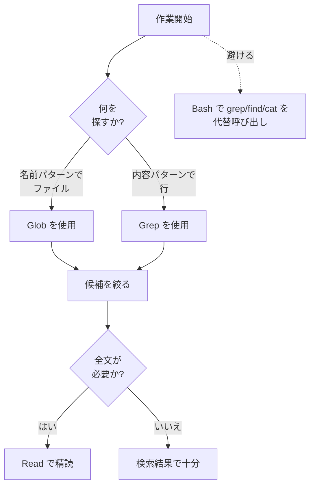

# ツールリファレンス

Claude Code がコードベースを理解し修正するときに使う組み込みツールと、各ツールに権限がどう結び付くのかを整理します。


**ひとことで言うと**: ツール名は権限ルール、サブエージェントのツールリスト、hook のマッチャーでそのまま使われる識別子なので、ツールの読み取り/書き込み特性と権限の動作を知れば、Claude Code の安全境界を自ら設計できます。


## 組み込みツールと権限の関係

Claude Code は、コードを読み修正するための **組み込みツール** (built-in tools) 一式を標準で備えています。ここで重要なのは、ツール名そのものが識別子だという点です。`Read`、`Bash`、`Edit` といった正確な文字列が、次の 3 か所で同じように使われます。

- 権限ルール (`settings.json` の `permissions.allow` / `permissions.deny`)
- サブエージェント定義の `tools` / `disallowedTools` 項目
- hook のマッチャー (matcher)

ツールは大きく **権限が不要なもの** と **権限が必要なもの** に分かれます。おおむね読み取り専用 (read-only) ツールは権限なしで動作し、ファイルを作成・修正したりコマンドを実行するツールは権限確認を経ます。ツールを完全に無効化するには、その名前を `deny` 配列に追加します。

## 主要な組み込みツール一覧

以下は日常的なコーディング作業で最もよく使われるツールです。読み取り/書き込みの区分と権限の要否をあわせて整理しました。

| ツール | 用途 | 特性 | 権限 |
| :--- | :--- | :--- | :--- |
| `Read` | ファイル内容を行番号付きで読む (画像・PDF・ノートブック含む) | 読み取り | - |
| `Write` | 新規ファイル作成または全体の上書き | 書き込み | 必要 |
| `Edit` | 既存ファイルの正確な文字列置換 | 書き込み | 必要 |
| `Bash` | シェルコマンド実行 | 実行 | 必要 |
| `Glob` | 名前パターンでファイルを探す | 読み取り | - |
| `Grep` | ファイル内容のパターン検索 (ripgrep ベース) | 読み取り | - |
| `WebFetch` | URL を取得し Markdown に変換して抽出 | 読み取り (外部) | 必要 |
| `WebSearch` | ウェブ検索を行いタイトル・URL を返す | 読み取り (外部) | 必要 |
| `Agent` | 独立したコンテキストウィンドウを持つサブエージェントを生成 | 委任 | - |
| `TaskCreate` / `TaskUpdate` / `TaskList` / `TaskGet` | セッションのタスクリスト管理 | 管理 | - |
| `LSP` | 言語サーバーベースのコードインテリジェンス (定義移動、参照検索、型エラー報告) | 読み取り | - |
| `Skill` | メイン会話内でスキルを実行 | 実行 | 必要 |

`TodoWrite` は v2.1.142 以降デフォルトで無効になり、その役割を `TaskCreate`/`TaskUpdate`/`TaskList`/`TaskGet` 系のツールが引き継いでいます。

### 読み取りツールの細かな違い

同じ読み取りツールでも、動作には微妙な違いがあります。

- `Glob` はデフォルトで `.gitignore` を無視しないため、追跡されていないファイルも一緒に見つけます。結果は更新時刻順に並び、100 件で切り詰められます。
- `Grep` は逆に `.gitignore` を尊重し、無視されたファイルはスキップします。出力モードは `files_with_matches` (デフォルト)、`content`、`count` の 3 種類です。
- `Read` は常に絶対パスを受け取るよう案内され、トークン上限を超える大きなファイルは `offset`・`limit` でページ分割して読みます。

## 権限設定: allow / deny / ask

ツール権限は `settings.json` の `permissions` 項目、`/permissions` インターフェース、CLI フラグ (`--allowedTools`、`--disallowedTools`) で同じルール形式として扱われます。ルール形式は `ToolName(specifier)` です。

```json
{
  "permissions": {
    "allow": [
      "Read(~/project/**)",
      "Bash(npm run *)",
      "WebFetch(domain:docs.example.com)"
    ],
    "deny": [
      "Read(~/.ssh/**)",
      "Bash(rm -rf *)"
    ]
  }
}
```

指定子 (specifier) はツールの種類によって異なり、複数のツールが形式を共有します。

| ルール形式 | 適用ツール | 説明 |
| :--- | :--- | :--- |
| `Bash(npm run *)` | Bash, Monitor | コマンドパターンのマッチング |
| `Read(~/secrets/**)` | Read, Grep, Glob, LSP | パスパターンのマッチング |
| `Edit(/src/**)` | Edit, Write, NotebookEdit | パスパターンのマッチング |
| `WebFetch(domain:example.com)` | WebFetch | ドメインのマッチング |
| `WebSearch` | WebSearch | 指定子なし、ツール全体を許可/拒否 |
| `Agent(Explore)` | Agent | サブエージェント種別のマッチング |

ルールで有用な動作を 2 つ覚えておくとよいでしょう。

- `Edit(...)` の許可ルールは同じパスに対する読み取り権限もあわせて付与するため、対になる `Read(...)` ルールを別に置く必要はありません。
- `WebFetch` はデフォルト・`acceptEdits` モードで新しいドメインへ初めてアクセスするときに 1 回確認します。あらかじめ `WebFetch(domain:...)` ルールを置いておけば、確認なしで許可されます。

`ask` の動作は別のキーではなく、許可/拒否ルールに該当しない場合にユーザーへ確認する既定フローとして現れます。つまり `allow` でも `deny` でもなければ、そのツール呼び出しはユーザーに確認を求めます。

## ツール選択のベストプラクティス

Claude はおおむね自分で適切なツールを選びますが、同じ目的を達成するより正確で効率的な道が存在します。次のフローは検索作業で推奨される優先順位です。


```mermaid
flowchart TD
    A[作業開始] --> B{何を<br>探すか?}
    B -->|名前パターンで<br>ファイル| C[Glob を使用]
    B -->|内容パターンで<br>行| D[Grep を使用]
    C --> E[候補を絞る]
    D --> E
    E --> F{全文が<br>必要か?}
    F -->|はい| G[Read で精読]
    F -->|いいえ| H[検索結果で十分]
    A -.避ける.-> I[Bash で grep/find/cat を<br>代替呼び出し]
```

核心となる原則は次のとおりです。

- **名前でファイルを探す** には `Glob` を、**内容で行を探す** には `Grep` を使います。2 つのツールは専用のインデックスと安全な出力形式を備えています。
- **`Bash` で `grep`・`find`・`cat` を代替呼び出しするのは避けます**。Bash は権限確認を経るうえ、出力が長くなるほどコンテキストを圧迫し、専用ツールが提供する並び替え・切り詰め・行番号といった構造を失います。
- ファイルを直すときは、全体を上書きする `Write` より、変更部分だけを送る `Edit` を優先します。`Edit` は読み取り後修正のルールにより、意図しない上書きを防いでくれます。
- コードベース構造の把握のような広範な探索は、`Agent` でサブエージェントに委任してメインコンテキストを保全します。

## 組み込みツール vs MCP ツール

2 種類のツールは、出どころと登録方式が異なります。

| 区分 | 組み込みツール | MCP ツール |
| :--- | :--- | :--- |
| 出どころ | Claude Code が標準提供 | 外部 MCP サーバー接続で追加 |
| 名前の形式 | `Read`、`Bash` などの固定名 | サーバーが公開するツール名 |
| 追加方法 | 追加インストール不要 | MCP サーバー接続 |
| 確認方法 | 「どのツールが使える?」と質問 | `/mcp` コマンドで正確な名前を確認 |

新しいツールが必要なら MCP サーバーを接続します。逆に再利用可能なプロンプトベースのワークフローが必要ならスキルを書きますが、スキルは新しいツール項目を追加する代わりに、既存の `Skill` ツールを通じて実行されます。

セッションに実際にロードされるツールの集合は、使用中のプロバイダー・プラットフォーム・設定によって変わります。現在のセッションのツールが知りたければ Claude に直接尋ね、MCP ツールの正確な名前は `/mcp` で確認します。

## MoAI-ADK とツール境界

ツール名がそのまま権限ルール・サブエージェントのツールリスト・hook マッチャーの識別子であるという事実は、ハーネス設計の出発点です。MoAI-ADK はこの仕組みで安全境界を引きます — 読み取り専用の探索エージェントには `Read`/`Grep`/`Glob` のみを許可し、書き込み可能な実装エージェントは同時に 2 つ以上動かさず、破壊的な Bash パターンは deny ルールでブロックします。また「専用ツール優先」の原則 (Bash の `grep` の代わりに `Grep`、`cat` の代わりに `Read`) は安全だけでなくトークンの問題でもあります。専用ツールの構造化された出力 (並び替え・切り詰め・行番号) は、シェルコマンドの生の出力よりコンテキストをはるかに少なく占めるからです。

## 関連ドキュメント

- [フック (Hooks)](/claude-code/extensibility/hooks)
- [.claude ディレクトリ](/claude-code/foundations/claude-directory)

## 参考資料

- [Claude Code Tools reference](https://code.claude.com/docs/en/tools-reference)


検索の権限プロンプトが頻発するなら、よく使う読み取り専用コマンドを `settings.json` の `permissions.allow` に先に登録しておくと、流れが途切れません。ただし `Bash(rm -rf *)` のような破壊的パターンは必ず `deny` に置き、安全境界を明示してください。

