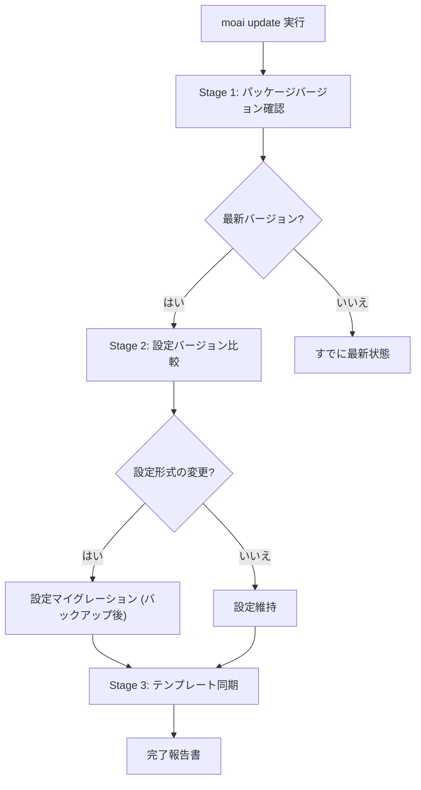
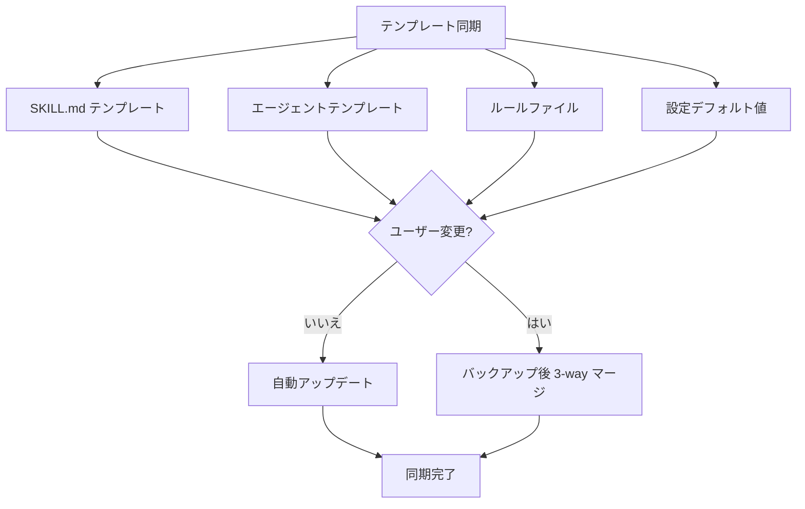

MoAI-ADK を最新バージョンに保つ方法を案内します。`moai update` 一つでバイナリとテンプレートが一緒に更新され、ユーザーが作ったカスタム資産は自動的に保存されます。

## アップデートコマンド

フラグなしで実行するとバイナリとテンプレートの両方を更新します — これがデフォルトの動作です。

```bash
moai update
```

### 3 段階スマートアップデート



### Stage 1: パッケージバージョン確認

現在インストールされているバージョンと GitHub Releases の最新バージョンを比較します。

```bash
# 現在のバージョン確認
moai --version

# 利用可能なアップデートのみ確認 (実際のアップデートはしない)
moai update --check
```

### checksum 義務検証 (Mandatory Checksum Verification) {#checksum-verification}

`moai update` の binary ダウンロードは **checksum 検証を回避できません**。release の `checksums.txt` ダウンロードが失敗するかパースが失敗するとアップデートフローを **abort** します — binary のダウンロードを試みません。

#### Retry ポリシー

`checksums.txt` のダウンロードは **3 回 retry** を指数バックオフで試行します:

| 試行 | 待機時間 |
|------|-----------|
| 1 回目 (即時) | 0s |
| 2 回目 retry | 2s 待機 |
| 3 回目 retry | 4s 待機 |
| 追加 retry なし | 合計 ~6s 待機後に失敗 |

すべての retry が失敗すると次のようなメッセージが出力されます:

```
error: checksum unavailable: persistent retry failure after 3 attempts
```

**`--skip-checksum` のような回避オプションは存在しません** (CWE-345 の意図されたポリシー)。

#### 失敗時の復旧手順

1. **ネットワーク接続の確認**:
   ```bash
   curl -I https://github.com/modu-ai/moai-adk/releases/latest
   ```
2. **Proxy / firewall の確認** — GitHub release asset ドメイン (`github.com`、`objects.githubusercontent.com`) の許可有無
3. **一時的な GitHub CDN 障害の可能性** — しばらくして再試行
4. **手動 binary インストール** (永久遮断時):
   ```bash
   curl -fsSL https://raw.githubusercontent.com/modu-ai/moai-adk/main/install.sh | bash
   ```
   手動インストール時は GitHub Release の `checksums.txt` を別途確認することを推奨します。

詳しい脅威モデルは [セキュリティノート — CWE-345](/ja/advanced/security-notes/#cwe-345) を参照してください。

### Stage 2: 設定バージョン比較

設定ファイルの形式と互換性を検査します。形式が変更された場合、自動的にバックアップ後にマイグレーションします。

**検査ファイル:**

- `.moai/config/sections/` 配下の YAML ファイル


設定マイグレーションの前に必ず `.moai/config/` ディレクトリがバックアップされます。


### Stage 3: テンプレート同期

プロジェクトテンプレートと基本ファイルを最新バージョンに同期します。ユーザーが修正したファイルは保存され、新バージョンとの衝突時はバックアップ後にマージされます。



## フラグリファレンス

| フラグ | 説明 |
|--------|------|
| `--check` | 新バージョンがあるかのみ確認 (アップデートしない) |
| `-c, --config` | 設定ウィザードの再実行 (テンプレート同期はしない) |
| `--force` | 強制アップデート (バージョン一致をスキップ、バックアップ+マージを強制) |
| `--yes` | すべての確認を自動承認 (CI/CD モード) |
| `--templates-only` | バイナリアップデートをスキップしテンプレートのみ同期 |
| `--binary` | テンプレート同期をスキップしバイナリのみアップデート |
| `--dry-run` | ファイルシステム変更なしで計画された作業のみ表示 |
| `--no-hooks` | Git フックのインストールをスキップ |
| `--verbose` | すべての警告を表示 (診断モード) |
| `--shell-env` | Claude Code 用のシェル環境変数を構成 |
| `--profile <max\|medium\|low>` | モデル+effort プロファイルの上書き (`llm.yaml` の `profile` に保存) |

### 動作方式

| コマンド | バイナリアップデート | テンプレート同期 |
|--------|-------------------|---------------|
| `moai update` |  |  |
| `moai update --binary` |  |  |
| `moai update --templates-only` |  |  |
| `moai update --check` |  |  (バージョン確認のみ) |

### バイナリ専用アップデート

バイナリのみアップデートしテンプレートは同期しません:

```bash
moai update --binary
```

### テンプレート専用同期

テンプレートのみ同期しバイナリはアップデートしません:

```bash
moai update --templates-only
```

### 設定ウィザードの再実行

設定ウィザードを再実行してプロジェクト構成を変更します (テンプレート同期は行いません):

```bash
moai update -c
# または
moai update --config
```

### Dry Run

実際の変更なしで計画されたアーカイブとインストール作業を事前に確認します:

```bash
moai update --dry-run
```

### CI/CD モード

すべての確認を自動承認します:

```bash
moai update --yes
```

## アップデート後の手順

### ステップ 1: バージョン確認

```bash
moai --version
```

### ステップ 2: 設定検証

```bash
moai doctor
```

### ステップ 3: 新機能の確認

```bash
moai --help
```

## 個人設定の管理

MoAI-ADK アップデート時に **CLAUDE.md** と `settings.json` は新バージョンに同期されます。個人的な修正事項は別のファイルに保管してください。

| ファイル | 場所 | アップデートの影響 |
|------|------|--------------|
| `CLAUDE.md` | プロジェクトルート |  アップデート時に変更される (MoAI-ADK 管理) |
| `settings.json` | `.claude/` |  アップデート時に変更される (MoAI-ADK 管理) |
| `CLAUDE.local.md` | プロジェクトルート |  影響なし (個人設定) |
| `.claude/settings.local.json` | プロジェクト |  影響なし (個人設定) |


**設定の優先順位:** Local > Project > User > Enterprise<br />
`settings.local.json` がプロジェクト設定をオーバーライドします。


### moai フォルダ構造

MoAI-ADK は次のフォルダでのみファイルを管理します:

```
.claude/
├── agents/
│   ├── moai/                # MoAI-ADK エージェント (アップデート対象)
│   └── harness/             # ユーザーハーネスエージェント (アップデート除外、保存)
│
├── hooks/
│   └── moai/                # MoAI-ADK フックスクリプト (アップデート対象)
│
├── skills/
│   ├── moai-*               # MoAI-ADK スキル (moai- 接頭辞、アップデート対象)
│   └── hns-*                # ユーザー生成スキル (アップデート除外、保存)
│
└── rules/
    └── moai/                # ルールファイル (moai 管理)
```

| タイプ | 場所 | アップデートの影響 |
|------|------|--------------|
| **エージェント** | `agents/moai/` |  アップデート時に変更される |
| **フック** | `hooks/moai/` |  アップデート時に変更される |
| **スキル** | `skills/moai-*` |  アップデート時に変更される |
| **ルール** | `rules/moai/` |  アップデート時に変更される |
| **ユーザーエージェント** | `agents/harness/` |  アップデートの影響なし (保存) |
| **ユーザースキル** | `skills/hns-*` (レガシー `harness-*`、`my-*` を含む) |  アップデートの影響なし (保存) |


**重要:** <code>moai-*</code> 接頭辞を持つスキルは MoAI-ADK が管理し、アップデート時に上書きされます。自分で作ったスキルは <code>hns-*</code> 接頭辞 (ユーザー所有ネームスペース) を、エージェントは <code>.claude/agents/harness/</code> ディレクトリを使ってください。


## ロールバック

アップデート後に問題が発生したら、以前のバージョンにロールバックできます:

```bash
# 手動再インストールで特定バージョンを復元
curl -fsSL https://raw.githubusercontent.com/modu-ai/moai-adk/main/install.sh | bash -s -- --version <リリースタグ>

# バックアップから設定を復元
cp -r .moai/config.bak .moai/config
```


ロールバックの前に現在の作業をコミットしてください。


## 問題解決

### アップデート失敗

```bash
# ネットワーク確認
curl -I https://github.com/modu-ai/moai-adk/releases/latest

# 手動再インストール
curl -fsSL https://raw.githubusercontent.com/modu-ai/moai-adk/main/install.sh | bash
```

### 設定マイグレーションエラー

```bash
# バックアップから復元
cp -r .moai/config.bak .moai/config

# 設定検証
moai doctor
```

### テンプレート衝突

ユーザーが修正したテンプレートファイルは自動的にバックアップ後 3-way マージされます。衝突が発生したら `--verbose` で詳細な警告を確認してください:

```bash
moai update --verbose
```

強制的に上書きするには `--force` を使います (既存のユーザー変更事項は `.moai/archive/` にバックアップされます):

```bash
moai update --force
```

## 次のステップ

1. **[変更ログの確認](https://github.com/modu-ai/moai-adk/releases)** — 新機能の学習
2. **[核心概念](/ja/core-concepts/what-is-moai-adk)** — 新しいエージェントおよび機能の習得
3. **[クイックスタート](./quickstart)** — プロジェクトへの新機能の適用
