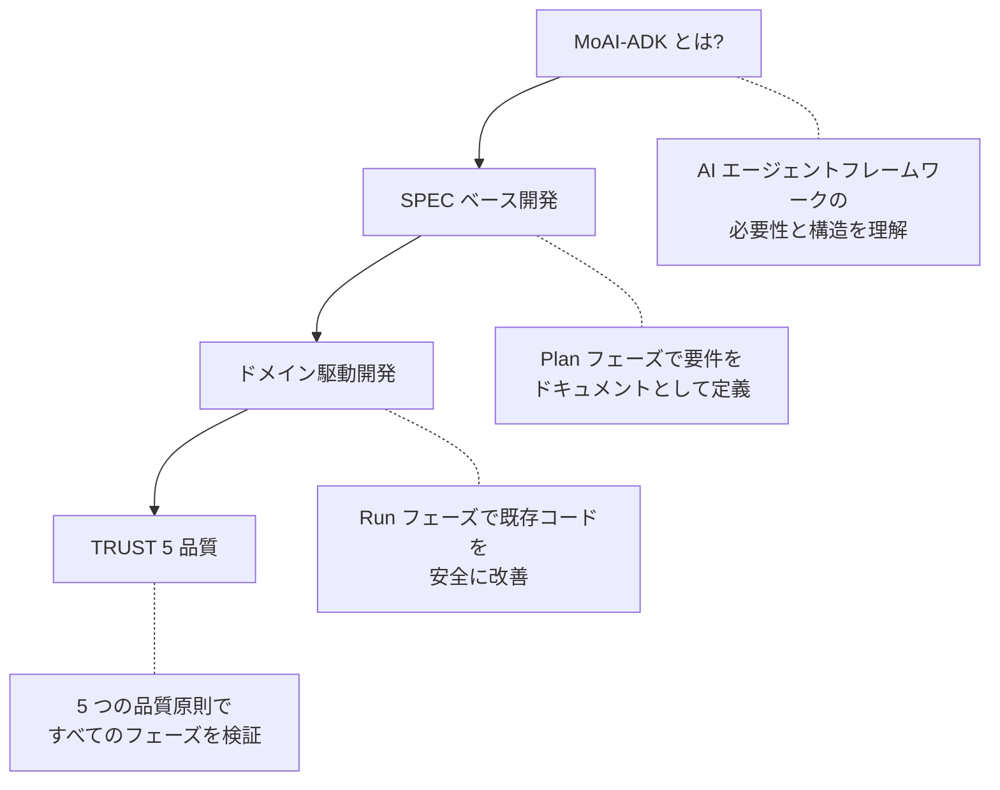

MoAI-ADK を理解するための 4 つのコアコンセプトの紹介です。


初めてですか? 上から順に読むことで、MoAI-ADK の全体像を自然に理解できます。


## 学習順序

| 順序 | ドキュメント | 主要な問い |
|-------|----------|--------------|
| 1 | [MoAI-ADK とは?](/core-concepts/what-is-moai-adk) | AI 開発ツールが必要な理由と構造は? |
| 2 | [SPEC ベース開発](/core-concepts/spec-based-dev) | 要件を明確に定義・管理する方法は? |
| 3 | [ドメイン駆動開発](/core-concepts/ddd) | 既存の機能を壊さずにコードを改善する方法は? |
| 4 | [TRUST 5 品質](/core-concepts/trust-5) | コード品質を保証する標準は? |


各ドキュメントは独立して読めますが、順に読むことで MoAI-ADK の開発哲学が自然につながります。**SPEC** で「何を」作るかを定義し、**DDD** で安全に作り、**TRUST 5** で品質を検証します。

