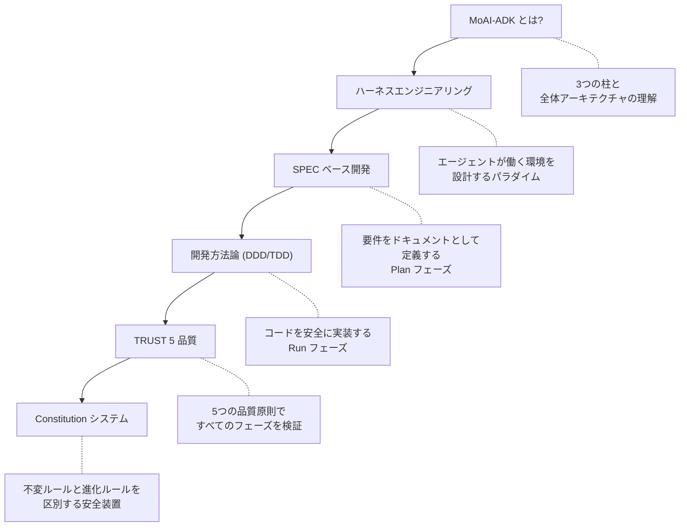

MoAI-ADK v3.0 を理解するために必要なコアコンセプトを紹介します。v3.0 の価値は3つの柱に要約されます — **トークノミクス** (Token Economics)、**エージェンティックループエンジニアリング** (Agentic Loop Engineering)、そして **エージェンティックハーネス** (Agentic Harness)。このセクションのドキュメントは、その3つの柱が実際の開発フローでどのように機能するのかを1つずつ解き明かします。




初めての方へ。上から下へ順番に読むと、MoAI-ADK の全体像が自然に描けます。各ドキュメントは独立して読んでも問題ありません。


## 3つの柱

| 柱 | 中心となる問い | 代表ドキュメント |
|------|----------|----------|
| **トークノミクス** | 同じ品質をより少ないトークンで得るには? | [MoAI-ADK とは?](/core-concepts/what-is-moai-adk) |
| **エージェンティックループエンジニアリング** | ループはどのように自ら働き、学習するのか? | [ハーネスエンジニアリング](/ja/core-concepts/harness-engineering) |
| **エージェンティックハーネス** | エージェントがうまく働ける環境をどう設計するのか? | [SPEC ベース開発](/core-concepts/spec-based-dev) · [TRUST 5](/core-concepts/trust-5) |

```mermaid
flowchart TD
    A["MoAI-ADK とは?"] --> B["ハーネスエンジニアリング"]
    B --> C["SPEC ベース開発"]
    C --> D["開発方法論 (DDD/TDD)"]
    D --> E["TRUST 5 品質"]
    E --> F["Constitution システム"]

    A -.- A1["3つの柱と\n全体アーキテクチャの理解"]
    B -.- B1["エージェントが働く環境を\n設計するパラダイム"]
    C -.- C1["要件をドキュメントとして定義する\nPlan フェーズ"]
    D -.- D1["コードを安全に実装する\nRun フェーズ"]
    E -.- E1["5つの品質原則で\nすべてのフェーズを検証"]
    F -.- F1["不変ルールと進化ルールを\n区別する安全装置"]
```

## 学習順序

| 順序 | ドキュメント | 中心となる問い |
|------|------|----------|
| 1 | [MoAI-ADK とは?](/core-concepts/what-is-moai-adk) | MoAI-ADK とは何か、なぜトークノミクスを目標とするのか? |
| 2 | [ハーネスエンジニアリング](/ja/core-concepts/harness-engineering) | コードを直接書く代わりに環境を設計するとはどういう意味か? |
| 3 | [SPEC ベース開発](/core-concepts/spec-based-dev) | 要件をどのように明確に定義し管理するのか? |
| 4 | [開発方法論 (DDD/TDD)](/core-concepts/ddd) | 既存のコードを壊さずにどう改善するのか? |
| 5 | [TRUST 5 品質](/core-concepts/trust-5) | コード品質をどんな基準で保証するのか? |
| 6 | [Constitution システム](/ja/core-concepts/constitution) | ハーネスが自ら進化するとき、その進化を何が統制するのか? |


フローとして要約するとこうなります。**SPEC** で何を作るかを決め、**DDD/TDD** で安全に作り、**TRUST 5** で品質を検証します。この全体のループを包み込むのが **ハーネス** であり、ループが回るほどハーネスが学習して指針が進化します — その進化の安全装置が **Constitution** です。

