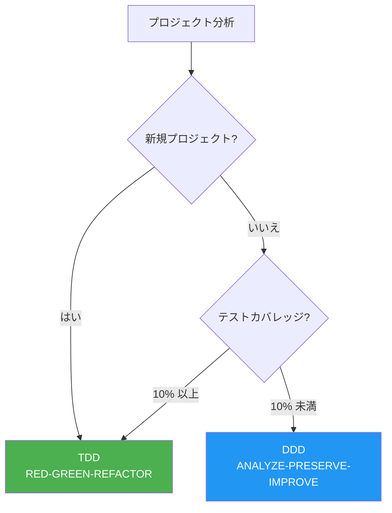
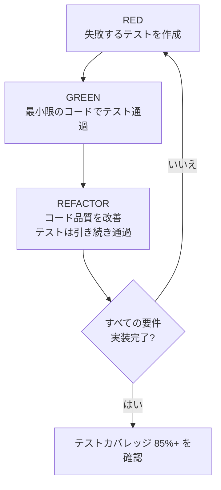
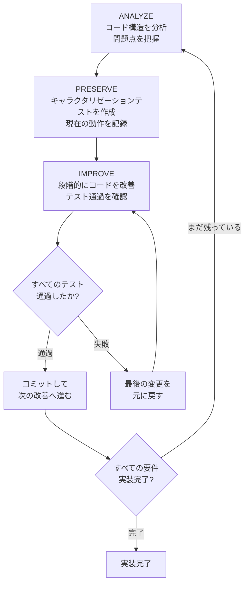
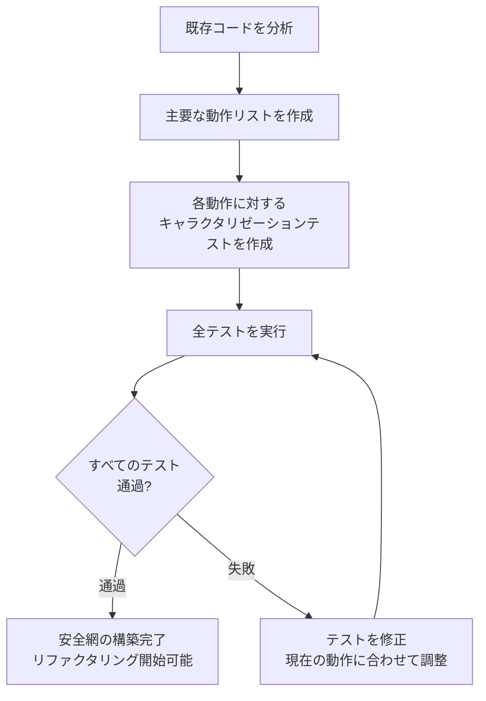
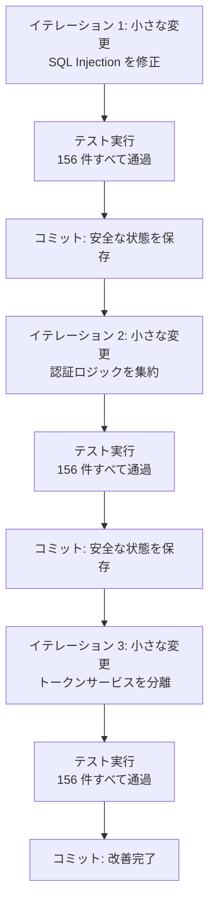
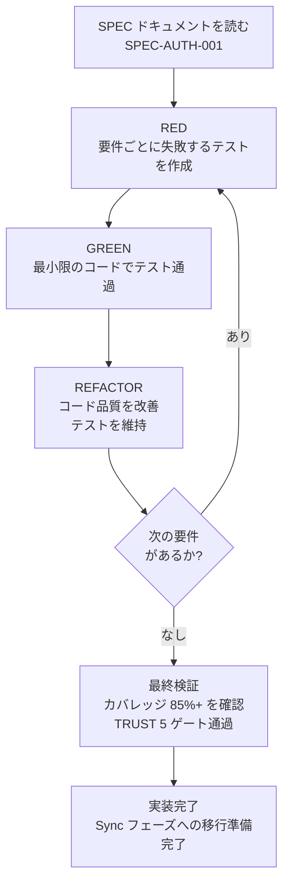
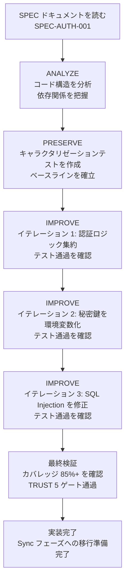

MoAI-ADK の開発方法論を詳しくご案内します。プロジェクトの状態に応じて TDD または DDD を
選択して使用します。


  **一行まとめ:** 新規プロジェクトは **TDD** (RED-GREEN-REFACTOR)、テストがほとんどない
  既存プロジェクトは **DDD** (ANALYZE-PRESERVE-IMPROVE) を使用します。
  `quality.yaml` で直接選択することもできます。


## 方法論概要

MoAI-ADK はプロジェクトの状態に応じて最適な開発方法論を自動的に選択します。



| プロジェクトタイプ                         | 方法論  | サイクル                    | 説明                                           |
| ------------------------------------------ | ------- | --------------------------- | ---------------------------------------------- |
| **新規プロジェクト**                       | **TDD** | RED-GREEN-REFACTOR          | テストを先に書いてから実装                     |
| **既存プロジェクト** (カバレッジ >= 10%)   | **TDD** | RED-GREEN-REFACTOR          | 部分的なテスト基盤で TDD を拡張               |
| **既存プロジェクト** (カバレッジ < 10%)    | **DDD** | ANALYZE-PRESERVE-IMPROVE    | キャラクタリゼーションテストで安全な段階的改善 |


  **方法論は直接選択できます:** `.moai/config/sections/quality.yaml` で
  `development_mode` を `tdd` または `ddd` に設定すると、自動選択を上書きして
  任意の方法論を使用できます。


## TDD とは?

**TDD** (Test-Driven Development) は **テストを先に書き、そのテストを
通過する最小限のコードを実装する** 開発方法論です。MoAI-ADK のデフォルト方法論で、
ほとんどのプロジェクトで使用されます。

### RED-GREEN-REFACTOR サイクル

TDD は 3 つのステップを繰り返すサイクルで進行します。



### ステップ 1: RED (失敗するテストを作成)

実装する機能の **テストを先に** 書きます。まだコードがないため、テストは必ず
失敗します。

**核心原則:**

- 一度に 1 つのテストのみ作成
- 実装したい動作を Given-When-Then で明確に記述
- テストが失敗することを確認 (失敗しなければテストに意味がない)

### ステップ 2: GREEN (最小限のコードでテスト通過)

テストを通過する **最もシンプルなコード** を書きます。

**核心原則:**

- 事前に最適化や抽象化をしない
- 正確性に集中し、エレガントさは後回し
- テストが通過したら止める

### ステップ 3: REFACTOR (コード品質を改善)

テストが通過する状態を維持しながらコードを整理します。

**核心原則:**

- 重複コードを除去
- 変数名、関数名を改善
- SOLID 原則を適用
- テストは引き続き通過すること

### TDD 実践例

```python
# RED: 失敗するテストを先に作成
def test_user_registration():
    """
    GIVEN: 有効なユーザー情報があり
    WHEN: 会員登録を行うと
    THEN: ユーザーが作成され、ウェルカムメールが送信されること
    """
    user_service = UserService()
    result = user_service.register(
        email="newuser@example.com",
        password="SecurePass123!"
    )

    assert result.success is True
    assert result.user.id is not None
    assert email_service.welcome_email_sent("newuser@example.com") is True

# テスト実行 (失敗を想定 - 未実装)
# > pytest test_user_service.py - test_user_registration FAILED

# ====================================

# GREEN: 最小限のコードでテスト通過
class UserService:
    def register(self, email: str, password: str) -> RegistrationResult:
        user = User.create(email, password)
        user_repository.save(user)
        email_service.send_welcome(email)
        return RegistrationResult.success(user)

# テスト実行 (通過)
# > pytest test_user_service.py - test_user_registration PASSED

# ====================================

# REFACTOR: コード品質を改善 (テストは引き続き通過)
class UserService:
    def __init__(
        self,
        user_repo: UserRepository,
        email_service: EmailService,
        password_validator: PasswordValidator
    ):
        self.user_repo = user_repo
        self.email_service = email_service
        self.password_validator = password_validator

    def register(self, email: str, password: str) -> RegistrationResult:
        if not self.password_validator.validate(password):
            return RegistrationResult.failure("パスワードが無効です")

        user = User.create(email, password)
        self.user_repo.save(user)
        self.email_service.send_welcome(email)
        return RegistrationResult.success(user)

# テスト実行 (依然として通過)
# > pytest test_user_service.py - test_user_registration PASSED
```

### 既存プロジェクトでの TDD (Brownfield Enhancement)

TDD を既存コードがあるプロジェクトで使用する場合は **Pre-RED ステップ** が追加されます:

1. **(Pre-RED)** 対象領域の既存コードを読み、現在の動作を理解します
2. **RED:** 既存コードの理解に基づいて失敗するテストを作成します
3. **GREEN:** 最小限のコードでテストを通過させます
4. **REFACTOR:** テストを維持しながらコードを改善します


  既存コードがあっても、テストカバレッジが 10% 以上であれば TDD を使用できます。
  Pre-RED ステップで既存の動作を把握した上でテストを作成するため、既存機能を
  安全に保持しながら新しい機能を追加できます。


## DDD とは?

**DDD** (Domain-Driven Development) は **安全なコード改善方法** です。既存の
コードを尊重しながら段階的に改善するアプローチです。テストがほとんどない (10%
未満) 既存プロジェクトで使用されます。

### 家のリフォームの例え

DDD を初めて知る方のために **家のリフォーム** で例えて説明します。築 10 年の家を
リフォームすることを想像してみてください。

| 家のリフォーム段階    | DDD 段階              | 行うこと                           | なぜ重要か                                                    |
| --------------------- | --------------------- | ---------------------------------- | ------------------------------------------------------------- |
| 家を点検する          | **ANALYZE** (分析)    | 壁のひび割れ、配管の状態を確認     | どこに問題があるか分からなければ修理できません                  |
| 現状を写真に撮る      | **PRESERVE** (保存)   | すべての部屋を写真で記録           | 後で「ここに壁があったっけ?」と迷った時に確認できます           |
| 一部屋ずつリフォーム  | **IMPROVE** (改善)    | 一度に一部屋だけ工事し毎回確認     | 一度にすべて壊すとどこで問題が発生したか分かりません            |

**間違った方法 vs 正しい方法:**

```
間違った方法: 「コード全体を一度にすべて変更します!」
  --> 既存機能が壊れるリスクが高い
  --> 問題が発生した時、どこで間違ったか見つけにくい

正しい方法: 「テストで現在の動作を記録し、少しずつ変更します!」
  --> 既存機能が壊れたらテストがすぐに知らせてくれる
  --> 問題が発生したら最後の変更だけ元に戻せばよい
```

### ANALYZE-PRESERVE-IMPROVE サイクル

MoAI-ADK の DDD は 3 つのステップを繰り返すサイクルで進行します。



### ステップ 1: ANALYZE (分析)

既存コードの構造を徹底的に分析します。医師が患者を診察するのと同じです。

**分析項目:**

| 分析対象   | 確認内容                               | 例え                 |
| ---------- | -------------------------------------- | -------------------- |
| ファイル構造 | どのファイルがあり、どう接続されているか | 家の図面を確認       |
| 依存関係   | どのモジュールがどのモジュールに依存しているか | 配管と電気配線を確認 |
| テスト状況 | 既存テストがどれくらいあるか           | 既存の保険を確認     |
| 問題点     | 重複コード、セキュリティ脆弱性、パフォーマンスボトルネック | ひび割れ、水漏れの確認 |

**manager-ddd が生成する分析レポートの例:**

```markdown
## コード分析レポート

- 対象: src/auth/ (認証モジュール)
- ファイル: 8 つの Python ファイル
- コード行数: 1,850 行
- テストカバレッジ: 5%

## 発見された問題
1. 重複した認証ロジック (3 箇所で同じコードが繰り返し)
2. ハードコードされた秘密鍵 (config.py に直接記述)
3. SQL Injection 脆弱性 (user_repository.py)
4. 不十分なテスト (5%、目標 85%)
```

### ステップ 2: PRESERVE (保存)

既存の動作を保持するための **安全網** を構築します。このステップの核心は **キャラクタリゼーション
テスト** (Characterization Tests) の作成です。


  **キャラクタリゼーションテストとは?**

  家のリフォーム前に現在の状態を **写真に撮っておく** のと同じです。

  通常のテストは「これが正しく動作しているか?」を確認します。しかしキャラクタリゼーション
  テストは「現在これがどのように動作しているか?」を記録します。

  つまり、正しい/間違いを判断するのではなく、**「元々このように動作していた」という事実を
  記録** するのです。後でコードを変更した後にテストが失敗すれば、既存の動作が
  変わったことをすぐに知ることができます。


**キャラクタリゼーションテストの例:**

```python
class TestExistingLoginBehavior:
    """既存のログイン関数の現在の動作を記録するキャラクタリゼーションテスト"""

    def test_valid_login_returns_token(self):
        """
        GIVEN: 登録済みユーザーが存在し
        WHEN: 正しいパスワードでログインすると
        THEN: 現在の実装が返すレスポンスをそのまま記録
        """
        user = create_test_user(
            email="test@example.com",
            password="password123"
        )

        result = login_service.login("test@example.com", "password123")

        # 現在の動作をそのまま記録 (正否を判断しない)
        assert result["status"] == "success"
        assert result["token"] is not None
        assert result["expires_in"] == 3600  # 現在の有効期限

    def test_wrong_password_returns_error(self):
        """間違ったパスワードでのログイン時の現在の動作を記録"""
        create_test_user(email="test@example.com", password="password123")

        result = login_service.login("test@example.com", "wrongpassword")

        assert result["status"] == "error"
        assert result["code"] == 401
```

**テスト作成戦略:**



### ステップ 3: IMPROVE (改善)

キャラクタリゼーションテストが構築されたら、安全にコードを改善できます。核心原則は
**小さなステップに分けて変更する** ことです。

**改善プロセス:**

```python
# BEFORE: 改善前のコード
def login(email, password):
    # SQL Injection 脆弱性
    user = db.query("SELECT * FROM users WHERE email = '" + email + "'")
    if user and check_password(user.password, password):
        token = generate_token(user.id)
        return {"status": "success", "token": token}
    return {"status": "error", "code": 401}

# ====================================

# AFTER: 改善後のコード (3 回のイテレーションを経て完成)
def login(email: str, password: str) -> LoginResult:
    """ユーザーログインを処理します。"""
    # イテレーション 1: パラメータ化クエリで SQL Injection を防止
    user = user_repository.find_by_email(email)

    if not user:
        return LoginResult.failure("資格情報が無効です")

    # イテレーション 2: 認証ロジックを集約
    if not auth_service.verify_password(user, password):
        return LoginResult.failure("資格情報が無効です")

    # イテレーション 3: トークンサービスを分離
    token = token_service.generate(user.id)
    return LoginResult.success(token)
```

**段階的改善ステップ:**




  **核心原則:** 変更のたびに必ずテストを実行します。テストが失敗したら
  最後の変更だけを元に戻せばよいのです。これが「小さなステップ」の力です。一度に多くの
  変更を行うと、どこで問題が発生したか見つけにくくなります。


## 方法論の比較

| 側面              | TDD                           | DDD                            |
| ----------------- | ----------------------------- | ------------------------------ |
| **テストタイミング** | コード作成前 (RED)           | 分析後 (PRESERVE)              |
| **カバレッジアプローチ** | コミット単位で厳格な基準 | 段階的改善                     |
| **最適な状況**    | 新規プロジェクト、10%+ カバレッジ | カバレッジ 10% 未満のレガシー  |
| **リスクレベル**  | 中 (規律が必要)              | 低 (動作保持)                  |
| **カバレッジ免除** | 不可                         | 許可                           |
| **Run Phase サイクル** | RED-GREEN-REFACTOR        | ANALYZE-PRESERVE-IMPROVE       |


  **方法論選択ガイド:**

  - **新規プロジェクト** (グリーンフィールド): TDD (デフォルト)
  - **既存プロジェクト** (カバレッジ 50% 以上): TDD
  - **既存プロジェクト** (カバレッジ 10-49%): TDD (Pre-RED ステップ活用)
  - **既存プロジェクト** (カバレッジ 10% 未満): DDD (段階的キャラクタリゼーションテスト)


## キャラクタリゼーションテストとは?

キャラクタリゼーションテストは DDD の核心ツールです。もう少し詳しく見ていきましょう。

### 通常のテストとの違い

| 区分          | 通常のテスト                      | キャラクタリゼーションテスト       |
| ------------- | --------------------------------- | ---------------------------------- |
| **目的**      | 「これが正しく動作しているか?」  | 「これが現在どのように動作しているか?」 |
| **作成時期**  | 新しいコードの作成前/後           | 既存コードのリファクタリング前     |
| **基準**      | 要件 (設計書)                     | 現在の実際の動作                   |
| **例え**      | 設計図通りに建てたか確認          | 現在の家の状態を写真で記録         |

### 作成原則

1. **判断せず記録のみ**: 現在のコードにバグがあっても、その動作をそのまま
   記録します
2. **エッジケースを含める**: 正常ケースだけでなく例外ケースもすべて記録します
3. **再現可能にする**: テストを何度実行しても同じ結果が出なければなりません
4. **高速にする**: キャラクタリゼーションテストは高速に実行でき、変更のたびにすぐ検証
   できる必要があります

## 実行方法

### TDD の実行

SPEC ドキュメントが準備できたら、以下のコマンドで TDD サイクルを実行します。

```bash
# TDD 実行 (development_mode: tdd の場合)
> /moai run SPEC-AUTH-001
```

このコマンドを実行すると **manager-tdd エージェント** が自動的に RED-GREEN-REFACTOR
サイクルを実行します:



### DDD の実行

```bash
# DDD 実行 (development_mode: ddd の場合)
> /moai run SPEC-AUTH-001
```

このコマンドを実行すると **manager-ddd エージェント** が自動的に
ANALYZE-PRESERVE-IMPROVE サイクルを実行します:



## 方法論の設定

`.moai/config/sections/quality.yaml` ファイルで開発方法論を設定します。

### TDD 設定 (デフォルト)

```yaml
constitution:
  development_mode: tdd  # TDD 方法論を使用

  tdd_settings:
    test_first_required: true         # 実装前のテスト作成必須
    red_green_refactor: true          # RED-GREEN-REFACTOR サイクル遵守
    min_coverage_per_commit: 80       # コミットあたりの最小カバレッジ
    mutation_testing_enabled: false   # ミューテーションテスト (任意)

  test_coverage_target: 85            # 全体カバレッジ目標
```

### DDD 設定

```yaml
constitution:
  development_mode: ddd  # DDD 方法論を使用

  ddd_settings:
    require_existing_tests: true      # リファクタリング前の既存テスト必須
    characterization_tests: true      # キャラクタリゼーションテストの自動生成
    behavior_snapshots: true          # スナップショットテストの使用
    max_transformation_size: small    # 変更サイズの制限
    preserve_before_improve: true     # 保存してから改善必須

  test_coverage_target: 85            # 全体カバレッジ目標
```

**DDD max_transformation_size オプション:**

| 値       | 変更範囲                   | 推奨状況                         |
| -------- | -------------------------- | -------------------------------- |
| `small`  | 1-2 ファイル、単純リファクタリング | 一般的なコード改善 (推奨)        |
| `medium` | 3-5 ファイル、中程度の複雑さ | モジュール構造の変更             |
| `large`  | 10 ファイル以上            | アーキテクチャ変更 (注意が必要)  |


  `max_transformation_size` を `large` に設定すると、一度に多くのファイルを変更するため、
  問題発生時の原因特定が困難になります。できるだけ `small` を維持することを
  推奨します。


## 実践例: レガシーコードのリファクタリング

3 年前に作成された認証モジュールをリファクタリングするシナリオです。テストカバレッジが 5% と
非常に低いため、DDD 方法論を使用します。

### 状況

```
問題点:
- SQL Injection 脆弱性 2 箇所
- ハードコードされた秘密鍵
- 重複した認証ロジック 3 箇所
- テストカバレッジ 5%
- コード複雑度が高い
```

### 実行プロセス

```bash
# ステップ 1: SPEC 作成 (Plan)
> /moai plan "レガシー認証システムのリファクタリング。SQL Injection 修正、秘密鍵の環境変数化、認証ロジックの集約"

# manager-spec が SPEC-AUTH-REFACTOR-001 を作成
```

```bash
# ステップ 2: DDD 実行 (Run)
> /moai run SPEC-AUTH-REFACTOR-001

# manager-ddd が ANALYZE-PRESERVE-IMPROVE サイクルを実行
# ANALYZE: コード分析、問題点リスト作成
# PRESERVE: キャラクタリゼーションテスト 156 件作成
# IMPROVE: 3 回のイテレーションで段階的改善
```

```bash
# ステップ 3: ドキュメント同期 (Sync)
> /moai sync SPEC-AUTH-REFACTOR-001

# manager-docs が API ドキュメント更新、リファクタリングレポートを作成
```

### 結果

| 指標                   | Before | After    | 変化           |
| ---------------------- | ------ | -------- | -------------- |
| テストカバレッジ       | 5%     | 87%      | +82%           |
| SQL Injection 脆弱性   | 2 箇所 | 0 箇所   | 完全除去       |
| ハードコードされた秘密鍵 | あり  | なし     | 環境変数化     |
| 重複コード             | 3 箇所 | 0 箇所   | 集約完了       |
| コード複雑度           | 高い   | 35% 削減 | 構造改善       |


  **重要ポイント:** リファクタリングの過程で既存の動作は一つも変更されませんでした。
  キャラクタリゼーションテスト 156 件がすべてのイテレーションで通過したため、既存ユーザーに影響を
  与えることなくコード品質を大幅に向上させました。


## 関連ドキュメント

- [SPEC ベース開発](/core-concepts/spec-based-dev) -- 開発方法論の実行前に SPEC
  ドキュメントが必要です
- [TRUST 5 品質](/core-concepts/trust-5) -- 実装完了後の品質検証基準を
  確認します
