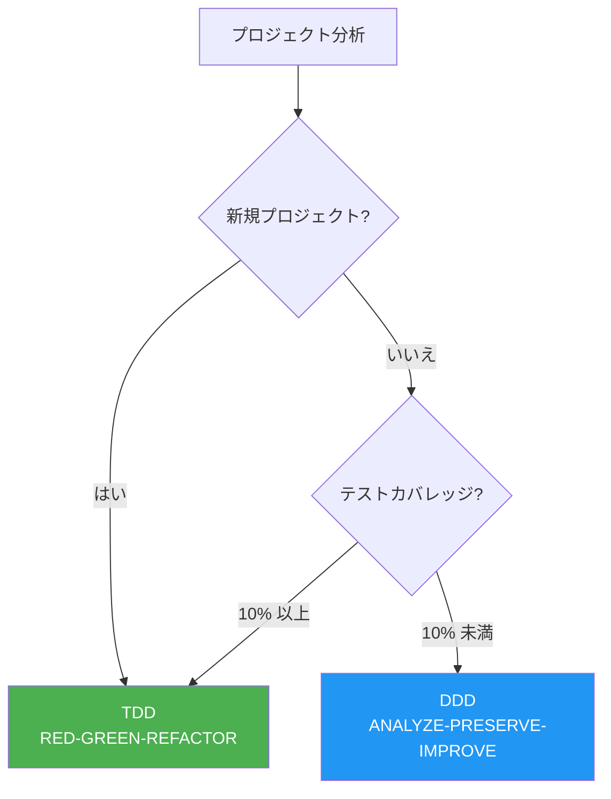
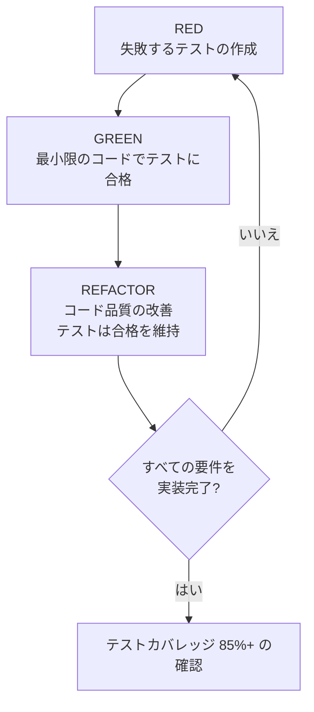
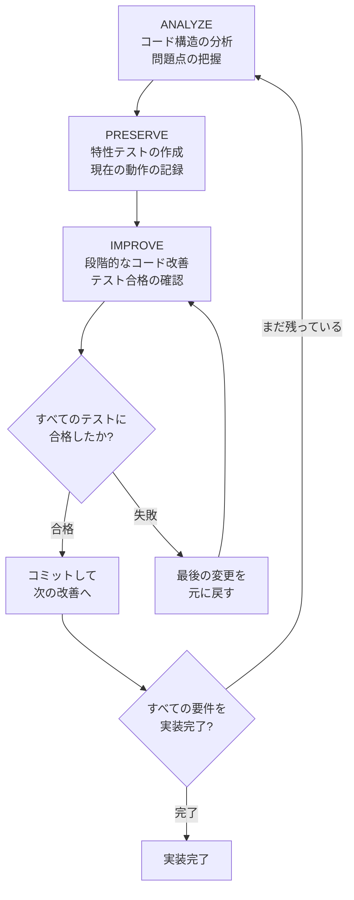
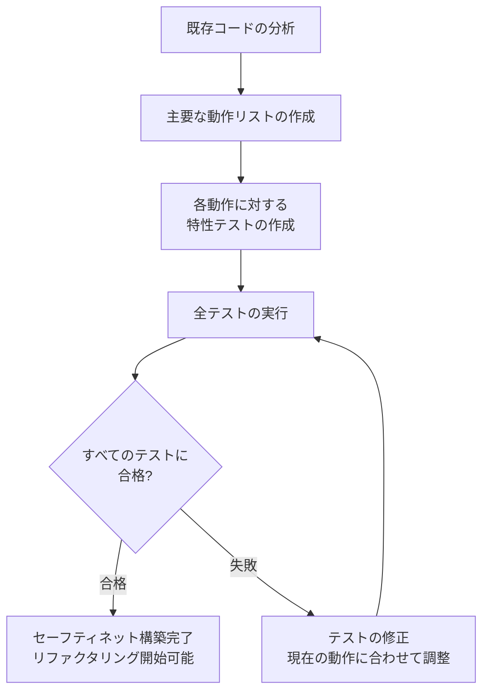
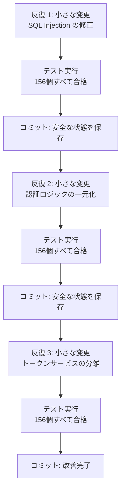
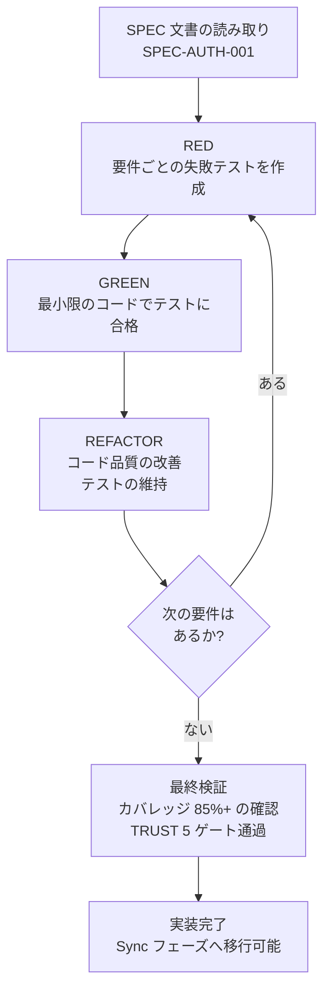
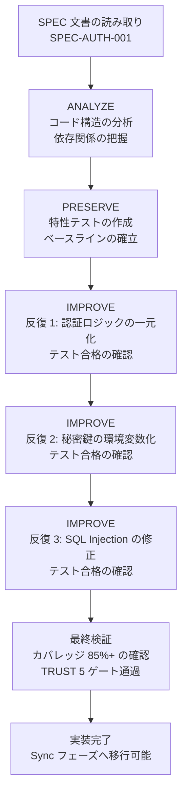

MoAI-ADK の開発方法論を詳しく案内します。Run フェーズでエージェントがコードを実装するときに従う規律で、プロジェクト状態に応じて TDD または DDD を選択して使用します。方法論が明確だとエージェントは迷いません — テストがそのまま完了条件になり、ループが自ら収束し、不要な再試行にトークンを浪費しません。


  **一言要約:** 新規プロジェクトは **TDD** (RED-GREEN-REFACTOR)、テストがほとんどない既存プロジェクトは **DDD** (ANALYZE-PRESERVE-IMPROVE) を使います。`quality.yaml` で直接選択することもできます。


## 方法論の概要

MoAI-ADK はプロジェクト状態に応じて、最適な開発方法論を自動的に選択します。


```mermaid
flowchart TD
    A["プロジェクト分析"] --> B{"新規プロジェクト?"}
    B -->|"はい"| C["TDD\nRED-GREEN-REFACTOR"]
    B -->|"いいえ"| D{"テストカバレッジ?"}
    D -->|"10% 以上"| C
    D -->|"10% 未満"| E["DDD\nANALYZE-PRESERVE-IMPROVE"]

    style C fill:#4CAF50,color:#fff
    style E fill:#2196F3,color:#fff
```

| プロジェクトの種類 | 方法論 | サイクル | 説明 |
| ---------------------------------- | ------- | ------------------------- | ---------------------------------------- |
| **新規プロジェクト** | **TDD** | RED-GREEN-REFACTOR | テストを先に書いてから実装 |
| **既存プロジェクト** (カバレッジ ≥ 10%) | **TDD** | RED-GREEN-REFACTOR | 部分的なテスト基盤の上で TDD を拡張 |
| **既存プロジェクト** (カバレッジ < 10%) | **DDD** | ANALYZE-PRESERVE-IMPROVE | 特性テストで安全な段階的改善 |


  **方法論は直接選択できます:** `.moai/config/sections/quality.yaml` で `development_mode` を `tdd` または `ddd` に設定すると、自動選択を無視して希望の方法論を使えます。


## TDD とは?

**TDD** (Test-Driven Development) は、**テストを先に書き、そのテストに合格する最小限のコードを実装する** 開発方法論です。MoAI-ADK の既定の方法論で、ほとんどのプロジェクトで使われます。

### RED-GREEN-REFACTOR サイクル

TDD は3つのステップを繰り返すサイクルで進みます。


```mermaid
flowchart TD
    A["RED\n失敗するテストの作成"] --> B["GREEN\n最小限のコードでテストに合格"]
    B --> C["REFACTOR\nコード品質の改善\nテストは合格を維持"]
    C --> D{"すべての要件を\n実装完了?"}
    D -->|"いいえ"| A
    D -->|"はい"| E["テストカバレッジ 85%+ の確認"]
```

### ステップ 1: RED (失敗するテストの作成)

実装する機能の **テストを先に** 書きます。まだコードがないので、テストは必ず失敗します。

**基本原則:**

- 一度に1つのテストだけを書く
- 実装しようとする動作を Given-When-Then で明確に記述する
- テストが失敗することを確認する (失敗しないならテストに意味がない)

### ステップ 2: GREEN (最小限のコードでテストに合格)

テストに合格する **最もシンプルなコード** を書きます。

**基本原則:**

- 先回りの最適化や抽象化をしない
- 正確さに集中し、エレガンスは後回し
- テストが合格したら止まる

### ステップ 3: REFACTOR (コード品質の改善)

テストが合格する状態を維持しながら、コードを整理します。

**基本原則:**

- 重複コードの除去
- 変数名、関数名の改善
- SOLID 原則の適用
- テストは合格し続けなければならない

### TDD の実践例

```python
# RED: 失敗するテストを先に作成
def test_user_registration():
    """
    GIVEN: 有効なユーザー情報があり
    WHEN: 会員登録をすると
    THEN: ユーザーが作成され、ウェルカムメールが送信されるべき
    """
    user_service = UserService()
    result = user_service.register(
        email="newuser@example.com",
        password="SecurePass123!"
    )

    assert result.success is True
    assert result.user.id is not None
    assert email_service.welcome_email_sent("newuser@example.com") is True

# テスト実行 (失敗を想定 - 未実装)
# > pytest test_user_service.py - test_user_registration FAILED

# ====================================

# GREEN: 最小限のコードでテストに合格
class UserService:
    def register(self, email: str, password: str) -> RegistrationResult:
        user = User.create(email, password)
        user_repository.save(user)
        email_service.send_welcome(email)
        return RegistrationResult.success(user)

# テスト実行 (合格)
# > pytest test_user_service.py - test_user_registration PASSED

# ====================================

# REFACTOR: コード品質の改善 (テストは合格を維持)
class UserService:
    def __init__(
        self,
        user_repo: UserRepository,
        email_service: EmailService,
        password_validator: PasswordValidator
    ):
        self.user_repo = user_repo
        self.email_service = email_service
        self.password_validator = password_validator

    def register(self, email: str, password: str) -> RegistrationResult:
        if not self.password_validator.validate(password):
            return RegistrationResult.failure("パスワードが無効です")

        user = User.create(email, password)
        self.user_repo.save(user)
        self.email_service.send_welcome(email)
        return RegistrationResult.success(user)

# テスト実行 (依然として合格)
# > pytest test_user_service.py - test_user_registration PASSED
```

### 既存プロジェクトでの TDD (Brownfield Enhancement)

TDD を既存コードのあるプロジェクトで使うときは、**Pre-RED ステップ** が追加されます:

1. **(Pre-RED)** 対象領域の既存コードを読み、現在の動作を理解します
2. **RED:** 既存コードの理解をもとに、失敗するテストを作成します
3. **GREEN:** 最小限のコードでテストに合格させます
4. **REFACTOR:** テストを維持しながらコードを改善します


  既存コードがあっても、テストカバレッジが 10% 以上なら TDD を使えます。Pre-RED ステップで既存の動作を把握してからテストを書くため、既存機能を安全に保存しながら新機能を追加できます。


## DDD とは?

**DDD** (Domain-Driven Development) は **安全なコード改善の方法** です。既存コードを尊重しながら段階的に改善するアプローチです。テストがほとんどない (10% 未満) 既存プロジェクトで使われます。

### 家のリフォームの例え

DDD に初めて触れる方のために、**家のリフォーム** に例えて説明します。築10年の家をリフォームすると想像してみてください。

| 家のリフォーム段階 | DDD の段階 | やること | なぜ重要か |
| --------------------- | --------------------- | ---------------------------------- | ----------------------------------------------------------- |
| 家の点検 | **ANALYZE** (分析) | 壁のひび、配管の状態を確認 | どこに問題があるか分からなければ直せません |
| 現在の状態を撮影 | **PRESERVE** (保存) | すべての部屋の写真を撮って記録 | 後で「元々ここに壁があったっけ?」と迷ったときに確認できます |
| 部屋を1つずつリフォーム | **IMPROVE** (改善) | 一度に1部屋だけ工事し、毎回確認 | 一度に全部壊すと、どこで問題が起きたのか分かりません |

**間違った方法 vs 正しい方法:**

```
間違った方法: 「コード全体を一度に全部変えます!」
  --> 既存機能が壊れるリスクが高いです
  --> 問題が起きたとき、どこで間違えたのか見つけにくいです

正しい方法: 「テストで現在の動作を記録し、少しずつ変えます!」
  --> 既存機能が壊れたらテストがすぐに教えてくれます
  --> 問題が起きたら最後の変更だけ元に戻せばよいです
```

### ANALYZE-PRESERVE-IMPROVE サイクル

MoAI-ADK の DDD は3つのステップを繰り返すサイクルで進みます。


```mermaid
flowchart TD
    A["ANALYZE\nコード構造の分析\n問題点の把握"] --> B["PRESERVE\n特性テストの作成\n現在の動作の記録"]
    B --> C["IMPROVE\n段階的なコード改善\nテスト合格の確認"]
    C --> D{"すべてのテストに\n合格したか?"}
    D -->|"合格"| E["コミットして\n次の改善へ"]
    D -->|"失敗"| F["最後の変更を\n元に戻す"]
    F --> C
    E --> G{"すべての要件を\n実装完了?"}
    G -->|"まだ残っている"| A
    G -->|"完了"| H["実装完了"]
```

### ステップ 1: ANALYZE (分析)

既存コードの構造を徹底的に分析します。医師が患者を診察するのと同じです。

**分析項目:**

| 分析対象 | 確認内容 | 例え |
| ---------- | ---------------------------------- | ------------------ |
| ファイル構造 | どんなファイルがあり、どうつながっているか | 家の図面の確認 |
| 依存関係 | どのモジュールがどのモジュールに依存するか | 配管と電気配線の確認 |
| テストの現況 | 既存テストがどれくらいあるか | 既存の保険の確認 |
| 問題点 | 重複コード、セキュリティ脆弱性、性能ボトルネック | ひび割れた壁、水漏れの確認 |

**manager-develop が生成する分析レポートの例:**

```markdown
## コード分析レポート

- 対象: src/auth/ (認証モジュール)
- ファイル: 8個の Python ファイル
- コード行数: 1,850行
- テストカバレッジ: 5%

## 発見された問題
1. 重複した認証ロジック (3か所で同じコードが繰り返し)
2. ハードコードされた秘密鍵 (config.py に直接記述)
3. SQL Injection 脆弱性 (user_repository.py)
4. 不十分なテスト (5%、目標 85%)
```

### ステップ 2: PRESERVE (保存)

既存の動作を保存するための **セーフティネット** を構築します。このステップの核心は **特性テスト** (Characterization Tests) の作成です。


  **特性テストとは?**

  家のリフォーム前に現在の状態を **写真に撮っておくこと** と同じです。

  一般的なテストは「これは正しく動作するか?」を確認します。しかし特性テストは「現在これはどう動作しているか?」を記録します。

  つまり、正しい/間違いを判断するのではなく、**「元々こう動作していた」という事実を記録** するのです。後でコードを変更してテストが失敗すれば、既存の動作が変わったことがすぐに分かります。


**特性テストの例:**

```python
class TestExistingLoginBehavior:
    """既存のログイン関数の現在の動作を記録する特性テスト"""

    def test_valid_login_returns_token(self):
        """
        GIVEN: 登録済みのユーザーがいて
        WHEN: 正しいパスワードでログインすると
        THEN: 現在の実装が返すレスポンスをそのまま記録
        """
        user = create_test_user(
            email="test@example.com",
            password="password123"
        )

        result = login_service.login("test@example.com", "password123")

        # 現在の動作をそのまま記録 (正誤を判断しない)
        assert result["status"] == "success"
        assert result["token"] is not None
        assert result["expires_in"] == 3600  # 現在の有効期限

    def test_wrong_password_returns_error(self):
        """間違ったパスワードでのログイン時の現在の動作を記録"""
        create_test_user(email="test@example.com", password="password123")

        result = login_service.login("test@example.com", "wrongpassword")

        assert result["status"] == "error"
        assert result["code"] == 401
```

**テスト作成戦略:**


```mermaid
flowchart TD
    A["既存コードの分析"] --> B["主要な動作リストの作成"]
    B --> C["各動作に対する\n特性テストの作成"]
    C --> D["全テストの実行"]
    D --> E{"すべてのテストに\n合格?"}
    E -->|"合格"| F["セーフティネット構築完了\nリファクタリング開始可能"]
    E -->|"失敗"| G["テストの修正\n現在の動作に合わせて調整"]
    G --> D
```

### ステップ 3: IMPROVE (改善)

特性テストが構築されたら、いよいよ安全にコードを改善できます。基本原則は **小さなステップに分けて変更すること** です。

**改善の過程:**

```python
# BEFORE: 改善前のコード
def login(email, password):
    # SQL Injection の脆弱性
    user = db.query("SELECT * FROM users WHERE email = '" + email + "'")
    if user and check_password(user.password, password):
        token = generate_token(user.id)
        return {"status": "success", "token": token}
    return {"status": "error", "code": 401}

# ====================================

# AFTER: 改善後のコード (3回の反復を経て完成)
def login(email: str, password: str) -> LoginResult:
    """ユーザーのログインを処理します。"""
    # 反復 1: パラメータ化クエリで SQL Injection を防止
    user = user_repository.find_by_email(email)

    if not user:
        return LoginResult.failure("認証情報が無効です")

    # 反復 2: 認証ロジックの一元化
    if not auth_service.verify_password(user, password):
        return LoginResult.failure("認証情報が無効です")

    # 反復 3: トークンサービスの分離
    token = token_service.generate(user.id)
    return LoginResult.success(token)
```

**段階的な改善ステップ:**


```mermaid
flowchart TD
    S1["反復 1: 小さな変更\nSQL Injection の修正"] --> T1["テスト実行\n156個すべて合格"]
    T1 --> C1["コミット: 安全な状態を保存"]
    C1 --> S2["反復 2: 小さな変更\n認証ロジックの一元化"]
    S2 --> T2["テスト実行\n156個すべて合格"]
    T2 --> C2["コミット: 安全な状態を保存"]
    C2 --> S3["反復 3: 小さな変更\nトークンサービスの分離"]
    S3 --> T3["テスト実行\n156個すべて合格"]
    T3 --> C3["コミット: 改善完了"]
```


  **基本原則:** 変更のたびに必ずテストを実行します。テストが失敗したら、最後の変更だけ元に戻せばよいのです。これが「小さなステップ」の力です。一度に多くを変えると、どこで問題が起きたのか見つけにくくなります。


## 方法論の比較

| 側面 | TDD | DDD |
| ----------------- | --------------------------- | ---------------------------- |
| **テストのタイミング** | コード作成前 (RED) | 分析後 (PRESERVE) |
| **カバレッジのアプローチ** | コミットごとの厳格な基準 | 段階的な改善 |
| **最適な状況** | 新規プロジェクト、10%+ カバレッジ | カバレッジ 10% 未満のレガシー |
| **リスクレベル** | 中間 (規律が必要) | 低い (動作の保存) |
| **カバレッジの例外** | 許容されない | 許容される |
| **Run Phase のサイクル** | RED-GREEN-REFACTOR | ANALYZE-PRESERVE-IMPROVE |


  **方法論選択ガイド:**

  - **新規プロジェクト** (グリーンフィールド): TDD (既定値)
  - **既存プロジェクト** (カバレッジ 50% 以上): TDD
  - **既存プロジェクト** (カバレッジ 10-49%): TDD (Pre-RED ステップを活用)
  - **既存プロジェクト** (カバレッジ 10% 未満): DDD (段階的な特性テスト)


## 特性テストとは?

特性テストは DDD の中核ツールです。もう少し詳しく見てみましょう。

### 一般的なテストとの違い

| 区分 | 一般的なテスト | 特性テスト |
| ------------- | ------------------------------- | ------------------------------ |
| **目的** | 「これは正しく動作するか?」 | 「これは現在どう動作しているか?」 |
| **作成時点** | 新規コードの作成前/後 | 既存コードのリファクタリング前 |
| **基準** | 要件 (設計書) | 現在の実際の動作 |
| **例え** | 設計図どおりに建てたか確認 | 現在の家の状態を写真で記録 |

### 作成原則

1. **判断せず記録のみ**: 現在のコードにバグがあっても、その動作をそのまま記録します
2. **エッジケースを含める**: 正常ケースだけでなく、例外ケースもすべて記録します
3. **再現可能に**: テストを何度実行しても同じ結果になる必要があります
4. **高速に**: 特性テストは高速に実行されてこそ、変更のたびにすぐ検証できます

## 実行方法

### TDD の実行

SPEC 文書が準備できたら、以下のコマンドで TDD サイクルを実行します。

```bash
# TDD の実行 (development_mode: tdd の場合)
> /moai run SPEC-AUTH-001
```

このコマンドを実行すると、**manager-develop エージェント** が自動的に RED-GREEN-REFACTOR サイクルを実行します:


```mermaid
flowchart TD
    A["SPEC 文書の読み取り\nSPEC-AUTH-001"] --> B["RED\n要件ごとの失敗テストを作成"]
    B --> C["GREEN\n最小限のコードでテストに合格"]
    C --> D["REFACTOR\nコード品質の改善\nテストの維持"]
    D --> E{"次の要件は\nあるか?"}
    E -->|"ある"| B
    E -->|"ない"| F["最終検証\nカバレッジ 85%+ の確認\nTRUST 5 ゲート通過"]
    F --> G["実装完了\nSync フェーズへ移行可能"]
```

### DDD の実行

```bash
# DDD の実行 (development_mode: ddd の場合)
> /moai run SPEC-AUTH-001
```

このコマンドを実行すると、**manager-develop エージェント** が自動的に ANALYZE-PRESERVE-IMPROVE サイクルを実行します:


```mermaid
flowchart TD
    A["SPEC 文書の読み取り\nSPEC-AUTH-001"] --> B["ANALYZE\nコード構造の分析\n依存関係の把握"]
    B --> C["PRESERVE\n特性テストの作成\nベースラインの確立"]
    C --> D["IMPROVE\n反復 1: 認証ロジックの一元化\nテスト合格の確認"]
    D --> E["IMPROVE\n反復 2: 秘密鍵の環境変数化\nテスト合格の確認"]
    E --> F["IMPROVE\n反復 3: SQL Injection の修正\nテスト合格の確認"]
    F --> G["最終検証\nカバレッジ 85%+ の確認\nTRUST 5 ゲート通過"]
    G --> H["実装完了\nSync フェーズへ移行可能"]
```

## 方法論の設定

`.moai/config/sections/quality.yaml` ファイルで開発方法論を設定します。

### TDD の設定 (既定値)

```yaml
constitution:
  development_mode: tdd  # TDD 方法論を使用

  tdd_settings:
    test_first_required: true         # 実装前のテスト作成が必須
    red_green_refactor: true          # RED-GREEN-REFACTOR サイクルの遵守
    min_coverage_per_commit: 80       # コミットあたりの最小カバレッジ
    mutation_testing_enabled: false   # ミューテーションテスト (任意)

  test_coverage_target: 85            # 全体カバレッジの目標
```

### DDD の設定

```yaml
constitution:
  development_mode: ddd  # DDD 方法論を使用

  ddd_settings:
    require_existing_tests: true      # リファクタリング前に既存テストが必要
    characterization_tests: true      # 特性テストの自動生成
    behavior_snapshots: true          # スナップショットテストの使用
    max_transformation_size: small    # 変更サイズの制限
    preserve_before_improve: true     # 保存後の改善が必須

  test_coverage_target: 85            # 全体カバレッジの目標
```

**DDD max_transformation_size のオプション:**

| 値 | 変更範囲 | 推奨状況 |
| -------- | ------------------------ | -------------------------------- |
| `small` | 1-2ファイル、単純なリファクタリング | 一般的なコード改善 (推奨) |
| `medium` | 3-5ファイル、中程度の複雑さ | モジュール構造の変更 |
| `large` | 10ファイル以上 | アーキテクチャの変更 (注意が必要) |


  `max_transformation_size` を `large` に設定すると一度に多くのファイルを変更するため、問題発生時に原因の特定が難しくなります。可能なら `small` を維持することを推奨します。


## 実践例: レガシーコードのリファクタリング

3年前に書かれた認証モジュールをリファクタリングするシナリオです。テストカバレッジが 5% と非常に低いため、DDD 方法論を使います。

### 状況

```
問題点:
- SQL Injection 脆弱性 2か所
- ハードコードされた秘密鍵
- 重複した認証ロジック 3か所
- テストカバレッジ 5%
- コード複雑度が高い
```

### 実行過程

```bash
# ステップ 1: SPEC の作成 (Plan)
> /moai plan "レガシー認証システムのリファクタリング。SQL Injection の修正、秘密鍵の環境変数化、認証ロジックの一元化"

# manager-spec が SPEC-AUTH-REFACTOR-001 を生成
```

```bash
# ステップ 2: DDD の実行 (Run)
> /moai run SPEC-AUTH-REFACTOR-001

# manager-develop が ANALYZE-PRESERVE-IMPROVE サイクルを実行
# ANALYZE: コード分析、問題点リストの生成
# PRESERVE: 特性テスト 156個を作成
# IMPROVE: 3回の反復による段階的改善
```

```bash
# ステップ 3: ドキュメント同期 (Sync)
> /moai sync SPEC-AUTH-REFACTOR-001

# manager-docs が API ドキュメントの更新、リファクタリングレポートの生成
```

### 結果

| 指標 | Before | After | 変化 |
| ------------------ | ------ | -------- | -------------- |
| テストカバレッジ | 5% | 87% | +82% |
| SQL Injection 脆弱性 | 2か所 | 0か所 | 除去完了 |
| ハードコードされた秘密鍵 | あり | なし | 環境変数化 |
| 重複コード | 3か所 | 0か所 | 一元化完了 |
| コード複雑度 | 高い | 35% 減少 | 構造改善 |


  **重要ポイント:** リファクタリングの過程で、既存の動作はただの1つも変更されませんでした。特性テスト 156個が毎回の反復ですべて合格したため、既存ユーザーに影響を与えることなくコード品質を大きく向上させました。


## 関連ドキュメント

- [SPEC ベース開発](/core-concepts/spec-based-dev) -- 開発方法論の実行前に SPEC 文書が必要です
- [TRUST 5 品質](/core-concepts/trust-5) -- 実装完了後の品質検証基準を確認します
