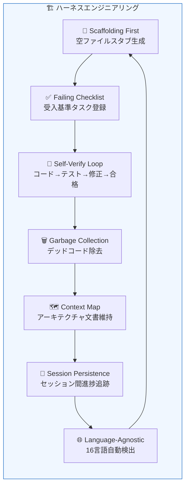
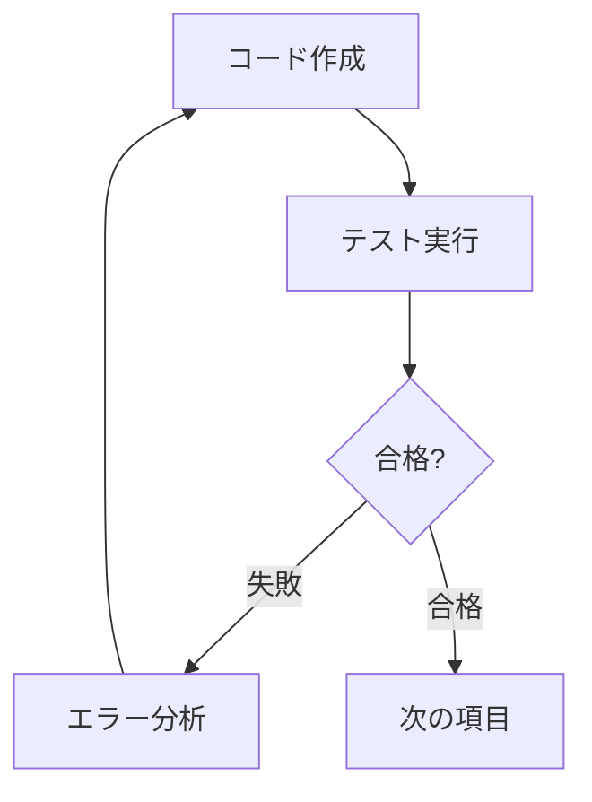

# ハーネスエンジニアリング


## ハーネスエンジニアリングとは？

MoAI-ADKは **ハーネスエンジニアリング(Harness Engineering)** パラダイムを実装しています。これは、開発者が直接コードを書く代わりに、**AIエージェントが最適なコードを生産できる環境(ハーネス)を設計する**アプローチです。

> "Human steers, agents execute."
> — エンジニアの役割は、コード作成からハーネス設計へと転換されます: SPEC、品質ゲート、フィードバックループ。

従来のバイブコーディングは、AIに自由にコードを生成させた後、結果を手動でレビューします。ハーネスエンジニアリングはその逆です — **仕様(SPEC)、自動検証、継続的フィードバックループ**でAIエージェントを導き、一貫した品質のコードを生産します。

## 7つの中核コンポーネント



各コンポーネントはMoAIの特定のコマンドにマッピングされます:

| コンポーネント | 説明 | コマンド |
|----------|------|--------|
| **Self-Verify Loop** | エージェントがコード作成 → テスト → 失敗 → 修正 → 合格のサイクルを自律的に繰り返す | [`/moai loop`](/ja/utility-commands/moai-loop) |
| **Context Map** | コードベースのアーキテクチャマップとドキュメントを常にエージェントに提供 | [`/moai codemaps`](/ja/quality-commands/moai-codemaps) |
| **Session Persistence** | `progress.md`がセッション間で完了したステップを追跡し、中断された作業を自動的に再開 | [`/moai run SPEC-XXX`](/ja/workflow-commands/moai-run) |
| **Failing Checklist** | 実行開始時にすべての受入基準を保留タスクとして登録し、実装完了時にチェック | [`/moai run SPEC-XXX`](/ja/workflow-commands/moai-run) |
| **Language-Agnostic** | 16言語対応: 言語を自動検出し、適切なLSP/リンター/テスト/カバレッジツールを選択 | すべてのワークフロー |
| **Garbage Collection** | デッドコード、AIスロップ(slop)、未使用のimportを定期的にスキャンして除去 | [`/moai clean`](/ja/utility-commands/moai-clean) |
| **Scaffolding First** | 実装前に空ファイルスタブを先に生成し、コードのエントロピーを防止 | [`/moai run SPEC-XXX`](/ja/workflow-commands/moai-run) |

## 動作原理

### 1. Scaffolding First (スキャフォールディング優先)

`/moai run`が開始されると、エージェントはコードを書く前にまず必要なファイル構造を生成します:

```
src/
├── auth/
│   ├── handler.go      ← 空スタブ
│   ├── handler_test.go  ← 空テスト
│   ├── service.go       ← 空スタブ
│   └── service_test.go  ← 空テスト
└── middleware/
    └── jwt.go           ← 空スタブ
```

この方式により、エージェントが無秩序にファイルを生成することを防ぎ、一貫したプロジェクト構造を維持します。

### 2. Failing Checklist (失敗チェックリスト)

SPECの受入基準が自動的にタスクリストに登録されます:

```
- [ ] JWTトークン生成エンドポイント
- [ ] トークン検証ミドルウェア
- [ ] リフレッシュトークンロジック
- [ ] 期限切れトークンの処理
- [ ] 85%以上のテストカバレッジ
```

各項目が実装され、テストに合格するとチェックされます。すべての項目がチェックされて初めて作業が完了します。

### 3. Self-Verify Loop (自己検証ループ)

エージェントが自律的に実行する中核サイクル:



このループは`/moai loop`で最大100回まで繰り返され、収束検知(同じエラーが繰り返される場合は代替戦略を適用)を含みます。

### 4. Context Map (コンテキストマップ)

`/moai codemaps`が生成するアーキテクチャドキュメントは、コードベース全体の構造をエージェントに提供します。これにより、エージェントは:

- 既存コードと衝突しない実装方法を選択
- 適切なパターンと規則に従う
- 依存関係を理解し、影響範囲を把握

### 5. Session Persistence (セッション永続性)

Claude Codeセッションが中断されても、`progress.md`が完了したステップを記録します:

```markdown
## Progress
- [x] Phase 1: 分析完了
- [x] Phase 2: ハンドラー実装
- [ ] Phase 3: テスト作成 ← ここから再開
- [ ] Phase 4: リファクタリング
```

`/moai run --resume SPEC-XXX`で、中断した地点から自動的に再開されます。

## 従来型開発 vs ハーネスエンジニアリング

| 観点 | 従来型開発 | ハーネスエンジニアリング |
|------|-----------|-----------------|
| **開発者の役割** | コード作成者 | 環境設計者 |
| **コード生産** | 手動作成 | AIエージェントによる自動生産 |
| **品質保証** | 事後レビュー | 組み込みの自動検証ループ |
| **セッション継続性** | 手動メモ | 自動進捗追跡 |
| **コード整理** | 技術的負債の蓄積 | 自動ガベージコレクション |
| **ドキュメント化** | 別作業 | 自動アーキテクチャマップ生成 |

## ハーネスネームスペースポリシー (template-managed vs user-owned)

独自のカスタムスキルやエージェントを作成する際は、`moai update` がどの資産を上書き(overwrite)し、どの資産を保存(preserve)するかを知っておく必要があります。MoAI-ADK はネームスペースを **「パッケージ配布(template-managed)」** と **「ユーザー作成(user-owned)」** に明確に分離します。

| 区分 | ネームスペース / パス | 出所 | `moai update` の動作 |
| --- | --- | --- | --- |
| **template-managed** | `moai-*` スキル(`moai-foundation-*`, `moai-workflow-*`, `moai-domain-*`, `moai-ref-*`, `moai-meta-*` を含む)、`moai-harness-*` スキル、`moai-meta-harness` | MoAI-ADK パッケージ (template) | **上書き** — 同期時に削除して再インストール |
| **user-owned** | `harness-*` スキル、`.claude/agents/harness/` エージェント | ユーザープロジェクト | **保存** — `moai update` は決して削除・変更しない(バックアップして保存) |

### template-managed (上書き対象)

`moai-*` prefix スキルと `moai-harness-*` / `moai-meta-harness` は **MoAI-ADK パッケージが提供する汎用資産**です。すべてのユーザープロジェクトに配布され、`moai update` 実行時に最新の template で**上書き**されます。したがって、これらの資産を直接変更すると、次回の更新で変更内容が失われます。

### user-owned (保存対象)

`harness-*` prefix スキルと `.claude/agents/harness/` ディレクトリは **ユーザープロジェクトが所有**します。`moai update` はこれらを**決して削除・変更せず**、更新前にバックアップした上でそのまま保存します。

### カスタムスキル作成者への示唆

独自に作成したドメイン特化スキルやエージェントを `moai update` 後も残すには、**必ず `harness-*` prefix を使用**してください(エージェントは `.claude/agents/harness/` に配置)。`moai-*` または `moai-harness-*` prefix で作成すると template-managed と見なされ、次回の更新で上書きされます。

> このネームスペース分離ポリシーの出所は `SPEC-V3R6-HARNESS-NAMESPACE-V2-001` (完了) です。

## 次のステップ

- [SPECベース開発](/ja/core-concepts/spec-based-dev) — ハーネスの入力となるSPEC文書の作成方法
- [TRUST 5品質](/ja/core-concepts/trust-5) — ハーネスが検証する5つの品質基準
