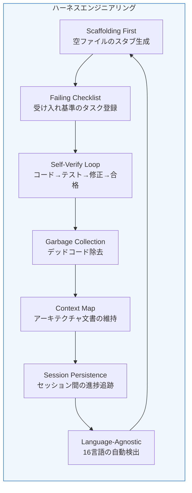
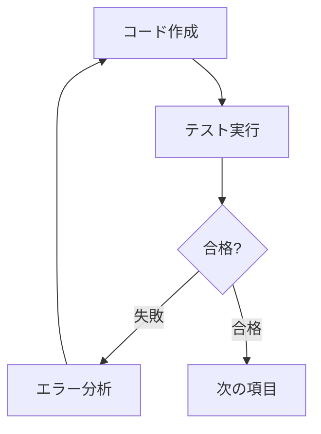

# ハーネスエンジニアリング

## ハーネスエンジニアリングとは?

MoAI-ADK は **ハーネスエンジニアリング** (Harness Engineering) パラダイムを実装しています。開発者が直接コードを書く代わりに、**AI エージェントが最適なコードを生産できる環境 (ハーネス) を設計する** アプローチです。

> "Human steers, agents execute."
> — エンジニアの役割はコード作成からハーネス設計へと転換します: SPEC、品質ゲート、フィードバックループ。

従来のバイブコーディングは、AI に自由にコードを生成させた後、結果を手動でレビューします。ハーネスエンジニアリングはその逆です — **規格 (SPEC)、自動検証、継続的フィードバックループ** で AI エージェントをガイドし、一貫した品質のコードを生産します。

ハーネスとは何でしょうか? 基盤モデルを取り囲み、実行をオーケストレーションするシステム全体 — モデルがどう考え計画するか、ツールをどう呼び出すか、コンテキストをどう認識し管理するか、成果物をどこに保存するか、結果をどう評価するかを決定する層です。MoAI-ADK は Claude Code の上に載る、まさにこのハーネスです。

## 3つの柱とハーネス

ハーネスエンジニアリングは、v3.0 の3つの柱が交わる地点です。

| 柱 | ハーネスにおける役割 |
|------|------------------|
| **トークノミクス** | ハーネスがタスクごとにモデル・推論の深さを割り当て、トークン予算を守ります |
| **エージェンティックループエンジニアリング** | ループ (`/moai loop`、goal エンジン) が回って観察を蓄積し、ハーネスがその観察から学習します |
| **エージェンティックハーネス** | 11エージェントのカタログ、3-phase ワークフロー、TRUST 5 ゲートが実行環境を構成します |

特に2番目の柱が中核となるイノベーションです。AI の再帰的自己改善 (RSI) の現実的な短期経路は、モデルの重みを直接修正することではなく **モデルを取り囲むハーネスを改善すること** です。MoAI-ADK はまさにこの経路を取ります — モデルではなくハーネス (スキル・エージェント指針) を再帰的に改善します。

## 7つのコアコンポーネント


```mermaid
graph TB
    subgraph Harness["ハーネスエンジニアリング"]
        direction TB
        SF["Scaffolding First<br/>空ファイルのスタブ生成"] --> FC["Failing Checklist<br/>受け入れ基準のタスク登録"]
        FC --> SV["Self-Verify Loop<br/>コード→テスト→修正→合格"]
        SV --> GC["Garbage Collection<br/>デッドコード除去"]
        GC --> CM["Context Map<br/>アーキテクチャ文書の維持"]
        CM --> SP["Session Persistence<br/>セッション間の進捗追跡"]
        SP --> LA["Language-Agnostic<br/>16言語の自動検出"]
        LA --> SF
    end

    style Harness fill:#f0f7ff,stroke:#1565C0
```

各コンポーネントは MoAI の特定のコマンドにマッピングされます:

| コンポーネント | 説明 | コマンド |
|----------|------|--------|
| **Self-Verify Loop** | エージェントがコード作成 → テスト → 失敗 → 修正 → 合格のサイクルを自律的に反復 | [`/moai loop`](/ja/utility-commands/moai-loop) |
| **Context Map** | コードベースのアーキテクチャマップと文書を常にエージェントに提供 | [`/moai codemaps`](/ja/utility-commands/moai-codemaps) |
| **Session Persistence** | `progress.md` がセッション間で完了したステップを追跡し、中断した作業を自動再開 | [`/moai run SPEC-XXX`](/ja/workflow-commands/moai-run) |
| **Failing Checklist** | 実行開始時にすべての受け入れ基準を待機タスクとして登録し、実装完了時にチェック | [`/moai run SPEC-XXX`](/ja/workflow-commands/moai-run) |
| **Language-Agnostic** | 16言語をサポート: 言語を自動検出し、正しい LSP/リンター/テスト/カバレッジツールを選択 | すべてのワークフロー |
| **Garbage Collection** | デッドコード、AI スロップ (slop)、未使用の import を定期的にスキャンして除去 | [`/moai clean`](/ja/utility-commands/moai-clean) |
| **Scaffolding First** | 実装前に空のファイルスタブを先に生成し、コードエントロピーを防止 | [`/moai run SPEC-XXX`](/ja/workflow-commands/moai-run) |

## 動作原理

### 1. Scaffolding First (スキャフォールディング優先)

`/moai run` が始まると、エージェントはコードを書く前にまず必要なファイル構造を生成します:

```
src/
├── auth/
│   ├── handler.go      ← 空のスタブ
│   ├── handler_test.go  ← 空のテスト
│   ├── service.go       ← 空のスタブ
│   └── service_test.go  ← 空のテスト
└── middleware/
    └── jwt.go           ← 空のスタブ
```

この方式は、エージェントが無秩序にファイルを生成するのを防ぎ、一貫したプロジェクト構造を維持します。

### 2. Failing Checklist (失敗チェックリスト)

SPEC の受け入れ基準が自動的にタスクリストに登録されます:

```
- [ ] JWT トークン生成エンドポイント
- [ ] トークン検証ミドルウェア
- [ ] リフレッシュトークンのロジック
- [ ] 期限切れトークンの処理
- [ ] 85%+ テストカバレッジ
```

各項目が実装されテストに合格するとチェックされます。すべての項目がチェックされて初めて作業が完了します。

### 3. Self-Verify Loop (自己検証ループ)

エージェントが自律的に実行するコアサイクル:


```mermaid
graph TD
    A["コード作成"] --> B["テスト実行"]
    B --> C{"合格?"}
    C -->|"失敗"| D["エラー分析"]
    D --> A
    C -->|"合格"| E["次の項目"]
```

このループは `/moai loop` で最大100回まで反復され、収束検知 (同じエラーの繰り返し時に代替戦略を適用) を含みます。完了条件を自ら宣言したい場合は goal エンジン (`/moai goal "<条件>"`) を使います — 条件が満たされるかターン上限に達するまで、セッションが自ら働き続けます。

### 4. Context Map (コンテキストマップ)

`/moai codemaps` が生成するアーキテクチャ文書は、エージェントにコードベースの全体構造を提供します。これによりエージェントは:

- 既存コードと衝突しない実装方法を選択
- 適切なパターンとルールに従う
- 依存関係を理解し、影響範囲を把握

### 5. Session Persistence (セッション永続性)

Claude Code のセッションが中断されても、`progress.md` が完了したステップを記録します:

```markdown
## Progress
- [x] Phase 1: 分析完了
- [x] Phase 2: ハンドラー実装
- [ ] Phase 3: テスト作成 ← ここから再開
- [ ] Phase 4: リファクタリング
```

`/moai run --resume SPEC-XXX` で中断した地点から自動的に再開されます。

## 自己進化ハーネス — ループがハーネスを育てる

ハーネスは固定された環境ではありません。ループが回るほど観察が蓄積され、ハーネスがその観察から学習して自ら指針を改善します。

```
ループ実行 → 観察の蓄積 → パターン学習 → 指針の進化 (承認ゲート)
```

### 4層の学習ラダー

| Tier | 観察数 | 動作 |
|------|---------|------|
| **観察** (Observation) | ≥1 | 単純記録 |
| **ヒューリスティック** (Heuristic) | ≥3 | パターン認識 |
| **ルール** (Rule) | ≥5 | ルール形成 |
| **自動アップデート** (AutoUpdate) | ≥10 | 指針の自動修正 — **ユーザー承認必須** |

### 安全装置

自動進化が人間の監視なしに閉じたループを回ることはありません。評価者と権限統制は進化ループの **外** に置きます:

- **5層の安全パイプライン** — スナップショットとロールバック (`moai harness rollback`) でいつでも復元できます
- **ユーザー承認ゲート** — Tier-4 自動アップデートは必ずユーザー承認を経ます
- **Constitution システム** — 不変ルール (FROZEN) は進化対象から除外されます ([Constitution システム](/ja/core-concepts/constitution) 参照)

```bash
moai harness status      # 学習状態の確認 (観察数、パターン、提案)
moai harness apply       # 提案の適用 (ユーザー承認ゲートの通過が必要)
moai harness rollback    # 直前の適用をロールバック
moai harness disable     # 学習の無効化
```

## 従来型開発 vs ハーネスエンジニアリング

| 観点 | 従来型開発 | ハーネスエンジニアリング |
|------|-----------|-----------------|
| **開発者の役割** | コード作成者 | 環境設計者 |
| **コード生産** | 手動作成 | AI エージェントによる自動生産 |
| **品質保証** | 事後レビュー | 組み込みの自動検証ループ |
| **セッション継続性** | 手動メモ | 自動進捗追跡 |
| **コード整理** | 技術的負債の蓄積 | 自動ガベージコレクション |
| **ドキュメント化** | 別作業 | アーキテクチャマップの自動生成 |
| **改善の方向** | ツールは固定、人が適応 | ループが観察を積み、ハーネスが進化 |

## ハーネスの名前空間ポリシー (template-managed vs user-owned)

自分でカスタムスキルやエージェントを作るとき、`moai update` がどの資産を上書き (overwrite) し、どの資産を保存 (preserve) するかを知っておく必要があります。MoAI-ADK は名前空間を **「汎用配布 (template-managed)」** と **「ユーザー作成 (user-owned)」** に明確に分離します。

| 区分 | 名前空間 / パス | 出所 | `moai update` の動作 |
| --- | --- | --- | --- |
| **template-managed** | `moai-*` スキル (`moai-foundation-*`、`moai-workflow-*`、`moai-domain-*`、`moai-ref-*`、`moai-meta-*` を含む)、`moai-harness-*` スキル | MoAI-ADK パッケージ (template) | **上書き** — 同期時に削除して新規インストール |
| **user-owned** | `hns-*` スキル (正式) + レガシー `harness-*` / `my-harness-*` スキル、`.claude/agents/harness/` エージェント | ユーザープロジェクト | **保存** — `moai update` は絶対に削除・修正しない (バックアップ後に保存) |

### template-managed (上書き対象)

`moai-*` prefix のスキルと `moai-harness-*` は **MoAI-ADK パッケージが提供する汎用資産** です。すべてのユーザープロジェクトに配布され、`moai update` 実行時に最新の template で **上書き** されます。そのため、これらの資産を直接修正すると、次のアップデートで変更内容が失われます。

### user-owned (保存対象)

`hns-*` prefix のスキル (Harness v4 Builder が生成する正式な名前空間) と `.claude/agents/harness/` ディレクトリは **ユーザープロジェクトが所有** します。前世代の prefix である `harness-*` / `my-harness-*` も同様に認識されます。`moai update` はこれらを **絶対に削除・修正せず**、アップデート前にバックアップしてそのまま保存します。

### カスタムスキル作成者への含意

自分で作ったドメイン特化スキルやエージェントが `moai update` 後も生き残るようにするには、**必ず `hns-*` prefix を使ってください** (エージェントは `.claude/agents/harness/` に配置)。`moai-*` または `moai-harness-*` prefix で作ると template-managed と見なされ、次のアップデートで上書きされます。`/moai harness "自然言語のリクエスト"` でハーネスを生成すると、Builder がこのルールに合った名前を自動的に割り当てます。

## 次のステップ

- [SPEC ベース開発](/ja/core-concepts/spec-based-dev) — ハーネスの入力となる SPEC 文書の書き方
- [TRUST 5 品質](/ja/core-concepts/trust-5) — ハーネスが検証する5つの品質基準
- [Constitution システム](/ja/core-concepts/constitution) — ハーネスの進化を統制する不変ルール
