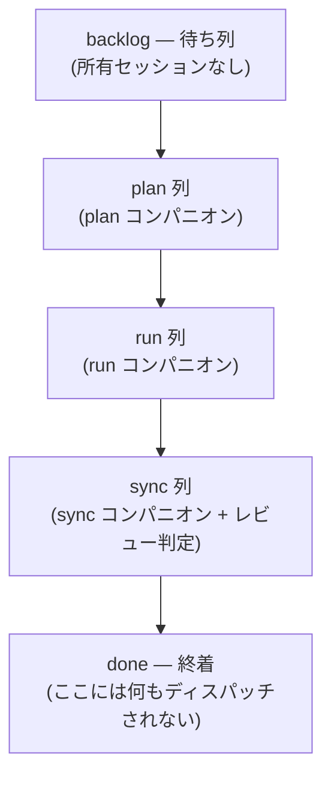
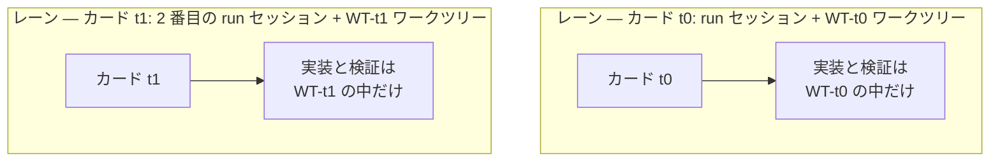

# カンバンボード用語

カンバンモードを扱うドキュメントと運用メモは、9つの用語を共有しています — ボード、チェーン、セッションランチャーのガイドのどこを開いても同じ言葉が出てきます。このページはそれらの用語を一箇所に集めて定義します。各項目は定義1行と例1つで構成され、他のドキュメントはこの意味を前提に書かれています。

まず最につまずきやすい点から: **レーン** (lane) と**列** (column) は別の言葉です。この区別は以下で別セクションとして扱います。

## ボードの形

ボードは5つの列で固定されています:

`backlog` と `done` には意図的に所有セッションがいません。中央の3列がそれぞれ1つのコンパニオン役割に対応するため、ディスパッチは決定ではなく照合になります — カードがどの列にいるかを見れば、誰に送るべきかが決まります。review 列は存在しません: レビュー判定は sync ゲートが吸収し、sync 段階がレビュー・レンズを自ら回します。

## 9つの用語

| 用語 | 意味 | 例 |
|---|---|---|
| **レーン** (lane) | カード1枚を最後まで運ぶ並行作業ストリーム1つ。セッション1つとワークツリー1つの組。物理カンバンボードのスイムレーンのように、それぞれの流れは自分の車線を走り、作業ツリーを決して共有しません。「レーンローカル検証」 (lane-local verification) とは、そのレーンの変更が影響しうるテストだけをそのレーンが実行するという意味です。 | `run` セッションがワークツリー `WT-t0` で作業するのがレーン1つ |
| **カード** (card) | ボード上の作業単位1つ。運営者が `/moai todo "<説明>"` で投入し、短いIDで呼びます。カードはワークツリー1つ、進行記録1つ、完了エビデンスを所有します。 | `t0` — 1行修正のカード |
| **列** (column) | ボードの段階1つ。順序は固定: `backlog → plan → run → sync → done`。中央の3列はそれぞれ1つのコンパニオン役割に対応します。 | `/moai run <SPEC-ID>` は `run` 列で行われます |
| **バックログ** (backlog) | ボードの入口の待ち列。所有セッションは意図的に不在です — 作業は運営者が投入したときだけボードに入ります。 | `/moai todo "rename hint is stale"` がカード1枚をバックログに追加 |
| **リード** (lead) | 唯一の調整セッション (`moai cc -k`)。自分で読んだエビデンスに基づいてだけカードを次の列へ進め、段階の間には運営者にそのセッションの `/clear` を依頼し、コードは自分で書きません。 | カードをワークツリー指示とともにディスパッチしたそのセッション |
| **コンパニオン** (companion) | 人が直接、ターミナル1つずつで起動する作業セッション (`moai cc -k --name <role>`)。名前はロール名だけで付き、同じロール名がすでに生きていれば次の番号が付きます。一度に1つの列の作業を担当します。 | `plan`, `run`, `sync` |
| **ランID** (run-id) | リードが起動時に表示する短い識別子。リードセッション自身の名前であり、コンパニオンはそれを背負いません — コンパニオンはロール名で呼ばれます。 | リードセッションの名前である `a1b2c3` |
| **ワークツリー** (worktree) | カードの作業が行われる隔離されたチェックアウト。ランチャーで入ります (`moai cc -w <name>` / `EnterWorktree`) — raw `git worktree add` では作りません。ブランチ名は `WT-<card-id>`。ワークツリーは段階より長生きします: 1つがrunからsyncまでを貫きます。 | ブランチ `WT-t0` の `.claude/worktrees/t0` |
| **ディスパッチ** (dispatch) | リードからコンパニオン1体への指示。作業のコピーではなくポインタです — カードID、SPEC ID、段階コマンド、完了シグナル。運営者の会話言語で書かれます。 | "card: t0 — wt: EnterWorktree(t0) … evidence: .moai/reports/t0/" |

## レーンと列 — 最も混同されやすい組

**列** (column) は作業の段階を指し、**レーン** (lane) はその段階を通ってカード1枚を運ぶ主体を指します。一方はボード上の停留所、他方は停留所を通るルートです。

2つのレーンが同じボードで同時に流れても、互いのワークツリーには最後まで入り込みません。これが並行を安全にする仕組みです — どのレーンのコミットも別のレーンの作業ツリーに漏れません。

## カード1枚の旅

すべての用語が一度ずつ登場する実際の流れです:

1. 運営者が `/moai todo "rename hint is stale"` で**カード** `t0` を**バックログ**に入れます。
2. **リード**がキューから `t0` を選び、plan コンパニオンに**ディスパッチ**します。
3. `plan` **コンパニオン**がSPECを書いたら、リードは自分でエビデンスを読み、カードを次の**列**へ進めます。
4. `run` が**ワークツリー** `WT-t0` で実装します — このセッションとワークツリーの組がまさに**レーン**で、検証もレーンの中で (変更が影響しうるテストだけ) 走ります。リードセッションの名前である `a1b2c3` が**ランID**です。
5. sync 列も同じように通り — そこで sync ゲートがレビュー判定を吸収して下します — sync がPRを出した時点でカードはdoneに到達します。

この間ずっと、カードの作業は `WT-t0` だけで行われます。並行して走っていた別レーンのワークツリーとは最後まで混ざりません。

## 関連ドキュメント

- [カンバンモード](/ja/advanced/kanban-mode) — 参入条件、Origin-Trail Chain の設計、チェーンの段階
- [`/moai todo`](/ja/utility-commands/moai-todo) — カードをボードに載せるバックログキュー
- [ハーネスエンジニアリング](/ja/core-concepts/harness-engineering) — フェーズチェイニングと観測がハーネス設計の上にどう載っているか
