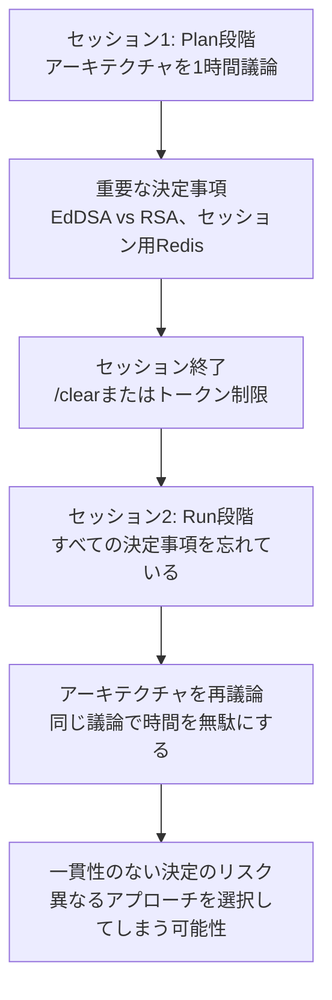
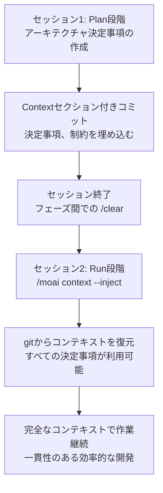
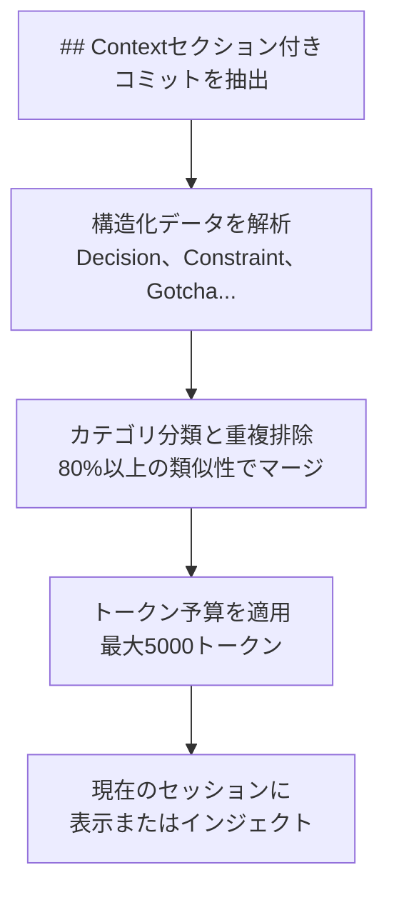
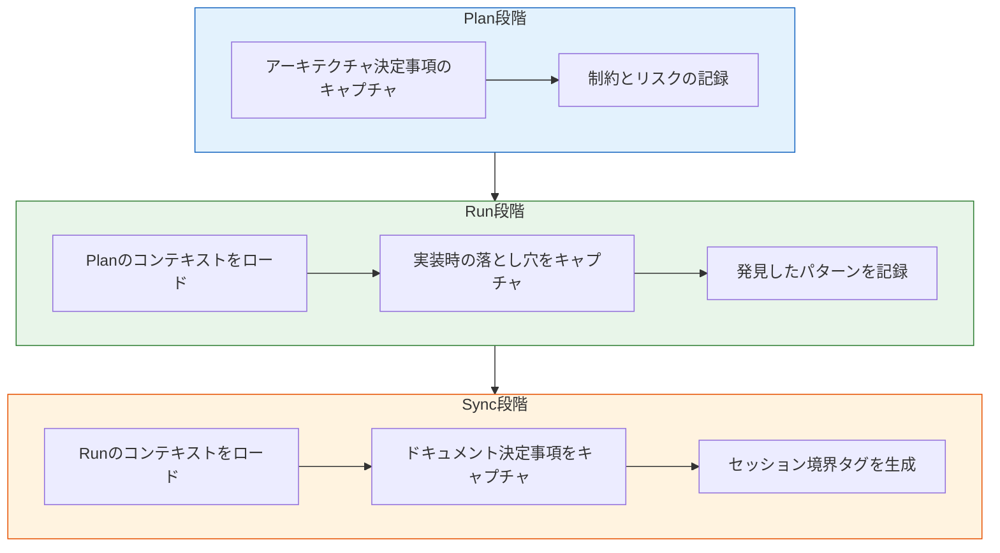

セッションをまたいでAIと開発者のインタラクションコンテキストを保持する、MoAI-ADKのGitベースコンテキストメモリシステムの詳細ガイドです。


  **一行まとめ:** MoAI Memoryは構造化されたコンテキスト (決定事項、制約、落とし穴) をgitコミットメッセージに埋め込み、将来のセッションが中断した箇所からそのまま再開できるようにします。


## MoAI Memoryとは？

MoAI Memoryは、構造化されたgitコミットメッセージを使用してセッションをまたいでAIと開発者のインタラクションコンテキストを保持する **Gitベースコンテキストメモリシステム** です。すべての実装コミットには `## Context` セクションが含まれており、開発中に発見された決定事項、制約、パターンをキャプチャします。

日常的なアナロジーとして、MoAI Memoryは **医師のカルテ** のようなものです。診察のたびに医師は診断、処方、所見を記録します。次回の診察では、医師はカルテを読んで患者の病歴をすぐに把握でき、同じ質問を繰り返す必要がありません。

| 医師のカルテ | MoAI Memory | 共通点 |
|-------------|-------------|--------|
| 診断と処方 | 決定事項と制約 | 何が決まったかを記録する |
| 観察された副作用 | 発見した落とし穴 | 予期しない発見を記録する |
| 治療計画 | パターンとリスク | アプローチと注意事項を記録する |
| 患者の好み | UserPrefs | 個人的な好みを記録する |

## なぜMoAI Memoryが必要なのか？

### セッション継続性の問題

複数のセッションにわたってAIと開発する際の最大の問題は、**以前の決定事項のコンテキストが失われる** ことです。



**コンテキストが失われる一般的な状況:**

| 状況 | 何が起きるか | 影響 |
|------|------------|------|
| フェーズ移行 | PlanとRunフェーズ間での `/clear` | すべてのPlan決定事項が失われる |
| トークン制限 | 長いセッションで初期コンテキストが削除される | 重要なアーキテクチャ決定事項が失われる |
| チームの引き継ぎ | 別のエージェントが次のフェーズを担当する | エージェントが前のコンテキストを持っていない |
| 複数日の作業 | 1日後や週末後に再開する | すべてを再説明しなければならない |

### MoAI Memoryの解決策

MoAI Memoryはコンテキストをgitコミットに直接埋め込むため、コンテキストが **コードと一緒に移動します**。




**MoAI Memoryなしの場合:**

セッション2はゼロのコンテキストで開始します。AIはEdDSAの代わりにRSAを選択したり、セッションにRedisが選ばれていたことを忘れたりする可能性があります。すでに行われた決定を再議論することに時間を費やします。

**MoAI Memoryありの場合:**

一つのコマンドですべての以前の決定事項をロードします:

```bash
> /moai context --spec SPEC-AUTH-001 --inject
```



## 仕組み

すべての実装コミットには、6つのカテゴリのコンテキストをキャプチャする構造化された `## Context` セクションが含まれています:

| カテゴリ | 目的 | 例 |
|---------|------|-----|
| **Decision** | 技術的選択とその根拠 | "EdDSA over RSA256 (パフォーマンス優先)" |
| **Constraint** | 有効な制約 | "/api/v1の後方互換性を維持しなければならない" |
| **Gotcha** | 発見した落とし穴 | "RedisのTTLはトークンストレージには信頼できない" |
| **Pattern** | 使用した参照実装 | "auth.go:45のmiddlewareチェーンパターン" |
| **Risk** | 既知のリスク / 延期した項目 | "レート制限はフェーズ2に延期" |
| **UserPref** | 開発者の好み | "OOPよりも関数型スタイルを好む" |

### セッションをまたいだコンテキストフロー

```
セッション1 (Plan)         セッション2 (Run)          セッション3 (Sync)
    |                          |                          |
    v                          v                          v
 決定事項 --> gitコミット --> コンテキスト --> gitコミット --> コンテキスト
 制約       ## Context付き   gitから       ## Context付き   gitから
 パターン   セクション        ロード        セクション        ロード
```

## コミットフォーマット

DDDとTDDの両方のワークフローがコンテキストセクション付きの構造化されたコミットを生成します。

### TDDモードのコミット

```
🔴 RED: Add failing test for token expiry validation
SPEC: SPEC-AUTH-001
Phase: RUN-RED

## Context (AI-Developer Memory)
- Decision: 15-minute access token TTL (security best practice)
- Gotcha: Clock skew between services requires 30s grace period
- Pattern: Token validation pattern from middleware/auth.go:89

## MX Tags Changed
- Added: @MX:TODO auth_test.go:15 (test for token expiry)
```

### DDDモードのコミット

```
🔴 ANALYZE: Document JWT validation behavior
SPEC: SPEC-AUTH-001
Phase: RUN-ANALYZE

## Context (AI-Developer Memory)
- Decision: Use EdDSA for JWT signing (performance priority)
- Constraint: Must support existing RSA tokens during migration
- Risk: Token rotation deferred to Phase 2

## MX Tags Changed
- Added: @MX:ANCHOR jwt.go:42 (fan_in: 5)
```


  `## Context` セクションはコミット作成時に **manager-git エージェント** によって自動的に生成されます。手動で記述する必要はありません。


## コンテキストの取得

`/moai context` コマンドを使用して以前のコンテキストを取得してインジェクトします。

### SPECのコンテキストを表示する

```bash
# 特定のSPECのすべてのコンテキストを表示
/moai context --spec SPEC-AUTH-001

# 過去7日間の決定事項のみを表示
/moai context --category Decision --days 7

# 圧縮されたサマリーのみを表示
/moai context --spec SPEC-AUTH-001 --summary
```

### 現在のセッションにコンテキストをインジェクトする

```bash
# 以前のコンテキストを現在のセッションにロードする
/moai context --spec SPEC-AUTH-001 --inject
```

このコマンドはSPECに関連するgitコミットからすべてのコンテキストを抽出し、現在のセッションにインジェクトして、シームレスな継続を可能にします。

### 取得の仕組み



**トークン予算の優先度:**

| 優先度 | カテゴリ | 根拠 |
|--------|---------|------|
| 1 (重要) | Decisions、Constraints | コアアーキテクチャコンテキスト |
| 2 (重要) | Gotchas、Risks | 同じミスの繰り返しを防ぐ |
| 3 (あると良い) | Patterns、UserPrefs | 効率性の改善 |

## コンテキストカテゴリの詳細

### Decision

**何が選択され、なぜそうなったか** を記録します。セッション継続性において最も重要なカテゴリです。

```
- Decision: EdDSA over RSA256 (user requested, performance priority)
- Decision: Use Redis for session storage (low latency requirement)
- Decision: Separate auth service from main API (microservice boundary)
```

### Constraint

**守らなければならない有効な制限** を記録します。

```
- Constraint: Must maintain /api/v1 backward compatibility
- Constraint: API response time within 500ms (P95)
- Constraint: Cannot use external OAuth providers (air-gapped environment)
```

### Gotcha

開発中に発見した **予期しない落とし穴** を記録します。同じミスが繰り返されることを防ぎます。

```
- Gotcha: Redis TTL unreliable for RefreshToken storage, use DB instead
- Gotcha: Clock skew between services requires 30s grace period
- Gotcha: bcrypt cost factor 12 causes 300ms delay on low-end hardware
```

### Pattern

現在の作業を導いた **参照実装** を記録します。

```
- Pattern: middleware chain pattern from auth.go:45
- Pattern: error handling pattern from pkg/errors/handler.go
- Pattern: repository pattern from internal/user/repository.go
```

### Risk

将来のセッションのための **既知のリスク** と延期した項目を記録します。

```
- Risk: Rate limiting deferred to Phase 2
- Risk: Token rotation not yet implemented (security debt)
- Risk: No load testing for concurrent session handling
```

### UserPref

一貫したインタラクションスタイルのための **開発者の好み** を記録します。

```
- UserPref: Prefers functional style over OOP
- UserPref: Wants detailed commit messages with context
- UserPref: Prefers Go table-driven tests
```

## 主なメリット

| メリット | 説明 |
|---------|------|
| **ゼロ依存** | gitそのものをメモリストアとして使用 -- 外部データベースやサービス不要 |
| **チーム共有** | コンテキストは `git clone` と一緒に移動 -- 自動的なチームナレッジ転送 |
| **完全な監査証跡** | `git log` で完全な決定履歴を確認できる |
| **セッション継続性** | `/clear` やセッション中断後も完全なコンテキストで作業を再開できる |
| **フェーズ移行** | コンテキストがPlanからRunへ、RunからSyncへ自然に流れる |

## MoAIワークフローとの統合

MoAI MemoryはPlan-Run-Syncパイプラインの各フェーズと統合されています:



### セッション境界タグ

各フェーズが完了すると、境界を示すgitタグが作成されます:

```bash
# セッション境界タグの例
git tag -a "moai/SPEC-AUTH-001/run-complete" \
  -m "Run phase completed
SPEC: SPEC-AUTH-001
Decisions: 5, Constraints: 3, Risks: 2
Next action: /moai sync SPEC-AUTH-001"
```

これらのタグにより、`/moai context` がフェーズ移行を素早く特定できます。

## デザインのインスピレーション

MoAI Memoryは [claude-mem](https://github.com/thedotmack/claude-mem)、[claude-brain](https://github.com/memvid/claude-brain)、[memory-mcp](https://github.com/yuvalsuede/memory-mcp) にインスパイアされており、追加インフラが不要なGitネイティブなアプローチに適応されています。

## 関連ドキュメント

- [MoAI-ADKとは？](/core-concepts/what-is-moai-adk) -- MoAI-ADKの全体的なアーキテクチャを理解します
- [SPECベース開発](/core-concepts/spec-based-dev) -- SPECドキュメントがどのように作成・管理されるかを学びます
- [TRUST 5品質](/core-concepts/trust-5) -- すべてのコード変更の品質検証基準を学びます
