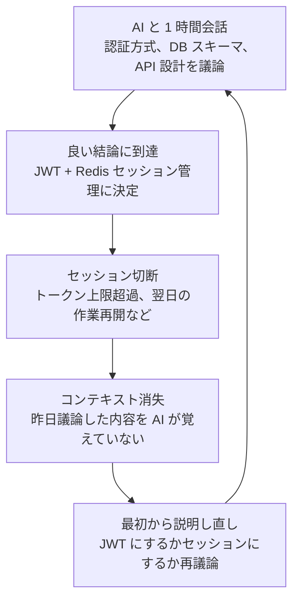
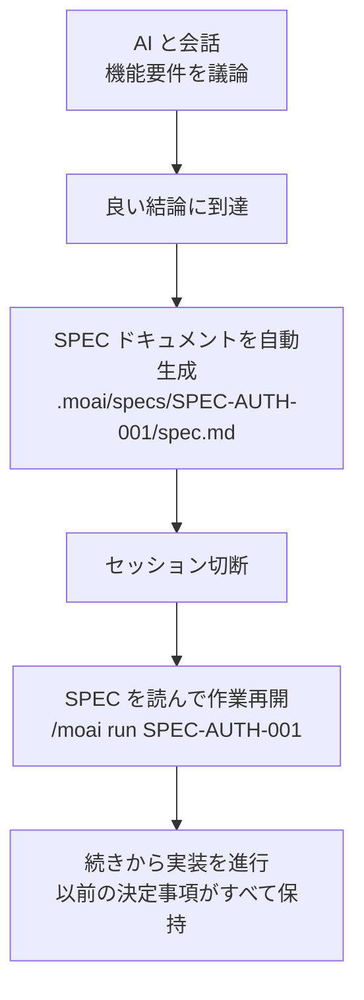
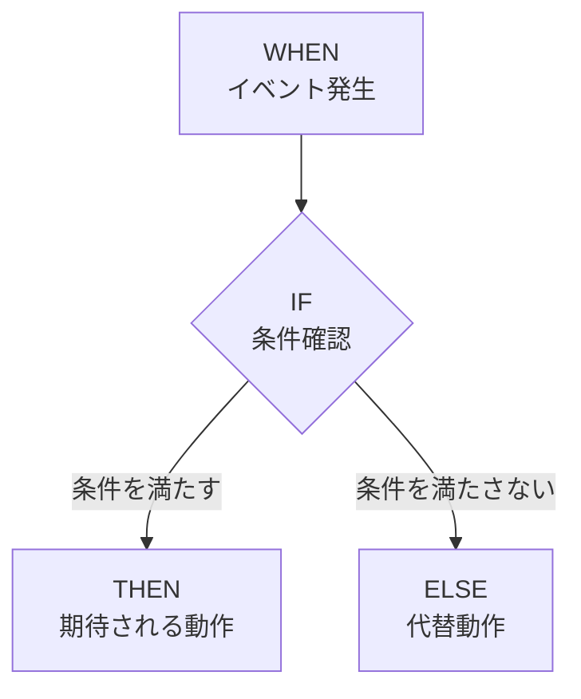
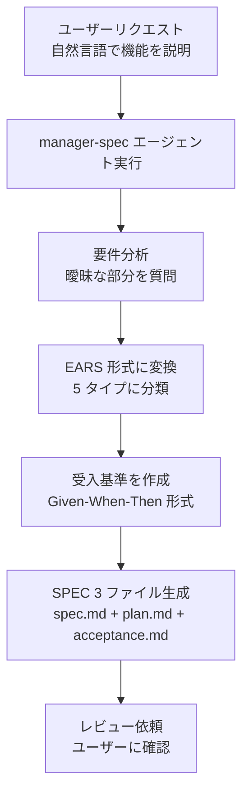
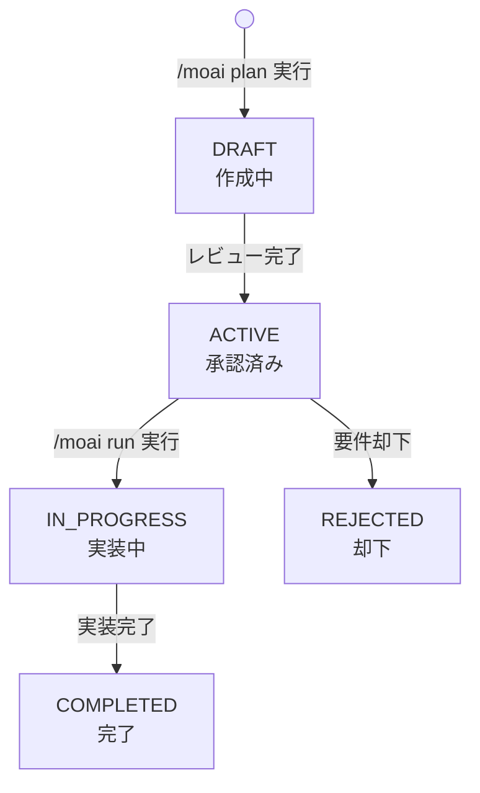

MoAI-ADK の SPEC ベース開発方法論を詳しくご案内します。


  **一言まとめ:** SPEC は「AI との会話をドキュメントとして残すこと」です。セッションが
  切れても、SPEC さえあればいつでも作業を再開できます。



  **SPEC はエージェントのためのものです:** SPEC は開発者が暗記したり学習したりするための
  ものではありません。エージェントが作業を実行する際に参照するドキュメントです。SPEC の
  原理と使い方を概念的に理解していれば十分です。



  **SPEC は 3 つのファイルで構成されます:** `/moai plan` 実行時に `spec.md` (EARS 要件)、`plan.md` (実装計画)、`acceptance.md` (受入基準) の 3 ファイルが同時に生成されます。


## SPEC とは？

**SPEC** (Specification) はプロジェクトの要件を構造化された形式で定義した
ドキュメントです。

日常的な例えで説明すると、SPEC は **料理のレシピ** のようなものです。料理をするとき
頭の中だけで覚えていると、材料を忘れたり順序を間違えたりしがちです。しかしレシピを
書き留めておけば、誰でも同じ料理を正確に作ることができます。

| 料理のレシピ                      | SPEC ドキュメント        | 共通点                               |
| --------------------------------- | ---------------------- | ------------------------------------ |
| 必要な材料のリスト                | 要件リスト              | 何が必要かを定義                     |
| 調理の順序                        | 実装の順序              | どの順序で進めるかを定義             |
| 完成写真                          | 受入基準                | 完成した結果がどんな姿かを定義       |
| 「塩少々」のような曖昧な表現なし  | EARS 形式で明確に       | 曖昧さの排除                         |

## なぜ SPEC が必要なのか？

### バイブコーディングのコンテキスト消失問題

AI と会話しながらコードを書くとき、最大の問題は **コンテキスト消失** です。



**コンテキスト消失が発生する具体的な状況:**

| 状況                | 何が起こるか                           | 結果                     |
| ------------------- | -------------------------------------- | ---------------------- |
| セッションタイムアウト | 一定時間後に以前の会話内容が消える       | 議論した決定事項が消失   |
| `/clear` 実行       | トークン節約のためコンテキストを初期化   | 以前のコンテキスト全体が初期化 |
| トークン上限超過    | 会話が長くなると古い内容からカットされる | 初期の決定事項が消失     |
| 翌日の作業再開      | 新しいセッションでは昨日の会話を知らない | すべての内容を再説明する必要あり |

### SPEC で問題を解決する

SPEC は会話内容を **ファイルとして保存** することで、この問題を根本的に解決します。



**SPEC の有無による違い:**


**SPEC なしで作業する場合:**

昨日「ユーザー認証機能」について 1 時間 AI と議論したとしましょう。JWT にするか
セッションにするか、トークンの有効期限はどうするか、リフレッシュトークンはどこに
保存するか...これらすべてをもう一度議論しなければなりません。

**SPEC がある場合:**

以下の 1 行だけで、昨日決めた内容そのまま実装を開始できます。

```bash
> /moai run SPEC-AUTH-001
```



## EARS 形式

**EARS** (Easy Approach to Requirements Syntax) は要件を明確に記述する
方法です。自然言語の曖昧さを排除し、テストで検証可能な形式に
要件を変換します。

EARS は 5 種類の要件パターンを提供します。

### 1. Ubiquitous (常に真)

システムが **常に** 遵守すべき要件です。条件なく常に適用されます。

**形式:** 「システムは～しなければならない」

**例:**

```yaml
- id: REQ-001
  type: ubiquitous
  priority: HIGH
  text: "システムはすべてのユーザー入力を検証しなければならない"
  acceptance_criteria:
    - "すべての入力値に対して型検証を実行"
    - "SQL Injection 防止のためパラメータ化クエリを使用"
    - "XSS 防止のため出力エスケープを実施"
```

**日常の例え:** 「運転するときは常にシートベルトを着用しなければならない」と同じです。特別な
条件なく常に守るべきものです。

### 2. Event-driven (イベント駆動)

特定のイベントが発生したときにシステムがどう反応すべきかを定義します。

**形式:** 「WHEN ～すると、IF ～なら、THEN ～しなければならない」



**例:**

```yaml
- id: REQ-002
  type: event-driven
  priority: HIGH
  text: |
    WHEN ユーザーがログインボタンをクリックすると、
    IF メールアドレスとパスワードが有効なら、
    THEN JWT トークンを発行しダッシュボードにリダイレクトしなければならない
  acceptance_criteria:
    - given: "登録済みのユーザーアカウントがあり"
      when: "正しいメールアドレスとパスワードでログインすると"
      then: "200 レスポンスとともに JWT トークンを発行"
      and: "トークンの有効期限は 1 時間"
```

**日常の例え:** 「インターホンが鳴ったら (WHEN)、モニターで確認して知り合いなら (IF)、
ドアを開ける (THEN)」と同じです。

### 3. State-driven (状態駆動)

特定の状態が維持されている間、システムがどう動作すべきかを定義します。

**形式:** 「WHILE ～の間、～しなければならない」

**例:**

```yaml
- id: REQ-003
  type: state-driven
  priority: MEDIUM
  text: |
    WHILE ユーザーがログイン状態の間、
    システムはセッションを 5 分ごとに更新しなければならない
  acceptance_criteria:
    - "最後のアクティビティから 5 分経過時に自動更新"
    - "セッション期限切れの 5 分前に通知を表示"
    - "30 分間無操作時に自動ログアウト"
```

**日常の例え:** 「エアコンがオンの間 (WHILE)、室温を 25 度に維持しなければ
ならない」と同じです。

### 4. Unwanted (禁止事項)

システムが **絶対にしてはならない** ことを定義します。主にセキュリティ関連の要件に
使用します。

**形式:** 「システムは～してはならない」

**例:**

```yaml
- id: REQ-004
  type: unwanted
  priority: CRITICAL
  text: "システムはパスワードを平文で保存してはならない"
  acceptance_criteria:
    - "パスワードは bcrypt でハッシュ化 (cost factor 12)"
    - "ハッシュ化されていないパスワードがログに含まれないこと"
    - "データベースに平文パスワードを保存不可"

- id: REQ-005
  type: unwanted
  priority: CRITICAL
  text: "システムはハードコードされた秘密鍵を使用してはならない"
  acceptance_criteria:
    - "すべての秘密鍵は環境変数またはシークレットマネージャーを使用"
    - "コードに秘密鍵を含めないこと"
    - "Git コミットに秘密鍵が含まれることを防止"
```

**日常の例え:** 「鍵を玄関マットの下に置いてはならない」と同じです。してはいけない
ことを明示します。

### 5. Optional (任意機能)

実装が推奨されるが必須ではない機能です。

**形式:** 「可能であれば、～すべきである」

**例:**

```yaml
- id: REQ-006
  type: optional
  priority: LOW
  text: "可能であれば、システムはログイン時にメール通知を送信すべきである"
  acceptance_criteria:
    - "メールサーバーが設定されている場合のみ動作"
    - "通知を無効にするオプションを提供"
```

**日常の例え:** 「時間があればデザートも作れたらいいな」と同じです。あれば良いが
なくても問題ありません。

### EARS 一覧

| タイプ           | 形式                                  | 用途                 | 優先度           |
| ---------------- | ------------------------------------- | -------------------- | ---------------- |
| **Ubiquitous**   | 「システムは～しなければならない」     | 常に適用されるルール | 通常 HIGH        |
| **Event-driven** | 「WHEN ～すると、THEN ～しなければならない」 | イベント反応の定義 | 機能による       |
| **State-driven** | 「WHILE ～の間、～しなければならない」 | 状態維持の動作       | 通常 MEDIUM      |
| **Unwanted**     | 「システムは～してはならない」         | 禁止事項 (セキュリティ) | 通常 CRITICAL |
| **Optional**     | 「可能であれば、～すべきである」       | 任意機能             | 通常 LOW         |

## SPEC ドキュメント構造

SPEC ドキュメントは **manager-spec エージェント** が自動で生成します。開発者が直接 EARS
形式を覚える必要はなく、自然言語でリクエストすればエージェントが変換します。

`/moai plan` 実行時に 1 つの SPEC ディレクトリ内に **3 つのファイル** が同時に生成されます:

| ファイル | 役割 | 内容 |
| --- | --- | --- |
| `spec.md` | EARS 要件定義 | YAML フロントマター、要件 (5 種類の EARS タイプ)、制約条件、依存関係 |
| `plan.md` | 実装計画 | タスク分解、技術スタック仕様、リスク分析と緩和戦略 |
| `acceptance.md` | 受入基準 | Given/When/Then シナリオ、エッジケース、パフォーマンスおよび品質ゲート |

### spec.md -- EARS 要件

```yaml
---
id: SPEC-AUTH-001               # 一意識別子
title: ユーザー認証システム       # 明確で簡潔なタイトル
priority: HIGH                  # HIGH, MEDIUM, LOW
status: ACTIVE                  # DRAFT, ACTIVE, IN_PROGRESS, COMPLETED
created: 2025-01-12             # 作成日
updated: 2025-01-12             # 最終更新日
author: 開発チーム               # 作成者
version: 1.0.0                  # ドキュメントバージョン
---

# ユーザー認証システム

## 概要
JWT ベースのユーザー認証システムを実装

## 要件
### Ubiquitous
- システムはすべての API リクエストに認証を要求しなければならない

### Event-driven
- WHEN ユーザーがログインすると、THEN JWT を発行しなければならない

### Unwanted
- システムはパスワードを平文で保存してはならない

## 制約条件
- API レスポンス時間 500ms 以内
- パスワード bcrypt ハッシュ化 (cost factor 12)

## 依存関係
- Redis (セッション管理)
- PostgreSQL (ユーザーデータ)
```

### plan.md -- 実装計画

```markdown
# 実装計画

## タスク分解
1. ユーザーモデルおよびマイグレーション作成
2. JWT トークン発行/検証ユーティリティ実装
3. ログイン/会員登録 API エンドポイント実装
4. 認証ミドルウェア実装
5. Refresh Token 更新ロジック実装

## 技術スタック
- Go 1.23 + Fiber v2
- PostgreSQL 16 + GORM
- Redis 7 (セッション/トークン保存)

## リスク分析
| リスク | 影響 | 緩和戦略 |
| --- | --- | --- |
| トークン窃取 | HIGH | Refresh Token ローテーション、HttpOnly Cookie |
| ブルートフォース | MEDIUM | Rate Limiting、アカウントロック |
```

### acceptance.md -- 受入基準

```markdown
# 受入基準

## シナリオ

### AC-01: 正常ログイン
- **Given** 登録済みのユーザーアカウントがあり
- **When** 正しいメールアドレスとパスワードでログインすると
- **Then** 200 レスポンスと JWT トークンセットを返却

### AC-02: 不正な資格情報
- **Given** 登録済みのユーザーアカウントがあり
- **When** 間違ったパスワードでログインすると
- **Then** 401 レスポンスと一般的なエラーメッセージを返却

## エッジケース
- 期限切れの Refresh Token での更新時に 401 レスポンス
- 同時ログイン制限を超過した場合、最も古いセッションを期限切れにする

## 品質ゲート
- API レスポンス時間: 500ms 以内 (P95)
- テストカバレッジ: 85% 以上
```

## SPEC ワークフロー

SPEC 作成は `/moai plan` コマンド 1 つで開始されます。



**実行方法:**

```bash
# SPEC 作成コマンド
> /moai plan "ユーザー認証機能の実装"
```

このコマンドを実行すると、以下が自動的に進行します:

1. **要件分析:** manager-spec が「ユーザー認証機能」が何を意味するかを
   分析します
2. **明確化質問:** 曖昧な部分があればユーザーに質問します (例: 「JWT とセッション
   のどちらを希望しますか?」)
3. **EARS 変換:** 自然言語を 5 種類の EARS タイプに自動分類します
4. **3 ファイル生成:** `.moai/specs/SPEC-AUTH-001/` ディレクトリに `spec.md`、`plan.md`、
   `acceptance.md` の 3 ファイルを同時に生成します
5. **レビュー依頼:** 生成された SPEC をユーザーに提示し確認を求めます


  **重要:** エージェントが生成した SPEC ドキュメントは必ず一度レビューしてください。AI が
  要件を誤って解釈したり、漏れが生じる可能性があります。特に受入基準がテスト
  可能か、優先度が適切かを確認することをお勧めします。


## SPEC ファイルの配置と管理

### ファイル構造

```
.moai/
└── specs/
    ├── SPEC-AUTH-001/
    │   ├── spec.md          # EARS 要件
    │   ├── plan.md          # 実装計画
    │   └── acceptance.md    # 受入基準
    ├── SPEC-PAYMENT-001/
    │   ├── spec.md
    │   ├── plan.md
    │   └── acceptance.md
    └── SPEC-SEARCH-001/
        ├── spec.md
        ├── plan.md
        └── acceptance.md
```

### SPEC ステータス管理

各 SPEC はライフサイクルに応じてステータスが変更されます。



| ステータス    | 意味                           | 次に遷移可能なステータス |
| ------------- | ------------------------------ | ----------------------- |
| `DRAFT`       | 作成中、レビューが必要         | ACTIVE, REJECTED        |
| `ACTIVE`      | 承認済み、実装準備完了         | IN_PROGRESS, REJECTED   |
| `IN_PROGRESS` | 実装進行中                     | COMPLETED, REJECTED     |
| `COMPLETED`   | すべての受入基準を満たし、完了 | (最終ステータス)        |
| `REJECTED`    | 要件却下、再作成が必要         | (最終ステータス)        |

## 実践例: JWT 認証 SPEC

実際に `/moai plan` を実行して生成された SPEC の例です。

```bash
# SPEC 作成
> /moai plan "JWT ベースのユーザー認証システム。ログイン、会員登録、トークン更新機能を含む"
```

以下のように `.moai/specs/SPEC-AUTH-001/` ディレクトリに 3 つのファイルが生成されます。

**spec.md -- EARS 要件:**

```yaml
---
id: SPEC-AUTH-001
title: JWT ベースのユーザー認証システム
priority: HIGH
status: ACTIVE
created: 2025-01-15
version: 1.0.0
---

# JWT ベースのユーザー認証システム

## 概要
JWT トークンを使用したユーザー認証システム。
ログイン、会員登録、トークン更新機能を実装する。

## 要件

### Ubiquitous
- REQ-U01: システムはすべての認証トークンを HTTPS でのみ送信しなければならない
- REQ-U02: システムはすべてのユーザー入力を検証しなければならない

### Event-driven
- REQ-E01: WHEN ユーザーが会員登録フォームを送信すると、
  IF メールアドレスが重複していなければ、
  THEN アカウントを作成しウェルカムメールを送信しなければならない
- REQ-E02: WHEN ユーザーがログインすると、
  IF 資格情報が有効なら、
  THEN Access Token (1 時間) と Refresh Token (7 日) を発行しなければならない

### Unwanted
- REQ-N01: システムはパスワードを平文で保存してはならない
- REQ-N02: システムは期限切れの Refresh Token で新しいトークンを発行してはならない

### Optional
- REQ-O01: 可能であれば、ソーシャルログイン (Google、GitHub) をサポートすべきである

## 制約条件
- パスワード: bcrypt (cost factor 12)
- Access Token 有効期限: 1 時間
- Refresh Token 有効期限: 7 日
- API レスポンス時間: 500ms 以内 (P95)
```

**plan.md -- 実装計画:**

```markdown
# 実装計画

## タスク分解
1. ユーザーモデルおよび DB マイグレーション作成
2. パスワードハッシュ化ユーティリティ実装
3. JWT トークン発行/検証ユーティリティ実装
4. 会員登録 API エンドポイント実装
5. ログイン API エンドポイント実装
6. 認証ミドルウェア実装
7. Refresh Token 更新ロジック実装

## 技術スタック
- Go 1.23 + Fiber v2
- PostgreSQL 16 + GORM
- Redis 7 (Refresh Token 保存)

## リスク分析
| リスク | 影響 | 緩和戦略 |
| --- | --- | --- |
| トークン窃取 | HIGH | Refresh Token ローテーション、HttpOnly Cookie |
| ブルートフォース | MEDIUM | Rate Limiting、アカウントロック |
```

**acceptance.md -- 受入基準:**

```markdown
# 受入基準

## シナリオ

### AC-01: 正常ログイン
- **Given** 登録済みのユーザーアカウントがあり
- **When** 正しいメールアドレスとパスワードでログインすると
- **Then** 200 レスポンスと JWT トークンセット (Access + Refresh) を返却

### AC-02: 不正なパスワード
- **Given** 登録済みのユーザーアカウントがあり
- **When** 間違ったパスワードでログインすると
- **Then** 401 レスポンス

### AC-03: 重複会員登録
- **Given** すでに登録済みのメールアドレスがあり
- **When** 同じメールアドレスで会員登録すると
- **Then** 409 レスポンス

### AC-04: トークン更新
- **Given** 有効な Refresh Token があり
- **When** トークン更新をリクエストすると
- **Then** 新しい Access Token を返却

## 品質ゲート
- API レスポンス時間: 500ms 以内 (P95)
- テストカバレッジ: 85% 以上
```

**この SPEC で実装を開始する:**

```bash
# SPEC 確認後に実装開始
> /moai run SPEC-AUTH-001
```

このコマンド 1 つで、設定された開発方法論 (DDD または TDD) に従い SPEC のすべての要件を
自動で実装します。新規プロジェクトは **TDD** (RED-GREEN-REFACTOR)、既存プロジェクトは
**DDD** (ANALYZE-PRESERVE-IMPROVE) サイクルを使用します。

## SPEC 作成のヒント

### 自然言語から EARS への変換

日常的なリクエストを EARS 形式にどのように変換するかを比較します。

| 自然言語のリクエスト       | EARS 形式                                                                        |
| ---------------------- | ------------------------------------------------------------------------ |
| 「ログイン機能を作って」   | WHEN ユーザーが有効な資格情報を提示すると、THEN 認証トークンを発行しなければならない |
| 「パスワードは安全に」     | システムはパスワードを平文で保存してはならない (Unwanted)                           |
| 「速くないとダメ」         | ログインレスポンス時間は 500ms 以内でなければならない (Ubiquitous)                  |
| 「エラー処理をちゃんと」   | WHEN エラーが発生すると、THEN ユーザーに明確なメッセージを表示しなければならない      |
| 「できたらいいな」         | 可能であれば、システムはリアルタイム通知をサポートすべきである (Optional)             |


  EARS 形式を直接書く必要はありません。`/moai plan` に自然言語でリクエストすれば
  **manager-spec エージェントが自動で EARS 形式に変換** します。上の表は
  どのように変換されるかを理解するための参考資料です。


## SPEC ライフサイクルと Era 分類

SPEC は一度書いて終わる文書ではなく、**計画(plan) → 実装(run) → 同期(sync)** というライフサイクルに従います。MoAI-ADK は各 SPEC がどの時代(era)の規約で書かれたかを自動的に分類し、現代の規約に従う SPEC にのみドリフト(drift、規約からの逸脱)検査を適用します。

### 3 フェーズクローズ(plan → run → sync)

すべての V3R6 SPEC は**3 フェーズ**で完結します。かつて存在した 4 番目のフェーズ(Mx-phase)は**廃止**されました — MX タグ検証は独立したフェーズではなく、sync フェーズ内で処理される横断的関心事(cross-cutting concern)です。

| フェーズ | コマンド | 行うこと | 記録先 |
| --- | --- | --- | --- |
| **plan** | `/moai plan` | SPEC 成果物(spec/plan/acceptance)を作成 | `progress.md` §E.1 |
| **run** | `/moai run` | 方法論(DDD/TDD)に従って実装 | `progress.md` §E.2 / §E.3 |
| **sync** | `/moai sync` | ドキュメント同期 + 完了コミット | `progress.md` §E.4 |

sync フェーズが完了すると、そのコミットの SHA が `progress.md` の **`§E.4 Sync-phase Audit-Ready Signal`** セクションに **`sync_commit_sha`** フィールドとして記録されます。このフィールドの有無が、SPEC が現代の規約(V3R6)を完全に遵守したかを判別する重要なシグナルです。


  **Mx-phase の廃止:** 以前のバージョンでは plan/run/sync の後に `Mx-phase` という 4 番目のフェーズと `mx_commit_sha` フィールドがありました。現在は廃止され 3 フェーズに統合されています。MX コード注釈(@MX タグ)の管理は sync フェーズ内で併せて実行されます。


### 5 つの Era 分類

すべての SPEC は、作成された時期の規約に応じて正確に 1 つの era バケットに分類されます。

| Era | 時期 | ライフサイクル標準 |
| --- | --- | --- |
| **V2.x** | 2026-02 以前 | `progress.md` なし; 直接コミットで実装 |
| **V3R2-R4** | 2026-02 ~ 2026-03 | `progress.md` 導入; `sync_commit_sha` なし |
| **V3R5** | 2026-03 ~ 2026-04 | sync セクション登場; `sync_commit_sha` 未強制 |
| **V3R6** | 2026-04 ~ 現在 | 3 フェーズ現代標準(plan/run/sync); `sync_commit_sha` 必須 |
| **unclassified** | — | 自動分類不可(どのヒューリスティックにもマッチせず) |

era 分類は `spec.md` フロントマターの `created:` 日付と `progress.md` のセクション構造を自動的に検査して決定されます。境界が曖昧な場合は、フロントマターに `era: V3R6` のような明示的なフィールドを追加して直接指定できます。

### Grandfather 条項(grandfather clause)

**V2.x · V3R2-R4 · V3R5** に分類された SPEC は **grandfather 条項で保護**されます。これら 3 つの era は作成当時の規約が正当だったため、現代の V3R6 規約を遡及適用しません。

- grandfather SPEC は監査結果で `era_final: true` と表示されます。
- セクション欠落、コミット SHA 不在など、どのようなパターンでも**ドリフト結果は報告されません**。
- 過去の SPEC を現代の規約に合わせて一括正規化することは運用上不可能で、実益もないためです。

### ドリフト検査は V3R6 専用

ライフサイクルドリフト検査(`moai spec audit`)は **V3R6 SPEC にのみ**適用されます。

- 現代 era の境界基準日は **`2026-04-01`** です。この日付以降に作成され V3R6 シグナルを備えた SPEC のみがドリフト検査の対象です。
- 内部的に `IsModern()` 判定は **V3R6 のときだけ true** を返します。
- つまり grandfather era(V2.x/V3R2-R4/V3R5)はドリフト検査から常に除外され、結果として欠陥に分類されることはありません。

この分類体系により、古い SPEC に対する誤検出(false positive)なく、現在作成中の SPEC の規約遵守だけを正確に検証できます。

## 関連ドキュメント

- [MoAI-ADK とは？](/core-concepts/what-is-moai-adk) -- MoAI-ADK の全体構造を
  理解します
- [開発方法論 (DDD/TDD)](/core-concepts/ddd) -- SPEC を基に安全にコードを
  実装する DDD/TDD 方法論を学びます
- [TRUST 5 品質](/core-concepts/trust-5) -- 実装されたコードの品質を検証する基準を
  学びます
