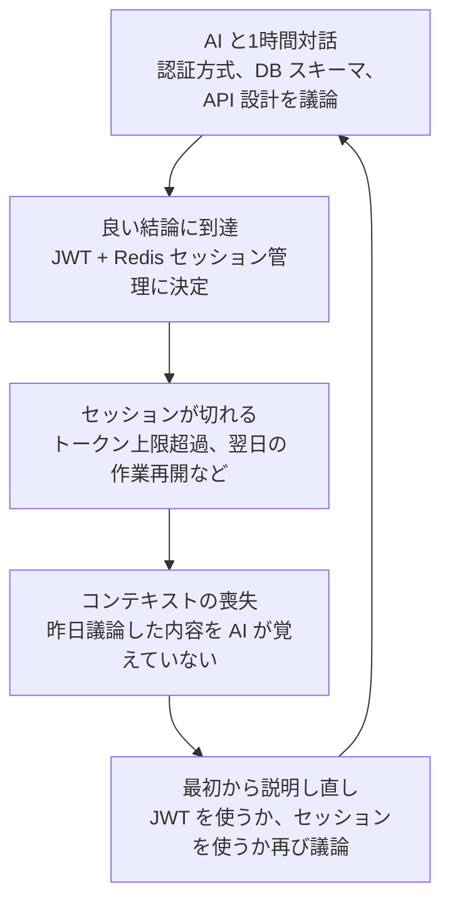
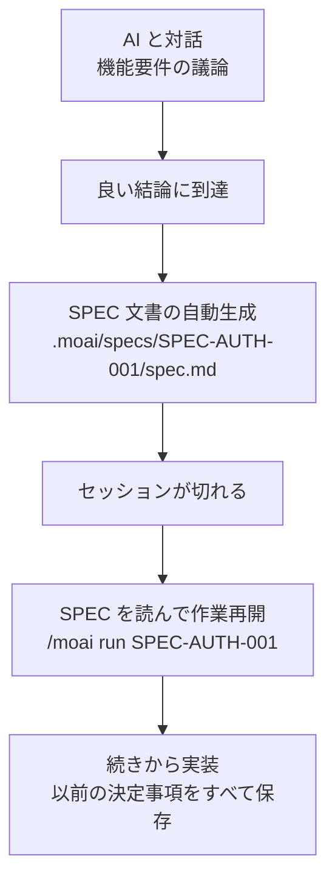
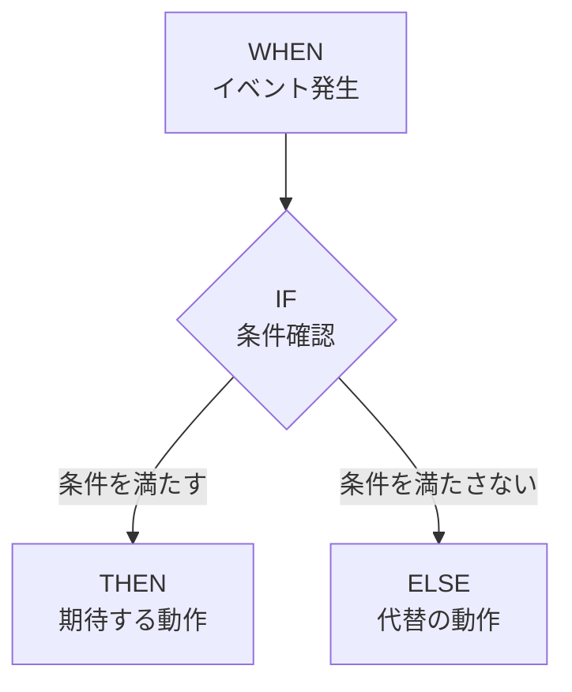
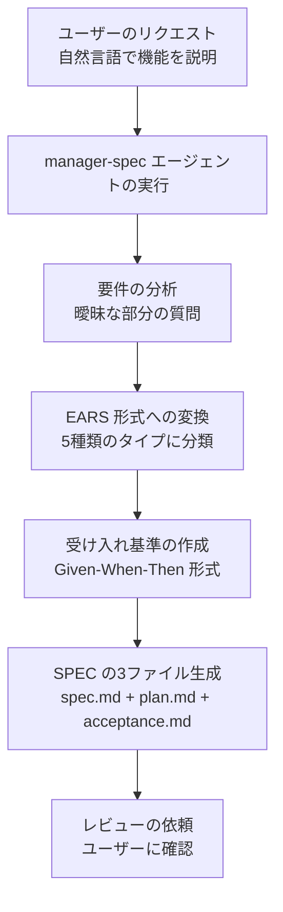
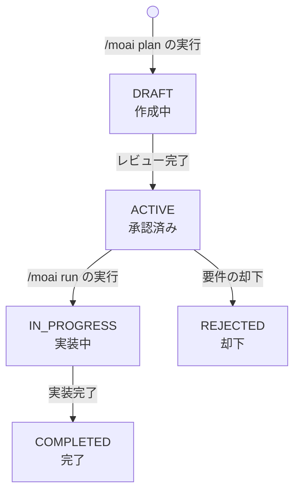

MoAI-ADK の SPEC ベース開発方法論を詳しく案内します。SPEC はエージェンティックハーネスの入力であり、トークノミクスの隠れたツールでもあります — 要件がファイルとして残っていれば、セッションを切って `/clear` でコンテキストを空にしても、SPEC 1行で作業を継続でき、同じ説明を繰り返してトークンを燃やすことがありません。


  **一言要約:** SPEC は「AI と交わした対話をドキュメントとして残すこと」です。セッションが切れても、SPEC さえあればいつでも作業を再開できます。



  **SPEC は Agent のためのものです:** SPEC は開発者が暗記したり学習したりするためのものではありません。Agent が作業を実行するときに参照するドキュメントです。SPEC の原理と使い方を概念的に理解していれば十分です。



  **SPEC は3ファイルで構成されます:** `/moai plan` の実行時に `spec.md` (EARS 要件)、`plan.md` (実装計画)、`acceptance.md` (受け入れ基準) の3ファイルが同時に生成されます。


## SPEC とは?

**SPEC** (Specification) は、プロジェクトの要件を構造化された形式で定義したドキュメントです。

日常の例えで説明すると、SPEC は **料理レシピ** のようなものです。料理をするとき、頭の中の記憶だけに頼ると、材料を忘れたり手順を飛ばしたりしがちです。しかしレシピを書いておけば、誰でも同じ料理を正確に作れます。

| 料理レシピ | SPEC 文書 | 共通点 |
| --------------------------------- | ---------------------- | -------------------------------- |
| 必要な材料リスト | 要件リスト | 何が必要かを定義 |
| 調理手順 | 実装手順 | どの順序で進めるかを定義 |
| 完成写真 | 受け入れ基準 | 完成した結果がどんな姿かを定義 |
| 「塩少々」のような曖昧な表現なし | EARS 形式で明確に | 曖昧さの排除 |

## なぜ SPEC が必要なのか?

### バイブコーディングのコンテキスト喪失問題

AI と対話しながらコードを書くとき、最大の問題は **コンテキストの喪失** です。


```mermaid
flowchart TD
    A["AI と1時間対話\n認証方式、DB スキーマ、API 設計を議論"] --> B["良い結論に到達\nJWT + Redis セッション管理に決定"]
    B --> C["セッションが切れる\nトークン上限超過、翌日の作業再開など"]
    C --> D["コンテキストの喪失\n昨日議論した内容を AI が覚えていない"]
    D --> E["最初から説明し直し\nJWT を使うか、セッションを使うか再び議論"]
    E --> A
```

**コンテキスト喪失が起こる具体的な状況:**

| 状況 | 何が起こるか | 結果 |
| ----------------- | ------------------------------------ | ---------------------- |
| セッションのタイムアウト | 一定時間後に以前の対話内容が消える | 議論した決定事項の喪失 |
| `/clear` の実行 | トークン節約のためにコンテキストを初期化 | 以前のコンテキスト全体が初期化 |
| トークン上限の超過 | 対話が長くなると古い内容から切り捨てられる | 序盤の決定事項の喪失 |
| 翌日の作業再開 | 新しいセッションは昨日の対話を知らない | すべての内容の再説明が必要 |

### SPEC で問題を解決する

SPEC は対話の内容を **ファイルとして保存** することで、この問題を根本的に解決します。ファイルに残った決定はコンテキストウィンドウと無関係に生き残ります — ハーネスエンジニアリングで言う "durable state in files" (ファイルに保持される永続状態) の代表例です。


```mermaid
flowchart TD
    A["AI と対話\n機能要件の議論"] --> B["良い結論に到達"]
    B --> C["SPEC 文書の自動生成\n.moai/specs/SPEC-AUTH-001/spec.md"]
    C --> D["セッションが切れる"]
    D --> E["SPEC を読んで作業再開\n/moai run SPEC-AUTH-001"]
    E --> F["続きから実装\n以前の決定事項をすべて保存"]
```

**SPEC の有無による違い:**


**SPEC なしで作業する場合:**

昨日「ユーザー認証機能」について AI と1時間議論したとしましょう。JWT を使うかセッションを使うか、トークンの有効期限はどれくらいにするか、リフレッシュトークンはどこに保存するか... これらすべてを再び議論しなければなりません。

**SPEC がある場合:**

以下の1行で、昨日決めた内容のまま実装を開始できます。

```bash
> /moai run SPEC-AUTH-001
```



## EARS 形式

**EARS** (Easy Approach to Requirements Syntax) は、要件を明確に書く方法です。自然言語の曖昧さを排除し、テストで検証できる形式に要件を変換します。

EARS は5種類の要件パターンを提供します。

### 1. Ubiquitous (常に真)

システムが **常に** 遵守すべき要件です。条件なしに常に適用されます。

**形式:** 「システムは~しなければならない」

**例:**

```yaml
- id: REQ-001
  type: ubiquitous
  priority: HIGH
  text: "システムはすべてのユーザー入力を検証しなければならない"
  acceptance_criteria:
    - "すべての入力値に対する型検証の実行"
    - "SQL Injection 防止のためのパラメータ化クエリの使用"
    - "XSS 防止のための出力エスケープ"
```

**日常の例え:** 「運転するときは常にシートベルトを着用しなければならない」と同じです。特別な条件なしに常に守ります。

### 2. Event-driven (イベント駆動)

特定のイベントが発生したときに、システムがどう反応すべきかを定義します。

**形式:** 「WHEN ~すると、IF ~ならば、THEN ~しなければならない」


```mermaid
flowchart TD
    A["WHEN\nイベント発生"] --> B{"IF\n条件確認"}
    B -->|条件を満たす| C["THEN\n期待する動作"]
    B -->|条件を満たさない| D["ELSE\n代替の動作"]
```

**例:**

```yaml
- id: REQ-002
  type: event-driven
  priority: HIGH
  text: |
    WHEN ユーザーがログインボタンをクリックすると、
    IF メールアドレスとパスワードが有効ならば、
    THEN JWT トークンを発行し、ダッシュボードにリダイレクトしなければならない
  acceptance_criteria:
    - given: "登録済みのユーザーアカウントがあり"
      when: "正しいメールアドレスとパスワードでログインすると"
      then: "200 レスポンスとともに JWT トークンを発行"
      and: "トークンの有効期限は1時間"
```

**日常の例え:** 「呼び鈴が鳴ったら (WHEN)、モニターで確認して知っている人なら (IF)、ドアを開ける (THEN)」と同じです。

### 3. State-driven (状態駆動)

特定の状態が維持されている間、システムがどう動作すべきかを定義します。

**形式:** 「WHILE ~の間、~しなければならない」

**例:**

```yaml
- id: REQ-003
  type: state-driven
  priority: MEDIUM
  text: |
    WHILE ユーザーがログイン状態の間、
    システムはセッションを5分ごとに更新しなければならない
  acceptance_criteria:
    - "最後のアクティビティから5分経過時に自動更新"
    - "セッション期限切れの5分前に通知を表示"
    - "30分間の無操作で自動ログアウト"
```

**日常の例え:** 「エアコンがついている間 (WHILE)、室温を25度に維持しなければならない」と同じです。

### 4. Unwanted (禁止事項)

システムが **絶対にしてはいけない** ことを定義します。主にセキュリティ関連の要件に使います。

**形式:** 「システムは~してはならない」

**例:**

```yaml
- id: REQ-004
  type: unwanted
  priority: CRITICAL
  text: "システムはパスワードを平文で保存してはならない"
  acceptance_criteria:
    - "パスワードは bcrypt でハッシュ化 (cost factor 12)"
    - "ハッシュ化されていないパスワードがログに含まれない"
    - "データベースへの平文パスワードの保存不可"

- id: REQ-005
  type: unwanted
  priority: CRITICAL
  text: "システムはハードコードされた秘密鍵を使ってはならない"
  acceptance_criteria:
    - "すべての秘密鍵は環境変数またはシークレットマネージャーを使用"
    - "コードに秘密鍵が含まれない"
    - "Git コミットへの秘密鍵の混入防止"
```

**日常の例え:** 「鍵を玄関マットの下に置いてはいけない」と同じです。してはいけないことを明示します。

### 5. Optional (任意の機能)

実装が推奨されるものの、必須ではない機能です。

**形式:** 「可能であれば、~すべきである」

**例:**

```yaml
- id: REQ-006
  type: optional
  priority: LOW
  text: "可能であれば、システムはログイン時にメール通知を送信すべきである"
  acceptance_criteria:
    - "メールサーバーが構成されている場合のみ動作"
    - "通知の無効化オプションを提供"
```

**日常の例え:** 「時間があればデザートも作れたらいいな」と同じです。あれば良いですが、なくても大丈夫です。

### EARS の一覧

| 種類 | 形式 | 用途 | 優先度 |
| ---------------- | ----------------------------- | ------------------ | ---------------- |
| **Ubiquitous** | 「システムは~しなければならない」 | 常に適用されるルール | 通常 HIGH |
| **Event-driven** | 「WHEN ~すると、THEN ~しなければならない」 | イベント反応の定義 | 機能による |
| **State-driven** | 「WHILE ~の間、~しなければならない」 | 状態維持の動作 | 通常 MEDIUM |
| **Unwanted** | 「システムは~してはならない」 | 禁止事項 (セキュリティ) | 通常 CRITICAL |
| **Optional** | 「可能であれば、~すべきである」 | 任意の機能 | 通常 LOW |

## SPEC 文書の構造

SPEC 文書は **manager-spec エージェント** が自動的に生成します。開発者が EARS 形式を直接暗記する必要はなく、自然言語でリクエストすればエージェントが変換します。

`/moai plan` の実行時に、1つの SPEC ディレクトリの中に **3つのファイル** が同時に生成されます:

| ファイル | 役割 | 内容 |
| --- | --- | --- |
| `spec.md` | EARS 要件の定義 | YAML フロントマター、要件 (5種類の EARS タイプ)、制約条件、依存関係 |
| `plan.md` | 実装計画 | 作業の分解、技術スタックの明細、リスク分析と緩和戦略 |
| `acceptance.md` | 受け入れ基準 | Given/When/Then シナリオ、エッジケース、性能および品質ゲート |

### spec.md -- EARS 要件

```yaml
---
id: SPEC-AUTH-001               # 一意の識別子
title: ユーザー認証システム       # 明確で簡潔なタイトル
priority: HIGH                  # HIGH, MEDIUM, LOW
status: ACTIVE                  # DRAFT, ACTIVE, IN_PROGRESS, COMPLETED
created: 2025-01-12             # 作成日
updated: 2025-01-12             # 最終更新日
author: 開発チーム               # 作成者
version: 1.0.0                  # ドキュメントバージョン
---

# ユーザー認証システム

## 概要
JWT ベースのユーザー認証システムの実装

## 要件
### Ubiquitous
- システムはすべての API リクエストに認証を要求しなければならない

### Event-driven
- WHEN ユーザーがログインすると、THEN JWT を発行しなければならない

### Unwanted
- システムはパスワードを平文で保存してはならない

## 制約条件
- API 応答時間 500ms 以内
- パスワードは bcrypt ハッシュ化 (cost factor 12)

## 依存関係
- Redis (セッション管理)
- PostgreSQL (ユーザーデータ)
```

### plan.md -- 実装計画

```markdown
# 実装計画

## 作業の分解
1. ユーザーモデルとマイグレーションの作成
2. JWT トークンの発行/検証ユーティリティの実装
3. ログイン/会員登録 API エンドポイントの実装
4. 認証ミドルウェアの実装
5. Refresh Token 更新ロジックの実装

## 技術スタック
- Go 1.23 + Fiber v2
- PostgreSQL 16 + GORM
- Redis 7 (セッション/トークンの保存)

## リスク分析
| リスク | 影響 | 緩和戦略 |
| --- | --- | --- |
| トークンの窃取 | HIGH | Refresh Token のローテーション、HttpOnly クッキー |
| ブルートフォース | MEDIUM | Rate Limiting、アカウントロック |
```

### acceptance.md -- 受け入れ基準

```markdown
# 受け入れ基準

## シナリオ

### AC-01: 正常ログイン
- **Given** 登録済みのユーザーアカウントがあり
- **When** 正しいメールアドレスとパスワードでログインすると
- **Then** 200 レスポンスと JWT トークンセットを返す

### AC-02: 誤った認証情報
- **Given** 登録済みのユーザーアカウントがあり
- **When** 間違ったパスワードでログインすると
- **Then** 401 レスポンスと一般的なエラーメッセージを返す

## エッジケース
- 期限切れの Refresh Token での更新時に 401 レスポンス
- 同時ログイン数の上限超過時に最も古いセッションを失効

## 品質ゲート
- API 応答時間: 500ms 以内 (P95)
- テストカバレッジ: 85% 以上
```

## SPEC ワークフロー

SPEC の作成は `/moai plan` コマンド1つで始まります。


```mermaid
flowchart TD
    A["ユーザーのリクエスト\n自然言語で機能を説明"] --> B["manager-spec エージェントの実行"]
    B --> C["要件の分析\n曖昧な部分の質問"]
    C --> D["EARS 形式への変換\n5種類のタイプに分類"]
    D --> E["受け入れ基準の作成\nGiven-When-Then 形式"]
    E --> F["SPEC の3ファイル生成\nspec.md + plan.md + acceptance.md"]
    F --> G["レビューの依頼\nユーザーに確認"]
```

**実行方法:**

```bash
# SPEC の作成コマンド
> /moai plan "ユーザー認証機能の実装"
```

このコマンドを実行すると、次が自動的に進みます:

1. **要件の分析:** manager-spec が「ユーザー認証機能」が何を意味するのかを分析します
2. **明確化の質問:** 曖昧な部分があればユーザーに質問します (例: 「JWT とセッションのどちらの方式を好みますか?」)
3. **EARS への変換:** 自然言語を5種類の EARS タイプに自動分類します
4. **3ファイルの生成:** `.moai/specs/SPEC-AUTH-001/` ディレクトリに `spec.md`、`plan.md`、`acceptance.md` の3ファイルを同時に生成します
5. **レビューの依頼:** 生成された SPEC をユーザーに見せて確認を依頼します


  **重要:** エージェントが生成した SPEC 文書は必ず一度レビューしてください。AI が要件を誤って解釈したり、抜け漏れが生じたりすることがあります。特に受け入れ基準がテスト可能か、優先度が適切かを確認するのが良いでしょう。


## SPEC ファイルの場所と管理

### ファイル構造

```
.moai/
└── specs/
    ├── SPEC-AUTH-001/
    │   ├── spec.md          # EARS 要件
    │   ├── plan.md          # 実装計画
    │   └── acceptance.md    # 受け入れ基準
    ├── SPEC-PAYMENT-001/
    │   ├── spec.md
    │   ├── plan.md
    │   └── acceptance.md
    └── SPEC-SEARCH-001/
        ├── spec.md
        ├── plan.md
        └── acceptance.md
```

### SPEC の状態管理

各 SPEC はライフサイクルに応じて状態が変わります。


```mermaid
flowchart TD
    Start(( )) -->|"/moai plan の実行"| DRAFT["DRAFT\n作成中"]
    DRAFT -->|"レビュー完了"| ACTIVE["ACTIVE\n承認済み"]
    ACTIVE -->|"/moai run の実行"| IN_PROGRESS["IN_PROGRESS\n実装中"]
    IN_PROGRESS -->|"実装完了"| COMPLETED["COMPLETED\n完了"]
    ACTIVE -->|"要件の却下"| REJECTED["REJECTED\n却下"]
```

| 状態 | 意味 | 次に可能な状態 |
| ------------- | -------------------------- | --------------------- |
| `DRAFT` | 作成中、レビューが必要 | ACTIVE, REJECTED |
| `ACTIVE` | 承認済み、実装準備完了 | IN_PROGRESS, REJECTED |
| `IN_PROGRESS` | 実装進行中 | COMPLETED, REJECTED |
| `COMPLETED` | すべての受け入れ基準を満たし完了 | (最終状態) |
| `REJECTED` | 要件が却下され、書き直しが必要 | (最終状態) |

## 実践例: JWT 認証の SPEC

実際に `/moai plan` を実行して生成された SPEC の例です。

```bash
# SPEC の作成
> /moai plan "JWT ベースのユーザー認証システム。ログイン、会員登録、トークン更新機能を含む"
```

以下のように `.moai/specs/SPEC-AUTH-001/` ディレクトリに3ファイルが生成されます。

**spec.md -- EARS 要件:**

```yaml
---
id: SPEC-AUTH-001
title: JWT ベースのユーザー認証システム
priority: HIGH
status: ACTIVE
created: 2025-01-15
version: 1.0.0
---

# JWT ベースのユーザー認証システム

## 概要
JWT トークンを使ったユーザー認証システム。
ログイン、会員登録、トークン更新機能を実装する。

## 要件

### Ubiquitous
- REQ-U01: システムはすべての認証トークンを HTTPS のみで送信しなければならない
- REQ-U02: システムはすべてのユーザー入力を検証しなければならない

### Event-driven
- REQ-E01: WHEN ユーザーが会員登録フォームを送信すると、
  IF メールアドレスが重複していなければ、
  THEN アカウントを作成し、ウェルカムメールを送信しなければならない
- REQ-E02: WHEN ユーザーがログインすると、
  IF 認証情報が有効ならば、
  THEN Access Token (1時間) と Refresh Token (7日) を発行しなければならない

### Unwanted
- REQ-N01: システムはパスワードを平文で保存してはならない
- REQ-N02: システムは期限切れの Refresh Token で新しいトークンを発行してはならない

### Optional
- REQ-O01: 可能であれば、ソーシャルログイン (Google, GitHub) をサポートすべきである

## 制約条件
- パスワード: bcrypt (cost factor 12)
- Access Token の有効期限: 1時間
- Refresh Token の有効期限: 7日
- API 応答時間: 500ms 以内 (P95)
```

**plan.md -- 実装計画:**

```markdown
# 実装計画

## 作業の分解
1. ユーザーモデルと DB マイグレーションの作成
2. パスワードハッシュ化ユーティリティの実装
3. JWT トークンの発行/検証ユーティリティの実装
4. 会員登録 API エンドポイントの実装
5. ログイン API エンドポイントの実装
6. 認証ミドルウェアの実装
7. Refresh Token 更新ロジックの実装

## 技術スタック
- Go 1.23 + Fiber v2
- PostgreSQL 16 + GORM
- Redis 7 (Refresh Token の保存)

## リスク分析
| リスク | 影響 | 緩和戦略 |
| --- | --- | --- |
| トークンの窃取 | HIGH | Refresh Token のローテーション、HttpOnly クッキー |
| ブルートフォース | MEDIUM | Rate Limiting、アカウントロック |
```

**acceptance.md -- 受け入れ基準:**

```markdown
# 受け入れ基準

## シナリオ

### AC-01: 正常ログイン
- **Given** 登録済みのユーザーアカウントがあり
- **When** 正しいメールアドレスとパスワードでログインすると
- **Then** 200 レスポンスと JWT トークンセット (Access + Refresh) を返す

### AC-02: 誤ったパスワード
- **Given** 登録済みのユーザーアカウントがあり
- **When** 間違ったパスワードでログインすると
- **Then** 401 レスポンス

### AC-03: 重複した会員登録
- **Given** すでに登録済みのメールアドレスがあり
- **When** 同じメールアドレスで会員登録すると
- **Then** 409 レスポンス

### AC-04: トークンの更新
- **Given** 有効な Refresh Token があり
- **When** トークンの更新をリクエストすると
- **Then** 新しい Access Token を返す

## 品質ゲート
- API 応答時間: 500ms 以内 (P95)
- テストカバレッジ: 85% 以上
```

**この SPEC で実装を開始する:**

```bash
# SPEC 確認後に実装開始
> /moai run SPEC-AUTH-001
```

このコマンド1つで、設定された開発方法論 (DDD または TDD) に従い、SPEC のすべての要件を自動的に実装します。新規プロジェクトは **TDD** (RED-GREEN-REFACTOR)、既存プロジェクトは **DDD** (ANALYZE-PRESERVE-IMPROVE) サイクルを使用します。

## SPEC 作成のヒント

### 自然言語から EARS への変換

日常的なリクエストを EARS 形式にどう変えるかを比較します。

| 自然言語のリクエスト | EARS 形式 |
| ---------------------- | ------------------------------------------------------------------------ |
| 「ログイン機能を作って」 | WHEN ユーザーが有効な認証情報を提示すると、THEN 認証トークンを発行しなければならない |
| 「パスワードは安全に」 | システムはパスワードを平文で保存してはならない (Unwanted) |
| 「速くないとダメ」 | ログインの応答時間は 500ms 以内でなければならない (Ubiquitous) |
| 「エラー処理をちゃんとして」 | WHEN エラーが発生すると、THEN ユーザーに明確なメッセージを表示しなければならない |
| 「できたらいいな」 | 可能であれば、システムはリアルタイム通知をサポートすべきである (Optional) |


  EARS 形式を直接書く必要はありません。`/moai plan` に自然言語でリクエストすると、**manager-spec エージェントが自動的に EARS 形式に変換** します。上の表はどう変換されるかを理解するための参考資料です。


## SPEC のライフサイクルと Era 分類

SPEC は一度書いて終わりのドキュメントではなく、**計画(plan) → 実装(run) → 同期(sync)** というライフサイクルに従います。MoAI-ADK は各 SPEC がどの時代(era)の規約で書かれたかを自動的に分類し、現代の規約に従う SPEC にのみドリフト(drift、規約からの逸脱)検査を適用します。

### 3段階クローズ(plan → run → sync)

すべての V3R6 SPEC は **3段階** で完結します。かつて存在した4番目の段階(Mx-phase)は **廃止** されました — MX タグ検証は別の段階ではなく、sync 段階で処理される横断的関心事(cross-cutting concern)です。

| 段階 | コマンド | やること | 記録場所 |
| --- | --- | --- | --- |
| **plan** | `/moai plan` | SPEC 成果物(spec/plan/acceptance)の作成 | `progress.md` §E.1 |
| **run** | `/moai run` | 方法論(DDD/TDD)に従って実装 | `progress.md` §E.2 / §E.3 |
| **sync** | `/moai sync` | ドキュメント同期 + 完了コミット | `progress.md` §E.4 |

sync 段階が終わると、そのコミットの SHA が `progress.md` の **`§E.4 Sync-phase Audit-Ready Signal`** セクションに **`sync_commit_sha`** フィールドとして記録されます。このフィールドの有無が、SPEC が現代の規約(V3R6)を完全に守ったかを判別する中核シグナルです。


  **Mx-phase の廃止:** 以前のバージョンには plan/run/sync の次に `Mx-phase` という4番目の段階と `mx_commit_sha` フィールドがありました。現在は廃止され、3段階に統合されています。MX コードコメント(@MX タグ)の管理は sync 段階の中で一緒に実行されます。


### 5つの Era 分類

すべての SPEC は、書かれた時期の規約に応じて、正確に1つの era バケットに分類されます。

| Era | 時期 | ライフサイクル標準 |
| --- | --- | --- |
| **V2.x** | 2026-02 以前 | `progress.md` なし; 直接コミットで実装 |
| **V3R2-R4** | 2026-02 ~ 2026-03 | `progress.md` の導入; `sync_commit_sha` なし |
| **V3R5** | 2026-03 ~ 2026-04 | sync セクションの登場; `sync_commit_sha` は非強制 |
| **V3R6** | 2026-04 ~ 現在 | 3段階の現代標準(plan/run/sync); `sync_commit_sha` 必須 |
| **unclassified** | — | 自動分類不可(どのヒューリスティックにもマッチしない) |

era 分類は `spec.md` フロントマターの `created:` 日付と `progress.md` のセクション構造を自動的に検査して決定されます。境界が曖昧な場合は、フロントマターに `era: V3R6` のような明示的なフィールドを追加して直接指定できます。

### Grandfather 条項(grandfather clause)

**V2.x · V3R2-R4 · V3R5** に分類された SPEC は **grandfather 条項で保護** されます。この3つの era は、書かれた当時の規約が正当だったため、現代の V3R6 規約を遡及適用しません。

- grandfather SPEC は監査結果で `era_final: true` と表示されます。
- セクションの欠落、コミット SHA の不在など、どんなパターンでも **ドリフト欠陥として報告されません**。
- 過去の SPEC を現代の規約に合わせて一括正規化するのは運用上不可能で、実益がないためです。

### ドリフト検査は V3R6 専用

ライフサイクルのドリフト検査(`moai spec audit`)は **V3R6 SPEC にのみ** 適用されます。

- 現代 era の境界基準日は **`2026-04-01`** です。この日以降に作成され、V3R6 のシグナルを備えた SPEC だけがドリフト検査の対象です。
- 内部的に `IsModern()` の判定は **V3R6 のときのみ真(true)** を返します。
- つまり、grandfather era(V2.x/V3R2-R4/V3R5)はドリフト検査から常に除外され、欠陥として分類されません。

この分類体系のおかげで、古い SPEC に対する偽陽性(false positive)なしに、現在作成中の SPEC の規約遵守だけを正確に検証できます。

## 関連ドキュメント

- [MoAI-ADK とは?](/core-concepts/what-is-moai-adk) -- MoAI-ADK の全体構造を理解します
- [開発方法論 (DDD/TDD)](/core-concepts/ddd) -- SPEC を基盤に安全にコードを実装する DDD/TDD 方法論を学びます
- [TRUST 5 品質](/core-concepts/trust-5) -- 実装されたコードの品質を検証する基準を学びます
