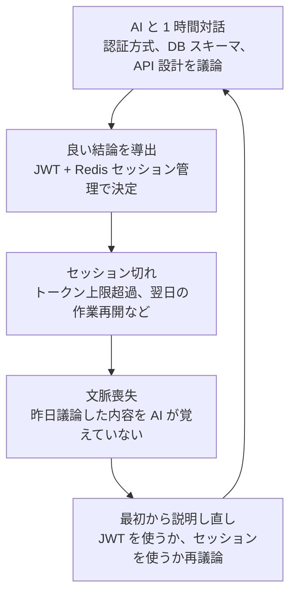
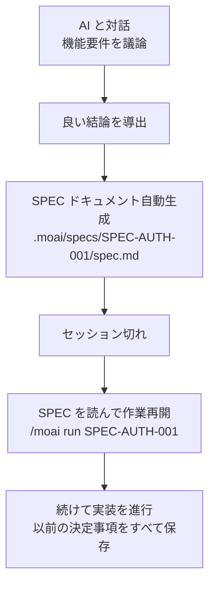
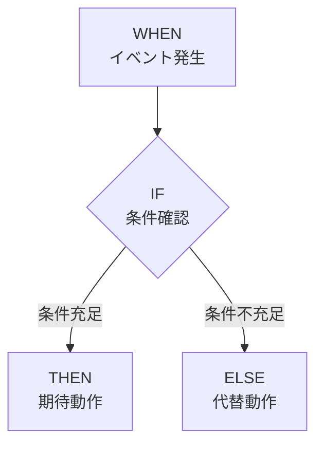
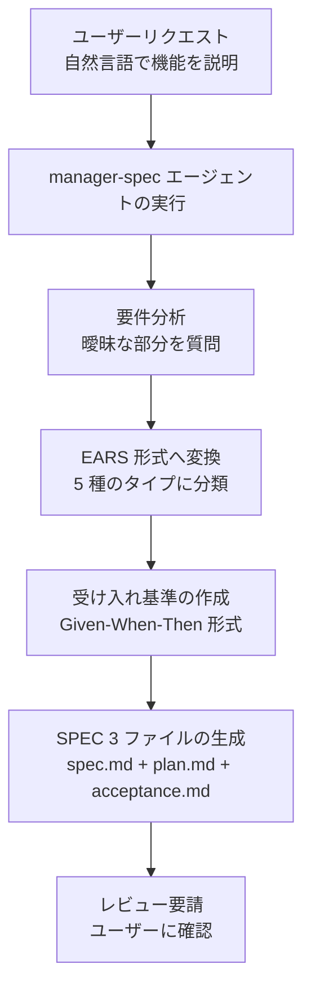
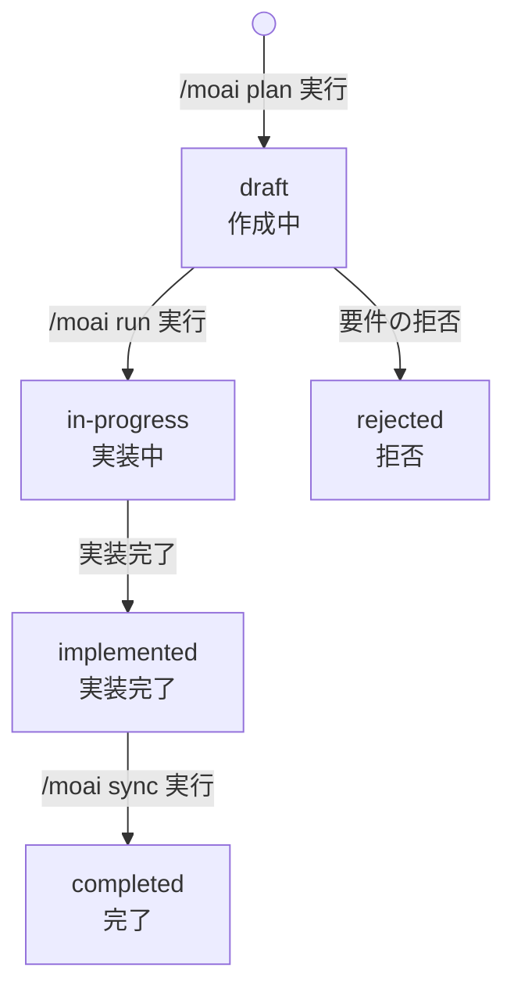

MoAI-ADK の SPEC ベース開発方法論を詳しく案内します。SPEC はエージェンティックハーネスの入力であり、トークノミクスの隠れたツールです — 要件がファイルに残っていれば、セッションを切って `/clear` でコンテキストを空にしても SPEC 一行で作業を続けられ、同じ説明を繰り返してトークンを燃やすことがありません。




  **一行要約:** SPEC は「AI と交わした対話をドキュメントに残すこと」です。セッションが
  切れても SPEC さえあればいつでも続けて作業できます。



  **SPEC は Agent のためのものです:** SPEC は開発者が暗記したり学習したりするためのもの
  ではありません。Agent が作業を行うときに参照するドキュメントです。SPEC の原理と使い
  方を概念的に理解していれば十分です。



  **SPEC は 3 つのファイルで構成されます:** `/moai plan` 実行時に `spec.md` (EARS 要件)、`plan.md` (実装計画)、`acceptance.md` (受け入れ基準) の 3 つのファイルが同時に生成されます。


## SPEC とは?

**SPEC** (Specification) はプロジェクトの要件を構造化された形式で定義した
ドキュメントです。

日常的なたとえで説明すると、SPEC は **料理のレシピ** のようなものです。料理するとき
頭の中だけで覚えていると材料を抜かしたり順序を忘れたりしやすいです。しかしレシピを
書いておけば誰でも同じ料理を正確に作れます。

| 料理のレシピ                       | SPEC ドキュメント              | 共通点                           |
| --------------------------------- | ---------------------- | -------------------------------- |
| 必要な材料の一覧                  | 要件の一覧          | 何が必要かを定義             |
| 調理の順序                         | 実装の順序              | どんな順序で進めるかを定義        |
| 完成写真                         | 受け入れ基準              | 完成した結果がどんな姿かを定義 |
| 「塩少々」のような曖昧な表現なし | EARS 形式で明確に | 曖昧さの除去                      |

## なぜ SPEC が必要か?

### バイブコーディングの文脈喪失問題

AI と対話しながらコードを書くとき、最大の問題は **文脈の喪失** です。


```mermaid
flowchart TD
    A["AI と 1 時間対話\n認証方式、DB スキーマ、API 設計を議論"] --> B["良い結論を導出\nJWT + Redis セッション管理で決定"]
    B --> C["セッション切れ\nトークン上限超過、翌日の作業再開など"]
    C --> D["文脈喪失\n昨日議論した内容を AI が覚えていない"]
    D --> E["最初から説明し直し\nJWT を使うか、セッションを使うか再議論"]
    E --> A
```

**文脈喪失が発生する具体的な状況:**

| 状況              | 何が起きるか                 | 結果                   |
| ----------------- | ------------------------------------ | ---------------------- |
| セッションタイムアウト     | 一定時間後に以前の対話内容が消える | 議論した決定事項の消失 |
| `/clear` 実行     | トークンを節約するためコンテキストを初期化 | 以前の文脈全体の初期化  |
| トークン上限超過    | 対話が長くなると古い内容から切られる | 序盤の決定事項の喪失     |
| 翌日の作業再開 | 新しいセッションでは昨日の対話を知らない       | すべての内容の再説明が必要  |

### SPEC で問題を解決する

SPEC は対話内容を **ファイルに保存** してこの問題を根本的に解決します。ファイルに残った決定はコンテキストウィンドウと無関係に生き残ります — ハーネスエンジニアリングでいう「durable state in files」(ファイルに込められた持続状態) の代表的な例です。


```mermaid
flowchart TD
    A["AI と対話\n機能要件を議論"] --> B["良い結論を導出"]
    B --> C["SPEC ドキュメント自動生成\n.moai/specs/SPEC-AUTH-001/spec.md"]
    C --> D["セッション切れ"]
    D --> E["SPEC を読んで作業再開\n/moai run SPEC-AUTH-001"]
    E --> F["続けて実装を進行\n以前の決定事項をすべて保存"]
```

**SPEC の有無による違い:**


**SPEC なしで作業する場合:**

昨日「ユーザー認証機能」について 1 時間 AI と議論したと仮定しましょう。JWT を使うか
セッションを使うか、トークン有効期限をいくつにするか、リフレッシュトークンをどこに保存するか... この
すべてを再び議論する必要があります。

**SPEC がある場合:**

下記の一行で昨日決めた内容そのままに実装を開始します。

```bash
> /moai run SPEC-AUTH-001
```



## EARS 形式

**EARS** (Easy Approach to Requirements Syntax) は要件を明確に書く
方法です。自然言語の曖昧さを除去し、テストで検証できる形式に
要件を変換します。

EARS は 5 種類の要件パターンを提供します。

 **GEARS ノート (v3.0.0+)**: GEARS (Generalized Approach to Requirements Syntax) が新しい公式の要件表記法として導入されました。EARS は 6 か月間の後方互換性を維持し、既存の SPEC ワークフロールールは依然として EARS 表記を使います。新規 SPEC は GEARS 表記を推奨します。

### 1. Ubiquitous (常に真)

システムが **常に** 遵守しなければならない要件です。条件なしに常に適用されます。

**形式:** 「システムは ~しなければならない」

**例:**

```yaml
- id: REQ-001
  type: ubiquitous
  priority: HIGH
  text: "システムはすべてのユーザー入力を検証しなければならない"
  acceptance_criteria:
    - "すべての入力値に対して型検証を実行"
    - "SQL Injection 防止のためパラメータ化されたクエリを使用"
    - "XSS 防止のため出力エスケープ"
```

**日常のたとえ:** 「運転するときは常にシートベルトを着用しなければならない」と同じです。特別な
条件なしに常に守る必要があります。

### 2. Event-driven (イベント駆動)

特定のイベントが発生したときにシステムがどう反応すべきかを定義します。

**形式:** 「WHEN ~したら、IF ~なら、THEN ~しなければならない」


```mermaid
flowchart TD
    A["WHEN\nイベント発生"] --> B{"IF\n条件確認"}
    B -->|条件充足| C["THEN\n期待動作"]
    B -->|条件不充足| D["ELSE\n代替動作"]
```

**例:**

```yaml
- id: REQ-002
  type: event-driven
  priority: HIGH
  text: |
    WHEN ユーザーがログインボタンをクリックしたら、
    IF メールアドレスとパスワードが有効なら、
    THEN JWT トークンを発行しダッシュボードにリダイレクトしなければならない
  acceptance_criteria:
    - given: "登録されたユーザーアカウントがあり"
      when: "正しいメールアドレスとパスワードでログインすると"
      then: "200 応答とともに JWT トークンを発行"
      and: "トークン有効期限は 1 時間"
```

**日常のたとえ:** 「呼び鈴が鳴ったら (WHEN)、モニターで確認して知っている人なら (IF)、
ドアを開ける (THEN)」と同じです。

### 3. State-driven (状態駆動)

特定の状態が維持される間、システムがどう動作すべきかを定義します。

**形式:** 「WHILE ~の間、~しなければならない」

**例:**

```yaml
- id: REQ-003
  type: state-driven
  priority: MEDIUM
  text: |
    WHILE ユーザーがログインした状態の間、
    システムはセッションを 5 分ごとに更新しなければならない
  acceptance_criteria:
    - "最後の活動から 5 分経過時に自動更新"
    - "セッション有効期限の 5 分前に通知を表示"
    - "30 分無活動時に自動ログアウト"
```

**日常のたとえ:** 「エアコンがついている間 (WHILE)、室内温度を 25 度に維持しなければ
ならない」と同じです。

### 4. Unwanted (禁止事項)

システムが **決してしてはならない** ことを定義します。主にセキュリティ関連の要件に
使います。

**形式:** 「システムは ~してはならない」

**例:**

```yaml
- id: REQ-004
  type: unwanted
  priority: CRITICAL
  text: "システムはパスワードを平文で保存してはならない"
  acceptance_criteria:
    - "パスワードは bcrypt でハッシュ (cost factor 12)"
    - "ハッシュされていないパスワードがログに含まれない"
    - "データベースに平文パスワードの保存不可"

- id: REQ-005
  type: unwanted
  priority: CRITICAL
  text: "システムはハードコードされた秘密鍵を使ってはならない"
  acceptance_criteria:
    - "すべての秘密鍵は環境変数または秘密管理ツールを使用"
    - "コードに秘密鍵が含まれない"
    - "Git コミットに秘密鍵が含まれるのを防止"
```

**日常のたとえ:** 「鍵を玄関マットの下に置いてはならない」と同じです。してはいけない
ことを明示します。

### 5. Optional (選択的機能)

実装が推奨されるが必須ではない機能です。

**形式:** 「可能なら、~しなければならない」

**例:**

```yaml
- id: REQ-006
  type: optional
  priority: LOW
  text: "可能なら、システムはログイン時にメール通知を送信しなければならない"
  acceptance_criteria:
    - "メールサーバーが構成されている場合のみ動作"
    - "通知の無効化オプションを提供"
```

**日常のたとえ:** 「時間があればデザートも作れたら良い」と同じです。あれば良いが
なくても大丈夫です。

### EARS 一目で見る

| 種類             | 形式                          | 用途               | 優先順位         |
| ---------------- | ----------------------------- | ------------------ | ---------------- |
| **Ubiquitous**   | 「システムは ~しなければならない」         | 常に適用されるルール | 通常 HIGH        |
| **Event-driven** | 「WHEN ~したら、THEN ~しなければならない」 | イベント反応の定義   | 機能に応じて異なる |
| **State-driven** | 「WHILE ~の間、~しなければならない」  | 状態維持の動作     | 通常 MEDIUM      |
| **Unwanted**     | 「システムは ~してはならない」      | 禁止事項 (セキュリティ)   | 通常 CRITICAL    |
| **Optional**     | 「可能なら、~しなければならない」      | 選択的機能        | 通常 LOW         |

## SPEC ドキュメント構造

SPEC ドキュメントは **manager-spec エージェント** が自動的に生成します。開発者が直接 EARS
形式を暗記する必要なく、自然言語でリクエストするとエージェントが変換します。

`/moai plan` 実行時に 1 つの SPEC ディレクトリの中に **3 つのファイル** が同時に生成されます:

| ファイル | 役割 | 内容 |
| --- | --- | --- |
| `spec.md` | EARS 要件の定義 | YAML フロントマター、要件 (5 種の EARS タイプ)、制約条件、依存性 |
| `plan.md` | 実装計画 | 作業分解、技術スタック仕様、リスク分析および緩和戦略 |
| `acceptance.md` | 受け入れ基準 | Given/When/Then シナリオ、エッジケース、性能および品質ゲート |

### spec.md -- EARS 要件

```yaml
---
id: SPEC-AUTH-001               # 固有識別子
title: ユーザー認証システム         # 明確で簡潔なタイトル
priority: HIGH                  # HIGH, MEDIUM, LOW
status: draft                   # draft, in-progress, implemented, completed
created: 2025-01-12             # 作成日
updated: 2025-01-12             # 最終修正日
author: 開発チーム                   # 作成者
version: 1.0.0                  # ドキュメントバージョン
---

# ユーザー認証システム

## 概要
JWT ベースのユーザー認証システムの実装

## 要件
### Ubiquitous
- システムはすべての API リクエストに認証を要求しなければならない

### Event-driven
- WHEN ユーザーがログインしたら、THEN JWT を発行しなければならない

### Unwanted
- システムはパスワードを平文で保存してはならない

## 制約条件
- API 応答時間 500ms 以内
- パスワード bcrypt ハッシュ (cost factor 12)

## 依存性
- Redis (セッション管理)
- PostgreSQL (ユーザーデータ)
```

### plan.md -- 実装計画

```markdown
# 実装計画

## 作業分解
1. ユーザーモデルおよびマイグレーションの生成
2. JWT トークン発行/検証ユーティリティの実装
3. ログイン/会員登録 API エンドポイントの実装
4. 認証ミドルウェアの実装
5. Refresh Token 更新ロジックの実装

## 技術スタック
- Go 1.23 + Fiber v2
- PostgreSQL 16 + GORM
- Redis 7 (セッション/トークン保存)

## リスク分析
| リスク | 影響 | 緩和戦略 |
| --- | --- | --- |
| トークン奪取 | HIGH | Refresh Token のローテーション、HttpOnly クッキー |
| 総当たり攻撃 | MEDIUM | Rate Limiting、アカウントロック |
```

### acceptance.md -- 受け入れ基準

```markdown
# 受け入れ基準

## シナリオ

### AC-01: 正常ログイン
- **Given** 登録されたユーザーアカウントがあり
- **When** 正しいメールアドレスとパスワードでログインすると
- **Then** 200 応答と JWT トークンセットを返す

### AC-02: 誤った資格情報
- **Given** 登録されたユーザーアカウントがあり
- **When** 誤ったパスワードでログインすると
- **Then** 401 応答と一般的なエラーメッセージを返す

## エッジケース
- 有効期限切れの Refresh Token で更新時に 401 応答
- 同時ログイン制限の超過時に最も古いセッションを有効期限切れに

## 品質ゲート
- API 応答時間: 500ms 以内 (P95)
- テストカバレッジ: 85% 以上
```

## SPEC ワークフロー

SPEC 生成は `/moai plan` コマンド 1 つで始まります。


```mermaid
flowchart TD
    A["ユーザーリクエスト\n自然言語で機能を説明"] --> B["manager-spec エージェントの実行"]
    B --> C["要件分析\n曖昧な部分を質問"]
    C --> D["EARS 形式へ変換\n5 種のタイプに分類"]
    D --> E["受け入れ基準の作成\nGiven-When-Then 形式"]
    E --> F["SPEC 3 ファイルの生成\nspec.md + plan.md + acceptance.md"]
    F --> G["レビュー要請\nユーザーに確認"]
```

**実行方法:**

```bash
# SPEC 生成コマンド
> /moai plan "ユーザー認証機能の実装"
```

このコマンドを実行すると次が自動的に進行します:

1. **要件分析:** manager-spec が「ユーザー認証機能」が何を意味するかを
   分析します
2. **明確化質問:** 曖昧な部分があればユーザーに質問します (例: 「JWT とセッション
   のどちらの方式を好みますか?」)
3. **EARS 変換:** 自然言語を 5 種の EARS タイプに自動分類します
4. **3 ファイル生成:** `.moai/specs/SPEC-AUTH-001/` ディレクトリに `spec.md`、`plan.md`、
   `acceptance.md` の 3 ファイルを同時に生成します
5. **レビュー要請:** 生成された SPEC をユーザーに見せて確認を要請します


  **重要:** エージェントが生成した SPEC ドキュメントは必ず一度レビューしてください。AI が
  要件を誤って解釈したり漏らしたりすることがあります。特に受け入れ基準がテスト
  可能か、優先順位が適切かを確認するのが良いです。


## SPEC ファイルの場所と管理

### ファイル構造

```
.moai/
└── specs/
    ├── SPEC-AUTH-001/
    │   ├── spec.md          # EARS 要件
    │   ├── plan.md          # 実装計画
    │   └── acceptance.md    # 受け入れ基準
    ├── SPEC-PAYMENT-001/
    │   ├── spec.md
    │   ├── plan.md
    │   └── acceptance.md
    └── SPEC-SEARCH-001/
        ├── spec.md
        ├── plan.md
        └── acceptance.md
```

### SPEC 状態管理

各 SPEC はライフサイクルに応じて状態が変化します。


```mermaid
flowchart TD
    Start(( )) -->|"/moai plan 実行"| draft["draft\n作成中"]
    draft -->|"/moai run 実行"| in_progress["in-progress\n実装中"]
    in_progress -->|"実装完了"| implemented["implemented\n実装完了"]
    implemented -->|"/moai sync 実行"| completed["completed\n完了"]
    draft -->|"要件の拒否"| rejected["rejected\n拒否"]
```

| 状態           | 意味                       | 次に可能な状態      |
| -------------- | -------------------------- | --------------------- |
| `draft`        | 作成中、レビューが必要         | in-progress, rejected |
| `in-progress`  | 実装進行中               | implemented, rejected |
| `implemented`  | 実装完了、同期待ち     | completed             |
| `completed`    | すべての受け入れ基準を充足、完了  | (最終状態)           |
| `rejected`     | 要件の拒否、再作成が必要 | (最終状態)           |

## 実践例: JWT 認証 SPEC

実際に `/moai plan` を実行して生成された SPEC の例です。

```bash
# SPEC 生成
> /moai plan "JWT ベースのユーザー認証システム。ログイン、会員登録、トークン更新機能を含む"
```

下記のように `.moai/specs/SPEC-AUTH-001/` ディレクトリに 3 ファイルが生成されます。

**spec.md -- EARS 要件:**

```yaml
---
id: SPEC-AUTH-001
title: JWT ベースのユーザー認証システム
priority: HIGH
status: draft
created: 2025-01-15
version: 1.0.0
---

# JWT ベースのユーザー認証システム

## 概要
JWT トークンを使ったユーザー認証システム。
ログイン、会員登録、トークン更新機能を実装する。

## 要件

### Ubiquitous
- REQ-U01: システムはすべての認証トークンを HTTPS でのみ送信しなければならない
- REQ-U02: システムはすべてのユーザー入力を検証しなければならない

### Event-driven
- REQ-E01: WHEN ユーザーが会員登録フォームを送信したら、
  IF メールアドレスが重複していなければ、
  THEN アカウントを作成し歓迎メールを送信しなければならない
- REQ-E02: WHEN ユーザーがログインしたら、
  IF 資格情報が有効なら、
  THEN Access Token (1 時間) と Refresh Token (7 日) を発行しなければならない

### Unwanted
- REQ-N01: システムはパスワードを平文で保存してはならない
- REQ-N02: システムは有効期限切れの Refresh Token で新しいトークンを発行してはならない

### Optional
- REQ-O01: 可能なら、ソーシャルログイン (Google, GitHub) をサポートしなければならない

## 制約条件
- パスワード: bcrypt (cost factor 12)
- Access Token の有効期限: 1 時間
- Refresh Token の有効期限: 7 日
- API 応答時間: 500ms 以内 (P95)
```

**plan.md -- 実装計画:**

```markdown
# 実装計画

## 作業分解
1. ユーザーモデルおよび DB マイグレーションの生成
2. パスワードハッシュユーティリティの実装
3. JWT トークン発行/検証ユーティリティの実装
4. 会員登録 API エンドポイントの実装
5. ログイン API エンドポイントの実装
6. 認証ミドルウェアの実装
7. Refresh Token 更新ロジックの実装

## 技術スタック
- Go 1.23 + Fiber v2
- PostgreSQL 16 + GORM
- Redis 7 (Refresh Token 保存)

## リスク分析
| リスク | 影響 | 緩和戦略 |
| --- | --- | --- |
| トークン奪取 | HIGH | Refresh Token のローテーション、HttpOnly クッキー |
| 総当たり攻撃 | MEDIUM | Rate Limiting、アカウントロック |
```

**acceptance.md -- 受け入れ基準:**

```markdown
# 受け入れ基準

## シナリオ

### AC-01: 正常ログイン
- **Given** 登録されたユーザーアカウントがあり
- **When** 正しいメールアドレスとパスワードでログインすると
- **Then** 200 応答と JWT トークンセット (Access + Refresh) を返す

### AC-02: 誤ったパスワード
- **Given** 登録されたユーザーアカウントがあり
- **When** 誤ったパスワードでログインすると
- **Then** 401 応答

### AC-03: 重複会員登録
- **Given** すでに登録されたメールアドレスがあり
- **When** 同じメールアドレスで会員登録すると
- **Then** 409 応答

### AC-04: トークン更新
- **Given** 有効な Refresh Token があり
- **When** トークン更新をリクエストすると
- **Then** 新しい Access Token を返す

## 品質ゲート
- API 応答時間: 500ms 以内 (P95)
- テストカバレッジ: 85% 以上
```

**この SPEC で実装を始める:**

```bash
# SPEC を確認後に実装を開始
> /moai run SPEC-AUTH-001
```

このコマンド 1 つで設定された開発方法論 (DDD または TDD) に応じて SPEC のすべての要件を
自動的に実装します。新規プロジェクトは **TDD** (RED-GREEN-REFACTOR)、既存プロジェクトは
**DDD** (ANALYZE-PRESERVE-IMPROVE) サイクルを使います。

## SPEC 作成のヒント

### 自然言語から EARS へ変換する

日常的なリクエストを EARS 形式にどう変えるかを比較します。

| 自然言語リクエスト            | EARS 形式                                                                |
| ---------------------- | ------------------------------------------------------------------------ |
| 「ログイン機能を作って」 | WHEN ユーザーが有効な資格情報を提示したら、THEN 認証トークンを発行しなければならない |
| 「パスワードは安全に」  | システムはパスワードを平文で保存してはならない (Unwanted)                 |
| 「速くないと」            | ログイン応答時間は 500ms 以内でなければならない (Ubiquitous)                      |
| 「エラー処理をちゃんと」     | WHEN エラーが発生したら、THEN ユーザーに明確なメッセージを表示しなければならない      |
| 「できたら良いんだけど」        | 可能なら、システムはリアルタイム通知をサポートしなければならない (Optional)              |


  EARS 形式を直接書かなくてもかまいません。`/moai plan` に自然言語でリクエストすると
  **manager-spec エージェントが自動的に EARS 形式へ変換** します。上記の表はどう
  変換されるかを理解するための参考資料です。


## SPEC ライフサイクルと Era 分類

SPEC は一度書いて終わりのドキュメントではなく、**計画 (plan) → 実装 (run) → 同期 (sync)** というライフサイクルに従います。MoAI-ADK は各 SPEC がどの時代 (era) の規約で書かれたかを自動的に分類し、現代の規約に従う SPEC にのみドリフト (drift、規約からの逸脱) 検査を適用します。

### 3 段階のクローズ (plan → run → sync)

すべての V3R6 SPEC は **3 段階** で完結します。かつて存在した 4 番目の段階 (Mx-phase) は **廃止** されました — MX タグ検証は別の段階ではなく sync 段階で処理される横断的関心事 (cross-cutting concern) です。

| 段階 | コマンド | やること | 記録場所 |
| --- | --- | --- | --- |
| **plan** | `/moai plan` | SPEC 成果物 (spec/plan/acceptance) の作成 | `progress.md` §E.1 |
| **run** | `/moai run` | 方法論 (DDD/TDD) に応じて実装 | `progress.md` §E.2 / §E.3 |
| **sync** | `/moai sync` | ドキュメント同期 + 完了コミット | `progress.md` §E.4 |

sync 段階が終わるとそのコミットの SHA が `progress.md` の **`§E.4 Sync-phase Audit-Ready Signal`** セクションに **`sync_commit_sha`** フィールドとして記録されます。このフィールドの存在有無が SPEC が現代の規約 (V3R6) を完全に従ったかを判別する核心的な信号です。


  **Mx-phase の廃止:** 以前のバージョンには plan/run/sync の次に `Mx-phase` という 4 番目の段階と `mx_commit_sha` フィールドがありました。現在は廃止され 3 段階に統合されました。MX コード注釈 (@MX タグ) の管理は sync 段階の中で一緒に行われます。


### 5 つの Era 分類

すべての SPEC は書かれた時期の規約に応じて正確に 1 つの era バケットに分類されます。

| Era | 時期 | ライフサイクル標準 |
| --- | --- | --- |
| **V2.x** | 2026-02 以前 | `progress.md` なし; 直接コミットで実装 |
| **V3R2-R4** | 2026-02 ~ 2026-03 | `progress.md` の導入; `sync_commit_sha` なし |
| **V3R5** | 2026-03 ~ 2026-04 | sync セクションの登場; `sync_commit_sha` 未強制 |
| **V3R6** | 2026-04 ~ 現在 | 3 段階の現代標準 (plan/run/sync); `sync_commit_sha` 必須 |
| **unclassified** | — | 自動分類不可 (どのヒューリスティックにもマッチしない) |

era 分類は `spec.md` フロントマターの `created:` 日付と `progress.md` のセクション構造を自動的に検査して決定されます。境界が曖昧な場合はフロントマターに `era: V3R6` のような明示的なフィールドを追加して直接指定できます。

### Grandfather 節 (grandfather clause)

**V2.x · V3R2-R4 · V3R5** に分類された SPEC は **grandfather 節で保護** されます。この 3 つの era は書かれた当時の規約が正当だったので、現代の V3R6 規約を遡及適用しません。

- grandfather SPEC は監査結果で `era_final: true` と表示されます。
- セクション欠落、コミット SHA 不在などどんなパターンでも **ドリフト欠陥が報告されません**。
- 過去の SPEC を現代の規約に合わせて一括正規化するのは運用上不可能で実益がないためです。

### ドリフト検査は V3R6 専用

ライフサイクルドリフト検査 (`moai spec audit`) は **V3R6 SPEC にのみ** 適用されます。

- 現代 era の境界基準日は **`2026-04-01`** です。この日付以降に書かれ V3R6 の信号を備えた SPEC のみがドリフト検査の対象です。
- 内部的に `IsModern()` 判定は **V3R6 のときのみ真 (true)** を返します。
- つまり grandfather era (V2.x/V3R2-R4/V3R5) はドリフト検査から常に除外され、欠陥として分類されません。

この分類体系のおかげで、古い SPEC に対する偽陽性 (false positive) なしに、現在作成中の SPEC の規約遵守だけを正確に検証できます。

## 関連ドキュメント

- [MoAI-ADK とは?](/core-concepts/what-is-moai-adk) -- MoAI-ADK の全体構造を
  理解します
- [開発方法論 (DDD/TDD)](/core-concepts/ddd) -- SPEC を基に安全にコードを
  実装する DDD/TDD 方法論を学びます
- [TRUST 5 品質](/core-concepts/trust-5) -- 実装されたコードの品質を検証する基準を
  学びます
