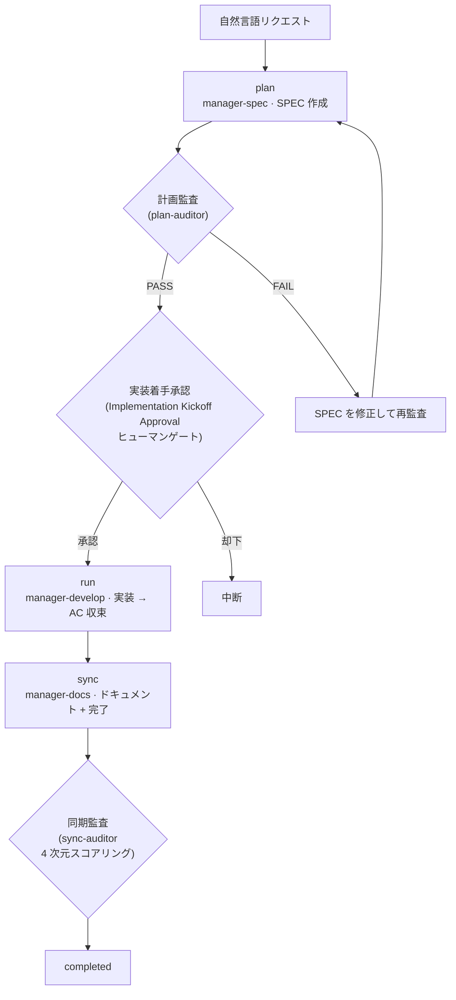



# SPEC ライフサイクル (SPEC Lifecycle)

すべての MoAI の作業は、**plan → run → sync** の 3 段階ライフサイクルに従います。このページは、そのライフサイクルが**どう流れるか** — 各段階に何が入り何が出るか、段階の間の 3 つのゲートが何を守るか、作業の規模がティアとルートをどう決めるか — を扱います。


 **分担**: [SPEC ベース開発](/ja/core-concepts/spec-based-dev)は、SPEC 文書が<strong>何であるか</strong>(GEARS 要件形式、3 ファイル構成、Era 分類とドリフト検査)を扱います。このページはライフサイクルが<strong>どう流れるか</strong>を扱います — 2 つのページは互いを繰り返さず、リンクし合います。


## 3つのフェーズ

| フェーズ | コマンド | 担当エージェント | トークン予算 | 何をするか |
|--------|--------|---------------|-----------|---------|
| **plan** | `/moai plan` | manager-spec | 30K | SPEC 文書の作成 (GEARS 要件 + 実装計画 + 受け入れ基準) |
| **run** | `/moai run` | manager-develop | 180K | DDD / TDD 方法論で実装 — AC 収束まで |
| **sync** | `/moai sync` | manager-docs | 40K | ドキュメント同期 + チェンジログ + 完了 (PR) |

各フェーズは、異なるエージェントが所有します。`manager-spec` が SPEC を作り、`manager-develop` がそれを実装し、`manager-docs` が結果をドキュメントに整理して完了させます — どのエージェントも自分の出力を自分で審査しないよう、段階ごとに持ち主が変わります。

### フェーズごとの成果物

| フェーズ | 入力 | 出力 |
|--------|------|------|
| **plan** | 自然言語リクエスト + コードベース調査 | `.moai/specs/SPEC-XXX/` の成果物セット (ティア別 — 下の表): spec.md, plan.md, acceptance.md (+ Tier L は design.md, research.md) |
| **run** | SPEC 成果物セット | 実装コミット + テスト。すべての受け入れ基準 (AC) が通ってはじめて次の段階へ |
| **sync** | run が残したツリー + 進行記録 | 更新されたドキュメント (README・CHANGELOG・API ドキュメント) + Pull Request。`completed` 状態への移行と `sync_commit_sha` の記録 |

SPEC 文書のファイル構成と形式が知りたければ [SPEC ベース開発](/ja/core-concepts/spec-based-dev)を、run の方法論サイクルが知りたければ [開発方法論 (DDD/TDD)](/ja/core-concepts/ddd) を見てください。

## 3つのゲート

段階の間には 3 つのゲートがあります。それぞれ、守るものが違います。

### 実装着手承認 (Implementation Kickoff Approval)

plan → run 境界の**ヒューマンゲート**です。未レビューの計画が実装へ流れるのを防ぐ、最後の人の確認であり、オーケストレーターが `AskUserQuestion` で承認を求めます。

- **必須であり、スコアと無関係です。** 計画監査が PASS でも、スコアが高くても、このゲートが自動的に飛ばされることはありません。
- ゲートを通ると、同じ場所で**自律・半自律の進行モード**を選べます — この選択は、承認の後に何が起こるかだけを定めるものであり、ゲートそのものを緩めたり代わりを務めたりはしません。

### 計画監査 (plan-audit)

すべての `/moai run` の開始時点 — 実装が始まる前 — に、**plan-auditor** 下位エージェントが SPEC 計画成果物全体を独立して審査します。どのハーネスレベル(`minimal` を含む)でも止められません。

| 判定 | 意味 |
|------|------|
| `PASS` | すべての必須基準を満たす — 次の段階へ |
| `FAIL` | 必須基準未達 — ブロックし、レポートを表示してユーザーに尋ねる |
| `BYPASSED` | `--skip-audit` または環境変数で迂回 — 迂回の事実を記録して続行 |
| `INCONCLUSIVE` | 監査者がタイムアウト・エラー・非定型出力に遭遇 — ブロックし、再試行/続行/中断を選ばせる |

PASS の基準は、ティア別の通過スコアです — **Tier S 0.75 · Tier M 0.80 · Tier L 0.85**(下のティア表)。直前の判定が PASS で、スコアがティア基準を超え、成果物ハッシュが変わっていなければ、監査の再実行は省略できます — しかし、この省略が扱うのは**監査の再実行だけ**です。実装着手承認のヒューマンゲートを、代わりに通すことは決してありません。

### 同期監査 (sync-auditor)

sync 品質の独立審査です。**sync-auditor** が、今書かれたばかりのコードへの愛着のない新しいコンテキストで、4 次元 — **Functionality / Security / Craft / Consistency** — に採点します。各次元は別々に付けられ、全体の判定は次元スコアの調和平均に従うため、ひとつの次元が崩れても、平均を取り戻して逃れることはできません。

## 複雑度ティア S/M/L

すべての SPEC は、plan フェーズで 3 つのティアのいずれかに分類されます。ティアは成果物セットと計画監査の通過スコアを定めます — 小さな作業に大きな儀式を強いる過剰フォーマル化が、この分類が存在する理由です。

| ティア | 規模ガイド | 影響ファイル | 成果物セット | 監査通過スコア |
|------|-------------|-----------|-------------|----------------|
| **S** (Simple) | 300 LOC 未満 | 5 未満 | **2 個**: spec.md + plan.md (AC は spec.md §3 にインライン) | 0.75 |
| **M** (Medium) | 300 – 1000 LOC | 5 – 15 | **3 個**: spec.md + plan.md + acceptance.md | 0.80 |
| **L** (Large) | 1000 LOC 超または constitution 関連 | 15 超 | **5 個**: spec.md + plan.md + acceptance.md + design.md + research.md | 0.85 |

ティアは、要件と受け入れ基準の予算も定めます — **S は 8 個、M は 16 個、L は 25 個**まで。2 つの上限は、要件数と受け入れ基準数に**それぞれ独立に**適用されます(合計ではありません)。どちらかでも上限を超えたら、予算を増やすのではなく、ティアを上げるか SPEC を割るべきだというシグナルです。

## ルート A とルート B

段階間の移行が何で引き起こされるかは、SPEC が掛かるルートが決めます。**ルート A — ハイブリッドトランク(`main` 直行)**は既定(Tier S/M)で、フェーズごとに `main` へ直接コミット・プッシュし、移行はコミット・プッシュイベントとグリーンの CI で引き起こされます。**ルート B — PR ルート**は Tier L または明示的な `--pr` で、`manager-git` がフェーズごとにブランチを作り PR を開き、移行は PR のマージで引き起こされます。どちらのルートも、段階の順序(plan → run → sync)も成果物セットも変えません — 変わるのは、移行を駆動する出来事の語彙だけです。

## /clear 戦略

フェーズが終わるたびに、セッションのコンテキストを空にするのが原則です:

- **`/moai plan` 完了の直後 — 必須。** 計画作成に使ったトークンを、実装に載せて行きません。この 1 回の `/clear` で、実装に 45–50K トークンをさらに使えます。
- コンテキストが 150K を超えたとき。
- 主要なフェーズ移行の直前。

セッションを切っても SPEC はファイルに残っています — これが SPEC ベース開発の出発点です — ので、次のセッションは 1 行(`/moai run SPEC-XXX`)で引き継ぎます。セッションを安全に切って引き継ぐ手順全体は、[トークン予算管理と安全な中止](/ja/advanced/token-budget)を参照してください。

## 関連ドキュメント

- [SPEC ベース開発](/ja/core-concepts/spec-based-dev) — SPEC 文書が何であるか: GEARS 形式、3 ファイル構成、Era 分類とドリフト検査
- [`/moai plan`](/ja/workflow-commands/moai-plan) · [`/moai run`](/ja/workflow-commands/moai-run) · [`/moai sync`](/ja/workflow-commands/moai-sync) — 各フェーズコマンドの実行詳細
- [開発方法論 (DDD/TDD)](/ja/core-concepts/ddd) — run フェーズが従う 2 つの方法論サイクル
- [TRUST 5 品質フレームワーク](/ja/core-concepts/trust-5) — run の成果物が通らなければならない品質フレーム
- [カンバンモード](/ja/advanced/kanban-mode) — このライフサイクルをマルチセッションボードの上で回す形
