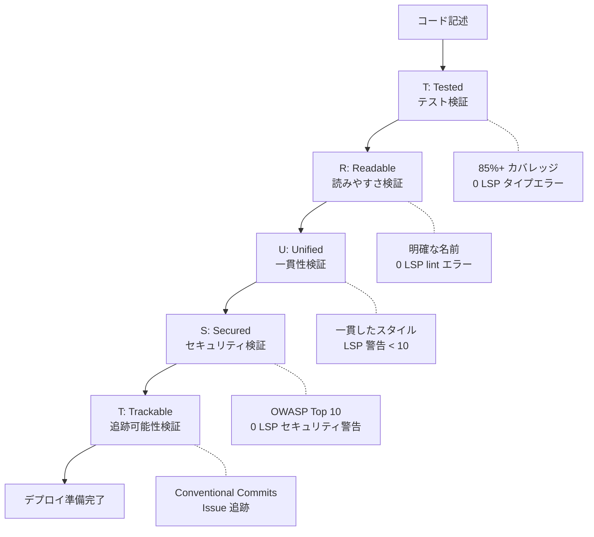
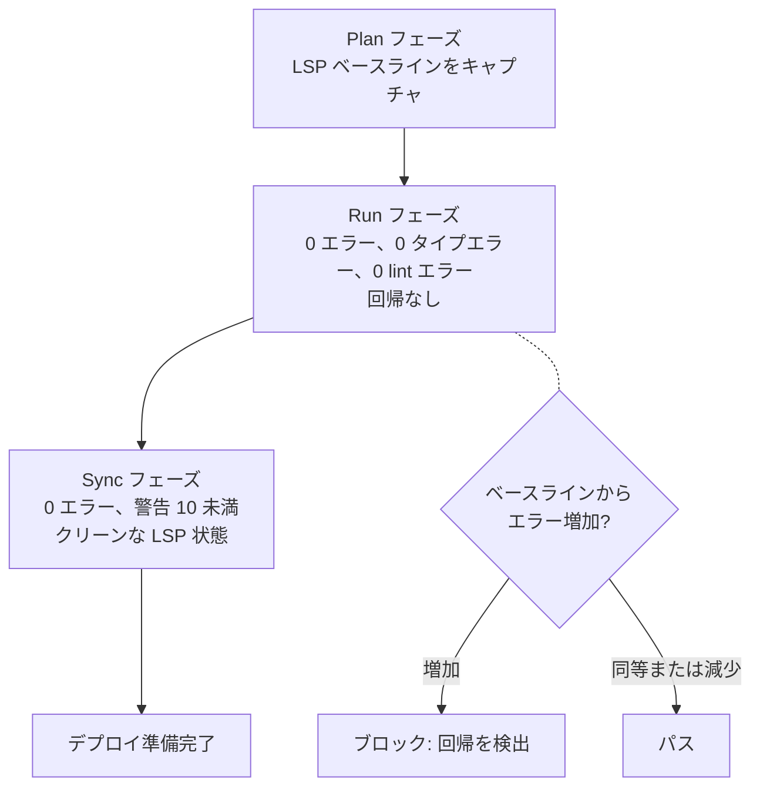
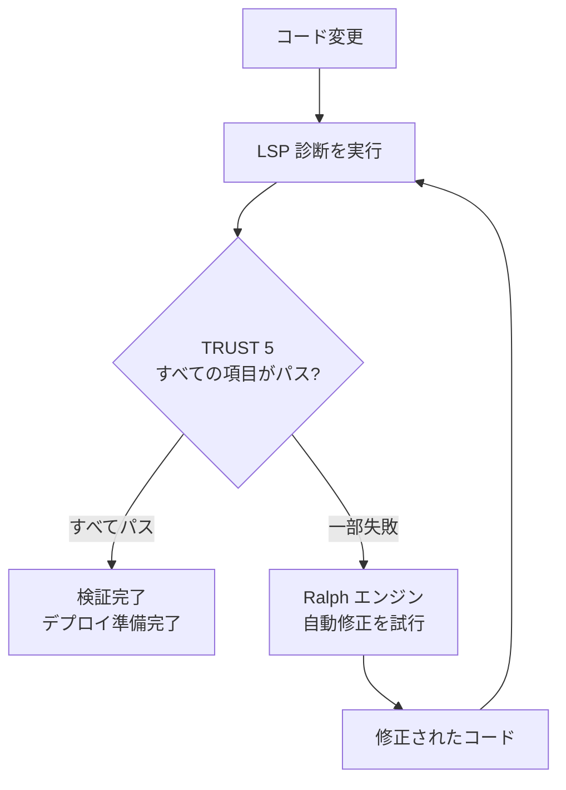

すべての MoAI-ADK コードが通過しなければならない 5 つの品質原則の詳細ガイドです。


  **要約:** TRUST 5 は「コードがテストされ、読みやすく、統一され、安全で、追跡可能か?」を検証する自動品質ゲートです。


## TRUST 5 とは?

TRUST 5 は MoAI-ADK がすべてのコードに適用する **5 つの品質原則** です。AI 生成コードと人間が書いたコードの両方がこれらの標準を満たす必要があります。

日常生活の例えで言えば、建物の検査のようなものです。入居前に構造安全性、電気配線、配管、火災安全、建築許可書を確認する必要があります。コードも同じです。

| 建物検査 | TRUST 5 | 確認内容 |
|---------------------|---------|----------------|
| 構造安全性 | **T** (Tested) | テストでコードが正しく動作することを確認 |
| 電気/配管設計図 | **R** (Readable) | 他の開発者がコードを理解できるか |
| 建築基準準準拠 | **U** (Unified) | プロジェクトのコーディング標準に一致 |
| 火災/セキュリティシステム | **S** (Secured) | セキュリティ脆弱性なし |
| 許可書類 | **T** (Trackable) | 変更履歴が明確に記録されている |



## T - Tested (テスト済み)

**核心:** すべてのコードはテストで検証されなければなりません。

### 確認項目

| 確認項目 | 基準 | 説明 |
|------------|----------|-------------|
| テストカバレッジ | 85% 以上 | すべてのコードの 85% 以上がテストで検証される |
| キャラクタリゼーションテスト | 既存コードを保護 | リファクタリング中の既存動作を保持するテスト |
| LSP タイプエラー | 0 | タイプチェックエラーなし |
| LSP 診断エラー | 0 | 言語サーバー診断エラーなし |

### なぜ 85% なのか?

100% を要求しない理由があります。

| カバレッジ | 現实的な意味 |
|----------|-------------------|
| 60% 未満 | 主要な機能がテストされていない可能性 |
| 60-84% | 基本的な機能はテストされているが、エッジケースが不足している可能性 |
| **85-95%** | **コアロジックとほとんどのエッジケースが検証済み (推奨)** |
| 95-100% | テスト保守コストが利益を上回り始める |

### ベストプラクティス

```python
def calculate_discount(price: float, discount_rate: float) -> float:
    """割引価格を計算します。

    Args:
        price: 元価格 (0 以上)
        discount_rate: 割引率 (0.0 ~ 1.0)

    Returns:
        割引後の価格

    Raises:
        ValueError: 無効な入力値の場合
    """
    if price < 0:
        raise ValueError("価格は 0 以上である必要があります")
    if not 0 <= discount_rate <= 1:
        raise ValueError("割引率は 0.0 から 1.0 の間である必要があります")
    return price * (1 - discount_rate)

# テストは正常時と例外時の両方を検証
def test_calculate_discount_normal():
    assert calculate_discount(10000, 0.1) == 9000
    assert calculate_discount(5000, 0.5) == 2500
    assert calculate_discount(0, 0.5) == 0

def test_calculate_discount_invalid_price():
    with pytest.raises(ValueError, match="Price cannot"):
        calculate_discount(-1000, 0.1)

def test_calculate_discount_invalid_rate():
    with pytest.raises(ValueError, match="Discount rate"):
        calculate_discount(10000, 1.5)
```

---

## R - Readable (読みやすい)

**核心:** コードは明確で理解しやすくなければなりません。

### 確認項目

| 確認項目 | 基準 | 説明 |
|------------|----------|-------------|
| 命名規則 | 意図を明示 | 変数、関数、クラス名は明確でなければならない |
| コードコメント | 複雑なロジックを説明 | 「なぜ」を説明する (「何」ではない) |
| LSP Lint エラー | 0 | すべての linter ルールをパス |
| 関数の長さ | 適切なサイズ | 関数は長すぎてはいけない |

### ベストプラクティス

```python
# 悪い: 名前から何をするかわからない
def calc(d, r):
    return d * (1 - r)

# 良い: 名前を読むだけで役割がわかる
def calculate_discounted_price(original_price: float, discount_rate: float) -> float:
    """original_price から discount_rate 分割引した価格を計算。"""
    return original_price * (1 - discount_rate)
```


  **読みやすさのヒント:** 「6 个月后にも理解できるか?」と自問してください。できない場合は、名前を変更するかコメントを追加してください。


---

## U - Unified (統一された)

**核心:** プロジェクト全体で一貫したコードスタイルを維持します。

### 確認項目

| 確認項目 | 基準 | 説明 |
|------------|----------|-------------|
| コードフォーマット | 自動フォーマッタ適用 | Python: ruff/black, JS: prettier |
| 命名規則 | プロジェクト標準に準拠 | snake_case、camelCase などを混在させない |
| エラーハンドリング | 一貫したパターン | すべての場所で同じエラーハンドリングを使用 |
| LSP 警告 | 10 未満 | 言語サーバー警告がしきい値以下 |

### ベストプラクティス

```python
# 統一されたエラーハンドリングパターン
class AppError(Exception):
    """アプリケーション基底エラー"""
    def __init__(self, message: str, code: int = 500):
        self.message = message
        self.code = code

class NotFoundError(AppError):
    """リソースが見つからない"""
    def __init__(self, resource: str, id: str):
        super().__init__(f"{resource} '{id}' not found", code=404)

class ValidationError(AppError):
    """入力検証失敗"""
    def __init__(self, field: str, reason: str):
        super().__init__(f"'{field}' validation failed: {reason}", code=400)

# すべてのサービスで同じパターンを使用
def get_user(user_id: str) -> User:
    user = user_repository.find_by_id(user_id)
    if not user:
        raise NotFoundError("User", user_id)
    return user
```

---

## S - Secured (安全な)

**核心:** すべてのコードはセキュリティ検証をパスしなければなりません。

### 確認項目

| 確認項目 | 基準 | 説明 |
|------------|----------|-------------|
| OWASP Top 10 | 完全準拠 | 最も一般的な Web セキュリティ脆弱性を防止 |
| 依存関係スキャン | 脆弱性のあるパッケージなし | 既知の脆弱性を持つライブラリを使用しない |
| 暗号化ポリシー | 機密データを保護 | パスワード、トークンは暗号化必須 |
| LSP セキュリティ警告 | 0 | セキュリティ関連の警告なし |

### 主要なセキュリティチェック

| 脆弱性 | 防止方法 | 例 |
|---------------|-------------------|---------|
| **SQL Injection** | パラメータ化クエリ | `db.execute("SELECT * FROM users WHERE id = %s", (id,))` |
| **XSS** | 出力エスケープ | HTML 出力を自動エスケープ |
| **パスワード露出** | bcrypt ハッシュ化 | `bcrypt.hashpw(password, salt)` |
| **ハードコードされた秘密鍵** | 環境変数 | `os.environ["SECRET_KEY"]` |
| **CSRF** | トークン検証 | 状態変更リクエストに CSRF トークンを含める |

### ベストプラクティス

```python
# 悪い: SQL Injection 脆弱性
def get_user(username: str) -> dict:
    query = f"SELECT * FROM users WHERE username = '{username}'"
    return db.execute(query)

# 良い: パラメータ化クエリで安全
def get_user(username: str) -> dict:
    query = "SELECT * FROM users WHERE username = %s"
    return db.execute(query, (username,))
```

---

## T - Trackable (追跡可能な)

**核心:** すべての変更は明確に追跡可能でなければなりません。

### 確認項目

| 確認項目 | 基準 | 説明 |
|------------|----------|-------------|
| コミットメッセージ | Conventional Commits | `feat:`、`fix:`、`refactor:` などの標準形式 |
| Issue リンク | GitHub Issues 参照 | コミットに関連 issue 番号を含める |
| CHANGELOG | 変更ログを維持 | ユーザーに表示される変更を記録 |
| LSP 状態追跡 | 診断履歴を記録 | 回帰検出のために LSP 状態変化を追跡 |

### Conventional Commits 形式

```bash
# 構造: <type>(<scope>): <description>
# 例:

# 新機能を追加
$ git commit -m "feat(auth): JWT ログイン API を追加"

# バグ修正
$ git commit -m "fix(auth): トークン有効期限計算エラーを修正"

# リファクタリング
$ git commit -m "refactor(auth): 認証ロジックを AuthService に分離"

# セキュリティ改善
$ git commit -m "security(db): パラメータ化クエリで SQL Injection を防止"
```

**コミットタイプ:**

| タイプ | 説明 | 例 |
|------|-------------|---------|
| `feat` | 新機能 | `feat(api): ユーザーリスト API を追加` |
| `fix` | バグ修正 | `fix(auth): ログインエラーメッセージを修正` |
| `refactor` | コード改善 (動作変更なし) | `refactor(db): クエリを最適化` |
| `security` | セキュリティ改善 | `security(auth): 秘密鍵を環境変数に` |
| `docs` | ドキュメント変更 | `docs(readme): インストールガイドを更新` |
| `test` | テスト追加/変更 | `test(auth): ログインテストケースを追加` |

---

## LSP 品質ゲート

MoAI-ADK は **LSP** (Language Server Protocol) を使用してコード品質をリアルタイムで検証します。LSP は IDE で赤い下線でエラーを表示するシステムです。

### フェーズ別 LSP しきい値

Plan、Run、Sync フェーズで異なる LSP 標準が適用されます。

| フェーズ | エラー許容量 | タイプエラー許容量 | Lint エラー許容量 | 警告許容量 | 回帰許容量 |
|-------|-----------------|---------------------|---------------------|------------------|---------------------|
| **Plan** | ベースラインをキャプチャ | ベースラインをキャプチャ | ベースラインをキャプチャ | - | - |
| **Run** | 0 | 0 | 0 | - | 許可されない |
| **Sync** | 0 | - | - | 最大 10 | 許可されない |

**各フェーズの意味:**

- **Plan フェーズ**: 現在のコードの LSP 状態を「ベースライン」としてキャプチャ。これが参照値になります。
- **Run フェーズ**: 実装完了時に LSP エラーは 0 必須。ベースラインからエラーが増加しない (回帰なし)。
- **Sync フェーズ**: ドキュメントと PR 作成前に LSP はクリーンである必要。警告は 10 まで許可。



## Ralph エンジン統合

**Ralph エンジン** は MoAI-ADK の自律品質検証ループです。LSP 診断結果に基づいてコードの問題を自動検出して修正します。



**動作方法:**

1. コード変更時に LSP が診断を実行
2. TRUST 5 基準を満たさない項目がある場合、Ralph エンジンが自動修正を試みる
3. 修正後に LSP 診断を再実行してパスを確認
4. パスするまで繰り返し (最大 3 回のリトライ)

**関連コマンド:**

```bash
# 自動修正を実行
> /moai fix

# 完了まで自動修正を繰り返す
> /moai loop
```

## quality.yaml 設定

`.moai/config/sections/quality.yaml` ファイルで TRUST 5 関連の設定を管理します。

### 主要設定

```yaml
constitution:
  # TRUST 5 品質検証を有効化
  enforce_quality: true

  # 目標テストカバレッジ
  test_coverage_target: 85

  # LSP 品質ゲート設定
  lsp_quality_gates:
    enabled: true

    plan:
      require_baseline: true # Plan 開始時にベースラインをキャプチャ

    run:
      max_errors: 0 # Run フェーズのエラー許容量: 0
      max_type_errors: 0 # タイプエラー許容量: 0
      max_lint_errors: 0 # Lint エラー許容量: 0
      allow_regression: false # ベースラインからの回帰を禁止

    sync:
      max_errors: 0 # Sync フェーズのエラー許容量: 0
      max_warnings: 10 # 警告許容量: 最大 10
      require_clean_lsp: true # クリーンな LSP 状態を要求

    cache_ttl_seconds: 5 # LSP 診断キャッシュ有効期間 (秒)
    timeout_seconds: 3 # LSP 診断タイムアウト (秒)
```

## 関連ドキュメント

- [MoAI-ADK とは?](/core-concepts/what-is-moai-adk) -- MoAI-ADK の全体構造を理解
- [SPEC ベース開発](/core-concepts/spec-based-dev) -- TRUST 5 が適用される Plan フェーズを学ぶ
- [ドメイン駆動開発](/core-concepts/ddd) -- TRUST 5 が適用される Run フェーズを学ぶ
