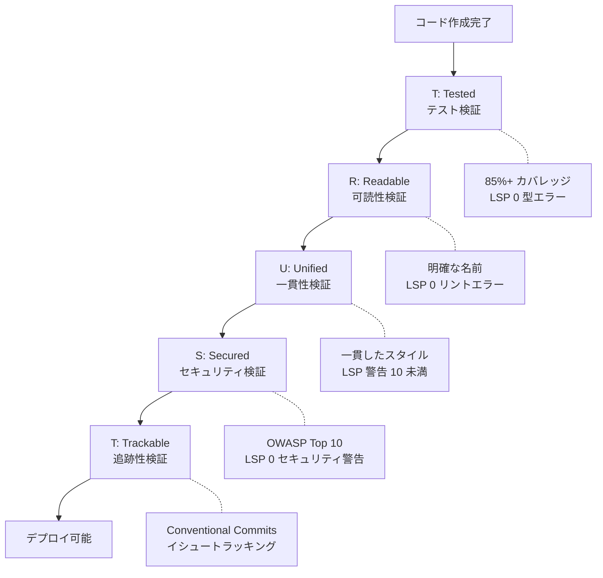
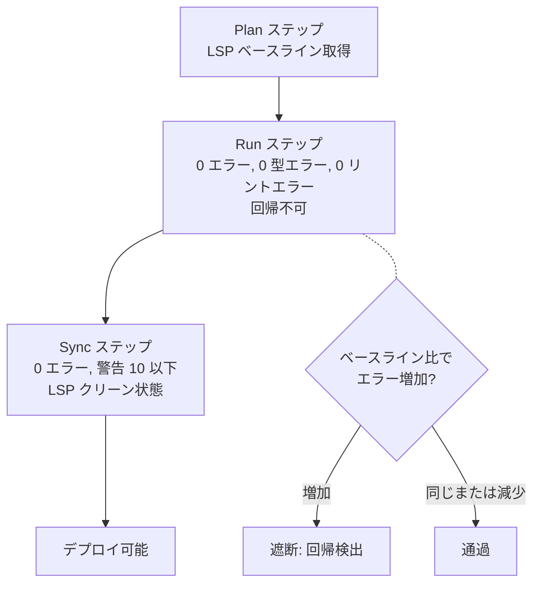
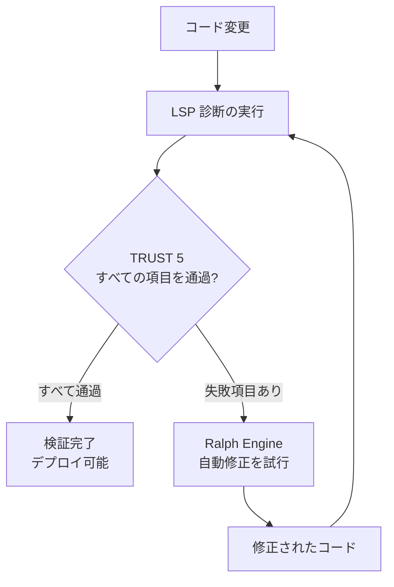

MoAI-ADK のすべてのコードが通過しなければならない 5 つの品質原則を詳しく案内します。TRUST 5 は
エージェンティックハーネスの品質ゲートです — エージェントがどれだけ速くコードを生産しても、この
ゲートを通過できなければ完了と認められません。


  **一行要約:** TRUST 5 は「コードがテストされているか、読みやすいか、一貫性があるか、
  安全か、追跡可能か」を検証する自動化された品質ゲートです。


### ハーネスレベル (3 段階)

TRUST 5 品質ゲートは SPEC の範囲に応じて 3 段階の深さで適用されます。複雑度推定器
(Complexity Estimator) が SPEC のスコープを基にハーネスレベルを自動決定します。

| レベル        | 名前 | 検証範囲                                              |
| ----------- | ---- | ----------------------------------------------------- |
| `minimal`   | 最小 | 高速検証 — 核心ゲートのみ通過                         |
| `standard`  | 標準 | 基本検証 — 基本品質ゲートの実行 (デフォルト値)            |
| `thorough`  | 深層 | 全体検証 — sync-auditor の独立評価 + TRUST 5 全体適用 |

## TRUST 5 とは?

TRUST 5 は MoAI-ADK がすべてのコードに適用する **5 つの品質原則** です。AI が生成した
コードも、人が書いたコードもこの基準を通過する必要があります。

日常的なたとえで説明すると、建物を建てるときに竣工検査をするのと同じです。構造
安全性、電気配線、水道配管、消防設備、建築許可書類をすべて確認しないと入居
できません。コードも同じです。

| 建物検査        | TRUST 5           | 確認内容                              |
| ---------------- | ----------------- | -------------------------------------- |
| 構造安全性      | **T** (Tested)    | コードが正しく動作するかをテストで検証 |
| 電気/水道の設計図 | **R** (Readable)  | 他の開発者がコードを理解できるか  |
| 建築規定の遵守   | **U** (Unified)   | プロジェクトのコーディングルールに合うか          |
| 消防/セキュリティ設備   | **S** (Secured)   | セキュリティ脆弱性がないか                   |
| 認可書類      | **T** (Trackable) | 変更履歴が明確に記録されるか        |


```mermaid
flowchart TD
    Code["コード作成完了"] --> T1["T: Tested\nテスト検証"]
    T1 --> R["R: Readable\n可読性検証"]
    R --> U["U: Unified\n一貫性検証"]
    U --> S["S: Secured\nセキュリティ検証"]
    S --> T2["T: Trackable\n追跡性検証"]
    T2 --> Deploy["デプロイ可能"]

    T1 -.- T1D["85%+ カバレッジ\nLSP 0 型エラー"]
    R -.- RD["明確な名前\nLSP 0 リントエラー"]
    U -.- UD["一貫したスタイル\nLSP 警告 10 未満"]
    S -.- SD["OWASP Top 10\nLSP 0 セキュリティ警告"]
    T2 -.- T2D["Conventional Commits\nイシュートラッキング"]
```

## T - Tested (テスト済み)

**核心:** すべてのコードはテストで検証される必要があります。

### 何を確認するか

| 検証項目       | 基準           | 説明                                                    |
| --------------- | -------------- | ------------------------------------------------------- |
| テストカバレッジ | 85% 以上       | コード全体の 85% 以上がテストで検証される必要があります       |
| 特性化テスト   | 既存コードの保護 | リファクタリング時に既存の動作を保存するテストがある必要があります |
| LSP 型エラー   | 0 個            | 型検査でエラーがない必要があります                      |
| LSP 診断エラー   | 0 個            | 言語サーバーの診断エラーがない必要があります                   |

### なぜ 85% か?

100% を要求しない理由があります。

| カバレッジ   | 現実的な意味                                               |
| ---------- | ----------------------------------------------------------- |
| 60% 未満   | 主要機能もテストされないことがあります                     |
| 60-84%     | 基本的な機能はテストされますがエッジケースが抜けることがあります |
| **85-95%** | **核心ロジックと大部分のエッジケースが検証されます (推奨)**    |
| 95-100%    | テストの保守コストに対する効果が落ち始めます        |

### ベストプラクティス

```python
def calculate_discount(price: float, discount_rate: float) -> float:
    """割引価格を計算します。

    Args:
        price: 元の価格 (0 以上)
        discount_rate: 割引率 (0.0 ~ 1.0)

    Returns:
        割引された価格

    Raises:
        ValueError: 有効でない入力値
    """
    if price < 0:
        raise ValueError("価格は 0 より小さくできません")
    if not 0 <= discount_rate <= 1:
        raise ValueError("割引率は 0.0 から 1.0 の間である必要があります")
    return price * (1 - discount_rate)

# テスト: 正常ケースと例外ケースの両方を検証
def test_calculate_discount_normal():
    assert calculate_discount(10000, 0.1) == 9000
    assert calculate_discount(5000, 0.5) == 2500
    assert calculate_discount(0, 0.5) == 0

def test_calculate_discount_invalid_price():
    with pytest.raises(ValueError, match="価格は 0 より"):
        calculate_discount(-1000, 0.1)

def test_calculate_discount_invalid_rate():
    with pytest.raises(ValueError, match="割引率は"):
        calculate_discount(10000, 1.5)
```

---

## R - Readable (読みやすい)

**核心:** コードは明確で理解しやすい必要があります。

### 何を確認するか

| 検証項目     | 基準                 | 説明                                               |
| ------------- | -------------------- | -------------------------------------------------- |
| 命名規則     | 意図を表す名前 | 変数、関数、クラスの名前が明確である必要があります          |
| コードコメント     | 複雑なロジックへの説明   | 「なぜ」こうしたかを説明するコメントがある必要があります |
| LSP リントエラー | 0 個                  | リンタールールをすべて通過する必要があります                   |
| 関数の長さ     | 適切なサイズ          | 1 つの関数が長すぎない必要があります                  |

### ベストプラクティス

```python
# 悪い例: 名前だけでは何をするか分かりません
def calc(d, r):
    return d * (1 - r)

# 良い例: 名前を読むだけで役割が分かります
def calculate_discounted_price(original_price: float, discount_rate: float) -> float:
    """元の価格から割引率の分だけ割引された価格を計算します。"""
    return original_price * (1 - discount_rate)
```


  **可読性のヒント:** 「6 か月後の自分自身」がこのコードを読んだときすぐに理解できる
  か自問してみてください。理解できないなら名前を変えるかコメントを追加してください。


---

## U - Unified (統一)

**核心:** プロジェクト全体で一貫したコードスタイルを維持します。

### 何を確認するか

| 検証項目 | 基準               | 説明                                      |
| --------- | ------------------ | ----------------------------------------- |
| コードフォーマット | 自動フォーマッターの適用   | Python は ruff/black、JS は prettier で統一 |
| 命名規則 | プロジェクト標準の遵守 | snake_case、camelCase などの混用禁止        |
| エラー処理 | 統一されたパターン        | すべての場所で同じエラー処理方式を使用    |
| LSP 警告  | 10 個未満          | 言語サーバーの警告が閾値以下              |

### ベストプラクティス

```python
# 統一されたエラー処理パターン
class AppError(Exception):
    """アプリケーションの基本エラー"""
    def __init__(self, message: str, code: int = 500):
        self.message = message
        self.code = code

class NotFoundError(AppError):
    """リソースが見つからない"""
    def __init__(self, resource: str, id: str):
        super().__init__(f"{resource} '{id}' が見つかりません", code=404)

class ValidationError(AppError):
    """入力値の検証失敗"""
    def __init__(self, field: str, reason: str):
        super().__init__(f"'{field}' の検証失敗: {reason}", code=400)

# すべてのサービスで同じパターンを使用
def get_user(user_id: str) -> User:
    user = user_repository.find_by_id(user_id)
    if not user:
        raise NotFoundError("ユーザー", user_id)
    return user
```

---

## S - Secured (セキュア)

**核心:** すべてのコードはセキュリティ検証を通過する必要があります。

### 何を確認するか

| 検証項目     | 基準               | 説明                                      |
| ------------- | ------------------ | ----------------------------------------- |
| OWASP Top 10  | 全体遵守          | 最もよくある 10 種の Web セキュリティ脆弱性を防止      |
| 依存性スキャン   | 脆弱なパッケージなし | 既知の脆弱性があるライブラリの使用禁止 |
| 暗号化ポリシー   | 機密データの保護   | パスワード、トークンなどは必ず暗号化         |
| LSP セキュリティ警告 | 0 個                | セキュリティ関連の警告がない必要があります            |

### 主要なセキュリティ検証項目

| 脆弱性                | 防止方法         | 例                                                     |
| --------------------- | ----------------- | -------------------------------------------------------- |
| **SQL Injection**     | パラメータ化されたクエリ | `db.execute("SELECT * FROM users WHERE id = %s", (id,))` |
| **XSS**               | 出力エスケープ   | HTML 出力時に自動エスケープ                             |
| **パスワードの露出**     | bcrypt ハッシュ       | `bcrypt.hashpw(password, salt)`                          |
| **ハードコードされた秘密鍵** | 環境変数の使用    | `os.environ["SECRET_KEY"]`                               |
| **CSRF**              | トークン検証         | すべての状態変更リクエストに CSRF トークンを含む                     |

### ベストプラクティス

```python
# 悪い例: SQL Injection の脆弱性
def get_user(username: str) -> dict:
    query = f"SELECT * FROM users WHERE username = '{username}'"
    return db.execute(query)

# 良い例: パラメータ化されたクエリで安全に
def get_user(username: str) -> dict:
    query = "SELECT * FROM users WHERE username = %s"
    return db.execute(query, (username,))
```

---

## T - Trackable (追跡可能)

**核心:** すべての変更は明確に追跡可能である必要があります。

### 何を確認するか

| 検証項目     | 基準                 | 説明                                      |
| ------------- | -------------------- | ----------------------------------------- |
| コミットメッセージ   | Conventional Commits | `feat:`、`fix:`、`refactor:` などの標準形式 |
| イシュー連携     | GitHub Issues 参照   | コミットに関連するイシュー番号を含む                |
| CHANGELOG     | 変更ログの維持       | ユーザーに見せる変更内容の記録          |
| LSP 状態追跡 | 診断履歴の記録       | LSP 状態の変更を追跡して回帰を検出        |

### Conventional Commits 形式

```bash
# 構造: <タイプ>(<範囲>): <説明>
# 例:

# 新機能の追加
$ git commit -m "feat(auth): JWT ベースのログイン API を追加"

# バグ修正
$ git commit -m "fix(auth): トークン有効期限の計算エラーを修正"

# リファクタリング
$ git commit -m "refactor(auth): 認証ロジックを AuthService に分離"

# セキュリティ改善
$ git commit -m "security(db): パラメータ化されたクエリで SQL Injection を防止"
```

**コミットタイプ:**

| タイプ       | 説明                       | 例                                         |
| ---------- | -------------------------- | -------------------------------------------- |
| `feat`     | 新しい機能                | `feat(api): ユーザー一覧 API を追加`            |
| `fix`      | バグ修正                  | `fix(auth): ログイン失敗時のエラーメッセージを修正` |
| `refactor` | コード改善 (動作の変更なし) | `refactor(db): クエリ最適化`                  |
| `security` | セキュリティ改善                  | `security(auth): 秘密鍵を環境変数化`         |
| `docs`     | ドキュメント変更                | `docs(readme): インストールガイドを更新`         |
| `test`     | テストの追加/修正           | `test(auth): ログインテストケースを追加`      |

---

## LSP 品質ゲート

MoAI-ADK は **LSP** (Language Server Protocol) を活用してコード品質をリアルタイムで
検証します。LSP は IDE で赤い下線でエラーを表示してくれるまさにそのシステムです。

### ステップ別 LSP 閾値

Plan、Run、Sync の各ステップごとに異なる LSP 基準が適用されます。

| ステップ     | エラー許容       | 型エラー許容  | リントエラー許容  | 警告許容 | 回帰許容 |
| -------- | --------------- | --------------- | --------------- | --------- | --------- |
| **Plan** | ベースライン取得 | ベースライン取得 | ベースライン取得 | -         | -         |
| **Run**  | 0 個             | 0 個             | 0 個             | -         | 不可      |
| **Sync** | 0 個             | -               | -               | 最大 10 個 | 不可      |

**各ステップの意味:**

- **Plan ステップ:** 現在のコードの LSP 状態を「ベースライン」として取得します。これが
  基準線になります。
- **Run ステップ:** 実装完了時に LSP エラーが 0 である必要があります。ベースライン比でエラーが
  増加してはいけません (回帰不可)。
- **Sync ステップ:** ドキュメント化および PR 生成前に LSP がクリーンである必要があります。警告は最大
  10 個まで許容されます。


```mermaid
flowchart TD
    P["Plan ステップ\nLSP ベースライン取得"] --> R["Run ステップ\n0 エラー, 0 型エラー, 0 リントエラー\n回帰不可"]
    R --> S["Sync ステップ\n0 エラー, 警告 10 以下\nLSP クリーン状態"]
    S --> Deploy["デプロイ可能"]

    R -.- RCheck{"ベースライン比で\nエラー増加?"}
    RCheck -->|"増加"| Block["遮断: 回帰検出"]
    RCheck -->|"同じまたは減少"| Pass["通過"]
```

## Ralph Engine との統合

**Ralph Engine** は MoAI-ADK の自律品質検証ループです。LSP 診断結果を
基にコードの問題を自動的に検出して修正を反復します。


```mermaid
flowchart TD
    A["コード変更"] --> B["LSP 診断の実行"]
    B --> C{"TRUST 5\nすべての項目を通過?"}
    C -->|"すべて通過"| D["検証完了\nデプロイ可能"]
    C -->|"失敗項目あり"| E["Ralph Engine\n自動修正を試行"]
    E --> F["修正されたコード"]
    F --> B
```

**動作方式:**

1. コードが変更されると LSP が診断を実行します
2. TRUST 5 基準に満たない項目があると Ralph Engine が自動修正を試みます
3. 修正後に再び LSP 診断を実行して通過の可否を確認します
4. 通過するまで反復します (最大 3 回リトライ)

**関連コマンド:**

```bash
# 自動修正の実行
> /moai fix

# 完了するまで自動反復修正
> /moai loop
```

## quality.yaml 設定

`.moai/config/sections/quality.yaml` ファイルで TRUST 5 関連の設定を管理します。

### 主要な設定項目

```yaml
constitution:
  # TRUST 5 品質検証の有効化
  enforce_quality: true

  # 目標テストカバレッジ
  test_coverage_target: 85

  # LSP 品質ゲート設定
  lsp_quality_gates:
    enabled: true

    plan:
      require_baseline: true # Plan 開始時にベースライン取得

    run:
      max_errors: 0 # Run ステップのエラー許容: 0 個
      max_type_errors: 0 # 型エラー許容: 0 個
      max_lint_errors: 0 # リントエラー許容: 0 個
      allow_regression: false # ベースライン比の回帰不可

    sync:
      max_errors: 0 # Sync ステップのエラー許容: 0 個
      max_warnings: 10 # 警告許容: 最大 10 個
      require_clean_lsp: true # LSP クリーン状態が必要

    cache_ttl_seconds: 5 # LSP 診断キャッシュ時間
    timeout_seconds: 3 # LSP 診断タイムアウト
```

### 設定カスタマイズのヒント

| 状況                                   | 調整方法                                                  |
| -------------------------------------- | ---------------------------------------------------------- |
| プロジェクト初期、テストがほとんどない場合 | `test_coverage_target` を 70 に下げて段階的に上げます |
| レガシーコードが多い場合                | `allow_regression` を一時的に true に設定します          |
| 厳格なセキュリティが必要な場合              | `max_warnings` を 0 に設定します                          |

## 実践適用: 品質ゲート通過シナリオ

実際の開発で TRUST 5 がどう適用されるかを見てみましょう。

### シナリオ: ユーザー検索 API の実装

```bash
# 1. Plan: SPEC 生成 (LSP ベースライン取得)
> /moai plan "ユーザー検索 API の実装"
```

```bash
# 2. Run: DDD で実装 (TRUST 5 検証)
> /moai run SPEC-SEARCH-001
```

**Run ステップでの TRUST 5 検証:**

| 項目              | 検証内容                            | 結果 |
| ----------------- | ------------------------------------ | ---- |
| **T** (Tested)    | テストカバレッジ 85%、型エラー 0 個   | 通過 |
| **R** (Readable)  | リントエラー 0 個、明確な関数名を使用    | 通過 |
| **U** (Unified)   | ruff/black フォーマットの適用、LSP 警告 3 個 | 通過 |
| **S** (Secured)   | SQL Injection 防止、入力値の検証      | 通過 |
| **T** (Trackable) | Conventional Commit 形式、SPEC 参照  | 通過 |

```bash
# 3. Sync: ドキュメント生成および PR (最終 LSP クリーン確認)
> /moai sync SPEC-SEARCH-001
```

**Sync ステップの最終確認:**

```
LSP 診断結果:
- エラー: 0 個
- 型エラー: 0 個
- リントエラー: 0 個
- 警告: 3 個 (閾値 10 以下)
- セキュリティ警告: 0 個

TRUST 5 全体通過: デプロイ可能
```

## TRUST 5 一目で見る

| 原則              | 核心の問い                   | 自動検証ツール         | 基準                       |
| ----------------- | --------------------------- | ---------------------- | -------------------------- |
| **T** (Tested)    | テストで検証されているか?      | pytest, LSP 型検査  | 85%+ カバレッジ、0 型エラー |
| **R** (Readable)  | 他の人が読めるか? | ruff, eslint, LSP リント | 0 リントエラー、明確な名前   |
| **U** (Unified)   | プロジェクトルールに合うか?     | black, prettier, LSP   | 一貫したフォーマット、警告 10 未満  |
| **S** (Secured)   | セキュリティ脆弱性がないか?       | bandit, semgrep, LSP   | OWASP 準拠、0 セキュリティ警告    |
| **T** (Trackable) | 変更履歴が追跡可能か?  | commitlint, git        | Conventional Commits       |

## 関連ドキュメント

- [MoAI-ADK とは?](/core-concepts/what-is-moai-adk) -- MoAI-ADK の全体構造を
  理解します
- [SPEC ベース開発](/core-concepts/spec-based-dev) -- TRUST 5 が適用される Plan
  ステップを学びます
- [ドメイン駆動開発](/core-concepts/ddd) -- TRUST 5 が適用される Run ステップを
  学びます
