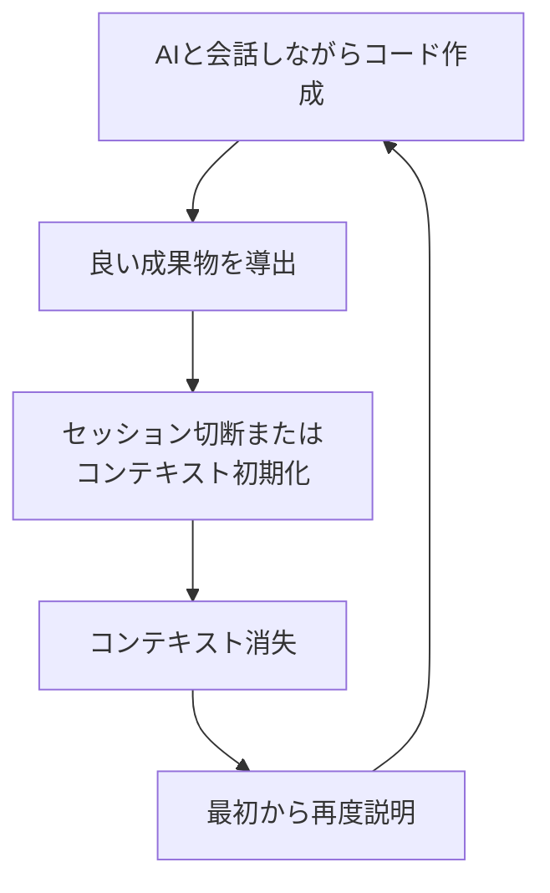
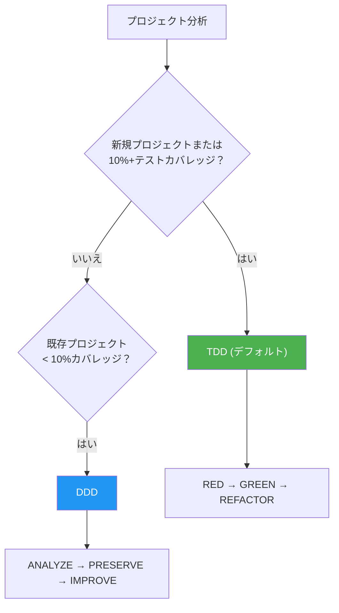
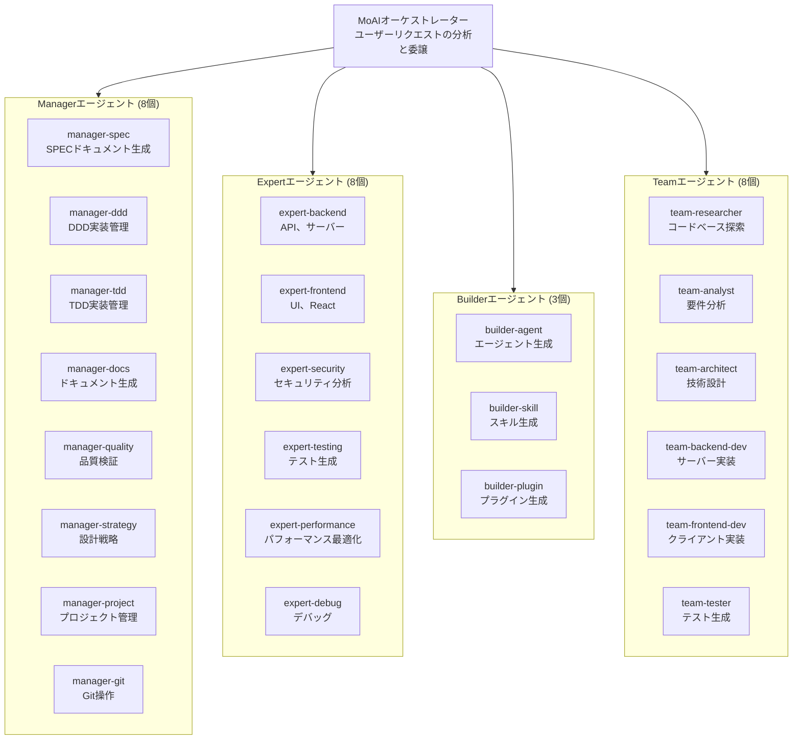
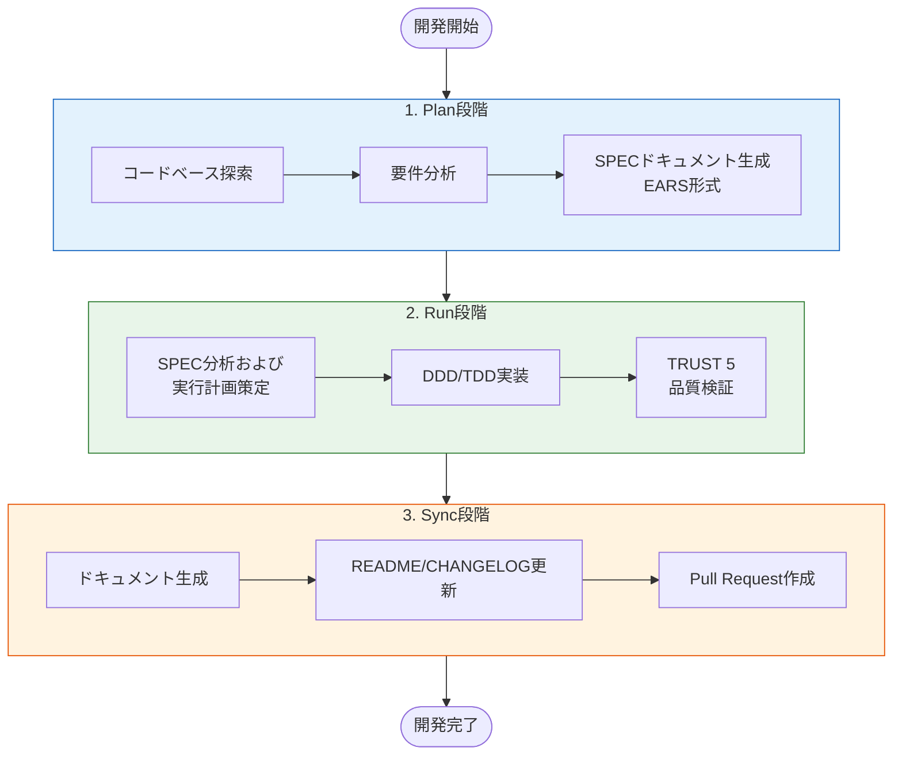
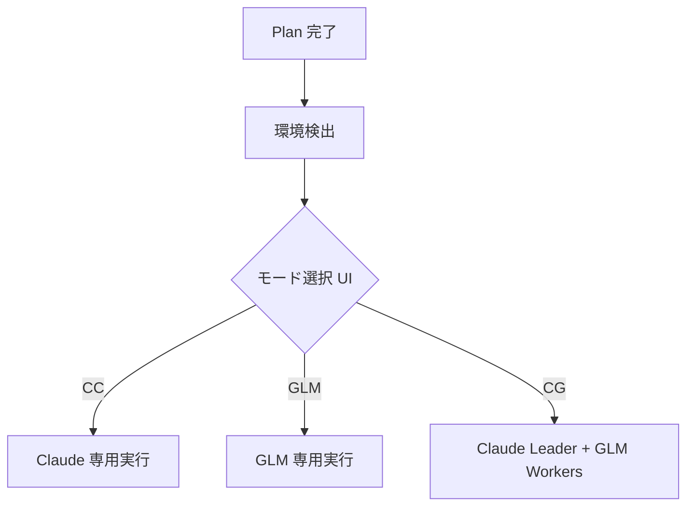
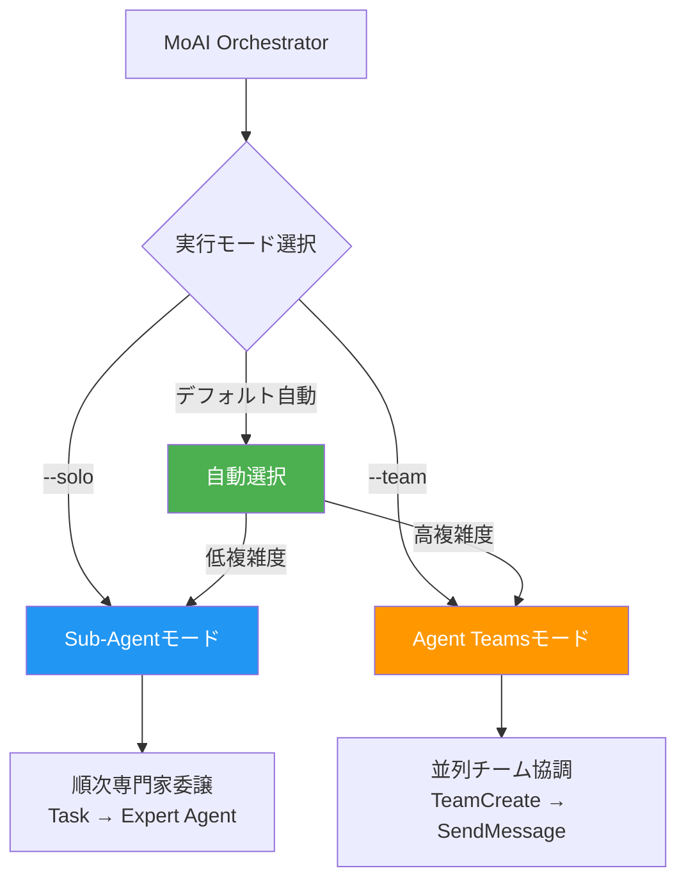

MoAI-ADKはClaude Codeのための **高性能AI開発環境** です。28の専門AIエージェントと52のスキルが協力して高品質なコードを生産します。新規プロジェクトと機能開発にはTDD (デフォルト) 、テストカバレッジが低い既存プロジェクトにはDDDを自動的に適用し、Sub-AgentとAgent Teamsの二重実行モードをサポートします。

Goで記述されたシングルバイナリ -- 依存関係なしですべてのプラットフォームで即座に実行できます。


**一行まとめ:** MoAI-ADKは「AIとの会話を文書 (SPEC) として残し、安全にコードを改善 (DDD/TDD) し、品質を自動検証 (TRUST 5) する」AI開発フレームワークです。


## MoAI-ADKの紹介

**MoAI** は「みんなのAI」 (MoAI - Everybody's AI) を意味します。**ADK** はAgentic Development Kitの略で、AIエージェントが開発プロセスを主導するツールキットです。

MoAI-ADKは **Claude Code内でエージェントが相互作用を通じてエージェントコーディングを実行できるようにするAgentic Development Kit** です。まるでAI開発チームが協力してプロジェクトを完成させるように、MoAI-ADKのAIエージェントがそれぞれの専門分野で開発作業を行い、相互に協力します。

| AI開発チーム | MoAI-ADK | 役割 |
|----------|----------|------|
| プロダクトオーナー | ユーザー (開発者) | 何を作るかを決定します |
| チームリード / Tech Lead | MoAIオーケストレーター | 全体の作業を調整してチームメンバーに委譲します |
| 企画者 / Spec Writer | manager-spec | 要件を文書にまとめます |
| 開発者 / Engineers | expert-backend, expert-frontend | 実際のコードを実装します |
| QA / コードレビュアー | manager-quality | 品質基準を検証します |

## なぜMoAI-ADKなのか？

### PythonからGoへの完全書き換え

Pythonベースの MoAI-ADK (~73,000行) をGoで完全に書き換えました。

| 項目 | Python版 | Go版 |
|------|-------------|----------|
| デプロイ | pip + venv + 依存関係 | **シングルバイナリ**、ゼロ依存 |
| 起動時間 | ~800msインタープリターブート | **~5ms** ネイティブ実行 |
| 並行性 | asyncio / threading | **ネイティブgoroutine** |
| 型安全性 | ランタイム (mypy任意) | **コンパイル時強制** |
| クロスプラットフォーム | Pythonランタイム必要 | **プリビルドバイナリ** (macOS, Linux, Windows) |
| Hook実行 | Shellラッパー + Python | **コンパイル済みバイナリ**、JSONプロトコル |

### 主要数値

- **34,220行** Goコード、**32個** パッケージ
- **85-100%** テストカバレッジ
- **28個** 専門AIエージェント + **52個** スキル
- **18個** プログラミング言語サポート
- **16個** Claude Code Hookイベント

### バイブコーディングの問題点

**バイブコーディング** (Vibe Coding) とはAIと自然に会話しながらコードを書く方法です。「こんな機能を作って」と言えばAIがコードを生成します。直感的で高速ですが、実務では深刻な問題が発生します。



**実務で直面する具体的な問題:**

| 問題 | 状況例 | 結果 |
|------|----------|------|
| **コンテキスト消失** | 昨日1時間議論した認証方式を今日また説明しなければならない | 時間の無駄、一貫性低下 |
| **品質のばらつき** | AIが良いコードを生成することもあれば、悪いコードを生成することもある | コード品質が予測不能 |
| **既存コードの破壊** | 「この部分を修正して」と言ったら他の機能が壊れた | バグ発生、ロールバック必要 |
| **繰り返しの説明** | プロジェクト構造、コーディング規約を毎回改めて伝える必要がある | 生産性低下 |
| **検証の不在** | AIが生成したコードが安全かどうか確認する方法がない | セキュリティ脆弱性、テスト不足 |

### MoAI-ADKの解決策

| 問題 | MoAI-ADKの解決策 |
|------|------------------|
| コンテキスト消失 | **SPECドキュメント** で要件をファイルとして永久保存 |
| 品質のばらつき | **TRUST 5** フレームワークで一貫した品質基準を適用 |
| 既存コードの破壊 | **DDD/TDD** でテストを先に作成して既存機能を保護 |
| 繰り返しの説明 | **CLAUDE.mdとスキルシステム** でプロジェクトコンテキストを自動ロード |
| 検証の不在 | **LSP品質ゲート** でコード品質を自動検証 |

## システム要件

| プラットフォーム | サポート環境 | 備考 |
|--------|---------|------|
| macOS | Terminal, iTerm2 | 完全サポート |
| Linux | Bash, Zsh | 完全サポート |
| Windows | **WSL (推奨)**、PowerShell 7.x+ | ネイティブcmd.exeはサポートしません |

**必須条件:**
- すべてのプラットフォームに **Git** のインストールが必要
- **Windowsユーザー**: [Git for Windows](https://gitforwindows.org/) **必須** (Git Bash含む)
  - 最良の体験のために **WSL** (Windows Subsystem for Linux) の使用を推奨
  - PowerShell 7.x以上は代替としてサポート
  - レガシーWindows PowerShell 5.xとcmd.exeは **サポートしません**

## クイックスタート

### 1. インストール

#### macOS / Linux / WSL

```bash
curl -fsSL https://raw.githubusercontent.com/modu-ai/moai-adk/main/install.sh | bash
```

#### Windows (PowerShell 7.x+)

> **推奨**: 上記のLinuxインストールコマンドでWSLを使用すると最良の体験を提供します。

```powershell
irm https://raw.githubusercontent.com/modu-ai/moai-adk/main/install.ps1 | iex
```

> [Git for Windows](https://gitforwindows.org/)が事前にインストールされている必要があります。

#### ソースからビルド (Go 1.26+)

```bash
git clone https://github.com/modu-ai/moai-adk.git
cd moai-adk && make build
```

> プリビルドバイナリは [Releases](https://github.com/modu-ai/moai-adk/releases) ページからダウンロードできます。

### 2. プロジェクト初期化

```bash
moai init my-project
```

対話型ウィザードが言語、フレームワーク、方法論を自動検出した後、Claude Code統合ファイルを生成します。

### 3. Claude Codeで開発開始

```bash
# Claude Code実行後
/moai project                            # プロジェクトドキュメント生成 (product.md, structure.md, tech.md)
/moai plan "ユーザー認証の追加"              # SPECドキュメント生成
/moai run SPEC-AUTH-001                   # DDD/TDD実装
/moai sync SPEC-AUTH-001                  # ドキュメント同期およびPR作成
```

## コア哲学


**「バイブコーディングの目的は高速な生産性ではなくコード品質です。」**

MoAI-ADKは高速にコードを量産するツールではありません。AIを活用しつつ、人間が直接書いたものよりも **より高品質な** コードを作ることが目標です。高速さは品質を保ちながら自然についてくる副次的な効果です。


この哲学は3つの原則として具体化されます:

1. **仕様優先** (SPEC-First): コードを書く前に何を作るかを文書で明確に定義します
2. **安全な改善** (DDD/TDD): 既存コードの動作を保持しながら段階的に改善します
3. **自動品質検証** (TRUST 5): 5つの品質原則ですべてのコードを自動検証します

## MoAI開発方法論

MoAI-ADKはプロジェクトの状態に応じて最適な開発方法論を自動的に選択します。



### TDD方法論 (デフォルト)

新規プロジェクトと機能開発のデフォルト方法論です。テストを先に作成し、その後実装します。

| 段階 | 説明 |
|------|------|
| **RED** | 期待動作を定義する失敗するテストを作成 |
| **GREEN** | テストを通過する最小限のコードを作成 |
| **REFACTOR** | テストを保持しながらコード品質を改善。REFACTOR 完了後に `/simplify` が自動実行されます。 |

ブラウンフィールドプロジェクト (既存コードベース) の場合、TDDに **pre-RED分析段階** が追加されます: テスト作成前に既存コードを読んで現在の動作を理解します。

### DDD方法論 (既存プロジェクト、10%未満カバレッジ)

テストカバレッジが低い既存プロジェクトを安全にリファクタリングするための方法論です。

```
ANALYZE   → 既存コードと依存関係を分析、ドメイン境界を特定
PRESERVE  → 特性化テストを作成、現在の動作スナップショットをキャプチャ
IMPROVE   → テスト保護下で段階的に改善。IMPROVE 完了後に /simplify が自動実行されます。
```


方法論は `moai init` 時に自動選択され (`--mode <ddd|tdd>`、デフォルト: tdd)、`.moai/config/sections/quality.yaml` の `development_mode` で変更できます。

**参考**: MoAI-ADK v2.5.0+ではバイナリ方法論選択 (TDDまたはDDDのみ) を使用します。ハイブリッドモードは明確性と一貫性のために削除されました。


## Harness Engineering アーキテクチャ

MoAI-ADK は **Harness Engineering** パラダイムを実装しています — 直接コードを書くのではなく、AI エージェントが作業する環境を設計するアプローチです。

| コンポーネント | 説明 | コマンド |
|-------------|------|---------|
| **Self-Verify Loop** | エージェントがコード作成 → テスト → 失敗 → 修正 → パスのサイクルを自律的に実行 | `/moai loop` |
| **Context Map** | コードベースのアーキテクチャマップとドキュメントがエージェントに常時提供 | `/moai codemaps` |
| **Session Persistence** | `progress.md` が完了フェーズをセッション間で追跡；中断された実行が自動的に再開 | `/moai run SPEC-XXX` |
| **Failing Checklist** | すべての受入基準が実行開始時にペンディングタスクとして登録；実装完了時に完了マーク | `/moai run SPEC-XXX` |
| **Language-Agnostic** | 18言語サポート：言語を自動検出し、適切なLSP/リンター/テスト/カバレッジツールを選択 | すべてのワークフロー |
| **Garbage Collection** | デッドコード、AI Slop、未使用 import の定期スキャンと除去 | `/moai clean` |
| **Scaffolding First** | 実装前に空のファイルスタブを作成してエントロピーを防止 | `/moai run SPEC-XXX` |


「人間が舵を取り、エージェントが実行する。」 — エンジニアの役割がコード作成からハーネス設計 (SPEC、品質ゲート、フィードバックループ) へと移行します。


## 自動品質・スケールアウトレイヤー

MoAI-ADK v2.6.0+ は、MoAI が**自律的に**呼び出す 2 つの Claude Code ネイティブスキルを統合しています — フラグや手動コマンドは不要です。

| スキル | 役割 | トリガー |
|-------|------|---------|
| `/simplify` | 品質保証 | TDD REFACTOR および DDD IMPROVE フェーズ完了後に**常に**実行 |
| `/batch` | スケールアウト実行 | タスク複雑度が閾値を超えると自動トリガー |

**`/simplify` — 自動品質パス**

並列エージェントを使用して変更コードの再利用機会、品質問題、効率性、CLAUDE.md 準拠を確認し、自動修正します。MoAI が実装サイクルごとに直接呼び出します。

**`/batch` — 並列スケールアウト**

隔離された git worktree で数十のエージェントを生成し、大規模な並列作業を実行します。各エージェントがテストを実行して結果を報告し、MoAI がマージします。ワークフロー別自動トリガー：

| ワークフロー | トリガー条件 |
|------------|------------|
| `run` | タスク >= 5、または予測ファイル変更 >= 10、または独立タスク >= 3 |
| `mx` | ソースファイル >= 50 |
| `coverage` | P1+P2 カバレッジギャップ >= 10 |
| `clean` | 確認済みデッドコード項目 >= 20 |

## AIエージェントオーケストレーション

MoAIは **戦略的オーケストレーター** です。直接コードを書かず、28の専門エージェントに作業を委譲します。

### エージェントカテゴリ

| 区分 | 数量 | エージェント | 役割 |
|------|------|---------|------|
| **Manager** | 8個 | spec, ddd, tdd, docs, quality, project, strategy, git | ワークフロー調整、SPEC生成、品質管理 |
| **Expert** | 8個 | backend, frontend, security, devops, performance, debug, testing, refactoring | ドメイン別実装、分析、最適化 |
| **Builder** | 3個 | agent, skill, plugin | 新しいMoAIコンポーネント生成 |
| **Team** | 8個 | researcher, analyst, architect, designer, backend-dev, frontend-dev, tester, quality | 並列チームベース開発 |



### 52個スキル (Progressive Disclosure)

3レベルProgressive Disclosureシステムでトークンを効率的に管理します:

| カテゴリ | 数量 | 例 |
|----------|------|------|
| **Foundation** | 5 | core, claude, philosopher, quality, context |
| **Workflow** | 11 | spec, project, ddd, tdd, testing, worktree, thinking... |
| **Domain** | 5 | backend, frontend, database, uiux, data-formats |
| **Language** | 18 | Go, Python, TypeScript, Rust, Java, Kotlin, Swift, C++... |
| **Platform** | 9 | Vercel, Supabase, Firebase, Auth0, Clerk, Railway... |
| **Library** | 3 | shadcn, nextra, mermaid |
| **Tool** | 2 | ast-grep, svg |
| **Specialist** | 10 | Figma, Flutter, Pencil... |

## MoAIワークフロー

### Plan → Run → Syncパイプライン

MoAIのコアワークフローは3段階で構成されています:



**実際の使用例:**

```bash
# 1. Plan: 要件定義
> /moai plan "JWTベースのユーザー認証機能の実装"

# 2. Run: DDD/TDD方式で実装
> /moai run SPEC-AUTH-001

# 3. Sync: ドキュメント生成およびPR
> /moai sync SPEC-AUTH-001
```

### 実行モード選択ゲート

Plan フェーズから Run フェーズへの移行時、MoAI は自動的に現在の実行環境 (cc/glm/cg) を検出し、ユーザーが実装開始前にモードを確認・変更できる選択 UI を表示します。



このゲートにより、環境状態に関わらず正しい実行モードが使用され、実装中のモード不一致が防止されます。

### /moaiサブコマンド

すべてのサブコマンドはClaude Code内で `/moai <サブコマンド>` として実行します。

#### コアワークフロー

| サブコマンド | エイリアス | 用途 | 主要フラグ |
|-----------|------|------|-----------|
| `plan` | `spec` | SPECドキュメント生成 (EARS形式) | `--worktree`, `--branch`, `--resume SPEC-XXX`, `--team` |
| `run` | `impl` | SPECのDDD/TDD実装 | `--resume SPEC-XXX`, `--team` |
| `sync` | `docs`, `pr` | ドキュメント同期、コードマップ、PR作成 | `--merge`, `--skip-mx` |

#### 品質とテスト

| サブコマンド | エイリアス | 用途 | 主要フラグ |
|-----------|------|------|-----------|
| `fix` | -- | LSPエラー、リント、型エラーの自動修正 (シングルパス) | `--dry`, `--seq`, `--level N`, `--resume`, `--team` |
| `loop` | -- | 完了まで反復自動修正 (最大100回) | `--max N`, `--auto-fix`, `--seq` |
| `review` | `code-review` | セキュリティおよび@MXタグ準拠のコードレビュー | `--staged`, `--branch`, `--security` |
| `coverage` | `test-coverage` | テストカバレッジ分析とギャップ補填 (16言語) | `--target N`, `--file PATH`, `--report` |
| `e2e` | -- | E2Eテスト (Chrome, Playwright, Agent Browser) | `--record`, `--url URL`, `--journey NAME` |
| `clean` | `refactor-clean` | デッドコードの特定と安全な削除 | `--dry`, `--safe-only`, `--file PATH` |

#### ドキュメントとコードベース

| サブコマンド | エイリアス | 用途 | 主要フラグ |
|-----------|------|------|-----------|
| `project` | `init` | プロジェクトドキュメント生成 (product.md, structure.md, tech.md, codemaps/) | -- |
| `mx` | -- | コードベーススキャンおよび@MXコードレベルアノテーション追加 | `--all`, `--dry`, `--priority P1-P4`, `--force`, `--team` |
| `codemaps` | `update-codemaps` | アーキテクチャドキュメント生成 | `--force`, `--area AREA` |
| `feedback` | `fb`, `bug`, `issue` | フィードバック収集およびGitHubイシュー作成 | -- |

#### デフォルトワークフロー

| サブコマンド | 用途 | 主要フラグ |
|-----------|------|-----------|
| *(なし)* | 全自律plan → run → syncパイプライン。複雑度スコア >= 5の場合SPEC自動生成。 | `--loop`, `--max N`, `--branch`, `--pr`, `--resume SPEC-XXX`, `--team`, `--solo` |

### 実行モードフラグ

エージェントがワークフロー実行中にどのように配置されるかを制御します:

| フラグ | モード | 説明 |
|-------|------|------|
| `--team` | Agent Teams | 並列チームベース実行。複数のエージェントが同時に作業。 |
| `--solo` | Sub-Agent | 段階別単一エージェント順次委譲。 |
| *(デフォルト)* | 自動 | 複雑度ベースの自動選択 (ドメイン >= 3、ファイル >= 10、スコア >= 7)。 |

**`--team`は3つの実行環境をサポートします:**

| 環境 | コマンド | Leader | Workers | 適した場合 |
|------|--------|--------|---------|-----------|
| Claude専用 | `moai cc` | Claude | Claude | 最高品質 |
| GLM専用 | `moai glm` | GLM | GLM | 最大コスト削減 |
| CG (Claude+GLM) | `moai cg` | Claude | GLM | 品質 + コストのバランス |


**参考**: `moai cg`はtmuxセッションレベルの環境変数分離を使用してClaude LeaderとGLM Workersを分離します。`moai glm`から切り替えると、`moai cg`が自動的にGLM設定を初期化します。


### 自律開発ループ (Ralph Engine)

LSP診断とAST-grepを組み合わせた自律エラー修正エンジンです:

```bash
/moai fix       # シングルパス: スキャン → 分類 → 修正 → 検証
/moai loop      # 反復修正: 完了マーカー検知まで反復 (最大100回)
```

**Ralph Engineの動作方式:**
1. **並列スキャン**: LSP診断 + AST-grep + リンターを同時実行
2. **自動分類**: レベル1 (自動修正) からレベル4 (ユーザー介入) までエラーを分類
3. **収束検知**: 同一エラーが繰り返される場合、代替戦略を適用
4. **完了基準**: 0エラー、0型エラー、85%+カバレッジ

### 推奨ワークフローチェーン

**新機能開発:**
```
/moai plan → /moai run SPEC-XXX → /moai sync SPEC-XXX
```

**バグ修正:**
```
/moai fix (または /moai loop) → /moai review → /moai sync
```

**リファクタリング:**
```
/moai plan → /moai clean → /moai run SPEC-XXX → /moai review → /moai coverage → /moai codemaps
```

**ドキュメント更新:**
```
/moai codemaps → /moai sync
```

## TRUST 5品質フレームワーク

すべてのコード変更は5つの品質基準で検証されます:

| 基準 | 意味 | 検証内容 |
|------|------|----------|
| **T**ested | テスト済み | 85%+カバレッジ、特性化テスト、ユニットテスト通過 |
| **R**eadable | 読みやすい | 明確な命名規約、一貫したコードスタイル、0リントエラー |
| **U**nified | 統一されている | 一貫したフォーマット、importソート、プロジェクト構造準拠 |
| **S**ecured | 安全 | OWASP準拠、入力検証、0セキュリティ警告 |
| **T**rackable | 追跡可能 | Conventional Commits、イシュー参照、構造化ロギング |

## @MXタグシステム

MoAI-ADKはAIエージェント間でコンテキスト、不変条件、危険領域を伝達するために **@MXコードレベルアノテーションシステム** を使用します。

| タグ種別 | 用途 | 追加タイミング |
|----------|------|----------|
| `@MX:ANCHOR` | 重要な契約 | fan_in >= 3の関数、変更時の影響範囲が広い |
| `@MX:WARN` | 危険領域 | goroutine、複雑度 >= 15、グローバル状態変更 |
| `@MX:NOTE` | コンテキスト伝達 | マジック定数、ドキュメント欠如、ビジネスルール |
| `@MX:TODO` | 未完了作業 | テスト欠如、未実装機能 |

@MXタグシステムは **最も危険で重要なコードのみをマーク** するよう設計されています。ほとんどのコードにはタグは不要であり、これは正常な設計です。

```bash
# コードベース全体をスキャン
/moai mx --all

# プレビュー (ファイル変更なし)
/moai mx --dry

# 優先度別スキャン
/moai mx --priority P1
```

## モデルポリシー (トークン最適化)

MoAI-ADKはClaude Codeサブスクリプションプランに合わせて28個のエージェントに最適なAIモデルを割り当てます。プランの使用量制限内で品質を最大化します。

| ポリシー | プラン | 🟣 Opus | 🔵 Sonnet | 🟡 Haiku | 用途 |
|------|--------|------|--------|-------|------|
| **High** | Max $200/月 | 23 | 1 | 4 | 最高品質、最大スループット |
| **Medium** | Max $100/月 | 4 | 19 | 5 | 品質とコストのバランス |
| **Low** | Plus $20/月 | 0 | 12 | 16 | 経済的、Opusを含まない |

### 設定方法

```bash
# プロジェクト初期化時
moai init my-project          # 対話型ウィザードでモデルポリシーを選択

# 既存プロジェクトの再設定
moai update                   # 各設定ステップに対する対話型プロンプト
```


デフォルトポリシーは `High` です。GLM設定は `settings.local.json` に分離されます (Gitにコミットされません)。


## 二重実行モード

MoAI-ADKはClaude Codeがサポートする **Sub-Agent** と **Agent Teams** の2つの実行モードを提供します。



### Agent Teamsモード (デフォルト)

MoAI-ADKはプロジェクトの複雑度を自動的に分析して最適な実行モードを選択します:

| 条件 | 選択モード | 理由 |
|------|-----------|------|
| ドメイン3個以上 | Agent Teams | マルチドメイン調整 |
| 影響ファイル10個以上 | Agent Teams | 大規模変更 |
| 複雑度スコア7以上 | Agent Teams | 高複雑度 |
| その他 | Sub-Agent | シンプルで予測可能なワークフロー |

**Agent Teamsモード** は並列チームベース開発を使用します:

- 複数のエージェントが同時に作業し、共有タスクリストで協調
- `TeamCreate`、`SendMessage`、`TaskList`によるリアルタイム調整
- 大規模な機能開発、マルチドメインタスクに適している

```bash
/moai plan "大規模機能"          # 自動: researcher + analyst + architect並列
/moai run SPEC-XXX                # 自動: backend-dev + frontend-dev + tester並列
/moai run SPEC-XXX --team         # Agent Teamsモードを強制
```


**Agent Teams用品質フック:**

- **TeammateIdleフック**: チームメンバーがアイドル状態に移行する前にLSP品質ゲートを検証 (エラー、型エラー、リントエラー)
- **TaskCompletedフック**: タスクがSPEC-XXXパターンを参照する場合にSPECドキュメントの存在を確認
- すべての検証はgraceful degradationを使用 - 警告はログに記録されますが作業は継続されます


### CGモード (Claude + GLMハイブリッド)

CGモードはLeaderが **Claude API** を、Workersが **GLM API** を使用するハイブリッドモードです。tmuxセッションレベルの環境変数分離によって実現されます。

```
┌─────────────────────────────────────────────────────────────┐
│  LEADER (現在のtmuxペイン、Claude API)                        │
│  - /moai --team実行時にワークフローオーケストレーション          │
│  - plan, quality, sync段階の処理                              │
│  - GLM環境なし → Claude API使用                               │
└──────────────────────┬──────────────────────────────────────┘
                       │ Agent Teams (新しいtmuxペイン)
                       ▼
┌─────────────────────────────────────────────────────────────┐
│  TEAMMATES (新しいtmuxペイン、GLM API)                        │
│  - tmuxセッション環境を継承 → GLM API使用                      │
│  - run段階で実装タスクを実行                                   │
│  - SendMessageでリーダーと通信                                 │
└─────────────────────────────────────────────────────────────┘
```

```bash
# 1. GLM APIキーの保存 (一度だけ)
moai glm sk-your-glm-api-key

# 2. CGモードの有効化
moai cg

# 3. 同じペインでClaude Codeを起動 (重要！)
claude

# 4. チームワークフローの実行
/moai --team "タスクの説明"
```

| コマンド | Leader | Workers | tmux必要 | コスト削減 | ユースケース |
|--------|--------|---------|----------|----------|----------|
| `moai cc` | Claude | Claude | いいえ | - | 複雑なタスク、最高品質 |
| `moai glm` | GLM | GLM | 推奨 | ~70% | コスト最適化 |
| `moai cg` | Claude | GLM | **必須** | **~60%** | 品質 + コストのバランス |


**v2.7.1 の変更**: CG モードが**デフォルト**のチームモードになりました。`--team` 使用時、`moai cc` または `moai glm` で明示的に変更しない限り、CG モードで実行されます。

`moai cg` は tmux セッションレベルの環境変数分離を使用して Claude Leader と GLM Workers を分離します。`moai glm` から切り替える場合、`moai cg` が自動的に GLM 設定をリセットします。


### Sub-Agentモード (`--solo`)

既存のClaude Codeの `Task()` APIを活用した順次エージェント委譲方式です。

- 1つの専門エージェントに作業を委譲して結果を受け取る
- 段階別にManager → Expert → Qualityの順で進行
- シンプルで予測可能なワークフローに適している

```bash
/moai run SPEC-AUTH-001 --solo    # Sub-Agentモードを強制
```

## CLIコマンド

| コマンド | 説明 |
|--------|------|
| `moai init` | 対話型プロジェクトセットアップ (言語/フレームワーク/方法論の自動検出) |
| `moai doctor` | システム状態の診断および環境確認 |
| `moai status` | Gitブランチ、品質メトリクスなどプロジェクト状態の概要 |
| `moai update` | 最新バージョンへの更新 (自動ロールバックサポート) |
| `moai update --check` | インストールなしで更新確認 |
| `moai update --project` | プロジェクトテンプレートのみ同期 |
| `moai worktree new <name>` | 新しいGit worktreeの作成 (並列ブランチ開発) |
| `moai worktree list` | アクティブなworktreeの一覧 |
| `moai worktree switch <name>` | worktreeの切り替え |
| `moai worktree sync` | アップストリームとの同期 |
| `moai worktree remove <name>` | worktreeの削除 |
| `moai worktree clean` | 古いworktreeのクリーンアップ |
| `moai worktree go <name>` | 現在のシェルでworktreeディレクトリに移動 |
| `moai hook <event>` | Claude Code Hookディスパッチャー |
| `moai glm` | GLM APIでClaude Codeを起動 (コスト効率の良い代替手段) |
| `moai cc` | GLM設定なしでClaude Codeを起動 (Claude専用モード) |
| `moai cg` | CGモードの有効化 -- Claude Leader + GLM Workers (tmuxペインレベル分離) |
| `moai version` | バージョン、コミットハッシュ、ビルド日時の表示 |

## Taskメトリクスロギング

MoAI-ADKは開発セッション中にTaskツールメトリクスを自動的にキャプチャします:

- **場所**: `.moai/logs/task-metrics.jsonl`
- **キャプチャメトリクス**: トークン使用量、ツール呼び出し、所要時間、エージェントタイプ
- **目的**: セッション分析、パフォーマンス最適化、コスト追跡

Taskツール完了時にPostToolUseフックがメトリクスをロギングします。このデータを使用してエージェントの効率性を分析し、トークン消費を最適化してください。

## プロジェクト構造

MoAI-ADKをインストールするとプロジェクトに以下のような構造が作成されます。

```
my-project/
├── CLAUDE.md                  # MoAIの実行指示書
├── .claude/
│   ├── agents/moai/           # 28個のAIエージェント定義
│   ├── skills/moai-*/         # 52個のスキルモジュール
│   ├── hooks/moai/            # 自動化フックスクリプト
│   └── rules/moai/            # コーディングルールと標準
└── .moai/
    ├── config/                # MoAI設定ファイル
    │   └── sections/
    │       └── quality.yaml   # TRUST 5品質設定
    ├── specs/                 # SPECドキュメント保管場所
    │   └── SPEC-XXX/
    │       └── spec.md
    └── memory/                # セッション間コンテキスト維持
```

**主要ファイルの説明:**

| ファイル/ディレクトリ | 役割 |
|--------------|------|
| `CLAUDE.md` | MoAIが読み取る実行指示書。プロジェクトルール、エージェントカタログ、ワークフロー定義が含まれています |
| `.claude/agents/` | 各エージェントの専門分野とツール権限を定義します |
| `.claude/skills/` | プログラミング言語、プラットフォーム別のベストプラクティスを含む知識モジュールです |
| `.moai/specs/` | SPECドキュメントが保存される場所です。各機能ごとに個別のディレクトリを持ちます |
| `.moai/config/` | TRUST 5品質基準、DDD/TDD設定などプロジェクト設定を管理します |

## 多言語サポート

MoAI-ADKは4つの言語をサポートしています。ユーザーが韓国語でリクエストすれば韓国語で応答し、英語でリクエストすれば英語で応答します。

| 言語 | コード | サポート範囲 |
|------|------|----------|
| 韓国語 | ko | 会話、ドキュメント、コマンド、エラーメッセージ |
| 英語 | en | 会話、ドキュメント、コマンド、エラーメッセージ |
| 日本語 | ja | 会話、ドキュメント、コマンド、エラーメッセージ |
| 中国語 | zh | 会話、ドキュメント、コマンド、エラーメッセージ |


**言語設定:** `.moai/config/sections/language.yaml` で会話言語、コードコメント言語、コミットメッセージ言語をそれぞれ設定できます。例えば、会話は韓国語で行いつつ、コードコメントとコミットメッセージは英語で記述するように設定できます。


## 次のステップ

MoAI-ADKの全体像を理解したら、次は各コアコンセプトを詳しく学びましょう。

- [SPECベース開発](/core-concepts/spec-based-dev) -- 要件をどのように文書として定義するかを学びます
- [ドメイン駆動開発](/core-concepts/ddd) -- 既存コードを安全に改善する方法を学びます
- [TRUST 5品質](/core-concepts/trust-5) -- コード品質を自動的に検証する方法を学びます
- [MoAI Memory](/core-concepts/moai-memory) -- セッション間でコンテキストがどのように保存されるかを学びます
