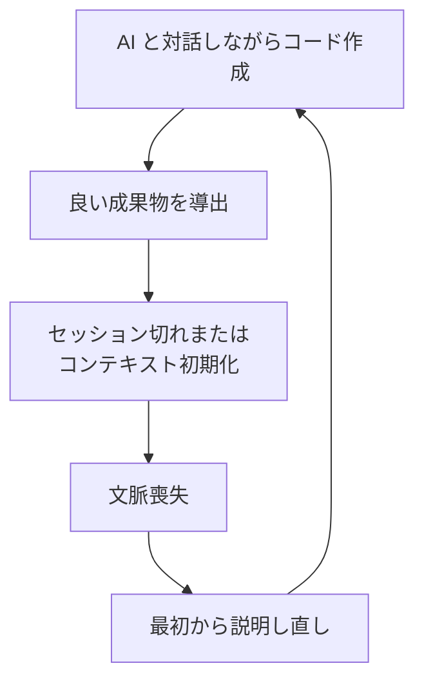
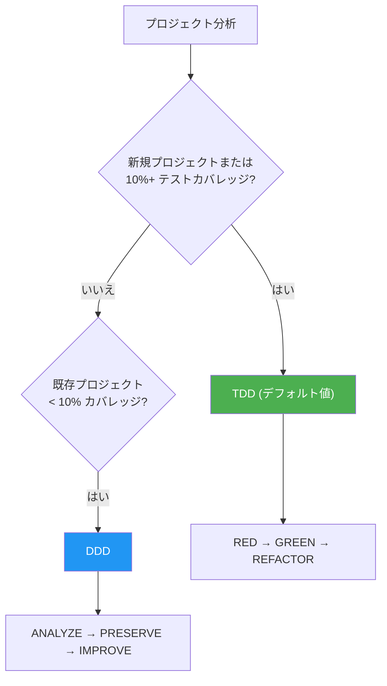
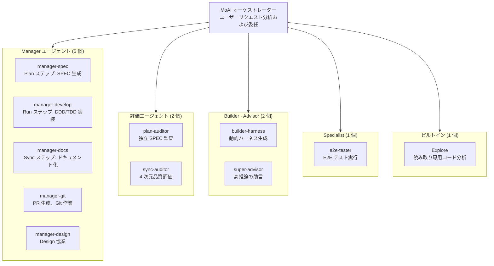
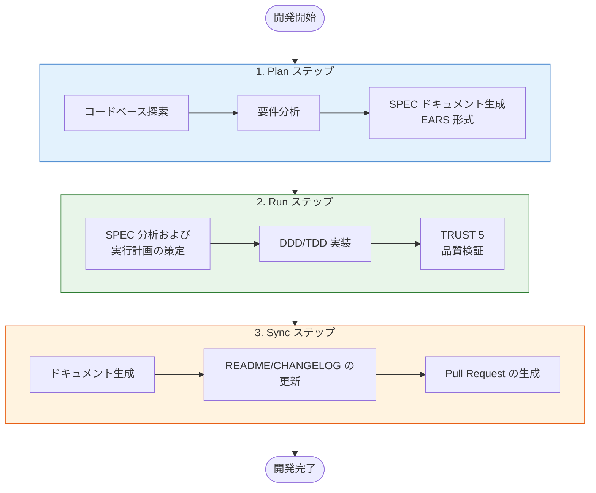
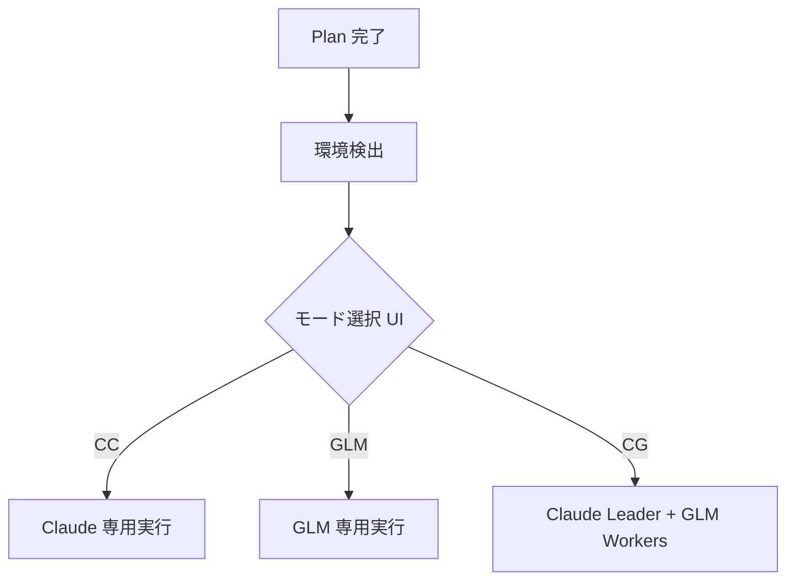

MoAI-ADK は **トークノミクス** (Token Economics) を目標とする **Agentic Development Kit** です。同じ品質のコードをより少ないトークンで、同じトークンでより高い品質を — モデル選択・推論深度・コンテキスト使用量をシステムが管理します。11 個の専門 AI エージェントと 27 個のスキルが協力し、新規プロジェクトには TDD (デフォルト値)、テストカバレッジが低い既存プロジェクトには DDD を自動的に適用します。

Go で書かれた単一バイナリ -- 依存性なしですべてのプラットフォームで即座に実行されます。




**一行要約:** MoAI-ADK は「AI と交わした対話をドキュメント (SPEC) に残し、安全にコードを改善 (DDD/TDD) し、品質を自動検証 (TRUST 5) する」ことを — **トークンコストまでシステムが管理しながら** 行うエージェンティック開発キットです。


## MoAI-ADK の紹介

**MoAI** は「モドゥのAI」(MoAI - Everybody's AI) を意味します。**ADK** は Agentic Development Kit の略で、AI エージェントが開発プロセスを主導するツール群を意味します。

MoAI-ADK は **Claude Code の中でエージェント同士が協力してエージェンティックコーディングを行うようにする開発キット** です。AI 開発チームが協業してプロジェクトを完成させるように、各エージェントが自分の専門分野の作業を担当します。

| AI 開発チーム | MoAI-ADK | 役割 |
|----------|----------|------|
| プロダクトオーナー | ユーザー (開発者) | 何を作るかを決めます |
| チームリード / Tech Lead | MoAI オーケストレーター | 全体の作業を調整し 11 個のエージェントに委任します |
| 企画者 / Spec Writer | manager-spec | 要件を SPEC ドキュメントに整理します |
| 開発者 / Engineers | manager-develop (ドメインコンテキスト注入) | 実際のコードを DDD/TDD で実装します |
| QA / コードレビュアー | plan-auditor · sync-auditor | 計画と成果物を独立して監査します |

## 核心的な価値 — 3 つの柱

v3.0 の価値は 3 つの柱に要約されます。

### トークノミクス (Token Economics)

コスト対品質を最大化する知的な資源配分です。作業ステップと SPEC のサイズに応じてモデルと推論深度を宣言的に割り当てる **3 階層モデルポリシー**、Claude リーダーと GLM ワーカーを組み合わせて実装コストを 60-70% 減らす **CG モード**、予算超過前に優雅に止まる **Token Circuit Breaker**、そして常時ロードコンテキストを減らす **コンテキストダイエット** がこの柱を成します。

### エージェンティックループエンジニアリング (Agentic Loop Engineering)

ループが自ら働き、その過程で観察が積み重なります。完了条件を宣言すると条件が満たされるまでセッションが働き続ける **goal エンジン**、診断ツールが見つけた課題を全部空にするまで反復修正する **Ralph Engine** (`/moai loop`)、自然言語リクエストを言語と無関係に意図分析してルーティングする **Analyze-First ルーティング** がここに属します。蓄積された観察はハーネス学習の原料になり、4 階層の学習のはしご (観察 → ヒューリスティック → ルール → 自動アップデート) に沿って指針が進化します — 自動アップデートは常にユーザー承認ゲートの下でのみ適用されます。

### エージェンティックハーネス (Agentic Harness)

コードを直接書く代わりに、エージェントがうまく働く環境を設計します。11 個のエージェントカタログ、SPEC ベースの 3-phase ワークフロー (plan → run → sync)、TRUST 5 品質ゲート、自然言語リクエストでプロジェクト専用ハーネスを生成する Harness v4 Builder がこの柱です。詳しい概念は [ハーネスエンジニアリング](/ja/core-concepts/harness-engineering) ドキュメントを参照してください。

## なぜトークノミクスか

トークン単価は下がり続けますが、エージェンティック開発のトークン使用量はそれより速く増えます。エージェントが複数回り、コンテキストが長くなり、推論が深くなるほど、コストを決めるのはモデル価格ではなく **トークン運用方式** です。

MoAI-ADK の答えは 3 つです。

1. **作業ごとに合ったモデル・推論深度を割り当てる** — 計画は深く、実装は安く、検証は独立して。
2. **コンテキストをダイエットする** — 常時ロードされる指針を最小化し、プロンプトキャッシュヒット率を測定します。
3. **予算をシステムが守る** — トークン使用を追跡し、閾値超過前に優雅に止まります。

## なぜ MoAI-ADK か?

### Python から Go への完全な書き直し

Python ベースの MoAI-ADK (~73,000 行) を Go で完全に書き直しました。

| 項目 | Python エディション | Go エディション |
|------|-------------|----------|
| 配布 | pip + venv + 依存性 | **単一バイナリ**、ゼロ依存性 |
| 起動時間 | ~800ms インタプリタ起動 | **~5ms** ネイティブ実行 |
| 並行性 | asyncio / threading | **ネイティブ goroutine** |
| 型安全性 | ランタイム (mypy はオプション) | **コンパイル時に強制** |
| クロスプラットフォーム | Python ランタイムが必要 | **事前ビルドバイナリ** (macOS, Linux, Windows) |
| Hook 実行 | Shell ラッパー + Python | **コンパイルされたバイナリ**、JSON プロトコル |

### 核心数値 (v3.0 基準)

- **11 個** のエージェントカタログ (10 MoAI カスタム + 1 Anthropic ビルトイン `Explore`)
- **27 個** のスキル (template-managed)
- **36 個** の CLI コマンド · **15 種** の `/moai` サブコマンド
- **16 個** のプログラミング言語対応
- **3 段階ハーネス** (minimal / standard / thorough) — SPEC の複雑度に応じた適応型品質ゲート
- **504 個** の SPEC ドキュメントを基に開発されたコードベース

### バイブコーディングの問題点

**バイブコーディング** (Vibe Coding) とは AI と自然に対話しながらコードを書く方式です。「こんな機能を作って」と言えば AI がコードを生成します。直感的で速いですが、実務では深刻な問題が発生します。


```mermaid
flowchart TD
    A["AI と対話しながらコード作成"] --> B["良い成果物を導出"]
    B --> C["セッション切れまたは\nコンテキスト初期化"]
    C --> D["文脈喪失"]
    D --> E["最初から説明し直し"]
    E --> A
```

**実務で遭遇する具体的な問題:**

| 問題 | 状況の例 | 結果 |
|------|----------|------|
| **文脈喪失** | 昨日 1 時間議論した認証方式を今日また説明する必要がある | 時間の浪費、一貫性の低下 |
| **品質の不一致** | AI が時には良いコードを、時には悪いコードを生成 | コード品質の予測不可 |
| **既存コードの破壊** | 「この部分を直して」と言ったら別の機能が壊れた | バグ発生、ロールバックが必要 |
| **反復説明** | プロジェクト構造、コーディングルールを毎回教え直す必要がある | 生産性の低下 |
| **検証の不在** | AI が生成したコードが安全か確認する方法がない | セキュリティ脆弱性、テスト不備 |
| **トークンの浪費** | すべての作業を同じモデル・同じ推論深度で処理 | コストの予測不可、予算超過 |

### MoAI-ADK の解決策

| 問題 | MoAI-ADK の解決策 |
|------|------------------|
| 文脈喪失 | **SPEC ドキュメント** で要件をファイルに永久保存 |
| 品質の不一致 | **TRUST 5** フレームワークで一貫した品質基準を適用 |
| 既存コードの破壊 | **DDD/TDD** でテストを先に書いて既存機能を保護 |
| 反復説明 | **CLAUDE.md とスキルシステム** でプロジェクトコンテキストを自動ロード |
| 検証の不在 | **LSP 品質ゲート** でコード品質を自動検証 |
| トークンの浪費 | **モデルポリシー + Token Circuit Breaker** でコストをシステムが管理 |

## システム要件

| プラットフォーム | 対応環境 | 備考 |
|--------|---------|------|
| macOS | Terminal, iTerm2 | 完全対応 |
| Linux | Bash, Zsh | 完全対応 |
| Windows | **WSL (推奨)**, PowerShell 7.x+ | ネイティブ cmd.exe は非対応 |

**必須条件:**
- すべてのプラットフォームに **Git** のインストールが必要
- **Windows ユーザー**: [Git for Windows](https://gitforwindows.org/) **必須** (Git Bash を含む)
  - 最良の体験のため **WSL** (Windows Subsystem for Linux) の使用を推奨
  - PowerShell 7.x 以上は代替として対応
  - レガシー Windows PowerShell 5.x と cmd.exe は **非対応**

## クイックスタート

### 1. インストール

#### macOS / Linux / WSL

```bash
curl -fsSL https://raw.githubusercontent.com/modu-ai/moai-adk/main/install.sh | bash
```

#### Windows (PowerShell 7.x+)

> **推奨**: 上記の Linux インストールコマンドで WSL を使うと最良の体験を提供します。

```powershell
irm https://raw.githubusercontent.com/modu-ai/moai-adk/main/install.ps1 | iex
```

> [Git for Windows](https://gitforwindows.org/) が先にインストールされている必要があります。

#### ソースからビルド (Go 1.26+)

```bash
git clone https://github.com/modu-ai/moai-adk.git
cd moai-adk && make build
```

> 事前ビルドされたバイナリは [Releases](https://github.com/modu-ai/moai-adk/releases) ページからダウンロードできます。

### 2. プロジェクトの初期化

```bash
moai init my-project
```

対話型ウィザードが言語、フレームワーク、方法論を自動検出した後 Claude Code 統合ファイルを生成します。

### 3. Claude Code で開発を開始

```bash
# Claude Code 実行後
/moai project                            # プロジェクトドキュメント生成 (product.md, structure.md, tech.md)
/moai plan "ユーザー認証の追加"              # SPEC ドキュメント生成
/moai run SPEC-AUTH-001                   # DDD/TDD 実装
/moai sync SPEC-AUTH-001                  # ドキュメント同期および PR 生成
```

自然言語で直接リクエストしてもかまいません — `/moai "ログインバグを直して"` は **Analyze-First** の意図分析を経て適切なワークフローにルーティングされます。

## 核心哲学


**「バイブコーディングの目的は速い生産性ではなくコード品質だ。」**

MoAI-ADK は速くコードを打ち出すツールではありません。AI を活用しつつ、人が直接書いたものより **より高い品質** のコードを作ることが目標です。速い速度は品質を守りながら自然についてくる副次的な効果です。


この哲学は 3 つの原則で具体化されます:

1. **仕様優先** (SPEC-First): コードを書く前に何を作るかをドキュメントで明確に定義します
2. **安全な改善** (DDD/TDD): 既存コードの動作を保存しながら段階的に改善します
3. **自動品質検証** (TRUST 5): 5 つの品質原則ですべてのコードを自動検証します

## MoAI 開発方法論

MoAI-ADK はプロジェクトの状態に応じて最適な開発方法論を自動的に選択します。


```mermaid
flowchart TD
    A["プロジェクト分析"] --> B{"新規プロジェクトまたは\n10%+ テストカバレッジ?"}
    B -->|"はい"| C["TDD (デフォルト値)"]
    B -->|"いいえ"| D{"既存プロジェクト\n< 10% カバレッジ?"}
    D -->|"はい"| E["DDD"]
    C --> F["RED → GREEN → REFACTOR"]
    E --> G["ANALYZE → PRESERVE → IMPROVE"]

    style C fill:#4CAF50,color:#fff
    style E fill:#2196F3,color:#fff
```

### TDD 方法論 (デフォルト値)

新規プロジェクトと機能開発の基本の方法論です。テストを先に書き、その後に実装します。

| ステップ | 説明 |
|------|------|
| **RED** | 期待される動作を定義する失敗するテストの作成 |
| **GREEN** | テストを通過する最小限のコードの作成 |
| **REFACTOR** | テストを維持しながらコード品質を改善。 |

ブラウンフィールドプロジェクト (既存コードベース) の場合、TDD に **pre-RED 分析ステップ** が追加されます: テストを書く前に既存コードを読んで現在の動作を理解します。

### DDD 方法論 (既存プロジェクト、10% 未満のカバレッジ)

テストカバレッジが低い既存プロジェクトを安全にリファクタリングするための方法論です。

```
ANALYZE   → 既存コードと依存性を分析、ドメイン境界を識別
PRESERVE  → 特性化テストの作成、現在の動作のスナップショットを取得
IMPROVE   → テスト保護下で段階的に改善。
```


方法論は `moai init` 時に自動選択され (`--mode <ddd|tdd>`、デフォルト値: tdd)、`.moai/config/sections/quality.yaml` の `development_mode` で変更できます。

**参考**: MoAI-ADK v2.5.0+ では二値の方法論選択 (TDD または DDD のみ) を使います。ハイブリッドモードは明確性と一貫性のため除去されました。


## ハーネスエンジニアリングアーキテクチャ

MoAI-ADK は **ハーネスエンジニアリング** (Harness Engineering) パラダイムを実装します — 直接コードを書くのではなく、AI エージェントが働く環境を設計するアプローチです。

| 構成要素 | 説明 | コマンド |
|----------|------|--------|
| **Self-Verify Loop** | エージェントがコード作成 → テスト → 失敗 → 修正 → 通過のサイクルを自律的に行う | `/moai loop` |
| **Goal エンジン** | 完了条件を宣言すると条件充足またはターン上限までセッションが自ら働き続ける | `/moai goal` |
| **Context Map** | コードベースのアーキテクチャマップとドキュメントがエージェントに常に提供される | `/moai codemaps` |
| **Session Persistence** | `progress.md` が完了したステップをセッション間で追跡; 中断された実行が自動的に再開 | `/moai run SPEC-XXX` |
| **Failing Checklist** | すべての受け入れ基準が実行開始時に待機作業として登録; 実装完了時に完了マーク | `/moai run SPEC-XXX` |
| **Language-Agnostic** | 16 言語対応: 言語の自動検出、正しい LSP/リンター/テスト/カバレッジツールの選択 | すべてのワークフロー |
| **Garbage Collection** | 死んだコード、AI Slop、未使用 import の周期的スキャンと除去 | `/moai clean` |
| **Scaffolding First** | 実装前に空ファイルスタブを生成してエントロピーを防止 | `/moai run SPEC-XXX` |


「人が方向を定め、エージェントが実行する。」— エンジニアの役割がコード作成からハーネス設計 (SPEC、品質ゲート、フィードバックループ) へ転換されます。概念全体は [ハーネスエンジニアリング](/ja/core-concepts/harness-engineering) ドキュメントで扱います。


## AI エージェントオーケストレーション

MoAI は **戦略的オーケストレーター** です。直接コードを書かず、11 個の保存エージェント (10 MoAI カスタム + 1 Anthropic ビルトイン `Explore`) に作業を委任します。核心的な設計原則は **計画と監査の分離** — 作った人が検査しません。

### 11 個のエージェントカタログ

| 分類 | エージェント | 役割 |
|------|---------|------|
| **Manager** | manager-spec | Plan ステップ: SPEC ドキュメント生成 |
| | manager-develop | Run ステップ: DDD/TDD/autofix 実装 |
| | manager-docs | Sync ステップ: ドキュメント化および PR 生成 |
| | manager-git | Git ワークフローおよび Tier ベースの PR ルーティング |
| | manager-design | Design ステップ: Claude Design 協業 |
| **Evaluator** | plan-auditor | SPEC 計画の独立した監査 (バイアス防止) |
| | sync-auditor | 4 次元品質評価 (機能 40 · セキュリティ 25 · 職人技 20 · 一貫性 15) |
| **Builder** | builder-harness | プロジェクト専用ハーネス (エージェント/スキル/コマンド) の生成 |
| **Advisor** | super-advisor | 高推論の助言 (E1-E4 エスカレーション) |
| **Specialist** | e2e-tester | Web/モバイル/デスクトップの E2E テスト実行 |
| **ビルトイン** | Explore | 読み取り専用のコードベース探索 |


```mermaid
flowchart TD
    MoAI["MoAI オーケストレーター\nユーザーリクエスト分析および委任"]

    subgraph Managers["Manager エージェント (5 個)"]
        M1["manager-spec\nPlan ステップ: SPEC 生成"]
        M2["manager-develop\nRun ステップ: DDD/TDD 実装"]
        M3["manager-docs\nSync ステップ: ドキュメント化"]
        M4["manager-git\nPR 生成、Git 作業"]
        M5["manager-design\nDesign 協業"]
    end

    subgraph Evaluators["評価エージェント (2 個)"]
        E1["plan-auditor\n独立 SPEC 監査"]
        E2["sync-auditor\n4 次元品質評価"]
    end

    subgraph BuilderAdvisor["Builder · Advisor (2 個)"]
        B1["builder-harness\n動的ハーネス生成"]
        B2["super-advisor\n高推論の助言"]
    end

    subgraph Specialist["Specialist (1 個)"]
        S1["e2e-tester\nE2E テスト実行"]
    end

    subgraph Explore["ビルトイン (1 個)"]
        X1["Explore\n読み取り専用コード分析"]
    end

    MoAI --> Managers
    MoAI --> Evaluators
    MoAI --> BuilderAdvisor
    MoAI --> Specialist
    MoAI --> Explore
```

### 27 個のスキル (Progressive Disclosure)

3 レベルの Progressive Disclosure システムでトークン効率的に管理されます。スキルの説明 (~100 トークン) のみが常時目録に露出し、本文 (~5K トークン) は実際の呼び出し時にのみロードされます — コンテキストダイエットの 1 つの軸です。

| カテゴリ | 例 |
|----------|------|
| **Foundation** | core, cc, thinking, quality |
| **Workflow** | spec, project, ddd, tdd, testing, worktree |
| **Domain** | backend, frontend, database, html-report |
| **Language** | Go, Python, TypeScript, Rust, Java, Kotlin, Swift, C++... |
| **Platform** | Vercel, Supabase, Firebase, Auth0, Clerk... |
| **Reference** | REST/GraphQL patterns, OWASP, git workflow |
| **Tool** | ast-grep, svg |

## MoAI ワークフロー

### Plan → Run → Sync パイプライン

MoAI の核心ワークフローは 3 段階で構成されます:


```mermaid
flowchart TD
    Start(["開発開始"]) --> Plan

    subgraph Plan["1. Plan ステップ"]
        P1["コードベース探索"] --> P2["要件分析"]
        P2 --> P3["SPEC ドキュメント生成\nEARS 形式"]
    end

    Plan --> Run

    subgraph Run["2. Run ステップ"]
        R1["SPEC 分析および\n実行計画の策定"] --> R2["DDD/TDD 実装"]
        R2 --> R3["TRUST 5\n品質検証"]
    end

    Run --> Sync

    subgraph Sync["3. Sync ステップ"]
        S1["ドキュメント生成"] --> S2["README/CHANGELOG の更新"]
        S2 --> S3["Pull Request の生成"]
    end

    Sync --> Done(["開発完了"])

    style Plan fill:#E3F2FD,stroke:#1565C0
    style Run fill:#E8F5E9,stroke:#2E7D32
    style Sync fill:#FFF3E0,stroke:#E65100
```

Plan ステップの成果物は **plan-auditor** が独立監査し、Run ステップ進入の直前には **実装着手承認** (ヒューマンゲート) を経ます。Sync ステップが終わると **sync-auditor** が 4 次元品質評価を行います — 「できたようだ」ではなく証拠で完了を判定します。

**実際の使用例:**

```bash
# 1. Plan: 要件の定義
> /moai plan "JWT ベースのユーザー認証機能の実装"

# 2. Run: DDD/TDD 方式で実装
> /moai run SPEC-AUTH-001

# 3. Sync: ドキュメント生成および PR
> /moai sync SPEC-AUTH-001
```

#### 実行モード選択ゲート

Plan ステップから Run ステップへ移行するとき、MoAI は自動的に現在の実行環境 (cc/glm/cg) を検出し、ユーザーが確認または変更できる選択 UI を表示します。


```mermaid
flowchart TD
    A["Plan 完了"] --> B["環境検出"]
    B --> C{"モード選択 UI"}
    C -->|"CC"| D["Claude 専用実行"]
    C -->|"GLM"| E["GLM 専用実行"]
    C -->|"CG"| F["Claude Leader + GLM Workers"]
```

このゲートは環境の状態に関係なく正しい実行モードが使われるよう保証し、実装中のモード不一致を防ぎます。

### /moai サブコマンド

すべてのサブコマンドは Claude Code 内で `/moai <サブコマンド>` として実行します。

#### 核心ワークフロー

| サブコマンド | 別名 | 用途 | 主要フラグ |
|-----------|------|------|-----------|
| `plan` | `spec` | SPEC ドキュメント生成 (EARS 形式) | `--worktree`, `--branch`, `--resume SPEC-XXX` |
| `run` | `impl` | SPEC の DDD/TDD 実装 | `--resume SPEC-XXX` |
| `sync` | `docs`, `pr` | ドキュメント同期、コードマップ、PR 生成 | `--merge`, `--skip-mx` |

#### エージェンティックループ

| サブコマンド | 用途 | 主要フラグ |
|-----------|------|-----------|
| `goal` | 完了条件宣言型の自律連続ループ (条件充足またはターン上限まで) | `status`, `clear` |
| `loop` | 診断ベースの反復自動修正 (goal エンジンの上のプリセット、デフォルト最大 10 回) | `--max N`, `--auto-fix`, `--seq` |
| `fix` | LSP エラー、リント、型エラーの自動修正 (単一パス) | `--dry`, `--seq`, `--level N`, `--resume` |

#### 品質およびコードベース

| サブコマンド | 別名 | 用途 | 主要フラグ |
|-----------|------|------|-----------|
| `review` | `code-review` | セキュリティおよび @MX タグ遵守のコードレビュー | `--staged`, `--branch`, `--security` |
| `gate` | -- | コミット前の品質ゲート (lint/format/type/test 並列) | -- |
| `clean` | `refactor-clean` | 死んだコードの識別と安全な除去 | `--dry`, `--safe-only`, `--file PATH` |
| `mx` | -- | コードベーススキャンおよび @MX コードレベル注釈の追加 | `--all`, `--dry`, `--priority P1-P4`, `--force` |
| `codemaps` | `update-codemaps` | アーキテクチャドキュメント生成 | `--force`, `--area AREA` |

#### プロジェクトおよびハーネス

| サブコマンド | 別名 | 用途 |
|-----------|------|------|
| `project` | `init` | プロジェクトドキュメント生成 (product.md, structure.md, tech.md, codemaps/) + ハーネスの自動構成 |
| `harness` | -- | ハーネス学習ライフサイクルの管理 · 自然言語でハーネス生成 |
| `feedback` | `fb`, `bug`, `issue` | フィードバックの収集および GitHub Issue の生成 |

#### 基本ワークフロー (自然言語)

| サブコマンド | 用途 | 主要フラグ |
|-----------|------|-----------|
| *(なし)* | Analyze-First の意図分析 → 完全自律の plan → run → sync パイプライン。複雑度スコア >= 5 のとき SPEC を自動生成。 | `--loop`, `--max N`, `--branch`, `--pr`, `--resume SPEC-XXX` |

### オーケストレーションモード

MoAI オーケストレーターは作業の複雑度を分析して実行形態を選択します。

| モード | 形態 | 適した作業 |
|------|------|-----------|
| **順次サブエージェント** (デフォルト) | ステップ別の単一エージェント委任 | コーディング中心の作業、予測可能なワークフロー |
| **並列サブエージェント** | 3-5 個の読み取り専用エージェントの同時ファンアウト | 調査・レビュー・監査などの並列分析 |
| **動的ワークフロー** | スクリプトが多数のエージェントをオーケストレーション | 大規模スイープ、交差検証リサーチ |


**v3.0 の変更**: かつての Agent Teams 静的オーケストレーション階層は引退しました。`--team` を強制してもサブエージェントモードにフォールバックします。ただし Claude Code のネイティブ teammate ランタイム — `moai cg` の tmux 分割画面 — はそのまま維持されます。チームモードの品質フック (TeammateIdle の LSP ゲート検証、TaskCompleted の SPEC 参照確認) も native teammate ランタイムとともに保存されます。


### CG モード (Claude + GLM ハイブリッド)

トークノミクスの柱の実践ツールです。Leader が **Claude API** を、Workers が **GLM API** を使うハイブリッドモードで、tmux セッションレベルの環境変数隔離を通じて実装されます。戦略・計画・監査は Claude が、大量の実装は GLM が担い、実装中心の作業で 60-70% のコストを削減します。

```
┌─────────────────────────────────────────────────────────────┐
│  LEADER (現在の tmux ペイン, Claude API)                     │
│  - moai cg 有効化後に /moai コマンドでオーケストレーション    │
│  - plan, quality, sync ステップの処理                        │
│  - GLM 環境なし → Claude API を使用                          │
└──────────────────────┬──────────────────────────────────────┘
                       │ Agent Teams (新しい tmux ペイン)
                       ▼
┌─────────────────────────────────────────────────────────────┐
│  TEAMMATES (新しい tmux ペイン, GLM API)                     │
│  - tmux セッション環境を継承 → GLM API を使用                │
│  - run ステップで実装作業を実行                              │
│  - SendMessage でリーダーと通信                              │
└─────────────────────────────────────────────────────────────┘
```

```bash
# 1. GLM API キーの保存 (一度だけ)
moai glm sk-your-glm-api-key

# 2. CG モードの有効化
moai cg

# 3. 同じペインで Claude Code を開始 (重要!)
claude

# 4. ワークフローの実行
/moai "作業の説明"
```

| コマンド | Leader | Workers | tmux 必要 | コスト削減 | 使用事例 |
|--------|--------|---------|----------|----------|----------|
| `moai cc` | Claude | Claude | いいえ | - | 複雑な作業、最高品質 |
| `moai glm` | GLM | GLM | 推奨 | ~70% | コスト最適化 |
| `moai cg` | Claude | GLM | **必須** | **~60%** | 品質 + コストのバランス |

### 自律開発ループ (Ralph Engine)

LSP 診断と AST-grep を組み合わせた自律エラー修正エンジンです:

```bash
/moai fix       # 単一パス: スキャン → 分類 → 修正 → 検証
/moai loop      # 反復修正: 完了条件の充足まで反復 (デフォルト最大 10 回)
```

**Ralph Engine の動作方式:**
1. **並列スキャン**: LSP 診断 + AST-grep + リンターを同時に実行
2. **自動分類**: レベル 1 (自動修正) からレベル 4 (ユーザー介入) までエラーを分類
3. **収束検出**: 同じエラーが繰り返されると代替戦略を適用
4. **完了基準**: 0 エラー、0 型エラー、85%+ カバレッジ

完了条件を直接宣言したいなら goal エンジンを使います:

```text
/moai goal "go test ./... exits 0; すべての AC が PASS として記録"
/moai goal status
/moai goal clear
```

`/moai loop` は goal エンジンの上のプリセットです — 診断ツールが見つけた課題キューを全部空にするまで反復修正します。

### 推奨ワークフローチェーン

**新機能開発:**
```
/moai plan → /moai run SPEC-XXX → /moai sync SPEC-XXX
```

**バグ修正:**
```
/moai fix (または /moai loop) → /moai review → /moai sync
```

**リファクタリング:**
```
/moai plan → /moai clean → /moai run SPEC-XXX → /moai review → /moai codemaps
```

**ドキュメント更新:**
```
/moai codemaps → /moai sync
```

## TRUST 5 品質フレームワーク

すべてのコード変更は 5 つの品質基準で検証されます:

| 基準 | 意味 | 検証内容 |
|------|------|----------|
| **T**ested | テスト済み | 85%+ カバレッジ、特性化テスト、ユニットテストの通過 |
| **R**eadable | 読みやすい | 明確な命名規則、一貫したコードスタイル、0 リントエラー |
| **U**nified | 統一 | 一貫したフォーマット、import の並び、プロジェクト構造の遵守 |
| **S**ecured | セキュア | OWASP 準拠、入力検証、0 セキュリティ警告 |
| **T**rackable | 追跡可能 | Conventional Commits、イシュー参照、構造化されたロギング |

## @MX タグシステム

MoAI-ADK は AI エージェント間でコンテキスト、不変量、危険領域を伝えるために **@MX コードレベル注釈システム** を使います。

| タグの種類 | 用途 | 追加のタイミング |
|----------|------|----------|
| `@MX:ANCHOR` | 重要な契約 | fan_in >= 3 の関数、変更時に影響範囲が広い |
| `@MX:WARN` | 危険領域 | goroutine、複雑度 >= 15、グローバル状態の変異 |
| `@MX:NOTE` | コンテキストの伝達 | マジック定数、ドキュメント欠落、ビジネスルール |
| `@MX:TODO` | 未完了作業 | テスト欠落、未実装機能 |

@MX タグシステムは **最も危険で重要なコードだけを表示** するよう設計されています。ほとんどのコードにはタグが必要なく、これは正常な設計です。

```bash
# コードベース全体をスキャン
/moai mx --all

# プレビュー (ファイル修正なし)
/moai mx --dry

# 優先順位別スキャン
/moai mx --priority P1
```

## モデルポリシー (トークノミクスの核心)

MoAI-ADK は Claude Code のサブスクリプション料金プランに合わせてエージェントに最適な AI モデルを割り当てます。料金プランの使用量制限内で品質を最大化することが目標です — 計画・監査のように推論が重いステップには上位モデルを、反復的な実装・ドキュメント化には軽量モデルを割り当てます。

| ポリシー | 特徴 |
|------|------|
| **max** | 最高品質 — 計画・監査に Opus 割り当て、最大スループット |
| **medium** (デフォルト) | 品質とコストのバランス |
| **low** | 経済的、Opus 非含 — Sonnet 中心の配分 |

### 設定方法

```bash
# プロジェクト初期化時
moai init my-project          # 対話型ウィザードでモデルポリシー選択

# 既存プロジェクトの再設定
moai update                   # 各設定ステップに対する対話型プロンプト
```


デフォルトポリシーは `medium` です。GLM 設定は `settings.local.json` に隔離されます (Git にコミットされません)。設定キーは `llm.yaml` の `performance_tier: max | medium | low` です (`--high`/`--low` はそれぞれ `--model-policy max`/`low` の deprecated 別名)。サブスクリプション/API 料金プランの軸は別の `plan_type: api | subscription` で分離されます。


## Task メトリクスロギング

MoAI-ADK は開発セッション中に Task ツールのメトリクスを自動的にキャプチャします:

- **場所**: `.moai/logs/task-metrics.jsonl`
- **キャプチャするメトリクス**: トークン使用量、ツール呼び出し、所要時間、エージェントタイプ
- **目的**: セッション分析、性能最適化、コスト追跡

Task ツール完了時に PostToolUse フックがメトリクスをロギングします。このデータを使ってエージェント効率を分析しトークン消費を最適化してください — トークノミクスは測定から始まります。

## プロジェクト構造

MoAI-ADK をインストールするとプロジェクトに次のような構造が生成されます。

```
my-project/
├── CLAUDE.md                  # MoAI の実行指針書
├── .claude/
│   ├── agents/moai/           # 10 個の MoAI カスタムエージェント定義 (+ Explore ビルトイン)
│   ├── skills/moai-*/         # 27 個のスキルモジュール
│   ├── hooks/moai/            # 自動化フックスクリプト
│   └── rules/moai/            # コーディングルールおよび標準
└── .moai/
    ├── config/                # MoAI 設定ファイル
    │   └── sections/
    │       └── quality.yaml   # TRUST 5 品質設定
    ├── specs/                 # SPEC ドキュメント保存所
    │   └── SPEC-XXX/
    │       └── spec.md
    └── memory/                # セッション間のコンテキスト維持
```

**主要ファイルの説明:**

| ファイル/ディレクトリ | 役割 |
|--------------|------|
| `CLAUDE.md` | MoAI が読む実行指針書。プロジェクトルール、エージェントカタログ、ワークフロー定義が込められています |
| `.claude/agents/` | 各エージェントの専門分野とツール権限を定義します |
| `.claude/skills/` | プログラミング言語、プラットフォーム別のベストプラクティスを込めた知識モジュールです |
| `.moai/specs/` | SPEC ドキュメントが保存される場所です。各機能ごとに別のディレクトリを持ちます |
| `.moai/config/` | TRUST 5 品質基準、DDD/TDD 設定などプロジェクト設定を管理します |

## 多言語対応

MoAI-ADK は 4 言語に対応します。ユーザーが韓国語でリクエストすれば韓国語で応答し、英語でリクエストすれば英語で応答します。

| 言語 | コード | 対応範囲 |
|------|------|----------|
| 韓国語 | ko | 対話、ドキュメント、コマンド、エラーメッセージ |
| 英語 | en | 対話、ドキュメント、コマンド、エラーメッセージ |
| 日本語 | ja | 対話、ドキュメント、コマンド、エラーメッセージ |
| 中国語 | zh | 対話、ドキュメント、コマンド、エラーメッセージ |


**言語設定:** `.moai/config/sections/language.yaml` で対話言語、コードコメント言語、コミットメッセージ言語をそれぞれ設定できます。たとえば、対話は韓国語でしつつコードコメントとコミットメッセージは英語で書くように設定できます。


## 次のステップ

MoAI-ADK の全体像を理解したら、次は各核心概念を詳しく見ていく番です。

- [ハーネスエンジニアリング](/ja/core-concepts/harness-engineering) -- エージェントが働く環境を設計するパラダイムを学びます
- [SPEC ベース開発](/core-concepts/spec-based-dev) -- 要件をどうドキュメントで定義するかを学びます
- [ドメイン駆動開発](/core-concepts/ddd) -- 既存コードを安全に改善する方法を学びます
- [TRUST 5 品質](/core-concepts/trust-5) -- コード品質を自動的に検証する方法を学びます
- [MoAI Memory](/claude-code/context-memory/memory) -- セッション間のコンテキストがどう保存されるかを学びます
