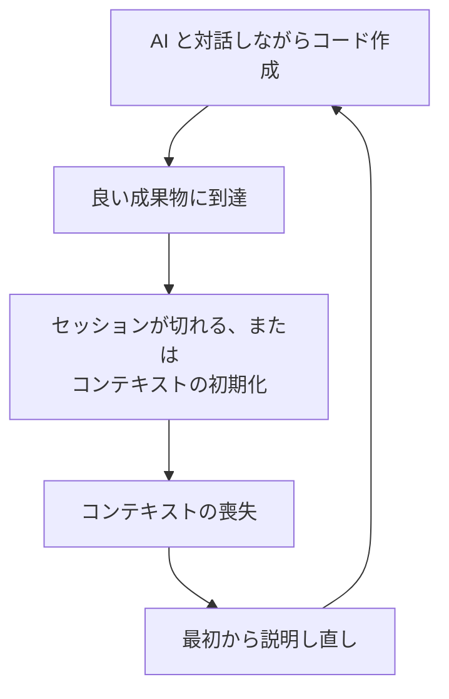
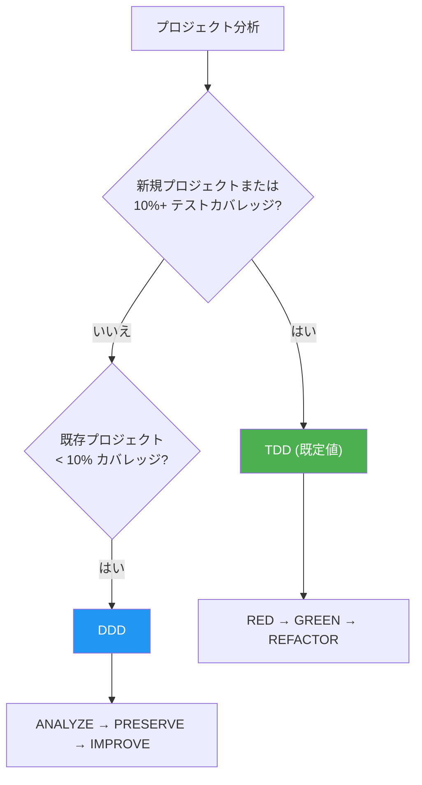
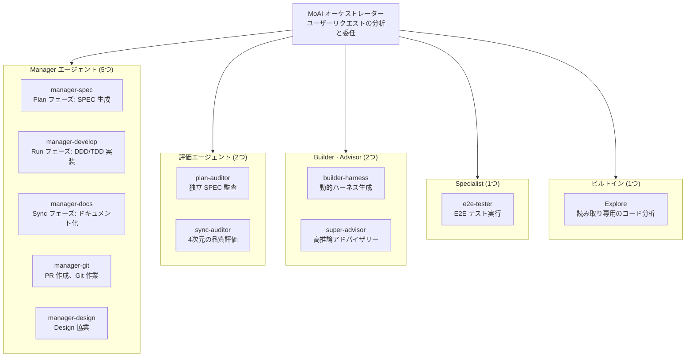
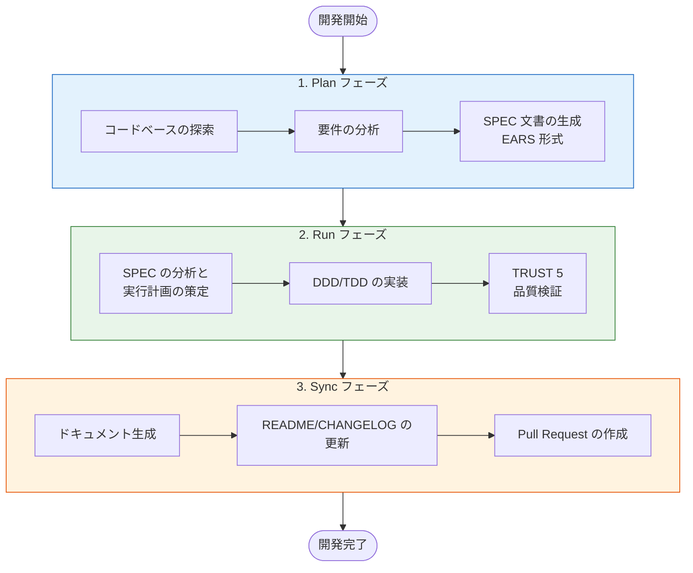
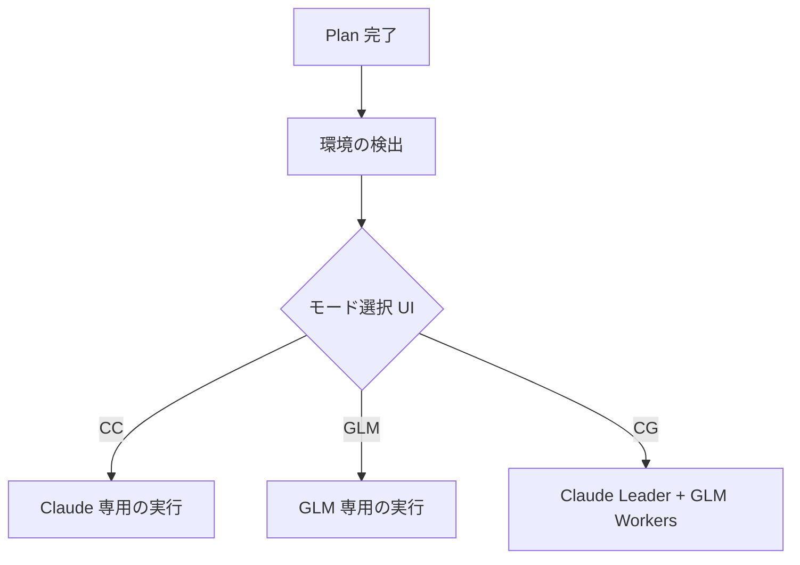

MoAI-ADK は **トークノミクス** (Token Economics) を目標とする **Agentic Development Kit** です。同じ品質のコードをより少ないトークンで、同じトークンでより高い品質を — モデル選択・推論の深さ・コンテキスト使用量をシステムが管理します。11個の専門 AI エージェントと27個のスキルが協力し、新規プロジェクトには TDD (既定値)、テストカバレッジの低い既存プロジェクトには DDD を自動的に適用します。

Go で書かれた単一バイナリ -- 依存関係なしにすべてのプラットフォームで即座に実行できます。


**一言要約:** MoAI-ADK は「AI と交わした対話をドキュメント (SPEC) として残し、安全にコードを改善 (DDD/TDD) し、品質を自動検証 (TRUST 5) する」ことを — **トークンコストまでシステムが管理しながら** 実行するエージェンティック開発キットです。


## MoAI-ADK の紹介

**MoAI** は「みんなの AI」(MoAI - Everybody's AI) を意味します。**ADK** は Agentic Development Kit の略で、AI エージェントが開発プロセスを主導するツール群を指します。

MoAI-ADK は **Claude Code の中でエージェントたちが相互に協力しながらエージェンティックコーディングを実行する開発キット** です。AI 開発チームが協業してプロジェクトを完成させるように、各エージェントが自分の専門分野の作業を担当します。

| AI 開発チーム | MoAI-ADK | 役割 |
|----------|----------|------|
| プロダクトオーナー | ユーザー (開発者) | 何を作るかを決めます |
| チームリード / Tech Lead | MoAI オーケストレーター | 全体の作業を調整し、11個のエージェントに委任します |
| プランナー / Spec Writer | manager-spec | 要件を SPEC 文書にまとめます |
| 開発者 / Engineers | manager-develop (ドメインコンテキストの注入) | 実際のコードを DDD/TDD で実装します |
| QA / コードレビュアー | plan-auditor · sync-auditor | 計画と成果物を独立に監査します |

## コアバリュー — 3つの柱

v3.0 の価値は3つの柱に要約されます。

### トークノミクス (Token Economics)

コスト対品質を最大化するインテリジェントな資源配分です。作業フェーズと SPEC のサイズに応じてモデルと推論の深さを宣言的に割り当てる **3層モデルポリシー**、Claude リーダーと GLM ワーカーを組み合わせて実装コストを 60-70% 削減する **CG モード**、予算超過の前に優雅に停止する **Token Circuit Breaker**、そして常時ロードされるコンテキストを削減する **コンテキストダイエット** がこの柱を構成します。

### エージェンティックループエンジニアリング (Agentic Loop Engineering)

ループが自ら働き、その過程で観察が蓄積されます。完了条件を宣言すると条件が満たされるまでセッションが働き続ける **goal エンジン**、診断ツールが見つけた課題をすべて空にするまで反復修正する **Ralph Engine** (`/moai loop`)、自然言語のリクエストを言語と無関係に意図分析してルーティングする **Analyze-First ルーティング** がここに属します。蓄積された観察はハーネス学習の原料となり、4層の学習ラダー (観察 → ヒューリスティック → ルール → 自動アップデート) に沿って指針が進化します — 自動アップデートは常にユーザー承認ゲートの下でのみ適用されます。

### エージェンティックハーネス (Agentic Harness)

コードを直接書く代わりに、エージェントがうまく働ける環境を設計します。11エージェントのカタログ、SPEC ベースの 3-phase ワークフロー (plan → run → sync)、TRUST 5 品質ゲート、自然言語のリクエストでプロジェクト専用のハーネスを生成する Harness v4 Builder がこの柱です。詳しい概念は [ハーネスエンジニアリング](/ja/core-concepts/harness-engineering) を参照してください。

## なぜトークノミクスなのか

トークン単価は下がり続けますが、エージェンティック開発のトークン使用量はそれより速く増えます。エージェントが複数動き、コンテキストが長くなり、推論が深くなるほど、コストを決めるのはモデル価格ではなく **トークンの運用方法** です。

MoAI-ADK の答えは3つです。

1. **作業ごとに適したモデル・推論の深さを割り当てる** — 計画は深く、実装は安く、検証は独立に。
2. **コンテキストをダイエットする** — 常時ロードされる指針を最小化し、プロンプトキャッシュのヒット率を測定します。
3. **予算をシステムが守る** — トークン使用を追跡し、しきい値超過の前に優雅に停止します。

## なぜ MoAI-ADK なのか?

### Python から Go への完全な書き直し

Python ベースの MoAI-ADK (~73,000行) を Go で完全に書き直しました。

| 項目 | Python エディション | Go エディション |
|------|-------------|----------|
| 配布 | pip + venv + 依存関係 | **単一バイナリ**、ゼロ依存 |
| 起動時間 | ~800ms のインタプリタ起動 | **~5ms** のネイティブ実行 |
| 並行性 | asyncio / threading | **ネイティブゴルーチン** |
| 型安全性 | ランタイム (mypy は任意) | **コンパイル時に強制** |
| クロスプラットフォーム | Python ランタイムが必要 | **ビルド済みバイナリ** (macOS, Linux, Windows) |
| Hook の実行 | Shell ラッパー + Python | **コンパイル済みバイナリ**、JSON プロトコル |

### 主要な数値 (v3.0 基準)

- **11個** のエージェントカタログ (10 MoAI カスタム + 1 Anthropic ビルトイン `Explore`)
- **27個** のスキル (template-managed)
- **36個** の CLI コマンド · **15種** の `/moai` サブコマンド
- **16個** のプログラミング言語をサポート
- **487個** の SPEC 文書を基盤に開発されたコードベース

### バイブコーディングの問題点

**バイブコーディング** (Vibe Coding) とは、AI と自然に対話しながらコードを書く方式です。「こんな機能を作って」と言えば AI がコードを生成します。直感的で速いですが、実務では深刻な問題が発生します。


```mermaid
flowchart TD
    A["AI と対話しながらコード作成"] --> B["良い成果物に到達"]
    B --> C["セッションが切れる、または\nコンテキストの初期化"]
    C --> D["コンテキストの喪失"]
    D --> E["最初から説明し直し"]
    E --> A
```

**実務で遭遇する具体的な問題:**

| 問題 | 状況の例 | 結果 |
|------|----------|------|
| **コンテキストの喪失** | 昨日1時間議論した認証方式を今日また説明しなければならない | 時間の浪費、一貫性の低下 |
| **品質の不一致** | AI が良いコードを生成することも、悪いコードを生成することもある | コード品質の予測不能 |
| **既存コードの破壊** | 「ここを直して」と言ったら別の機能が壊れた | バグの発生、ロールバックが必要 |
| **繰り返しの説明** | プロジェクト構造、コーディング規則を毎回伝え直す必要がある | 生産性の低下 |
| **検証の不在** | AI が生成したコードが安全か確認する方法がない | セキュリティ脆弱性、テスト不足 |
| **トークンの浪費** | すべての作業を同じモデル・同じ推論の深さで処理 | コストの予測不能、予算超過 |

### MoAI-ADK の解決策

| 問題 | MoAI-ADK の解決策 |
|------|------------------|
| コンテキストの喪失 | **SPEC 文書** で要件をファイルとして永久保存 |
| 品質の不一致 | **TRUST 5** フレームワークで一貫した品質基準を適用 |
| 既存コードの破壊 | **DDD/TDD** でテストを先に書いて既存機能を保護 |
| 繰り返しの説明 | **CLAUDE.md とスキルシステム** でプロジェクトコンテキストを自動ロード |
| 検証の不在 | **LSP 品質ゲート** でコード品質を自動検証 |
| トークンの浪費 | **モデルポリシー + Token Circuit Breaker** でコストをシステムが管理 |

## システム要件

| プラットフォーム | サポート環境 | 備考 |
|--------|---------|------|
| macOS | Terminal, iTerm2 | 完全サポート |
| Linux | Bash, Zsh | 完全サポート |
| Windows | **WSL (推奨)**, PowerShell 7.x+ | ネイティブ cmd.exe はサポート対象外 |

**必須条件:**
- すべてのプラットフォームに **Git** のインストールが必要
- **Windows ユーザー**: [Git for Windows](https://gitforwindows.org/) が **必須** (Git Bash を含む)
  - 最良の体験のために **WSL** (Windows Subsystem for Linux) の利用を推奨
  - PowerShell 7.x 以上は代替としてサポート
  - レガシーの Windows PowerShell 5.x と cmd.exe は **サポート対象外**

## クイックスタート

### 1. インストール

#### macOS / Linux / WSL

```bash
curl -fsSL https://raw.githubusercontent.com/modu-ai/moai-adk/main/install.sh | bash
```

#### Windows (PowerShell 7.x+)

> **推奨**: 上記の Linux インストールコマンドで WSL を使うと最良の体験が得られます。

```powershell
irm https://raw.githubusercontent.com/modu-ai/moai-adk/main/install.ps1 | iex
```

> 先に [Git for Windows](https://gitforwindows.org/) がインストールされている必要があります。

#### ソースからビルド (Go 1.26+)

```bash
git clone https://github.com/modu-ai/moai-adk.git
cd moai-adk && make build
```

> ビルド済みバイナリは [Releases](https://github.com/modu-ai/moai-adk/releases) ページからダウンロードできます。

### 2. プロジェクトの初期化

```bash
moai init my-project
```

対話型ウィザードが言語、フレームワーク、方法論を自動検出した後、Claude Code 統合ファイルを生成します。

### 3. Claude Code で開発開始

```bash
# Claude Code の起動後
/moai project                            # プロジェクト文書の生成 (product.md, structure.md, tech.md)
/moai plan "ユーザー認証の追加"            # SPEC 文書の生成
/moai run SPEC-AUTH-001                   # DDD/TDD の実装
/moai sync SPEC-AUTH-001                  # ドキュメント同期と PR の作成
```

自然言語でそのままリクエストしても構いません — `/moai "ログインのバグを直して"` は **Analyze-First** の意図分析を経て、適切なワークフローにルーティングされます。

## 中核となる哲学


**「バイブコーディングの目的は速い生産性ではなくコード品質である。」**

MoAI-ADK は速くコードを量産するツールではありません。AI を活用しつつ、人が直接書いたものより **さらに高い品質** のコードを作ることが目標です。速さは品質を守りながら自然についてくる副次的な効果です。


この哲学は3つの原則に具体化されます:

1. **仕様優先** (SPEC-First): コードを書く前に、何を作るかをドキュメントで明確に定義します
2. **安全な改善** (DDD/TDD): 既存コードの動作を保存しながら段階的に改善します
3. **自動品質検証** (TRUST 5): 5つの品質原則ですべてのコードを自動検証します

## MoAI 開発方法論

MoAI-ADK はプロジェクト状態に応じて、最適な開発方法論を自動的に選択します。


```mermaid
flowchart TD
    A["プロジェクト分析"] --> B{"新規プロジェクトまたは\n10%+ テストカバレッジ?"}
    B -->|"はい"| C["TDD (既定値)"]
    B -->|"いいえ"| D{"既存プロジェクト\n< 10% カバレッジ?"}
    D -->|"はい"| E["DDD"]
    C --> F["RED → GREEN → REFACTOR"]
    E --> G["ANALYZE → PRESERVE → IMPROVE"]

    style C fill:#4CAF50,color:#fff
    style E fill:#2196F3,color:#fff
```

### TDD 方法論 (既定値)

新規プロジェクトと機能開発の既定の方法論です。テストを先に書き、その後に実装します。

| ステップ | 説明 |
|------|------|
| **RED** | 期待する動作を定義する失敗テストの作成 |
| **GREEN** | テストに合格する最小限のコードの作成 |
| **REFACTOR** | テストを維持しながらコード品質を改善。 |

ブラウンフィールドプロジェクト (既存コードベース) の場合、TDD に **pre-RED 分析ステップ** が追加されます: テスト作成前に既存コードを読み、現在の動作を理解します。

### DDD 方法論 (既存プロジェクト、10% 未満のカバレッジ)

テストカバレッジの低い既存プロジェクトを安全にリファクタリングするための方法論です。

```
ANALYZE   → 既存コードと依存関係の分析、ドメイン境界の特定
PRESERVE  → 特性テストの作成、現在の動作のスナップショット取得
IMPROVE   → テストの保護下での段階的改善。
```


方法論は `moai init` 時に自動選択され (`--mode <ddd|tdd>`、既定値: tdd)、`.moai/config/sections/quality.yaml` の `development_mode` で変更できます。

**参考**: MoAI-ADK v2.5.0+ では二者択一の方法論選択 (TDD または DDD のみ) を採用しています。ハイブリッドモードは明確さと一貫性のために削除されました。


## ハーネスエンジニアリングのアーキテクチャ

MoAI-ADK は **ハーネスエンジニアリング** (Harness Engineering) パラダイムを実装しています — 直接コードを書くのではなく、AI エージェントが働く環境を設計するアプローチです。

| 構成要素 | 説明 | コマンド |
|----------|------|--------|
| **Self-Verify Loop** | エージェントがコード作成 → テスト → 失敗 → 修正 → 合格のサイクルを自律的に実行 | `/moai loop` |
| **Goal エンジン** | 完了条件を宣言すると、条件達成またはターン上限までセッションが自ら働き続ける | `/moai goal` |
| **Context Map** | コードベースのアーキテクチャマップと文書がエージェントに常に提供される | `/moai codemaps` |
| **Session Persistence** | `progress.md` が完了したステップをセッション間で追跡; 中断された実行が自動再開 | `/moai run SPEC-XXX` |
| **Failing Checklist** | すべての受け入れ基準が実行開始時に待機タスクとして登録; 実装完了時に完了マーク | `/moai run SPEC-XXX` |
| **Language-Agnostic** | 16言語をサポート: 言語の自動検出、正しい LSP/リンター/テスト/カバレッジツールの選択 | すべてのワークフロー |
| **Garbage Collection** | デッドコード、AI Slop、未使用 import の定期的なスキャンと除去 | `/moai clean` |
| **Scaffolding First** | 実装前に空のファイルスタブを生成してエントロピーを防止 | `/moai run SPEC-XXX` |


「人が方向を定め、エージェントが実行する。」 — エンジニアの役割がコード作成からハーネス設計 (SPEC、品質ゲート、フィードバックループ) へと転換します。概念の全体は [ハーネスエンジニアリング](/ja/core-concepts/harness-engineering) で扱います。


## AI エージェントのオーケストレーション

MoAI は **戦略的オーケストレーター** です。直接コードを書かず、11個の保持エージェント (10 MoAI カスタム + 1 Anthropic ビルトイン `Explore`) に作業を委任します。中核となる設計原則は **計画と監査の分離** — 作った本人は検査しません。

### 11エージェントのカタログ

| 分類 | エージェント | 役割 |
|------|---------|------|
| **Manager** | manager-spec | Plan フェーズ: SPEC 文書の生成 |
| | manager-develop | Run フェーズ: DDD/TDD/autofix の実装 |
| | manager-docs | Sync フェーズ: ドキュメント化と PR の作成 |
| | manager-git | Git ワークフローと Tier ベースの PR ルーティング |
| | manager-design | Design フェーズ: Claude Design との協業 |
| **Evaluator** | plan-auditor | SPEC 計画の独立監査 (バイアス防止) |
| | sync-auditor | 4次元の品質評価 (機能 40 · セキュリティ 25 · 職人性 20 · 一貫性 15) |
| **Builder** | builder-harness | プロジェクト専用のハーネス (エージェント/スキル/コマンド) の生成 |
| **Advisor** | super-advisor | 高推論のアドバイザリー (E1-E4 エスカレーション) |
| **Specialist** | e2e-tester | ウェブ/モバイル/デスクトップの E2E テスト実行 |
| **ビルトイン** | Explore | 読み取り専用のコードベース探索 |


```mermaid
flowchart TD
    MoAI["MoAI オーケストレーター\nユーザーリクエストの分析と委任"]

    subgraph Managers["Manager エージェント (5つ)"]
        M1["manager-spec\nPlan フェーズ: SPEC 生成"]
        M2["manager-develop\nRun フェーズ: DDD/TDD 実装"]
        M3["manager-docs\nSync フェーズ: ドキュメント化"]
        M4["manager-git\nPR 作成、Git 作業"]
        M5["manager-design\nDesign 協業"]
    end

    subgraph Evaluators["評価エージェント (2つ)"]
        E1["plan-auditor\n独立 SPEC 監査"]
        E2["sync-auditor\n4次元の品質評価"]
    end

    subgraph BuilderAdvisor["Builder · Advisor (2つ)"]
        B1["builder-harness\n動的ハーネス生成"]
        B2["super-advisor\n高推論アドバイザリー"]
    end

    subgraph Specialist["Specialist (1つ)"]
        S1["e2e-tester\nE2E テスト実行"]
    end

    subgraph Explore["ビルトイン (1つ)"]
        X1["Explore\n読み取り専用のコード分析"]
    end

    MoAI --> Managers
    MoAI --> Evaluators
    MoAI --> BuilderAdvisor
    MoAI --> Specialist
    MoAI --> Explore
```

### 27個のスキル (Progressive Disclosure)

3レベルの Progressive Disclosure システムでトークン効率的に管理されます。スキルの説明 (~100 トークン) だけが常時リストに露出され、本文 (~5K トークン) は実際の呼び出し時にのみロードされます — コンテキストダイエットの一軸です。

| カテゴリ | 例 |
|----------|------|
| **Foundation** | core, cc, thinking, quality |
| **Workflow** | spec, project, ddd, tdd, testing, worktree |
| **Domain** | backend, frontend, database, html-report |
| **Language** | Go, Python, TypeScript, Rust, Java, Kotlin, Swift, C++... |
| **Platform** | Vercel, Supabase, Firebase, Auth0, Clerk... |
| **Reference** | REST/GraphQL patterns, OWASP, git workflow |
| **Tool** | ast-grep, svg |

## MoAI ワークフロー

### Plan → Run → Sync パイプライン

MoAI の中核ワークフローは3つのフェーズで構成されます:


```mermaid
flowchart TD
    Start(["開発開始"]) --> Plan

    subgraph Plan["1. Plan フェーズ"]
        P1["コードベースの探索"] --> P2["要件の分析"]
        P2 --> P3["SPEC 文書の生成\nEARS 形式"]
    end

    Plan --> Run

    subgraph Run["2. Run フェーズ"]
        R1["SPEC の分析と\n実行計画の策定"] --> R2["DDD/TDD の実装"]
        R2 --> R3["TRUST 5\n品質検証"]
    end

    Run --> Sync

    subgraph Sync["3. Sync フェーズ"]
        S1["ドキュメント生成"] --> S2["README/CHANGELOG の更新"]
        S2 --> S3["Pull Request の作成"]
    end

    Sync --> Done(["開発完了"])

    style Plan fill:#E3F2FD,stroke:#1565C0
    style Run fill:#E8F5E9,stroke:#2E7D32
    style Sync fill:#FFF3E0,stroke:#E65100
```

Plan フェーズの成果物は **plan-auditor** が独立監査し、Run フェーズ進入の直前には **実装着手の承認** (ヒューマンゲート) を経ます。Sync フェーズが終わると **sync-auditor** が4次元の品質評価を実行します — 「できた気がする」ではなく証拠で完了を判定します。

**実際の使用例:**

```bash
# 1. Plan: 要件の定義
> /moai plan "JWT ベースのユーザー認証機能の実装"

# 2. Run: DDD/TDD 方式で実装
> /moai run SPEC-AUTH-001

# 3. Sync: ドキュメント生成と PR
> /moai sync SPEC-AUTH-001
```

#### 実行モード選択ゲート

Plan フェーズから Run フェーズへ移行するとき、MoAI は自動的に現在の実行環境 (cc/glm/cg) を検出し、ユーザーが確認・変更できる選択 UI を表示します。


```mermaid
flowchart TD
    A["Plan 完了"] --> B["環境の検出"]
    B --> C{"モード選択 UI"}
    C -->|"CC"| D["Claude 専用の実行"]
    C -->|"GLM"| E["GLM 専用の実行"]
    C -->|"CG"| F["Claude Leader + GLM Workers"]
```

このゲートは環境状態に関わらず正しい実行モードが使われることを保証し、実装中のモード不一致を防ぎます。

### /moai サブコマンド

すべてのサブコマンドは Claude Code 内で `/moai <サブコマンド>` として実行します。

#### コアワークフロー

| サブコマンド | エイリアス | 用途 | 主なフラグ |
|-----------|------|------|-----------|
| `plan` | `spec` | SPEC 文書の生成 (EARS 形式) | `--worktree`, `--branch`, `--resume SPEC-XXX` |
| `run` | `impl` | SPEC の DDD/TDD 実装 | `--resume SPEC-XXX` |
| `sync` | `docs`, `pr` | ドキュメント同期、コードマップ、PR の作成 | `--merge`, `--skip-mx` |

#### エージェンティックループ

| サブコマンド | 用途 | 主なフラグ |
|-----------|------|-----------|
| `goal` | 完了条件宣言型の自律継続ループ (条件達成またはターン上限まで) | `status`, `clear` |
| `loop` | 診断ベースの反復自動修正 (goal エンジン上のプリセット、最大100回) | `--max N`, `--auto-fix`, `--seq` |
| `fix` | LSP エラー、lint、型エラーの自動修正 (シングルパス) | `--dry`, `--seq`, `--level N`, `--resume` |

#### 品質とコードベース

| サブコマンド | エイリアス | 用途 | 主なフラグ |
|-----------|------|------|-----------|
| `review` | `code-review` | セキュリティおよび @MX タグ準拠のコードレビュー | `--staged`, `--branch`, `--security` |
| `gate` | -- | コミット前の品質ゲート (lint/format/type/test を並列) | -- |
| `clean` | `refactor-clean` | デッドコードの特定と安全な除去 | `--dry`, `--safe-only`, `--file PATH` |
| `mx` | -- | コードベースのスキャンと @MX コードレベル注釈の追加 | `--all`, `--dry`, `--priority P1-P4`, `--force` |
| `codemaps` | `update-codemaps` | アーキテクチャドキュメントの生成 | `--force`, `--area AREA` |

#### プロジェクトとハーネス

| サブコマンド | エイリアス | 用途 |
|-----------|------|------|
| `project` | `init` | プロジェクト文書の生成 (product.md, structure.md, tech.md, codemaps/) + ハーネスの自動構成 |
| `harness` | -- | ハーネス学習ライフサイクルの管理 · 自然言語でのハーネス生成 |
| `feedback` | `fb`, `bug`, `issue` | フィードバックの収集と GitHub イシューの作成 |

#### 基本ワークフロー (自然言語)

| サブコマンド | 用途 | 主なフラグ |
|-----------|------|-----------|
| *(なし)* | Analyze-First の意図分析 → 完全自律の plan → run → sync パイプライン。複雑度スコア >= 5 のとき SPEC を自動生成。 | `--loop`, `--max N`, `--branch`, `--pr`, `--resume SPEC-XXX` |

### オーケストレーションモード

MoAI オーケストレーターは作業の複雑さを分析して実行形態を選択します。

| モード | 形態 | 適した作業 |
|------|------|-----------|
| **順次サブエージェント** (既定) | ステップごとの単一エージェント委任 | コーディング中心の作業、予測可能なワークフロー |
| **並列サブエージェント** | 3-5個の読み取り専用エージェントの同時ファンアウト | 調査・レビュー・監査などの並列分析 |
| **動的ワークフロー** | スクリプトが多数のエージェントをオーケストレーション | 大規模スイープ、クロス検証リサーチ |


**v3.0 の変更**: かつての Agent Teams 静的オーケストレーション層は引退しました。`--team` を強制してもサブエージェントモードにフォールバックします。ただし Claude Code のネイティブ teammate ランタイム — `moai cg` の tmux 分割ペイン — はそのまま維持されます。チームモードの品質フック (TeammateIdle の LSP ゲート検証、TaskCompleted の SPEC 参照確認) もネイティブ teammate ランタイムとともに保存されます。


### CG モード (Claude + GLM ハイブリッド)

トークノミクスの柱の実戦ツールです。Leader が **Claude API** を、Workers が **GLM API** を使うハイブリッドモードで、tmux セッションレベルの環境変数分離によって実装されています。戦略・計画・監査は Claude が、大量の実装は GLM が担い、実装中心の作業で 60-70% のコストを削減します。

```
┌─────────────────────────────────────────────────────────────┐
│  LEADER (現在の tmux ペイン, Claude API)                     │
│  - /moai --team 実行時のワークフローオーケストレーション       │
│  - plan, quality, sync フェーズの処理                        │
│  - GLM 環境なし → Claude API を使用                          │
└──────────────────────┬──────────────────────────────────────┘
                       │ Agent Teams (新しい tmux ペイン)
                       ▼
┌─────────────────────────────────────────────────────────────┐
│  TEAMMATES (新しい tmux ペイン, GLM API)                     │
│  - tmux セッション環境を継承 → GLM API を使用                │
│  - run フェーズで実装作業を実行                               │
│  - SendMessage でリーダーと通信                               │
└─────────────────────────────────────────────────────────────┘
```

```bash
# 1. GLM API キーの保存 (一度だけ)
moai glm sk-your-glm-api-key

# 2. CG モードの有効化
moai cg

# 3. 同じペインで Claude Code を起動 (重要!)
claude

# 4. チームワークフローの実行
/moai --team "作業の説明"
```

| コマンド | Leader | Workers | tmux 必要 | コスト削減 | ユースケース |
|--------|--------|---------|----------|----------|----------|
| `moai cc` | Claude | Claude | いいえ | - | 複雑な作業、最高品質 |
| `moai glm` | GLM | GLM | 推奨 | ~70% | コスト最適化 |
| `moai cg` | Claude | GLM | **必須** | **~60%** | 品質とコストのバランス |

### 自律開発ループ (Ralph Engine)

LSP 診断と AST-grep を組み合わせた自律エラー修正エンジンです:

```bash
/moai fix       # シングルパス: スキャン → 分類 → 修正 → 検証
/moai loop      # 反復修正: 完了条件を満たすまで反復 (最大100回)
```

**Ralph Engine の動作方式:**
1. **並列スキャン**: LSP 診断 + AST-grep + リンターを同時に実行
2. **自動分類**: レベル 1 (自動修正) からレベル 4 (ユーザー介入) までエラーを分類
3. **収束検知**: 同じエラーが繰り返されると代替戦略を適用
4. **完了基準**: 0 エラー、0 型エラー、85%+ カバレッジ

完了条件を自ら宣言したい場合は goal エンジンを使います:

```text
/moai goal "go test ./... exits 0; すべての AC が PASS と記録される"
/moai goal status
/moai goal clear
```

`/moai loop` は goal エンジン上のプリセットです — 診断ツールが見つけた課題キューをすべて空にするまで反復修正します。

### 推奨ワークフローチェーン

**新機能の開発:**
```
/moai plan → /moai run SPEC-XXX → /moai sync SPEC-XXX
```

**バグ修正:**
```
/moai fix (または /moai loop) → /moai review → /moai sync
```

**リファクタリング:**
```
/moai plan → /moai clean → /moai run SPEC-XXX → /moai review → /moai codemaps
```

**ドキュメント更新:**
```
/moai codemaps → /moai sync
```

## TRUST 5 品質フレームワーク

すべてのコード変更は5つの品質基準で検証されます:

| 基準 | 意味 | 検証内容 |
|------|------|----------|
| **T**ested | テスト済み | 85%+ カバレッジ、特性テスト、ユニットテストの合格 |
| **R**eadable | 読みやすい | 明確な命名規則、一貫したコードスタイル、0 lint エラー |
| **U**nified | 統一されている | 一貫したフォーマット、import の整理、プロジェクト構造の遵守 |
| **S**ecured | 安全である | OWASP 準拠、入力検証、0 セキュリティ警告 |
| **T**rackable | 追跡可能 | Conventional Commits、イシュー参照、構造化ロギング |

## @MX タグシステム

MoAI-ADK は AI エージェント間でコンテキスト、不変条件、危険領域を伝達するために **@MX コードレベル注釈システム** を使います。

| タグの種類 | 用途 | 追加のタイミング |
|----------|------|----------|
| `@MX:ANCHOR` | 重要な契約 | fan_in >= 3 の関数、変更時の影響範囲が広い |
| `@MX:WARN` | 危険領域 | ゴルーチン、複雑度 >= 15、グローバル状態の変異 |
| `@MX:NOTE` | コンテキストの伝達 | マジック定数、ドキュメント欠落、ビジネスルール |
| `@MX:TODO` | 未完了の作業 | テストの欠落、未実装の機能 |

@MX タグシステムは **最も危険で重要なコードだけをマークする** ように設計されています。ほとんどのコードにはタグが不要で、これは正常な設計です。

```bash
# コードベース全体のスキャン
/moai mx --all

# プレビュー (ファイルの変更なし)
/moai mx --dry

# 優先度別のスキャン
/moai mx --priority P1
```

## モデルポリシー (トークノミクスの中核)

MoAI-ADK は Claude Code のサブスクリプションプランに合わせて、エージェントに最適な AI モデルを割り当てます。プランの使用量制限内で品質を最大化するのが目標です — 計画・監査のような推論の重いフェーズには上位モデルを、反復的な実装・ドキュメント化には軽量モデルを割り当てます。

| ポリシー | プラン | 特徴 |
|------|--------|------|
| **High** | Max $200/月 | 最高品質 — 計画・監査に Opus を割り当て、最大スループット |
| **Medium** | Max $100/月 | 品質とコストのバランス |
| **Low** | Plus $20/月 | 経済的、Opus 非搭載 — Sonnet 中心の配分 |

### 設定方法

```bash
# プロジェクト初期化時
moai init my-project          # 対話型ウィザードでモデルポリシーを選択

# 既存プロジェクトの再設定
moai update                   # 各設定ステップに対する対話型プロンプト
```


既定のポリシーは `High` です。GLM 設定は `settings.local.json` に分離されます (Git にコミットされません)。設定キーは `model_policy: high | medium | low` です。


## Task メトリクスのロギング

MoAI-ADK は開発セッション中に Task ツールのメトリクスを自動的にキャプチャします:

- **場所**: `.moai/logs/task-metrics.jsonl`
- **キャプチャされるメトリクス**: トークン使用量、ツール呼び出し、所要時間、エージェントタイプ
- **目的**: セッション分析、性能最適化、コスト追跡

Task ツールの完了時に PostToolUse フックがメトリクスを記録します。このデータを使ってエージェントの効率を分析し、トークン消費を最適化しましょう — トークノミクスは測定から始まります。

## プロジェクト構造

MoAI-ADK をインストールすると、プロジェクトに次のような構造が生成されます。

```
my-project/
├── CLAUDE.md                  # MoAI の実行指針
├── .claude/
│   ├── agents/moai/           # 10個の MoAI カスタムエージェント定義 (+ Explore ビルトイン)
│   ├── skills/moai-*/         # 27個のスキルモジュール
│   ├── hooks/moai/            # 自動化フックスクリプト
│   └── rules/moai/            # コーディングルールと標準
└── .moai/
    ├── config/                # MoAI 設定ファイル
    │   └── sections/
    │       └── quality.yaml   # TRUST 5 品質設定
    ├── specs/                 # SPEC 文書の保管場所
    │   └── SPEC-XXX/
    │       └── spec.md
    └── memory/                # セッション間のコンテキスト維持
```

**主なファイルの説明:**

| ファイル/ディレクトリ | 役割 |
|--------------|------|
| `CLAUDE.md` | MoAI が読む実行指針。プロジェクトルール、エージェントカタログ、ワークフロー定義が含まれます |
| `.claude/agents/` | 各エージェントの専門分野とツール権限を定義します |
| `.claude/skills/` | プログラミング言語、プラットフォーム別のベストプラクティスを収めた知識モジュールです |
| `.moai/specs/` | SPEC 文書が保存される場所です。機能ごとに別のディレクトリを持ちます |
| `.moai/config/` | TRUST 5 品質基準、DDD/TDD 設定などのプロジェクト設定を管理します |

## 多言語サポート

MoAI-ADK は4言語をサポートします。ユーザーが日本語でリクエストすれば日本語で応答し、英語でリクエストすれば英語で応答します。

| 言語 | コード | サポート範囲 |
|------|------|----------|
| 韓国語 | ko | 会話、ドキュメント、コマンド、エラーメッセージ |
| 英語 | en | 会話、ドキュメント、コマンド、エラーメッセージ |
| 日本語 | ja | 会話、ドキュメント、コマンド、エラーメッセージ |
| 中国語 | zh | 会話、ドキュメント、コマンド、エラーメッセージ |


**言語設定:** `.moai/config/sections/language.yaml` で会話言語、コードコメント言語、コミットメッセージ言語をそれぞれ設定できます。たとえば、会話は日本語で行いつつ、コードコメントとコミットメッセージは英語で書くように設定できます。


## 次のステップ

MoAI-ADK の全体像を理解したら、次は各コアコンセプトを詳しく学ぶ番です。

- [ハーネスエンジニアリング](/ja/core-concepts/harness-engineering) -- エージェントが働く環境を設計するパラダイムを学びます
- [SPEC ベース開発](/core-concepts/spec-based-dev) -- 要件をどうドキュメントとして定義するかを学びます
- [ドメイン駆動開発](/core-concepts/ddd) -- 既存コードを安全に改善する方法を学びます
- [TRUST 5 品質](/core-concepts/trust-5) -- コード品質を自動的に検証する方法を学びます
- [MoAI Memory](/claude-code/context-memory/memory) -- セッション間でコンテキストがどう保存されるかを学びます
