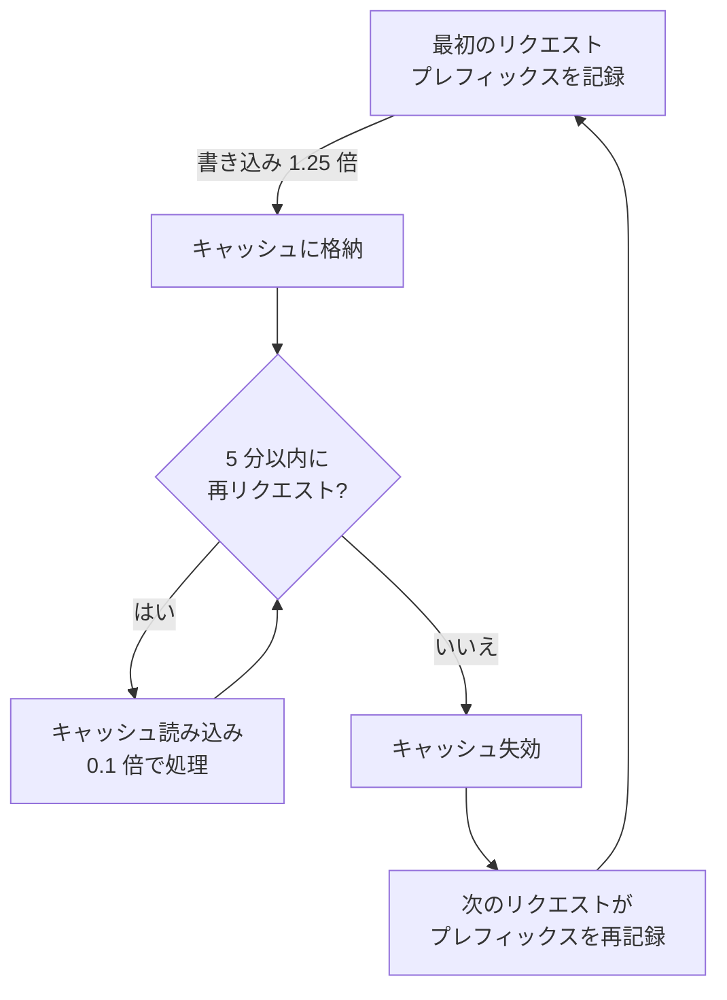

# プロンプトキャッシング — コスト削減と損益分岐

**プロンプトキャッシング** (prompt caching) は、直前に処理済みのリクエストの前部分を再計算せずに再利用します。モデルは毎ターン対話全体を最初から送り直しますが、前部分が直前と同一なら、その部分をキャッシュから取り出して定価の約 10% で処理します。だから対話が長くなるほど、繰り返されるコンテキストが大きいほど、削減幅は大きくなります。


この文書は**コスト**の観点からプロンプトキャッシングを扱います — 削減の原理、損益分岐、キャッシュが冷めたときにお金が漏れる場所、そして自律性ティアとコストの関係。動作原理とコンテキスト管理の詳しい説明は[プロンプトキャッシング](/ja/claude-code/context-memory/prompt-caching)を参照してください。2 つの文書は同じ機能を異なる角度から照らします — あちらはコンテキスト管理、こちらはコスト最適化です。


## なぜコストが下がるのか

モデルはリクエストとリクエストの間に何も記憶できません。そこで Claude Code は毎ターン新しい API リクエストを作り、**コンテキスト全体** — システムプロンプト、プロジェクト指示、ツール定義、ここまでの対話とツール結果、そして新しいメッセージ — を最初から詰めて送ります。

鍵になるのは、新しい内容が常に**一番最後に付け加わる**という点です。各リクエストの大部分は直前のリクエストとまったく同じで、本当に新しいものは最後の 1 回のやり取りだけです。プロンプトキャッシングは、まさにこの「変わっていない前部分」を毎回再計算しなくてすむようにします。MoAI-ADK の**トークノミクス** (tokenomics) が常時ロードされるコンテキスト自体を減らす側だとすれば、プロンプトキャッシングは残ったコンテキストを安価に再利用する側です。

## プレフィックスと 3 つの階層

キャッシュがヒットするには、リクエストの先頭部分 — **プレフィックス** (prefix) — が直前と 100% 同一でなければなりません。このプレフィックスは決められた順序で組み立てられます。

| 順序 | 階層 | 何が入るか | いつ変わるか |
|------|------|-----------------|-------------|
| 1 | ツール定義 (tools) | 内蔵ツール + MCP ツールのスキーマ | MCP サーバーの接続 · 切断、アップグレード |
| 2 | システムプロンプト (system) | 中核指示、権限ルール、`CLAUDE.md`、自動メモリ | 権限ルールの変更、セッション開始ファイルの編集、`/clear` |
| 3 | メッセージ (messages) | ユーザー入力 + 応答 + ツール結果 | 毎ターン (一番最後に付け加わる) |

ほとんど変わらない内容が前に来ます。メッセージ階層だけが変わっても、ツール定義とシステムプロンプトはキャッシュされたまま残ります。逆にシステムプロンプトやツール定義が変わると、それより後のすべての内容が別のプレフィックスの後に置かれるため、**全体が無効化**されます — 1 ターンが遅くなり、高くなります。

ここでは 1 つだけ覚えておけば十分です — **前部分が安定しているほどキャッシュは長く生き、削減は大きくなる。** 厳密な一致がヒットの条件であること、モデル · effort レベルごとにキャッシュが別々に積まれることまで含めた深い説明は、[コンテキスト管理の文書](/ja/claude-code/context-memory/prompt-caching)にあります。

## コスト構造と損益分岐

キャッシュがうまく回っているかは、API が毎応答で報告する 2 つのトークン数値でわかります。

| フィールド | 意味 | コスト (基本入力単価比) |
|------|------|----------------------------|
| `cache_read_input_tokens` | キャッシュから**読み込んだ**トークン | **0.1 倍** (≈10%) |
| `cache_creation_input_tokens` | キャッシュに**新規に書き込んだ**トークン | **1.25 倍** (5 分 TTL) · **2 倍** (1 時間 TTL) |

読み込みは通常入力の 10% なので、キャッシュから読み込む割合が高いほど、同じ仕事をはるかに安く処理できます。書き込みは通常入力より 25% 高いですが、これは「もう一度払って、後で得をする」という投資です。

### 損益分岐: リクエスト 2 個

キャッシングがコスト面で得になる時点は明確です — **リクエスト 2 個**です。

最初のリクエストはプレフィックスをキャッシュに書き込むため 1.25 倍 (5 分 TTL) を支払います。TTL 内に来た 2 番目のリクエストは、そのプレフィックスを 0.1 倍で読み込みます。2 リクエスト合計では、最初の書き込みプレミアムをすでに相殺して余りがあります。同じプレフィックスでリクエストが 3 つ、4 つと続くほど、削減は累積していきます。


**実用ルール**: 同じプレフィックスでリクエストが 2 回以上続くとき、キャッシングは無条件で得です。1 回で終わる仕事なら、キャッシングの有無がコストに大きく影響することはありません。


### キャッシュコストの流れ



### API を直接呼び出す場合

以下は **Anthropic API を直接呼び出す開発者**にのみ該当します。Claude Code ユーザーには無関係です — ランタイムが自動で管理します。

原則は 1 つです — **ブレークポイントは、毎リクエスト変わるデータ (質問、タイムスタンプ) の前の最後の安定ブロックに**置きます。

```python
# 安定したシステムプロンプトにキャッシュブレークポイントを配置
response = client.messages.create(
    model="claude-opus-4-8",
    max_tokens=1024,
    system=[{
        "type": "text",
        "text": "安定したシステムプロンプト...",
        "cache_control": {"type": "ephemeral", "ttl": "1h"}
    }],
    messages=[{"role": "user", "content": user_query}]
)
```

## 5 分の寿命: お金が漏れる場所

キャッシュにヒットするリクエストが届き続けている間は温かく保たれますが、**5 分間ひとつもリクエストがない**と失効します。この寿命は**アイドルベース** (idle-based) です — 最後のリクエストから 5 分が流れるとキャッシュが消え、次のリクエストはプレフィックスを最初から書き直さなければなりません。

人が介入しなければならない長い待ちがこの 5 分を超えると、キャッシュが冷めます。質問に答える時間、レビューを待つ時間がこれに当たります。コンテキストが大きいほどこの失効コストも大きくなります — 書き直すべきプレフィックスが大きいためです。だから、本当に必要なゲートでないなら、大きなコンテキストを抱えたまま長く止まらない方がよいのです。

| 認証方式 | デフォルト TTL | 備考 |
|-----------|----------|------|
| Claude サブスクリプション (Pro/Max/Team/Enterprise) | 1 時間 (自動、追加費用なし) | 上限超過時は 5 分へ自動切替 |
| API キー · サードパーティ | 5 分 | `ENABLE_PROMPT_CACHING_1H=1` で 1 時間に切替可能 |

## キャッシュを壊すもの (コストの観点)

以下の行動をすると、次のリクエストがキャッシュを外し、1 ターンが遅くなって高くなります。遅くて高いターンを 1 回払うと、新しいプレフィックスが再キャッシュされます。

| 行動 | 影響 |
|------|------|
| モデル切替 (`/model`) | 全体再計算 (モデルごとにキャッシュは分離) |
| effort レベルの変更 (`/effort`) | 全体再計算 |
| MCP サーバーの接続 · 切断 | ツール定義階層の無効化 → 全体 |
| ツール全体の拒否 (`Bash`、`WebFetch` のような裸の名前の deny ルール) | ツール定義階層の無効化 → 全体 |
| 対話の圧縮 (`/compact`、自動圧縮) | メッセージ階層の書き換え |
| Claude Code のアップグレード | システムプロンプト · ツール定義の変更 → 全体再構築 |

> `Bash(rm *)` のような**スコープ指定**の deny ルールと、すべての allow · ask ルールはツール集合を変えないため、プレフィックスはそのまま維持されます。


**セッション開始ファイルは特に高い** — `CLAUDE.md`、`.claude/rules/` 配下のルール、出力スタイル、常時ロードされるスキルは、セッション開始時にシステムプロンプト階層に入ります。セッション途中でこのファイルを直すとシステムプロンプト階層が変わり全体が無効化され、コンテキストがすでに大きくなっていればプレフィックス全体を書き直すことになります。こうした編集は**作業の終わりか `/clear` の直前にまとめて**行ってください。


無効化の一覧と「キャッシュを生かしておくもの」の全体は、[コンテキスト管理の文書](/ja/claude-code/context-memory/prompt-caching)にあります。

## 自律性ティア (MOAI_AUTONOMY_TIER) とコスト · 速度

MoAI-ADK の自律性ティアは、あくまで「人がどれくらい頻繁に介入するか」を定めるもので、キャッシュの動作を直接変えるわけではありません。しかし**人の介入が多いほどキャッシュが冷える隙間が増える**ため、コストに影響します。

`MOAI_AUTONOMY_TIER` 環境変数の値は 3 つです。

| ティア | 人の介入 | キャッシュへの影響 |
|------|-----------|-------------------|
| `semi-auto` (デフォルト) | 毎ステップで確認 · 承認ゲート | 長い待ちが 5 分の寿命を頻繁に超える → キャッシュの再記録が増える |
| `automatic` | 実行は自律、重要な決定のみ確認 | 遮断待ちが減りキャッシュが長く温かい |
| `fully-autonomous` | 人の介入は最小 (サンドボックス必要) | 待ちが最も少なくキャッシュの保温に有利 |

semi-auto では、作業開始の承認や質問への回答中に 5 分以上止まりやすく、その間にキャッシュが冷めます。人が戻ると、膨らんだプレフィックスを書き直さ (1.25 倍) なければなりません。ティアを上げるほどこうした遮断待ちが減り、**同じ仕事をより安く速く**処理できます。


コスト · 速度の利益は、レビューゲートを通る回数が減ることから得られます。`automatic` と `fully-autonomous` ではコミット直前の同期検証 (vet · lint · test) のゲートが外れ、`fully-autonomous` ではライフサイクルフックまで観測専用に縮みます。コストを節約したぶん、人が直接確認する地点も減るので、ティアの選択はコストだけの問題ではなく**レビュー責任**の問題です。


## モデル選択がキャッシュコストに与える影響

モデルはキャッシュキーの一部です。同じ内容でもモデルを変えれば全体を再計算します。だからモデルを一貫して保つこと自体が、キャッシュコストの節約になります。MoAI-ADK は 2 つの仕掛けでこの一貫性を守ります。

- **プロファイルマトリクス** (profile matrix): max · medium · low の 3 ティアのプロファイルが、各エージェントの `{モデル, effort レベル}` セルを定めています。`moai model profile --json` で照会します。エージェントごとにモデルが固定されていれば、複数のエージェントを立ち上げてもキャッシュは揺らぎません。
- **エージェント別モデル注入** (model-policy): `Agent()` を立ち上げるたびにモデルを明示します。エージェント定義のデフォルトが `model: inherit` のため、モデルを省くと親セッションのモデルへ静かに外れるのですが、これがキャッシュを揺らがすよくある原因です。宣言したモデルと実際に解決されたモデルが異なれば、ドリフトとして捕捉します。

モデルごとにキャッシュに乗る**最小トークン数**も異なります。これより短いプレフィックスはキャッシュに乗りません (エラーなく、そのまま処理されます)。

| モデル | コンテキスト | 最小キャッシュトークン |
|------|----------|----------------|
| Claude Fable 5 | 256K | 512 |
| Claude Opus 5 | 1M | 1,024 |
| Claude Sonnet 5 | 200K | 1,024 |
| Claude Opus 4.7 | 1M | 2,048 |
| Claude Haiku 4.5 | 200K | 4,096 |

> 2026 年ラインナップの Opus 4.8 (1M コンテキスト) のように、新モデルはファミリーごとに最小キャッシュトークンが異なるため、表にないモデルの値は[公式プロンプトキャッシング文書](https://platform.claude.com/docs/en/build-with-claude/prompt-caching)で確認してください。

## コストを節約する習慣

キャッシングは自動で有効になりますが、キャッシュを意識して働けばコストと遅延をさらに大きく削れます。鍵は 1 つです — 変わらない前部分が長く保たれるほど得になるので、その前部分を揺るがさないことです。

1. **セッション開始時に確定させ、途中で変えない**: モデル、effort レベル、MCP サーバーはセッション開始時に決め、作業が終わるまでそのままにします。この 3 つは全体再計算を呼ぶ最も多い原因です。
2. **常時ロードファイルは作業の最後に編集する**: `CLAUDE.md`、ルール、出力スタイル、常時ロードのスキルをセッション途中で直すと全体が無効化されます。1 つの作業が終わった後か `/clear` の直前にまとめて行ってください。
3. **大きなコンテキストで長く止まらない**: 5 分を超える待ちはキャッシュを冷やします。コンテキストが大きいほど、書き直すコストも大きくなります。
4. **`/compact` は自然な区切りで**: 作業と作業の間の意味のある境界で実行します。誤った道に入り込んだなら、全体を要約し直す `/compact` より、**キャッシュされた以前のターンまで巻き戻す `/rewind`** の方が安くすみます。
5. **`/clear` は本当に必要なときだけ**: `/clear` は温かいキャッシュを丸ごと捨てます。残った後片付けが短いなら、キャッシュを保持したまま終える方が、古い文脈を背負ったまま大きな作業を始めるより安いのです。

## CG モードでさらに節約する

キャッシングが「同じ内容を安く再利用する」軸なら、**CG モード** (CG Mode) は「高価なモデルを減らす」軸です。リーダーは Claude を、実装ワーカーは安価な GLM (z.ai バックエンド) を使うよう tmux セッションを切り分け、実装中心の作業で**コストを約 60-70% 削減します**。2 つの軸は重なりません — CG モードでも各バックエンドのキャッシングはそのバックエンド自身が行います (Claude はプロンプトキャッシング、GLM はコンテンツ類似度ベースの暗黙的キャッシング)。

詳しい構造と切替コマンドは[CG モード](/ja/multi-llm/cg-mode)を参照してください。

## コストのモニタリング

キャッシュがうまく働いているかを見るには、2 つのトークン数値を観察します。

- **statusline**: 毎ターンリアルタイムでキャッシュヒット (cache hit) を示すステータス行セグメントが使えます。
- **API 応答**: `cache_read_input_tokens` (読み込み) と `cache_creation_input_tokens` (書き込み) の比率が主要なシグナルです。

**読み込み対書き込みの比率**がキャッシュの健康度の核です。読み込みが書き込みを圧倒的に上回っていれば、キャッシングがうまく機能しています。逆に書き込みトークンが毎ターン高いままなら、プレフィックスのどこかが毎回変わっているということです — 上の「キャッシュを壊すもの」の表から原因を探してください。

遅延の面でも得です。変わらないプレフィックスを再処理しないため、応答が速くなります。キャッシュが無効化されたターンだけ、1 回遅くなり高くなります。

## 要約

- **削減の原理**: 変わらない前部分を 0.1 倍で再利用。前部分が大きいほど、安定しているほど、削減は大きくなります。
- **損益分岐**: リクエスト 2 個。最初のリクエストの 1.25 倍の書き込みプレミアムは、TTL 内の 2 番目のリクエストの 0.1 倍読み込みで回収されます。
- **5 分の寿命**: 長い人の待ちがキャッシュを冷やします。大きなコンテキストでは特に高くつきます。
- **自律性ティア**: `MOAI_AUTONOMY_TIER` が高いほど遮断待ちが減りキャッシュの保温が保たれてコスト · 速度に有利ですが、レビューゲートも減ります。
- **モニタリング**: statusline の cache hit + 読み込み/書き込みトークン比率。

## 関連ドキュメント

- [プロンプトキャッシング](/ja/claude-code/context-memory/prompt-caching) — 動作原理、プレフィックスマッチング、コンテキスト管理 (コンテキスト管理の観点)
- [コンテキストウィンドウ](/ja/claude-code/context-memory/context-window) — コンテキストウィンドウのサイズとモデルごとの違い
- [CG モード](/ja/multi-llm/cg-mode) — Claude + GLM ハイブリッドでコスト 60-70% 削減
- [モデルポリシー](/ja/multi-llm/model-policy) — エージェント別のモデル注入とドリフト防止

## 出典 (公式ドキュメント)

- [How Claude Code uses prompt caching](https://code.claude.com/docs/en/prompt-caching) — 自動管理、TTL の自動選択、無効化要因
- [Prompt caching (API)](https://platform.claude.com/docs/en/build-with-claude/prompt-caching) — `cache_control`、価格倍率、モデル別の最小トークン
- [Manage costs effectively](https://code.claude.com/docs/en/costs) — Claude Code の自動コスト最適化
