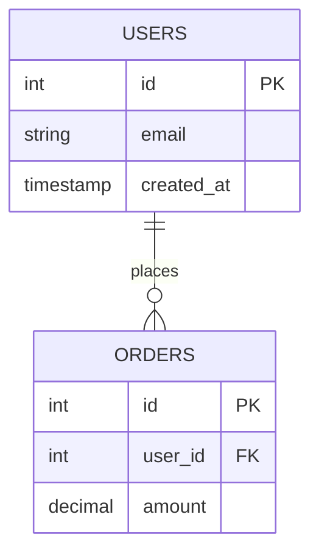

## 7ファイルテンプレートセット

`/moai db init` を実行すると、`.moai/project/db/` ディレクトリに次の 7 つのファイルが自動作成されます:

```
.moai/project/db/
├── README.md              (~50 行) 基本概要
├── schema.md              (自動生成) テーブルレジストリ
├── erd.mmd                (自動生成) エンティティ関係図
├── migrations.md          (自動生成) マイグレーションタイムライン
├── rls-policies.md        (テンプレート) Row-level security
├── queries.md             (テンプレート) 共通クエリライブラリ
└── seed-data.md           (テンプレート) シードデータパターン
```

## 各ファイルの役割

### README.md

このセクションの概要およびナビゲーションガイド。

内容:
- DB ワークフロー紹介
- 7 つのファイルの説明
- 一般的なワークフロー (マイグレーション追加、スキーマ更新)

このファイルはユーザー編集用で、自動更新時に保護されます。

### schema.md

すべてのテーブル、列、関係を自動的に文書化します。

構造:

```markdown
# スキーマ

## テーブルインデックス

| テーブル | 列数 | 主キー | 最新マイグレーション |
|---------|------|--------|-------------------|
| users | 8 | id | 20240101_create_users.sql |
| orders | 12 | id | 20240115_add_orders.sql |

## users

| 列 | 型 | 制約 | 説明 |
|----|-----|------|------|
| id | bigint | PRIMARY KEY, NOT NULL | ユーザー ID |
| email | varchar(255) | UNIQUE, NOT NULL | メールアドレス |
| created_at | timestamp | NOT NULL | 作成タイムスタンプ |
```

**[HARD] 自動生成** — `/moai db refresh` 時に完全に再生成されます。

### erd.mmd

Mermaid 構文でテーブル関係を可視化します。

例:



**[HARD] 自動生成** — `/moai db refresh` 時に完全に再生成されます。

### migrations.md

適用されたマイグレーションファイルのタイムライン。

構造:

```markdown
# マイグレーション履歴

## 2024年1月

- `2024-01-01` — 001_create_users.sql — ユーザーテーブル作成
- `2024-01-01` — 002_create_orders.sql — 注文テーブル作成
- `2024-01-15` — 003_add_email.sql — メールフィールド追加

## 2024年2月

- `2024-02-01` — 004_add_status.sql — ステータスフィールド追加
```

**[HARD] 自動生成** — `/moai db refresh` 時に完全に再生成されます。

### rls-policies.md

Supabase、PostgreSQL などで Row-Level Security (RLS) ポリシーを定義します。

このファイルはテンプレートであり、ユーザーが手動で作成します。例:

```markdown
# Row-Level Security ポリシー

## users テーブル

- **auth.uid() と一致する行のみ選択** — ユーザーは自分のプロフィールのみ閲覧可能
- **admin ロールのみすべての行を選択** — 管理者はすべてのユーザーを閲覧可能

## orders テーブル

- **自分の注文のみ選択** — user_id = auth.uid()
- **管理者はすべての注文を選択** — admin ロール確認
```

このファイルはユーザー編集用で、自動更新時に保護されます。

### queries.md

AI エージェントが参照する共通クエリパターン。

内容:

- ユーザー検索と認証
- 注文集計クエリ
- レポート生成クエリ
- データマイグレーション スクリプト

例:

```sql
-- メールでユーザー検索
SELECT * FROM users WHERE email = $1;

-- 月別売上集計
SELECT DATE_TRUNC('month', created_at) as month, SUM(amount)
FROM orders
GROUP BY DATE_TRUNC('month', created_at)
ORDER BY month DESC;
```

このファイルはユーザー編集用で、自動更新時に保護されます。

### seed-data.md

プロジェクトの初期データまたはテストデータパターン。

構造:

```markdown
# シードデータ

## 開発環境

### デフォルトユーザー

```json
{
  "email": "admin@example.com",
  "role": "admin"
},
{
  "email": "user@example.com",
  "role": "user"
}
```

## プロダクション

プロダクションシードデータは別リポジトリで管理します。
```

このファイルはユーザー編集用で、自動更新時に保護されます。

## _TBD_ マーカーによるカスタマイズ

初期作成時、テンプレートファイル (rls-policies.md、queries.md、seed-data.md) には `_TBD_` マーカーが含まれます:

```markdown
# Row-Level Security ポリシー

_TBD_: プロジェクトの RLS ポリシーをここに入力してください。
```

各 `_TBD_` マーカーを見つけて以下を実行します:

1. マーカーを削除
2. 実際のプロジェクト内容を記述
3. 保存

例:

```markdown
# Row-Level Security ポリシー

## users テーブル

- **認証済みユーザーのみ自分のデータを閲覧** — auth.uid() = id
- **admin ロールのみすべての行を閲覧** — role = 'admin'
```

## ユーザー編集コンテンツの保護

ユーザーが編集したセクションは、自動同期中も保護されます。

メカニズム:

1. ユーザー編集ブロックに SHA-256 ハッシュを追加
2. `/moai db refresh` 実行時、ハッシュを検証
3. ハッシュが一致すればその部分をスキップして自動生成部分のみ更新

例:

```markdown
---
# 自動生成セクション
## テーブルインデックス
[自動的に更新されます]

---
# ユーザーカスタムセクション (SHA-256: abc123...)
## 関係説明

これはユーザーが直接作成した内容です。
自動更新でも保持されます。
```

## 生成されたスキーマ.md の例

初期化後、schema.md は次の形式になります:

```markdown
# スキーマ

## テーブルインデックス

| テーブル | 列数 | 主キー | 最新マイグレーション |
|---------|------|--------|------------------|
| users | 8 | id | 20240101_create_users.sql |

## users

作成: 20240101_create_users.sql

| 列 | 型 | NULL 許可 | デフォルト | 説明 |
|---|---|---------|---------|----|
| id | bigint | NO | auto_increment | ユーザー一意 ID |
| email | varchar(255) | NO | - | メールアドレス |
| password_hash | varchar(255) | NO | - | ハッシュ化されたパスワード |
| created_at | timestamp | NO | CURRENT_TIMESTAMP | アカウント作成時刻 |

### 外部キー

なし

### インデックス

- PRIMARY KEY: id
- UNIQUE: email
```

## 関連設定ファイル

### db.yaml

`.moai/config/sections/db.yaml` のグローバル設定:

```yaml
db:
  auto_sync: true                        # 自動同期を有効
  debounce_window_seconds: 10            # debounce ウィンドウ
  approval_required: false               # 承認必須かどうか
  migration_patterns:                    # カスタムマイグレーションパス
    - path: "db/migrations"
      language: "go"
```

## ワークフロー

### 一般的なワークフロー

1. 新しいマイグレーションファイルを追加: `db/migrations/004_add_status.sql`
2. 自動同期フックが 10秒後にトリガー
3. `schema.md`、`erd.mmd`、`migrations.md` が自動更新
4. `rls-policies.md`、`queries.md`、`seed-data.md` は変わらず
5. ユーザーが必要に応じて手動で更新

### 完全な再構築

手動再構築が必要な場合:

```bash
/moai db refresh
```

プロンプト:

```
スキーマを完全に再構築しますか? (y/n)
```

「y」を入力すると:
- すべてのマイグレーションファイルを再スキャン
- schema.md を完全に再生成
- erd.mmd を完全に再生成
- migrations.md を完全に再生成
- ユーザー編集部分は保護されます
