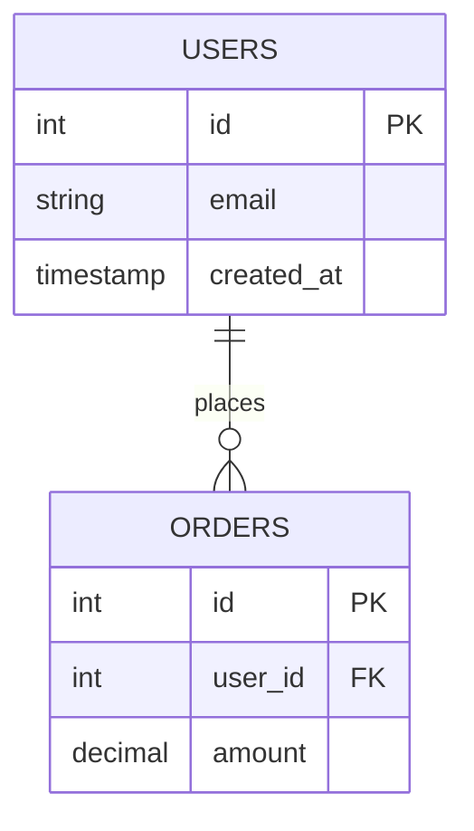

`.moai/project/db/` はプロジェクトのデータベースに関する単一の参照点です。
自動生成ファイル 3 つとユーザー編集テンプレート 4 つに分かれ、自動生成分は
`/moai db refresh` が管理し、ユーザー編集分は更新中も保護されます。

## 7 ファイルのテンプレートセット

`/moai db init` 実行時、`.moai/project/db/` ディレクトリに次の 7 ファイルが自動生成されます:

```
.moai/project/db/
├── README.md              (~ 50 行) 基本概要
├── schema.md              (自動生成) テーブルレジストリ
├── erd.mmd                (自動生成) エンティティ関係図
├── migrations.md          (自動生成) マイグレーションタイムライン
├── rls-policies.md        (テンプレート) Row-level security
├── queries.md             (テンプレート) 共通クエリライブラリ
└── seed-data.md           (テンプレート) シードデータパターン
```

## 各ファイルの役割

### README.md

このセクションの概要とナビゲーションガイドです。

内容:
- DB ワークフローの紹介
- 含まれる 7 ファイルの説明
- 一般的な作業フロー (マイグレーション追加、スキーマ更新)

このファイルはユーザー編集用のため、自動更新時に保護されます。

### schema.md

すべてのテーブル、カラム、リレーションを自動でドキュメント化します。

構造:

```markdown
# スキーマ

## テーブル一覧

| テーブル | カラム数 | 主キー | 最終マイグレーション |
|--------|--------|--------|-----------------|
| users | 8 | id | 20240101_create_users.sql |
| orders | 12 | id | 20240115_add_orders.sql |

## users

| カラム | 型 | 制約 | 説明 |
|------|------|--------|------|
| id | bigint | PRIMARY KEY, NOT NULL | ユーザー固有 ID |
| email | varchar(255) | UNIQUE, NOT NULL | メールアドレス |
| created_at | timestamp | NOT NULL | 作成時刻 |
```

**自動生成ファイル** — `/moai db refresh` 時に完全に再生成されるため、直接編集しないでください。

### erd.mmd

Mermaid 記法でテーブルの関係を可視化します。

例:


```mermaid
erDiagram
    USERS ||--o{ ORDERS : places
    USERS {
        int id PK
        string email
        timestamp created_at
    }
    ORDERS {
        int id PK
        int user_id FK
        decimal amount
    }
```

**自動生成ファイル** — `/moai db refresh` 時に完全に再生成されるため、直接編集しないでください。

### migrations.md

適用済みマイグレーションファイルのタイムラインです。

構造:

```markdown
# マイグレーション履歴

## 2024年1月

- `2024-01-01` — 001_create_users.sql — ユーザーテーブル作成
- `2024-01-01` — 002_create_orders.sql — 注文テーブル作成
- `2024-01-15` — 003_add_email.sql — メールフィールド追加

## 2024年2月

- `2024-02-01` — 004_add_status.sql — ステータスフィールド追加
```

**自動生成ファイル** — `/moai db refresh` 時に完全に再生成されるため、直接編集しないでください。

### rls-policies.md

Supabase、PostgreSQL などで Row-Level Security (RLS) ポリシーを定義します。

このファイルはテンプレートなので、ユーザーが手動で作成します。例:

```markdown
# Row-Level Security ポリシー

## users テーブル

- **auth.uid() と一致する行のみ選択** — 自分のプロフィールのみ照会可能
- **admin ロールのみ全行照会** — 管理者はすべてのユーザーを照会

## orders テーブル

- **自分の注文のみ照会** — user_id = auth.uid()
- **管理者はすべての注文を照会** — admin ロールを確認
```

このファイルはユーザー編集用のため、自動更新時に保護されます。

### queries.md

AI エージェントが参照する一般的なクエリパターン集です。エージェントが毎回
クエリを一から推論する代わりに、検証済みのパターンを再利用するため、品質と
トークンコストの両面で利益になります。

内容:

- ユーザー照会および認証
- 注文の集計クエリ
- レポート生成クエリ
- データマイグレーションスクリプト

例:

```sql
-- メールアドレスでユーザーを照会
SELECT * FROM users WHERE email = $1;

-- 月別売上集計
SELECT DATE_TRUNC('month', created_at) as month, SUM(amount)
FROM orders
GROUP BY DATE_TRUNC('month', created_at)
ORDER BY month DESC;
```

このファイルはユーザー編集用のため、自動更新時に保護されます。

### seed-data.md

プロジェクトの初期データまたはテストデータのパターンです。

構造例 — 開発環境セクションにはデフォルトアカウント一覧を JSON で整理します:

```json
[
  { "email": "admin@example.com", "role": "admin" },
  { "email": "user@example.com", "role": "user" }
]
```

プロダクションのシードデータは別のリポジトリに保管します。

このファイルはユーザー編集用のため、自動更新時に保護されます。

## _TBD_ マーカーによるカスタマイズ

初期生成時、テンプレートファイル (rls-policies.md、queries.md、seed-data.md) には `_TBD_` マーカーが含まれます:

```markdown
# Row-Level Security ポリシー

_TBD_: プロジェクトの RLS ポリシーをここに入力してください。
```

`_TBD_` マーカーを見つけて次を行います:

1. マーカーを削除
2. 実際のプロジェクト内容を作成
3. 保存

例:

```markdown
# Row-Level Security ポリシー

## users テーブル

- **認証済みユーザーのみ自分のデータを照会** — auth.uid() = id
- **admin ロールのみ全行照会** — role = 'admin'
```

## ユーザー編集コンテンツの保護

ユーザーが修正したセクションは自動同期中も保護されます。

メカニズム:

1. 各ファイルのユーザー編集ブロックに SHA-256 ハッシュを追加
2. `/moai db refresh` 実行時にハッシュを検証
3. ハッシュが一致すればその部分をスキップし、自動生成部分のみ更新

例:

```markdown
---
# 自動生成セクション
## テーブル一覧
[自動で更新される]

---
# ユーザーカスタムセクション (SHA-256: abc123...)
## リレーションの説明

この部分はユーザーが直接作成した内容です。
自動更新時も維持されます。
```

## 生成された schema.md の例

初期化後、schema.md は次のような形になります:

```markdown
# スキーマ

## テーブルインデックス

| テーブル名 | カラム数 | 主キー | 最終マイグレーション |
|---------|--------|--------|-----------------|
| users | 8 | id | 20240101_create_users.sql |

## users

作成: 20240101_create_users.sql

| カラム | 型 | NULL 許容 | デフォルト値 | 説明 |
|------|------|---------|--------|------|
| id | bigint | NO | auto_increment | ユーザー固有 ID |
| email | varchar(255) | NO | - | メールアドレス |
| password_hash | varchar(255) | NO | - | ハッシュ化されたパスワード |
| created_at | timestamp | NO | CURRENT_TIMESTAMP | アカウント作成時刻 |

### 外部キー

なし

### インデックス

- PRIMARY KEY: id
- UNIQUE: email
```

## 関連設定ファイル

### db.yaml

`.moai/config/sections/db.yaml` でのグローバル設定:

```yaml
db:
  auto_sync: true                        # 自動同期の有効化
  debounce_window_seconds: 10            # デバウンスウィンドウ
  approval_required: false               # 承認必須かどうか
  migration_patterns:                    # カスタムマイグレーションパス
    - path: "db/migrations"
      language: "go"
```

## ワークフロー

### 一般的な作業フロー

1. 新しいマイグレーションファイルを追加: `db/migrations/004_add_status.sql`
2. 自動同期フックが 10 秒後にトリガー
3. `schema.md`、`erd.mmd`、`migrations.md` が自動更新
4. `rls-policies.md`、`queries.md`、`seed-data.md` はそのまま維持
5. ユーザーが必要に応じて手動で更新

### 完全な再構築

手動での再構築が必要な場合:

```bash
/moai db refresh
```

プロンプト:

```
スキーマを完全に再構築しますか? (y/n)
```

"y" を入力すると:
- すべてのマイグレーションファイルを再スキャン
- schema.md を完全に再生成
- erd.mmd を完全に再生成
- migrations.md を完全に再生成
- ユーザー編集部分は保護される
