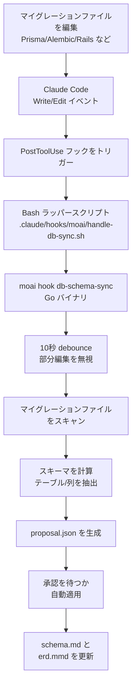

## アーキテクチャ概要

MoAI のデータベースワークフローは、マイグレーションファイルの変更を自動検出してスキーマドキュメントを同期します。これは PostToolUse フックで実装されます。

## イベントフロー



## 自動検出

### サポートされるイベント

マイグレーションファイルが変更されると自動検出されます:

| 言語 | マイグレーションパス | ファイルパターン |
|------|------------------|------------------|
| Go | `db/migrations/` | `*.sql` |
| Python | `alembic/versions/` | `*.py` |
| TypeScript | `prisma/migrations/` | `*.sql` |
| JavaScript | `migrations/` | `*.js` |
| Rust | `migrations/` | `*.sql` |
| Java | `src/main/resources/db/migration/` | `V*.sql` |
| Ruby | `db/migrate/` | `*.rb` |
| PHP | `database/migrations/` | `*.php` |

### debounce ウィンドウ

部分編集によるエラーを防ぐため、**10秒 debounce ウィンドウ**が実装されています:

- マイグレーションファイルの変更を検出
- 10秒待機
- 10秒以内に追加変更がなければスキーマスキャンを実行
- 10秒以内に追加変更があればタイマーをリセット

## 設定オプション

### 自動同期を有効化

`.moai/config/sections/db.yaml` で設定します:

```yaml
db:
  auto_sync: true              # デフォルト: true
  debounce_window_seconds: 10  # デフォルト: 10秒
  approval_required: false     # デフォルト: false (自動適用)
```

### 自動同期を無効化

プロジェクトで自動同期を無効にするには:

```yaml
db:
  auto_sync: false
```

この場合、手動で同期してください:

```bash
/moai db refresh
```

## 手動同期

`/moai db refresh` コマンドを使用します:

```bash
/moai db refresh
```

このコマンド:

1. ユーザー確認を待つ (REQ-024) — 「スキーマを完全に再構築しますか?」
2. すべてのマイグレーションファイルの全スキャン
3. schema.md、erd.mmd、migrations.md を再生成
4. 結果の要約を出力

## /moai sync との関係

完全なドキュメント同期ワークフロー (`/moai sync`) を実行する場合:

- Phase 0.08: DB スキーマが自動的にリフレッシュされます
- 自動同期フックとは独立して機能
- すべてのドキュメントを統合更新

## ユーザー編集コンテンツの保護

自動同期中も、ユーザーが編集したセクションは保護されます:

- SHA-256 ハッシュで変更を追跡
- ユーザー編集部分を自動検出
- 自動生成コンテンツのみを更新
- ユーザー編集部分を保持

例えば `schema.md` では:

```markdown
# スキーマドキュメント

## 自動生成セクション
[自動的に更新されます]

## カスタムメモ (ユーザー編集)
[自動更新でも保持されます]
```

## フック登録を確認

PostToolUse フックが正しく登録されているか確認します:

```bash
grep -A10 '"PostToolUse"' .claude/settings.json
```

期待される出力:

```json
"PostToolUse": [{
  "hooks": [{
    "command": "\"$CLAUDE_PROJECT_DIR/.claude/hooks/moai/handle-db-sync.sh\"",
    "timeout": 15
  }]
}]
```

## トラブルシューティング

### フックが機能しない

1. フックスクリプトが存在するか確認:

```bash
ls -la .claude/hooks/moai/handle-db-sync.sh
```

2. 実行権限を確認:

```bash
chmod +x .claude/hooks/moai/handle-db-sync.sh
```

3. moai バイナリパスを確認:

```bash
which moai
```

### スキーマ更新が不正確

自動同期を無効にして手動で検証します:

```yaml
db:
  auto_sync: false
```

その後手動でリフレッシュして結果を確認:

```bash
/moai db refresh
```
