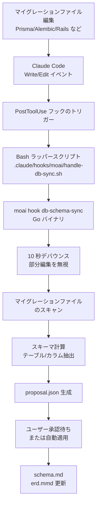

## アーキテクチャ概要

MoAI のデータベースワークフローは、マイグレーションファイルの変更を自動で検知して
スキーマドキュメントを同期します。人間が「ドキュメント更新」を覚えておく必要が
ないように、Claude Code の PostToolUse フックにこの観測ループを取り付けています —
エージェントが働けばドキュメントが追随する構造です。

## イベントフロー


```mermaid
flowchart TD
    A["マイグレーションファイル編集<br/>Prisma/Alembic/Rails など"] --> B["Claude Code<br/>Write/Edit イベント"]
    B --> C["PostToolUse フックのトリガー"]
    C --> D["Bash ラッパースクリプト<br/>.claude/hooks/moai/handle-db-sync.sh"]
    D --> E["moai hook db-schema-sync<br/>Go バイナリ"]
    E --> F["10 秒デバウンス<br/>部分編集を無視"]
    F --> G["マイグレーションファイルのスキャン"]
    G --> H["スキーマ計算<br/>テーブル/カラム抽出"]
    H --> I["proposal.json 生成"]
    I --> J["ユーザー承認待ち<br/>または自動適用"]
    J --> K["schema.md<br/>erd.mmd 更新"]
```

## 自動検知メカニズム

### サポートするイベント

マイグレーションファイルの変更時に自動で検知されます:

| 言語 | マイグレーションパス | ファイルパターン |
|------|-----------------|---------|
| Go | `db/migrations/` | `*.sql` |
| Python | `alembic/versions/` | `*.py` |
| TypeScript | `prisma/migrations/` | `*.sql` |
| JavaScript | `migrations/` | `*.js` |
| Rust | `migrations/` | `*.sql` |
| Java | `src/main/resources/db/migration/` | `V*.sql` |
| Ruby | `db/migrate/` | `*.rb` |
| PHP | `database/migrations/` | `*.php` |

### デバウンスウィンドウ

ファイル保存のたびにスキャンが走るのは無駄なので、部分編集による誤検知を
防ぐために **10 秒のデバウンスウィンドウ** が設定されています:

- マイグレーションファイルの変更を検知
- 10 秒間待機
- 10 秒以内に追加の変更がなければスキーマスキャンを実行
- 10 秒以内に追加の変更があればタイマーをリセット

## 設定オプション

### 自動同期の有効化

`.moai/config/sections/db.yaml` で設定します:

```yaml
db:
  auto_sync: true              # デフォルト: true
  debounce_window_seconds: 10  # デフォルト: 10 秒
  approval_required: false     # デフォルト: false (自動適用)
```

### 自動同期の無効化

特定のプロジェクトで自動同期を無効にするには:

```yaml
db:
  auto_sync: false
```

この場合は手動で同期する必要があります:

```bash
/moai db refresh
```

## 手動同期の方法

`/moai db refresh` コマンドを使用します:

```bash
/moai db refresh
```

このコマンドは:

1. ユーザー確認を待機 (REQ-024) — 「スキーマを完全に再構築しますか?」
2. すべてのマイグレーションファイルをフルスキャン
3. schema.md、erd.mmd、migrations.md を再生成
4. 結果サマリーを出力

## /moai sync との関係

ドキュメント全体の同期ワークフロー (`/moai sync`) 実行時:

- Phase 0.08: DB スキーマの自動リフレッシュを含む
- 自動同期フックとは独立して動作
- すべてのドキュメントを統合更新

## ユーザー編集コンテンツの保護

自動同期中でもユーザーが修正したセクションは保護されます:

- SHA-256 ハッシュで変更を追跡
- ユーザー編集区間を自動検知
- 自動生成コンテンツのみ更新
- ユーザー編集部分は維持

例えば `schema.md` では:

```markdown
# スキーマドキュメント

## 自動生成セクション
[自動で更新される]

## カスタム注釈 (ユーザー編集)
[自動更新時も維持される]
```

## フック設定の確認

PostToolUse フックが正しく登録されているか確認します:

```bash
grep -A10 '"PostToolUse"' .claude/settings.json
```

期待される出力:

```json
"PostToolUse": [{
  "hooks": [{
    "command": "\"$CLAUDE_PROJECT_DIR/.claude/hooks/moai/handle-db-sync.sh\"",
    "timeout": 15
  }]
}]
```

## トラブルシューティング

### フックが動作しない

1. フックスクリプトの存在確認:

```bash
ls -la .claude/hooks/moai/handle-db-sync.sh
```

2. 実行権限の確認:

```bash
chmod +x .claude/hooks/moai/handle-db-sync.sh
```

3. `moai` バイナリのパス確認:

```bash
which moai
```

### スキーマ更新が誤っている

自動同期を無効にして手動で検証します:

```yaml
db:
  auto_sync: false
```

その後、手動で更新して結果を確認:

```bash
/moai db refresh
```
