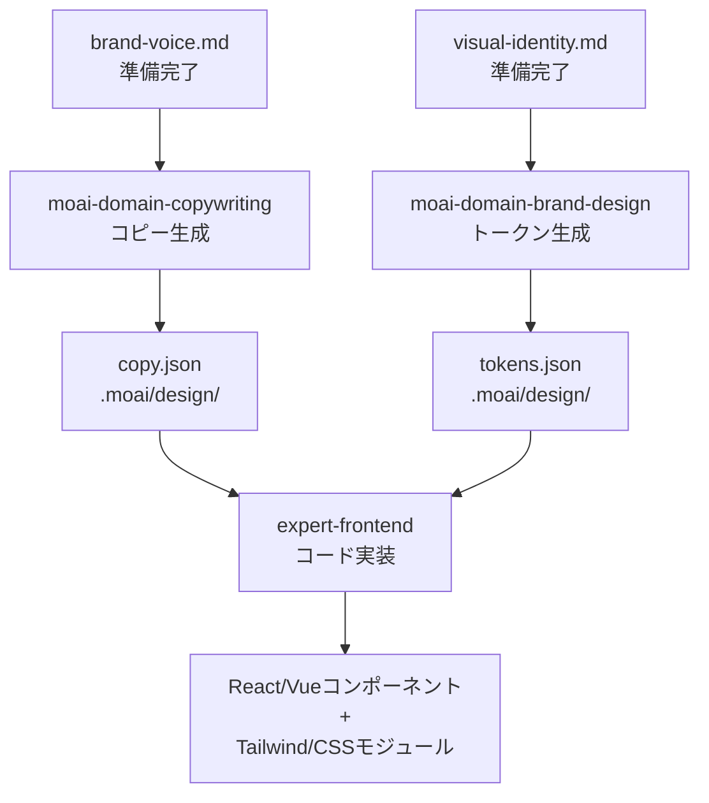

# コードベースパス

パスBは**完成したブランドコンテキスト**から設計トークンとコンポーネント仕様を**自動生成**します。

## 必須ファイル

パスBで必要な3つのファイル:

### 1. brand-voice.md

ブランドトーン、用語、メッセージングガイドライン

**用途:** `moai-domain-copywriting`スキルでhero、機能、CTA等のコピー生成

### 2. visual-identity.md

色、タイポグラフィ、ビジュアル言語

**用途:** `moai-domain-brand-design`スキルで設計トークン生成

### 3. target-audience.md

ターゲット顧客プロファイルと選好

**用途:** コピーと設計のすべての段階で利用

## スキル構成

### moai-domain-copywriting

**目的:** ブランドvoiceに沿うマーケティングコピー生成

**出力:** 構造化JSON(hero、features、CTA等のセクション別)

**Anti-AI-Slopルール:**
- 具体的な数値含む("90%削減" OK、"大幅に" NG)
- 読者を主体に("あなたが成功できる" OK)
- 能動態優先
- 抽象表現削除

### moai-domain-brand-design

**目的:** 設計トークンとコンポーネント仕様自動生成

**出力:** 設計トークンJSON + コンポーネント仕様

**WCAG AA準拠:**
- 色コントラスト比 4.5:1以上(テキスト)
- 3:1以上(グラフィック要素)
- 自動検証

## ワークフロー



## パスB実行

### ステップ1: ブランドファイル確認

```bash
ls -la .moai/project/brand/
# brand-voice.md       ✓
# visual-identity.md   ✓
# target-audience.md   ✓
```

### ステップ2: /moai design実行

```
/moai design
```

### ステップ3: パスB選択

```
パスを選択してください:

1. (推奨) Claude Design利用...
2. コードベース設計(Copywriting + Design Tokens)
   → 追加サブスクリプション不要

選択: 2
```

### ステップ4: 自動生成

`moai-domain-copywriting` → `moai-domain-brand-design`実行

**生成ファイル:**
- `.moai/design/copy.json` — ページ別コピー
- `.moai/design/tokens.json` — 設計トークン
- `.moai/design/components.json` — コンポーネント仕様

### ステップ5: GAN Loop進入

`expert-frontend`エージェント:
1. トークンとコピー受け取り
2. React/Vueコンポーネント + スタイル生成
3. `evaluator-active`評価(4次元スコアリング)
4. 不合格時は修正反復(最大5回)

## ブランドファイル修正

設計中に調整が必要な場合:

```bash
# 既存ファイル修正
vim .moai/project/brand/visual-identity.md

# 再実行(既存ファイル上書き)
/moai design
```

## 次のステップ

- [GAN Loop](./gan-loop.md) — Builder-Evaluator反復プロセス
- [Sprint Contractプロトコル](./gan-loop.md#sprint-contractプロトコル) — 各反復周期の受け入れ基準
- [4次元スコアリング](./gan-loop.md#4次元スコアリング) — 評価基準詳細
