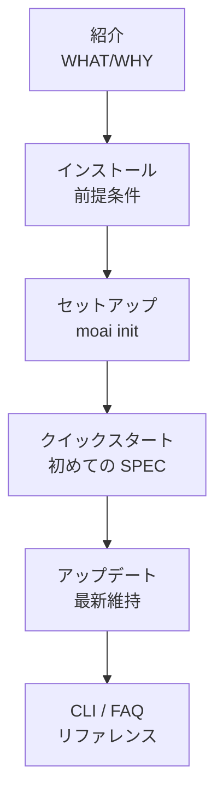

MoAI-ADK へようこそ。**紹介 → インストール → クイックスタート** の順に読み進めれば、30 分以内に最初の MoAI-ADK プロジェクトを実行できます。


すでにインストール済みの場合は [クイックスタート](./quickstart) へ。CLI フラグを探している場合は [CLI リファレンス](./cli) を、問題が発生した場合は [FAQ](./faq) を参照してください。


## 学習の流れ

## 推奨される読む順序

| 順序 | ドキュメント | 学べること |
|------|--------------|-----------|
| 1 | [紹介](./introduction) | MoAI-ADK とは何か、どんな問題を解決するのか |
| 2 | [インストール](./installation) | macOS/Linux へのインストールと前提条件確認 |
| 3 | [セットアップウィザード](./init-wizard) | `moai init` でプロジェクトを構成 |
| 4 | [クイックスタート](./quickstart) | 最初の SPEC を作成し `/moai plan → run → sync` を実行 |
| 5 | [アップデート](./update) | テンプレートとバイナリを最新に保つ |
| 6 | [CLI リファレンス](./cli) | `moai` サブコマンドの完全索引 |
| 7 | [よくある質問](./faq) | インストール・実行時に遭遇する一般的な問題 |


**次のステップ**: インストールが完了したら、[コア概念](/ja/core-concepts/) で SPEC ベース開発、DDD、TRUST 5 品質フレームワークを学びましょう。

