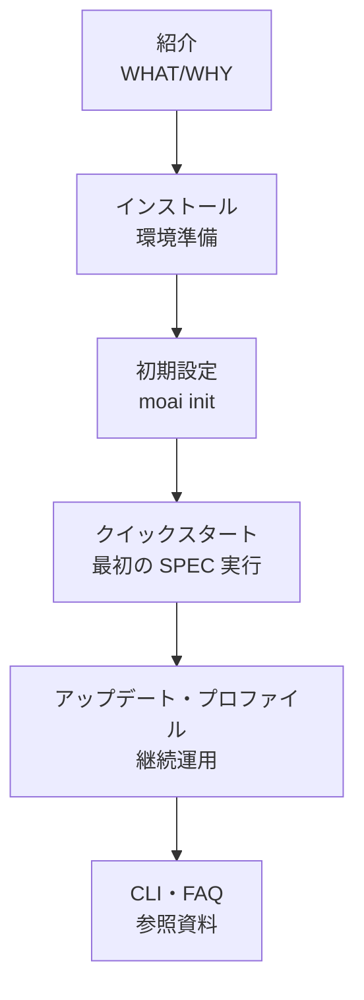

MoAI-ADK に初めて触れる方のためのオンボーディング経路です。**紹介 → インストール → クイックスタート** の順に読めば、30分以内に最初の MoAI-ADK プロジェクトを実行できます。インストールは単一バイナリを1つ取得するだけで、最初の SPEC 実行まで別途ランタイムや依存関係は必要ありません。


すでにインストールが完了している場合は [クイックスタート](./quickstart) へ直接進んでください。CLI フラグを知りたい場合は [CLI リファレンス](./cli) を、問題がある場合は [よくある質問](./faq) を確認してください。


## 学習フロー

```mermaid
flowchart TD
    A["紹介<br>WHAT/WHY"] --> B["インストール<br>環境準備"]
    B --> C["初期設定<br>moai init"]
    C --> D["クイックスタート<br>最初の SPEC 実行"]
    D --> E["アップデート・プロファイル<br>継続運用"]
    E --> F["CLI・FAQ<br>参照資料"]
```

## 推奨の読み順

| 順序 | ドキュメント | 主な内容 |
|------|------|----------|
| 1 | [紹介](./introduction) | MoAI-ADK とは何か、どんな問題を解決するのか |
| 2 | [インストール](./installation) | macOS/Linux でのインストールと前提条件 |
| 3 | [Windows 利用ガイド](./windows-guide) | Windows 環境の特殊な考慮事項 |
| 4 | [初期設定](./init-wizard) | `moai init` インタラクティブウィザードでプロジェクトを構成 |
| 5 | [クイックスタート](./quickstart) | 最初の SPEC を作成し `/moai plan → run → sync` を実行 |
| 6 | [アップデート](./update) | テンプレートを最新バージョンに保つ |
| 7 | [プロファイル管理](./profile) | ユーザープロファイル・環境変数・設定の同期 |
| 8 | [CLI リファレンス](./cli) | `moai` バイナリの全サブコマンド索引 |
| 9 | [よくある質問](./faq) | インストール・実行時によくある問題と解決法 |


**次のステップ**: インストールが完了したら、[コア概念](/ja/core-concepts/) で v3.0 の三本柱 — トークノミクス · エージェンティックループエンジニアリング · エージェンティックハーネス — と、SPEC・DDD・TRUST 5 など MoAI-ADK の設計哲学を学べます。

