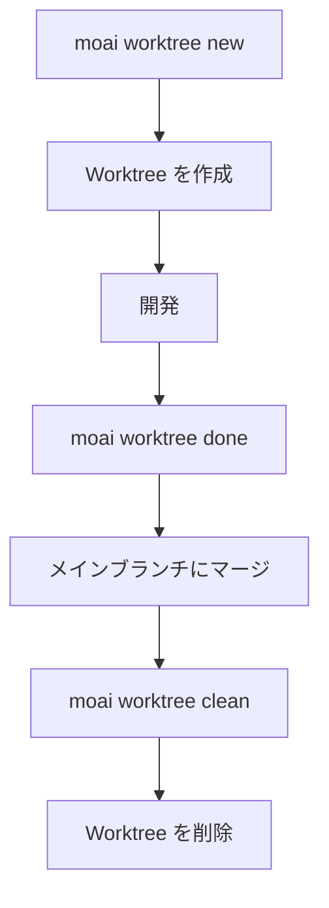

MoAI-ADK コマンドラインインターフェースのすべてのコマンドとオプションを参照します。

## コマンド一覧

```bash
moai --help
```

**出力例:**

```
MoAI-ADK - Agentic Development Kit for Claude Code

Usage:
  moai [command]

Available Commands:
  init        Interactive project setup (auto-detects language/framework/methodology)
  doctor      System health diagnosis and environment verification
  status      Project status summary including Git branch, quality metrics, etc.
  update      Update to the latest version (with automatic rollback support)
  worktree    Manage Git worktrees for parallel SPEC development
  hook        Claude Code hook dispatcher
  profile     Manage Claude Code configuration profiles
  glm         Switch to GLM backend (cost-effective) or update API key
  claude      Switch to Claude backend (Anthropic API)
  version     Display version, commit hash, and build date

Flags:
  -h, --help      help for moai
  -v, --version   version for moai
```

| コマンド | 説明 |
|---------|-------------|
| `moai init` | プロジェクトを初期化 (言語/フレームワーク/メソドロジー自動検出) |
| `moai doctor` | システム診断および環境検証 |
| `moai status` | プロジェクトステータス概要 (Git ブランチ、品質メトリクスなど) |
| `moai inventory` | 読み取り専用統合インベントリ (アクティブセッション、worktree、ハーネス) (`--json` で構造化出力) |
| `moai update` | 最新バージョンに更新 (自動ロールバックサポート) |
| `moai worktree` | Git worktree を管理 (並列 SPEC 開発) |
| `moai hook` | Claude Code フックディスパッチャー |
| `moai profile` | プロファイルを管理 (list, setup, current, delete) |
| `moai glm` | GLM バックエンドに切り替え (`--team`: GLM Worker モード) |
| `moai claude`, `moai cc` | Claude バックエンドに切り替え |
| `moai cg` | CG モードを有効化 — Claude リーダー + GLM チームメイト (tmux 必須) |
| `moai version` | バージョン、コミットハッシュ、ビルド日付を表示 |

---

## moai init

プロジェクトを初期化します。

```bash
moai init [PATH] [OPTIONS]
```

### オプション

| オプション | 説明 |
|--------|-------------|
| `-y, --non-interactive` | 非対話モード (デフォルトを使用) |
| `--mode [personal\|team]` | プロジェクトモード |
| `--locale [ko\|en\|ja\|zh]` | 優先言語 (デフォルト: en) |
| `--language TEXT` | プログラミング言語 (指定すると自動検出) |
| `--force` | 確認なしで強制再初期化 |

### 例

```bash
# 新しいプロジェクトを初期化
moai init my-project

# 韓国語、チームモード
moai init my-project --locale ko --mode team

# Python プロジェクト
moai init --language python
```

---

## moai update

MoAI-ADK を最新バージョンに更新します。

```bash
moai update [OPTIONS]
```

### オプション

| オプション | 説明 |
|--------|-------------|
| `--path PATH` | プロジェクトパス (デフォルト: 現在のディレクトリ) |
| `--force` | バックアップなしで強制更新 |
| `--check` | バージョンのみ確認 (更新なし) |
| `--project` | プロジェクトテンプレートのみ同期 |
| `--templates-only` | テンプレートのみ同期 (パッケージアップグレードをスキップ) |
| `--yes` | 自動確認 (CI/CD モード) |
| `-c, --config` | プロジェクト設定を編集 (初期セットアップウィザードと同じ) |
| `--merge` | 自動マージ (ユーザー変更を保持) |
| `--manual` | 手動マージ (ガイドを作成) |

### 例

```bash
# 更新を確認
moai update --check

# 強制更新
moai update --force

# 自動マージ
moai update --merge
```


**重要:** `--force` オプションはバックアップを作成しません。ユーザー変更が失われる可能性があります。


---

## moai doctor

システム診断を実行します。

```bash
moai doctor [OPTIONS]
```

### オプション

| オプション | 説明 |
|--------|-------------|
| `-v, --verbose` | 詳細なツールバージョンと言語検出を表示 |
| `--fix` | 欠落しているツールの修正を提案 |
| `--export PATH` | JSON ファイルにエクスポート |
| `--check TEXT` | 特定のツールのみ確認 |
| `--check-commands` | スラッシュコマンドの読み込み問題を診断 |
| `--shell` | シェルと PATH 設定を診断 (WSL/Linux) |

### 例

```bash
# 完全な診断
moai doctor

# 詳細な診断
moai doctor --verbose

# 修正を提案
moai doctor --fix
```

---

## moai profile

プロファイルを管理します。プロファイルは独立した Claude Code 構成環境を提供します。

### プロファイル サブコマンド

| コマンド | 説明 |
|--------|------|
| `moai profile list` | 使用可能なすべてのプロファイルを一覧表示 |
| `moai profile setup` | インタラクティブウィザードで新しいプロファイルを作成 |
| `moai profile current` | 現在アクティブなプロファイルの情報を表示 |
| `moai profile delete <name>` | 指定されたプロファイルを削除 |

### moai profile list

```bash
moai profile list
```

使用可能なすべてのプロファイルと現在アクティブなプロファイルを表示します。

### moai profile setup

```bash
moai profile setup
```

インタラクティブウィザードが新しいプロファイルを作成します:

1. **プロファイル名**: 一意の識別子 (例: `work`、`personal`)
2. **ユーザー名**: Claude Code がユーザーを指す名前
3. **言語設定**:
   - 対話言語 (conversation_language)
   - Git コミット言語 (git_commit_lang)
   - コードコメント言語 (code_comment_lang)
   - ドキュメント言語 (doc_lang)
4. **モデル設定**:
   - モデルポリシー (model_policy): high, medium, low
   - デフォルトモデル (model): inherit, opus, sonnet, haiku, 1M コンテキストモデル
5. **実行設定**:
   - 権限モード (permission_mode): default, acceptEdits
6. **表示設定**:
   - ステータスバーモード (statusline_mode): off, basic, full
   - ステータスバーテーマ (statusline_theme): auto, light, dark, monokai, nord, dracula
   - チームメイト表示 (teammate_display): auto, in-process, tmux

### moai profile current

```bash
moai profile current
```

現在アクティブなプロファイルの情報を表示します。

### moai profile delete

```bash
moai profile delete <name>
```

指定されたプロファイルと対応するディレクトリを削除します。

### プロファイル実行

プロファイルを使用して MoAI コマンドを実行するには、`-p` フラグを使用します:

```bash
# Claude モードで特定のプロファイルを使用
moai cc -p work

# GLM モードで特定のプロファイルを使用
moai glm -p personal

# CG モードで特定のプロファイルを使用
moai cg -p team-project
```

プロファイルの Claude Code 設定がそのセッションに適用されます。

### Profile vs MoAI Worktree

| 機能 | プロファイル | Worktree |
|------|----------|---------|
| **目的** | Claude Code 構成の分離 | プロジェクトファイルの分離 |
| **パス** | `~/.moai/claude-profiles/<name>/` | `~/.moai/worktrees/<project>/<spec>/` |
| **用途** | 異なる環境設定の管理 | SPEC 開発用ワークスペース |

---

## moai glm

GLM バックエンドに切り替えるか、API キーを更新します。

```bash
moai glm [OPTIONS] [API_KEY]
```

### オプション

| オプション | 説明 |
|--------|-------------|
| `--team` | GLM Worker モードを開始 (Opus リーダー + GLM-5 チームメンバー) |
| `--help` | ヘルプを表示 |

### 使用方法

```bash
# GLM バックエンドに切り替え
moai glm

# API キーを更新
moai glm <api-key>

# GLM Worker モードを開始 (コスト効率の良いチーム開発)
moai glm --team

# z.ai から API キーを取得
# https://z.ai/subscribe?ic=1NDV03BGWU
```

### プロファイルベースログイン (v2.7.0+)

`moai glm`、`moai cc`、`moai cg` は永続プロファイルをサポートするログインコマンドになりました。プロファイルは `~/.moai/claude-profiles/` に保存されます。

- 初回実行時にインタラクティブなプロファイル設定ウィザードを提供
- プロファイルはセッション間で永続化
- `moai glm` から `moai cg` への切り替え時に GLM 設定を自動リセット

### GLM Worker モード

`--team` オプションを使用すると、コスト効率の良い GLM Worker モードが開始されます:

- **構成**: Opus モデルのリーダーエージェント + GLM-5 モデルのチームメンバーエージェント
- **利点**: Claude と比べて 70% のコスト削減、同等のパフォーマンス
- **用途**: 大規模なチームベース開発時のトークンコスト最適化

---

## moai claude

Claude バックエンド (Anthropic API) に切り替えます。

```bash
$ moai claude [OPTIONS]
# または省略形
$ moai cc [OPTIONS]
```

### オプション

| オプション | 説明 |
|-----------|------|
| `-p, --profile TEXT` | 使用するプロフィール名 |

### 使用方法

```bash
# Claude バックエンド切り替え
moai cc

# プロフィール指定実行
moai cc -p work
```

---

## moai cg

CG モード (Claude + GLM ハイブリッド) を有効にします。リーダーは Claude API を、チームメイトは GLM API を使用し、tmux セッションレベルの環境変数分離で実装されています。

```bash
moai cg [OPTIONS]
```

### オプション

| オプション | 説明 |
|-----------|------|
| `-p, --profile TEXT` | 使用するプロフィール名 |


**v2.7.1 の変更**: CG モードが**デフォルト**のチームモードになりました。`--team` 使用時、設定変更なしで CG モードで実行されます。


### 動作原理

1. GLM 設定を tmux セッション環境に注入
2. settings から GLM 環境を削除 — リーダーペインは Claude API を使用
3. `CLAUDE_CODE_TEAMMATE_DISPLAY=tmux` を設定 — チームメイトは新しいペインで GLM 環境を継承

### 使用方法

```bash
# 1. GLM API キーを保存 (初回のみ)
moai glm sk-your-glm-api-key

# 2. CG モードを有効化 (tmux 内で実行)
moai cg

# 3. 同じペインで Claude Code を開始
claude

# 4. チームワークフローを実行
/moai --team "タスクの説明"
```

### 注意事項

| 項目 | 説明 |
|------|------|
| **tmux 必須** | tmux セッション内で実行する必要があります。VS Code ターミナルのデフォルトを tmux に設定すると便利です。 |
| **リーダー開始位置** | `moai cg` を実行した**同じペイン**で Claude Code を開始する必要があります。 |
| **セッション終了** | session_end フックが自動的に tmux セッション環境をクリアします。 |

### モード比較

| コマンド | リーダー | ワーカー | tmux 必須 | コスト削減 | 用途 |
|----------|----------|----------|-----------|------------|------|
| `moai cc` | Claude | Claude | 不要 | - | 最高品質 |
| `moai glm` | GLM | GLM | 推奨 | ~70% | コスト最適化 |
| `moai cg` | Claude | GLM | **必須** | **~60%** | 品質 + コストバランス |

### ディスプレイモード

| モード | 説明 | 通信 | リーダー/ワーカー分離 |
|--------|------|------|------------------------|
| `in-process` | デフォルトモード | SendMessage | 同じ環境 |
| `tmux` | 分割ペイン表示 | SendMessage | セッション環境分離 |


**注意:** CG モードは `tmux` ディスプレイモードでのみリーダー/ワーカー API 分離をサポートします。


---

## moai status

プロジェクトステータスを確認します。

```bash
moai status
```

**出力例:**

```
╭────── Project Status ──────╮
│   Mode          personal   │
│   Locale        unknown    │
│   SPECs         1          │
│   Branch        main       │
│   Git Status    Modified   │
╰────────────────────────────╯
```

**出力情報:**
- **Mode**: 作業モード (personal、team、manual)
- **Locale**: 言語設定
- **SPECs**: アクティブな SPEC の数
- **Branch**: 現在のブランチ
- **Git Status**: Git ステータス (Clean、Modified)

---

## moai inventory

アクティブなセッション、worktree、ハーネスを統合管理する読み取り専用インベントリを照会します。

```bash
moai inventory [OPTIONS]
```

### オプション

| オプション | 説明 |
|--------|-------------|
| `--json` | 構造化 JSON 形式で出力 |

### 使用方法

```bash
# 基本的なインベントリを表示
moai inventory

# JSON 形式で照会 (プログラミング使用)
moai inventory --json
```

**出力情報:**
- **アクティブセッション**: 現在実行中の Claude Code セッション
- **Worktree**: 並列開発用のアクティブな Git worktree リスト
- **ハーネス**: 登録された開発ハーネスリスト

詳細については、[インベントリ管理](./inventory) ページを参照してください。

---

## moai worktree

並列 SPEC 開発のための Git worktree を管理します。

```bash
moai worktree [OPTIONS] COMMAND [ARGS]...
```

### サブコマンド

| コマンド | 説明 |
|---------|-------------|
| `moai worktree new` | 新しい worktree を作成 |
| `moai worktree list` | アクティブな worktree を一覧表示 |
| `moai worktree switch` | worktree に切り替え |
| `moai worktree go` | worktree ディレクトリに移動 |
| `moai worktree sync` | アップストリームと同期 |
| `moai worktree remove` | worktree を削除 |
| `moai worktree clean` | 古い worktree をクリーンアップ |
| `moai worktree recover` | 既存のディレクトリから復元 |

### moai worktree new

新しい worktree を作成します。

```bash
moai worktree new [OPTIONS] SPEC_ID
```

#### オプション

| オプション | 説明 |
|--------|-------------|
| `-b, --branch TEXT` | ユーザーブランチ名 |
| `--base TEXT` | ベースブランチ (デフォルト: main) |
| `--repo PATH` | リポジトリパス |
| `--worktree-root PATH` | worktree ルートパス |
| `-f, --force` | 存在していても強制作成 |
| `--glm` | GLM LLM 設定を使用 |
| `--llm-config PATH` | ユーザー LLM 設定ファイルパス |

#### 例

```bash
# SPEC-001 の worktree を作成
moai worktree new SPEC-001

# ユーザーブランチを指定
moai worktree new SPEC-001 --branch feature-auth

# ベースブランチを変更
moai worktree new SPEC-001 --base develop
```

### moai worktree list

アクティブな worktree を一覧表示します。

```bash
moai worktree list [OPTIONS]
```

#### オプション

| オプション | 説明 |
|--------|-------------|
| `--format [table\|json]` | 出力形式 |
| `--repo PATH` | リポジトリパス |
| `--worktree-root PATH` | worktree ルートパス |

### moai worktree remove

worktree を削除します。

```bash
moai worktree remove [OPTIONS] SPEC_ID
```

#### オプション

| オプション | 説明 |
|--------|-------------|
| `-f, --force` | コミットされていない変更を強制削除 |
| `--repo PATH` | リポジトリパス |
| `--worktree-root PATH` | worktree ルートパス |

### worktree ワークフロー



---

## moai hook

MoAI-ADK イベント用の Claude Code フックディスパッチャー。

```bash
moai hook <event>
```

### サポートされるイベント (16)

| イベント | 説明 |
|-------|-------------|
| `PreToolUse` | ツール実行前 |
| `PostToolUse` | ツール実行後 |
| `Notification` | システム通知 |
| `Stop` | セッション終了 |
| `SubagentStop` | サブエージェント終了 |
| `UserPromptSubmit` | ユーザープロンプト送信 |
| `PreCompact` | コンテキスト圧縮前 |
| `PostCompact` | コンテキスト圧縮後 |
| `PermissionRequest` | 権限リクエスト |
| `PostToolFailure` | ツール実行失敗後 |
| `SubagentStart` | サブエージェント開始 |
| `TeammateIdle` | チームメイトアイドル状態 |
| `TaskCompleted` | タスク完了 |
| `WorktreeCreate` | ワークツリー作成 |
| `WorktreeRemove` | ワークツリー削除 |
| `model` | モデル選択 |

### 例

```bash
# PreToolUse フックを実行
moai hook PreToolUse

# PostToolUse フックを実行
moai hook PostToolUse

# ユーザープロンプト送信フック
moai hook UserPromptSubmit
```

---

## Statusline v3

MoAI Statusline v3 は Claude Code ステータスバーにリアルタイム API 使用量を表示します。

### v3 の新機能

| 機能 | 説明 |
|------|------|
| **RGB グラデーション色** | 使用量比率に応じたスムーズな色変化 |
| **5H/7D API 使用量** | 5 時間/7 日の累積使用量を表示 |
| **rate_limits フィールドパース** | Claude API レスポンスの正確な制限情報 |

### 色グラデーション

使用量比率に応じて色がスムーズに変わります:

- **0-30%**: 緑 → 黄色 (安全)
- **31-70%**: 黄色 → オレンジ (注意)
- **71-100%**: オレンジ → 赤 (限界近い)

### API 使用量表示

```
5H: 45K/200K (22%) | 7D: 180K/500K (36%)
```

- **5H**: 最近 5 時間の使用量
- **7D**: 最近 7 日の使用量
- **比率**: 現在の割り当て対比で使用中の比率

### 設定方法

プロファイル設定ウィザード (`moai profile setup`) で次のオプションを選択します:

1. **statusline_mode**: `off`, `basic`, `full`
2. **statusline_theme**: `auto`, `light`, `dark`, `monokai`, `nord`, `dracula`

### 使用方法

```bash
# プロファイル作成時に Statusline を設定
moai profile setup
# → statusline_mode: full を選択
# → statusline_theme: auto を選択

# プロファイルと共に実行
moai cc -p my-profile
```

---

## タスクメトリクスロギング

MoAI-ADK は開発セッション中に Task ツールメトリクスを自動的にキャプチャします。

### ログファイル

- **場所**: `.moai/logs/task-metrics.jsonl`
- **形式**: JSONL (JSON Lines)

### キャプチャメトリクス

| メトリクス | 説明 |
|--------|-------------|
| トークン使用量 | 入力/出力トークン数 |
| ツール呼び出し | 使用されたツールのリストと呼び出し回数 |
| 所要時間 | タスク実行時間 |
| エージェントタイプ | 実行されたエージェントの種類 |

### 活用方法

- セッション分析とパフォーマンス最適化
- エージェント効率の分析
- トークン消費の追跡とコスト管理

Task ツール完了時に PostToolUse フックがメトリクスを自動的にロギングします。

---

## モデルポリシー設定

MoAI-ADK は Claude Code サブスクリプションプランに基づいてエージェントに最適な AI モデルを割り当てます。

### ポリシーティア

| ポリシー | プラン | 🟣 Opus | 🔵 Sonnet | 🟡 Haiku |
|----------|--------|---------|-----------|----------|
| **High** | Max $200/月 | 16 | 5 | 3 |
| **Medium** | Max $100/月 | 3 | 17 | 4 |
| **Low** | Plus $20/月 | 0 | 13 | 11 |

### 設定方法

```bash
# プロジェクト初期化時 (対話型ウィザード)
moai init my-project

# 既存プロジェクトの再設定
moai update -c

# 手動設定 (.moai/config/sections/user.yaml)
# model_policy: high | medium | low
```

> **注意**: デフォルトポリシーは `High` です。`moai update` 実行後、`moai update -c` で設定を構成してください。

### 1M コンテキストモデル

プロフィール設定時に**デフォルトモデル**を選択する場合、1M コンテキストモデルを選択できます:

- `claude-opus-4-6 1M context`
- `claude-sonnet-4-6 1M context`

これらのモデルは、大規模コードベースの分析や長いドキュメント作業に最適です。

---

## 環境変数

| 変数 | 説明 |
|----------|-------------|
| `MOAI_API_KEY` | API キー (Claude/GLM) |
| `MOAI_MODE` | 実行モード (development/production) |
| `MOAI_LOCALE` | 言語設定 (ko/en/ja/zh) |
| `MOAI_WORKTREE_ROOT` | worktree ルートパス |

---

## 関連項目

- [クイックスタート](./quickstart)
- [インストール](./installation)
- [アップデート](./update)
