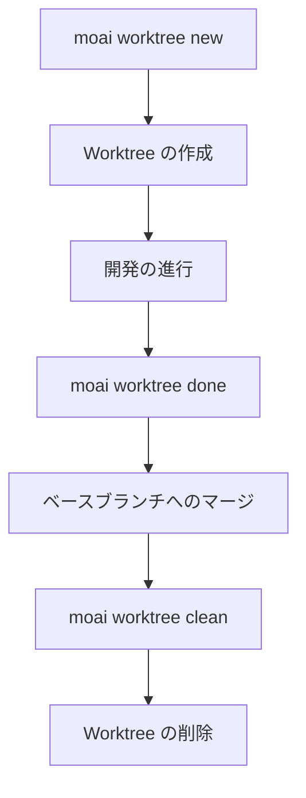

MoAI-ADK コマンドラインインターフェースのすべてのコマンドとオプションを参照してください。ターミナルの `moai` (Go バイナリ) と Claude Code チャットの `/moai` (スラッシュサブコマンド) は別のツールです — このドキュメントはターミナル CLI を扱います。

## コマンド一覧

```bash
moai --help
```

**出力例:**

```
MoAI-ADK - Agentic Development Kit for Claude Code

Usage:
  moai [command]

Available Commands:
  init        Interactive project setup (auto-detects language/framework/methodology)
  doctor      System health diagnosis and environment verification
  status      Project status summary including Git branch, quality metrics, etc.
  update      Update to the latest version (with automatic rollback support)
  worktree    Manage Git worktrees for parallel SPEC development
  hook        Claude Code hook dispatcher
  profile     Manage Claude Code configuration profiles
  glm         Switch to GLM backend (cost-effective) or update API key
  claude      Switch to Claude backend (Anthropic API)
  version     Display version, commit hash, and build date

Flags:
  -h, --help      help for moai
  -v, --version   version for moai
```

| コマンド | 説明 |
|--------|------|
| `moai init` | プロジェクトの初期化 (言語/フレームワーク/方法論の自動検出) |
| `moai doctor` | システム診断と環境検証 |
| `moai status` | プロジェクト状態の要約 (Git ブランチ、品質メトリクスなど) |
| `moai inventory` | アクティブセッション、worktree、ハーネスの統合インベントリの読み取り専用一覧 (add `--json` for structured output) |
| `moai update` | 最新バージョンへのアップデート (自動ロールバック対応) |
| `moai worktree` | Git worktree の管理 (並列 SPEC 開発) |
| `moai hook` | Claude Code フックディスパッチャー |
| `moai profile` | Profile の管理 (list, setup, current, delete) |
| `moai glm` | GLM バックエンドへの切り替え (`--team`: GLM Worker モード) |
| `moai claude`, `moai cc` | Claude バックエンドへの切り替え |
| `moai cg` | CG モードの有効化 — Claude リーダー + GLM チームメイト (tmux 必須) |
| `moai version` | バージョン、コミットハッシュ、ビルド日の表示 |

---

## moai init

プロジェクトを初期化します。

```bash
moai init [PATH] [OPTIONS]
```

### オプション

| オプション | 説明 |
|------|------|
| `-y, --non-interactive` | 非対話モード (既定値を使用) |
| `--mode [personal\|team]` | プロジェクトモード |
| `--locale [ko\|en\|ja\|zh]` | 希望する言語 (既定値: en) |
| `--language TEXT` | プログラミング言語 (未指定時は自動検出) |
| `--force` | 確認なしで強制的に再初期化 |

### 例

```bash
# 新規プロジェクトの初期化
moai init my-project

# 日本語、チームモード
moai init my-project --locale ja --mode team

# Python プロジェクト
moai init --language python
```

---

## moai update

MoAI-ADK を最新バージョンにアップデートします。

```bash
moai update [OPTIONS]
```

### オプション

| オプション | 説明 |
|------|------|
| `--path PATH` | プロジェクトのパス (既定値: 現在のディレクトリ) |
| `--force` | バックアップなしで強制アップデート |
| `--check` | バージョン確認のみ (アップデートしない) |
| `--project` | プロジェクトテンプレートのみ同期 |
| `--templates-only` | テンプレートのみ同期 (パッケージのアップグレードをスキップ) |
| `--yes` | 自動確認 (CI/CD モード) |
| `-c, --config` | プロジェクト設定の編集 (初期設定ウィザードと同じ) |
| `--merge` | 自動マージ (ユーザーの変更を保存) |
| `--manual` | 手動マージ (ガイドの生成) |

### 例

```bash
# アップデートの確認
moai update --check

# 強制アップデート
moai update --force

# 自動マージ
moai update --merge
```


**重要:** `--force` オプションはバックアップを作成しません。ユーザーの変更が失われる可能性があります。


---

## moai doctor

システム診断を実行します。

```bash
moai doctor [OPTIONS]
```

### オプション

| オプション | 説明 |
|------|------|
| `-v, --verbose` | 詳細なツールバージョンと言語検出の表示 |
| `--fix` | 不足ツールの修正提案 |
| `--export PATH` | JSON ファイルへのエクスポート |
| `--check TEXT` | 特定のツールのみ確認 |
| `--check-commands` | スラッシュコマンドのロード問題を診断 |
| `--shell` | シェルと PATH 構成の診断 (WSL/Linux) |

### 例

```bash
# フル診断
moai doctor

# 詳細診断
moai doctor --verbose

# 修正提案
moai doctor --fix
```

---

## moai profile

Profile を管理します。Profile は独立した Claude Code 構成環境を提供します。

### Profile サブコマンド

| コマンド | 説明 |
|--------|------|
| `moai profile list` | 利用可能なすべての Profile の一覧表示 |
| `moai profile setup` | 対話型ウィザードで新しい Profile を作成 |
| `moai profile current` | 現在アクティブな Profile 情報の表示 |
| `moai profile delete <name>` | 指定した Profile の削除 |

### moai profile list

```bash
moai profile list
```

利用可能なすべての Profile と、現在アクティブな Profile を表示します。

### moai profile setup

```bash
moai profile setup
```

対話型ウィザードが新しい Profile を作成します:

1. **Profile 名**: 一意の識別子 (例: `work`, `personal`)
2. **ユーザー名**: Claude Code がユーザーを呼ぶ名前
3. **言語設定**:
   - 会話言語 (conversation_language)
   - Git コミット言語 (git_commit_lang)
   - コードコメント言語 (code_comment_lang)
   - ドキュメント言語 (doc_lang)
4. **モデル設定**:
   - モデルポリシー (model_policy): high, medium, low
   - 既定モデル (model): inherit, opus, sonnet, haiku, 1M context モデル
5. **実行設定**:
   - 権限モード (permission_mode): default, acceptEdits
6. **表示設定**:
   - ステータスラインモード (statusline_mode): off, basic, full
   - ステータスラインテーマ (statusline_theme): auto, light, dark, monokai, nord, dracula
   - チームメイト表示 (teammate_display): auto, in-process, tmux

### moai profile current

```bash
moai profile current
```

現在アクティブな Profile の情報を表示します。

### moai profile delete

```bash
moai profile delete <name>
```

指定した Profile とそのディレクトリを削除します。

### Profile での実行

Profile を使って MoAI コマンドを実行するには `-p` フラグを使います:

```bash
# Claude モードで特定の Profile を使用
moai cc -p work

# GLM モードで特定の Profile を使用
moai glm -p personal

# CG モードで特定の Profile を使用
moai cg -p team-project
```

Profile の Claude Code 設定がそのセッションに適用されます。

### Profile vs MoAI Worktree

| 機能 | Profile | Worktree |
|------|---------|----------|
| **目的** | Claude Code 構成の分離 | プロジェクトファイルの分離 |
| **パス** | `~/.moai/claude-profiles/<name>/` | `~/.moai/worktrees/<project>/<spec>/` |
| **用途** | 異なる環境設定の管理 | SPEC 開発用のワークスペース |

---

## moai glm

GLM バックエンドに切り替えるか、API キーを更新します。

```bash
moai glm [OPTIONS] [API_KEY]
```

### オプション

| オプション | 説明 |
|------|------|
| `-p, --profile TEXT` | 使用する Profile 名 |
| `--team` | GLM Worker モードの開始 (Opus リーダー + GLM-5 チームメイト) |
| `--help` | ヘルプの表示 |

### 使い方

```bash
# GLM バックエンドへの切り替え
moai glm

# API キーの更新
moai glm <api-key>

# Profile を指定して実行
moai glm -p work

# GLM Worker モードの開始 (コスト効率の良いチーム開発)
moai glm --team

# z.ai で API キーを発行
# https://z.ai/subscribe?ic=1NDV03BGWU
```

### GLM Worker モード

`--team` オプションを使うと、コスト効率の良い GLM Worker モードが開始されます:

- **構成**: Opus モデルのリーダーエージェント + GLM-5 モデルのチームメイトエージェント
- **利点**: Claude 比 70% のコスト削減、同等の性能
- **用途**: 大規模なチームベース開発でのトークンコスト最適化

### Profile ベースの設定 (v2.7.0+)

`moai glm`、`moai cc`、`moai cg` は、永続的な Profile をサポートするログインコマンドになりました。Profile は `~/.moai/claude-profiles/` に保存されます。

- 初回実行時に対話型の Profile 設定ウィザードを提供
- Profile はセッション間で維持される
- `moai glm` から `moai cg` への切り替え時に GLM 設定を自動初期化

---

## moai claude

Claude バックエンド (Anthropic API) に切り替えます。

```bash
$ moai claude [OPTIONS]
# または短縮形
$ moai cc [OPTIONS]
```

### オプション

| オプション | 説明 |
|------|------|
| `-p, --profile TEXT` | 使用する Profile 名 |

### 使い方

```bash
# Claude バックエンドへの切り替え
moai cc

# Profile を指定して実行
moai cc -p work
```

---

## moai cg

CG モード (Claude + GLM ハイブリッド) を有効化します。リーダーは Claude API を、チームメイトは GLM API を使い、tmux セッションレベルの環境変数分離で実装されています。

```bash
moai cg [OPTIONS]
```

### オプション

| オプション | 説明 |
|------|------|
| `-p, --profile TEXT` | 使用する Profile 名 |

### 動作方式

1. GLM 設定を tmux セッション環境に注入
2. settings から GLM 環境を削除 — リーダーペインは Claude API を使用
3. `CLAUDE_CODE_TEAMMATE_DISPLAY=tmux` を設定 — チームメイトは新しいペインで GLM 環境を継承

### 使い方

```bash
# 1. GLM API キーの保存 (初回のみ)
moai glm sk-your-glm-api-key

# 2. CG モードの有効化 (tmux 内で実行)
moai cg

# 3. 同じペインで Claude Code を起動
claude

# 4. チームワークフローの実行
/moai --team "作業の説明"

# Profile を指定して実行
moai cg -p team-project
```

### 注意事項

| 項目 | 説明 |
|------|------|
| **tmux 必須** | tmux セッション内で実行する必要があります。VS Code のターミナル既定を tmux にすると便利です。 |
| **リーダーの起動場所** | `moai cg` を実行した **同じペイン** で Claude Code を起動する必要があります。 |
| **セッション終了** | session_end フックが自動的に tmux セッション環境を片付けます。 |

### モード比較

| コマンド | リーダー | ワーカー | tmux 必須 | コスト削減 | 用途 |
|--------|------|------|-----------|-----------|------|
| `moai cc` | Claude | Claude | いいえ | - | 最高品質 |
| `moai glm` | GLM | GLM | 推奨 | ~70% | コスト最適化 |
| `moai cg` | Claude | GLM | **必須** | **~60%** | 品質とコストのバランス |

### 表示モード

| モード | 説明 | 通信 | リーダー/ワーカーの分離 |
|------|------|------|----------------|
| `in-process` | 既定モード | SendMessage | 同一環境 |
| `tmux` | 分割ペイン表示 | SendMessage | セッション環境の分離 |


**v2.7.1 の変更**: CG モードが **既定** のチームモードになりました。`--team` の使用時は別途設定なしで CG モードで実行されます。


---

## moai status

プロジェクトの状態を確認します。

```bash
moai status
```

**出力例:**

```
╭────── Project Status ──────╮
│   Mode          personal   │
│   Locale        unknown    │
│   SPECs         1          │
│   Branch        main       │
│   Git Status    Modified   │
╰────────────────────────────╯
```

**出力情報:**
- **Mode**: 作業モード (personal, team, manual)
- **Locale**: 言語設定
- **SPECs**: アクティブな SPEC の数
- **Branch**: 現在のブランチ
- **Git Status**: Git の状態 (Clean, Modified)

---

## moai inventory

アクティブセッション、worktree、ハーネスを統合管理する読み取り専用インベントリを照会します。

```bash
moai inventory [OPTIONS]
```

### オプション

| オプション | 説明 |
|------|------|
| `--json` | 構造化された JSON 形式で出力 |

### 使い方

```bash
# 基本インベントリの表示
moai inventory

# JSON 形式での照会 (プログラムでの活用)
moai inventory --json
```

**出力情報:**
- **アクティブセッション**: 現在実行中の Claude Code セッション
- **Worktree**: 並列開発のためのアクティブな Git worktree の一覧
- **ハーネス**: 登録された開発ハーネスの一覧

詳細は [インベントリ管理](./inventory) ページを参照してください。

---

## moai worktree

Git worktree を管理して並列 SPEC 開発を行います。

```bash
moai worktree [OPTIONS] COMMAND [ARGS]...
```

### サブコマンド

| コマンド | 説明 |
|--------|------|
| `moai worktree new` | 新しい worktree の作成 |
| `moai worktree list` | アクティブな worktree の一覧 |
| `moai worktree switch` | worktree への切り替え |
| `moai worktree go` | worktree ディレクトリへの移動 |
| `moai worktree sync` | アップストリームとの同期 |
| `moai worktree remove` | worktree の削除 |
| `moai worktree clean` | 古い worktree の整理 |
| `moai worktree recover` | 既存ディレクトリからの復旧 |

### moai worktree new

新しい worktree を作成します。

```bash
moai worktree new [OPTIONS] SPEC_ID
```

#### オプション

| オプション | 説明 |
|------|------|
| `-b, --branch TEXT` | カスタムブランチ名 |
| `--base TEXT` | ベースブランチ (既定値: main) |
| `--repo PATH` | リポジトリのパス |
| `--worktree-root PATH` | worktree のルートパス |
| `-f, --force` | 存在していても強制作成 |
| `--glm` | GLM LLM 設定を使用 |
| `--llm-config PATH` | カスタム LLM 設定ファイルのパス |

#### 例

```bash
# SPEC-001 用の worktree を作成
moai worktree new SPEC-001

# カスタムブランチを指定
moai worktree new SPEC-001 --branch feature-auth

# ベースブランチを変更
moai worktree new SPEC-001 --base develop
```

### moai worktree list

アクティブな worktree の一覧を表示します。

```bash
moai worktree list [OPTIONS]
```

#### オプション

| オプション | 説明 |
|------|------|
| `--format [table\|json]` | 出力形式 |
| `--repo PATH` | リポジトリのパス |
| `--worktree-root PATH` | worktree のルートパス |

### moai worktree remove

worktree を削除します。

```bash
moai worktree remove [OPTIONS] SPEC_ID
```

#### オプション

| オプション | 説明 |
|------|------|
| `-f, --force` | 未コミットの変更があっても強制削除 |
| `--repo PATH` | リポジトリのパス |
| `--worktree-root PATH` | worktree のルートパス |

### worktree ワークフロー


```mermaid
flowchart TD
    A[moai worktree new] --> B[Worktree の作成]
    B --> C[開発の進行]
    C --> D[moai worktree done]
    D --> E[ベースブランチへのマージ]
    E --> F[moai worktree clean]
    F --> G[Worktree の削除]
```

---

## moai hook

MoAI-ADK イベントのための Claude Code フックディスパッチャーです。

```bash
moai hook <event>
```

### サポートされるイベント (16種)

| イベント | 説明 |
|-------|------|
| `PreToolUse` | ツール実行前 |
| `PostToolUse` | ツール実行後 |
| `Notification` | システム通知 |
| `Stop` | セッション終了 |
| `SubagentStop` | サブエージェントの終了 |
| `UserPromptSubmit` | ユーザープロンプトの送信 |
| `PreCompact` | コンテキスト圧縮前 |
| `PostCompact` | コンテキスト圧縮後 |
| `PermissionRequest` | 権限リクエスト |
| `PostToolFailure` | ツール実行失敗後 |
| `SubagentStart` | サブエージェントの開始 |
| `TeammateIdle` | チームメイトのアイドル状態 |
| `TaskCompleted` | タスクの完了 |
| `WorktreeCreate` | ワークツリーの作成 |
| `WorktreeRemove` | ワークツリーの削除 |
| `model` | モデルの選択 |

### 例

```bash
# PreToolUse フックの実行
moai hook PreToolUse

# PostToolUse フックの実行
moai hook PostToolUse

# ユーザープロンプト送信フック
moai hook UserPromptSubmit
```

---

## Statusline v3

MoAI Statusline v3 は Claude Code のステータスラインにリアルタイムの API 使用量を表示します。

### v3 の新機能

| 機能 | 説明 |
|------|------|
| **RGB Gradient カラー** | 使用率に応じた滑らかな色の変化 |
| **5H/7D API 使用量** | 5時間/7日の累積使用量の表示 |
| **rate_limits フィールドのパース** | Claude API レスポンスの正確な制限情報 |

### カラーグラデーション

使用率に応じて色が滑らかに変化します:

- **0-30%**: Green → Yellow (安全)
- **31-70%**: Yellow → Orange (注意)
- **71-100%**: Orange → Red (限界に接近)

### API 使用量の表示

```
5H: 45K/200K (22%) | 7D: 180K/500K (36%)
```

- **5H**: 直近5時間の使用量
- **7D**: 直近7日の使用量
- **比率**: 現在の割り当てに対する使用率

### 設定方法

Profile 設定ウィザード (`moai profile setup`) で次のオプションを選択:

1. **statusline_mode**: `off`, `basic`, `full`
2. **statusline_theme**: `auto`, `light`, `dark`, `monokai`, `nord`, `dracula`

### 使い方

```bash
# Profile 作成時に Statusline を設定
moai profile setup
# → statusline_mode: full を選択
# → statusline_theme: auto を選択

# Profile とともに実行
moai cc -p my-profile
```

---

## Task メトリクスのロギング

MoAI-ADK は開発セッション中に Task ツールのメトリクスを自動的にキャプチャします。

### ログファイル

- **場所**: `.moai/logs/task-metrics.jsonl`
- **形式**: JSONL (JSON Lines)

### キャプチャされるメトリクス

| メトリクス | 説明 |
|--------|------|
| トークン使用量 | 入力/出力トークン数 |
| ツール呼び出し | 使用されたツールの一覧と呼び出し回数 |
| 所要時間 | タスクの実行時間 |
| エージェントタイプ | 実行されたエージェントの種類 |

### 活用

- セッション分析と性能最適化
- エージェント効率の分析
- トークン消費の追跡とコスト管理

Task ツールの完了時に、PostToolUse フックがメトリクスを自動的に記録します。

---

## モデルポリシーの設定

MoAI-ADK は Claude Code のサブスクリプションプランに合わせて、エージェントに最適な AI モデルを割り当てます — トークノミクスの出発点です。計画・監査のような推論の重いフェーズには上位モデルを、反復作業には軽量モデルを割り当てます。

### ポリシーティア

| ポリシー | プラン | 特徴 |
|------|--------|------|
| **High** | Max $200/月 | 最高品質 — 計画・監査に Opus を割り当て、最大スループット |
| **Medium** | Max $100/月 | 品質とコストのバランス |
| **Low** | Plus $20/月 | 経済的、Opus 非搭載 — Sonnet 中心の配分 |

### 設定方法

```bash
# プロジェクト初期化時 (対話型ウィザード)
moai init my-project

# 既存プロジェクトの再設定
moai update -c

# 手動設定 (.moai/config/sections/user.yaml)
# model_policy: high | medium | low
```

> **参考**: 既定のポリシーは `High` です。`moai update` 実行後に `moai update -c` で設定を構成してください。

### 1M コンテキストモデル

Profile 設定中の **既定モデル** 選択時に、1M コンテキストのバリアントを選択できます。`[1m]` サフィックスは別のモデルではなく、Claude Code のネイティブなコンテキストウィンドウ修飾子です:

- `opus` / `opus[1m]`
- `sonnet` / `sonnet[1m]`
- `fable` / `fable[1m]`

これらのバリアントは、大規模コードベースの分析や長いドキュメント作業に適しています。

---

## 環境変数

| 変数 | 説明 |
|------|------|
| `MOAI_API_KEY` | API キー (Claude/GLM) |
| `MOAI_MODE` | 実行モード (開発/本番) |
| `MOAI_LOCALE` | 言語設定 (ko/en/ja/zh) |
| `MOAI_WORKTREE_ROOT` | worktree のルートパス |

---

## 参考

- [クイックスタート](./quickstart)
- [インストール](./installation)
- [アップデート](./update)
- [Profile](./profile)
