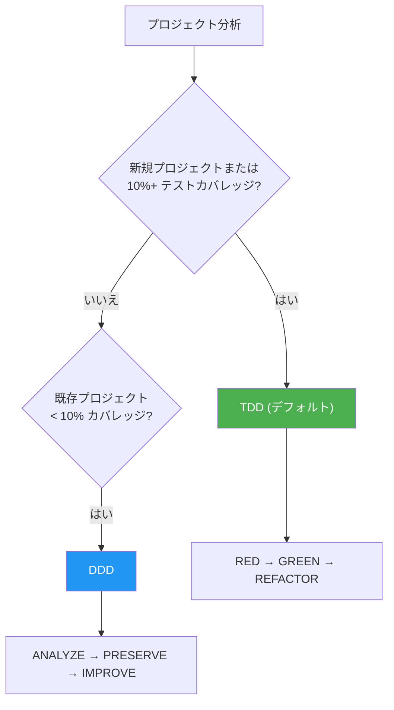

# よくある質問

MoAI-ADK の使用中によくある質問と回答です。

---

## Q: ステータスラインのバージョン表示は何を意味しますか？

MoAI ステータスラインはバージョン情報と更新通知を一緒に表示します:

```
🗿 v2.2.2 ⬆️ v2.2.5
```

- **`v2.2.2`**: 現在インストールされているバージョン
- **`⬆️ v2.2.5`**: 更新可能な新しいバージョン

最新バージョンを使用している場合、バージョン番号のみが表示されます:

```
🗿 v2.2.5
```

**更新方法**: `moai update` を実行すると更新通知が消えます。


**注意**: これは Claude Code の組み込みバージョン表示 (`🔅 v2.1.38`) とは異なります。MoAI 表示は MoAI-ADK バージョンを追跡し、Claude Code は独自のバージョンを別途表示します。


---

## Q: ステータスラインに表示されるセグメントをカスタマイズするには？

ステータスラインは 4 つの表示プリセットとカスタム設定をサポートしています:

| プリセット | 説明 |
|----------|------|
| **Full** (デフォルト) | すべての 8 セグメントを表示 |
| **Compact** | Model + Context + Git Status + Branch のみ |
| **Minimal** | Model + Context のみ |
| **Custom** | 個別セグメントを選択 |

`moai init` または `moai update -c` ウィザードで設定するか、`.moai/config/sections/statusline.yaml` を直接編集します:

```yaml
statusline:
  preset: compact  # または full, minimal, custom
  segments:
    model: true
    context: true
    output_style: false
    directory: false
    git_status: true
    claude_version: false
    moai_version: false
    git_branch: true
```


詳細は [SPEC-STATUSLINE-001](https://github.com/modu-ai/moai-adk/blob/main/.moai/specs/SPEC-STATUSLINE-001/spec.md) を参照してください。


---

## Q: モデルポリシーはどのように選択しますか？

MoAI-ADK は Claude Code サブスクリプションプランに基づいて 28 エージェントに最適な AI モデルを割り当てます。プランのレート制限内で品質を最大化します。

### ポリシーティア比較

| ポリシー | プラン | 🟣 Opus | 🔵 Sonnet | 🟡 Haiku | 用途 |
|----------|--------|---------|-----------|----------|------|
| **High** | Max $200/月 | 23 | 1 | 4 | 最高品質、最大スループット |
| **Medium** | Max $100/月 | 4 | 19 | 5 | 品質とコストのバランス |
| **Low** | Plus $20/月 | 0 | 12 | 16 | 経済的、Opus アクセスなし |


**なぜ重要？** Plus $20 プランには Opus アクセスが含まれていません。`Low` に設定すると、すべてのエージェントが Sonnet と Haiku のみを使用し、レート制限エラーを防ぎます。上位プランでは、重要なエージェント (セキュリティ、戦略、アーキテクチャ) に Opus を、通常タスクに Sonnet/Haiku を配分します。


### ティア別エージェントモデル割り当て

#### Manager Agents

| エージェント | High | Medium | Low |
|--------------|------|--------|-----|
| manager-spec | 🟣 opus | 🟣 opus | 🔵 sonnet |
| manager-strategy | 🟣 opus | 🟣 opus | 🔵 sonnet |
| manager-ddd | 🟣 opus | 🔵 sonnet | 🔵 sonnet |
| manager-tdd | 🟣 opus | 🔵 sonnet | 🔵 sonnet |
| manager-project | 🟣 opus | 🔵 sonnet | 🟡 haiku |
| manager-docs | 🔵 sonnet | 🟡 haiku | 🟡 haiku |
| manager-quality | 🟡 haiku | 🟡 haiku | 🟡 haiku |
| manager-git | 🟡 haiku | 🟡 haiku | 🟡 haiku |

#### Expert Agents

| エージェント | High | Medium | Low |
|--------------|------|--------|-----|
| expert-backend | 🟣 opus | 🔵 sonnet | 🔵 sonnet |
| expert-frontend | 🟣 opus | 🔵 sonnet | 🔵 sonnet |
| expert-security | 🟣 opus | 🟣 opus | 🔵 sonnet |
| expert-debug | 🟣 opus | 🔵 sonnet | 🔵 sonnet |
| expert-refactoring | 🟣 opus | 🔵 sonnet | 🔵 sonnet |
| expert-devops | 🟣 opus | 🔵 sonnet | 🟡 haiku |
| expert-performance | 🟣 opus | 🔵 sonnet | 🟡 haiku |
| expert-testing | 🟣 opus | 🔵 sonnet | 🟡 haiku |

### 設定方法

```bash
# プロジェクト初期化時
moai init my-project          # 対話型ウィザードでモデルポリシー選択

# 既存プロジェクトの再設定
moai update -c                # 設定ウィザードを再実行
```


デフォルトポリシーは `High` です。`moai update` 実行後、`moai update -c` でこの設定を構成するよう案内が表示されます。


---

## Q: 「Allow external CLAUDE.md file imports?」警告が表示されます

プロジェクトを開く際、Claude Code が外部ファイルインポートに関するセキュリティプロンプトを表示することがあります:

```
External imports:
  /Users/<user>/.moai/config/sections/quality.yaml
  /Users/<user>/.moai/config/sections/user.yaml
  /Users/<user>/.moai/config/sections/language.yaml
```


**推奨アクション**: **"No, disable external imports"** を選択 ✅


**理由?**
- プロジェクトの `.moai/config/sections/` に既にこれらのファイルが存在します
- プロジェクト固有の設定がグローバル設定より優先されます
- 必須設定は既に CLAUDE.md テキストに埋め込まれています
- 外部インポートを無効にする方が安全で、機能に影響しません

**これらのファイルは何ですか？**
- `quality.yaml`: TRUST 5 フレームワークと開発メソドロジー設定
- `language.yaml`: 言語設定 (会話、コメント、コミット)
- `user.yaml`: ユーザー名 (オプション、Co-Authored-By 表記用)

---

## Q: TDD と DDD メソドロジーの違いは何ですか？

MoAI-ADK v2.5.0+ は **バイナリメソドロジー選択** (TDD または DDD のみ) を使用します。明確性と一貫性のため、ハイブリッドモードは削除されました。

### メソドロジー選択ガイド



### TDD メソドロジー (デフォルト)

新規プロジェクトと機能開発のデフォルトメソドロジー。テストを先に書いてから実装します。

| フェーズ | 説明 |
|----------|------|
| **RED** | 期待される動作を定義する失敗テストを書く |
| **GREEN** | テストを通すための最小限のコードを書く |
| **REFACTOR** | テストを維持しながらコード品質を改善 |

ブラウンフィールドプロジェクト (既存コードベース) の場合、TDD は **RED 前分析ステップ** で拡張されます: テストを書く前に既存コードを読んで現在の動作を理解します。

### DDD メソドロジー (10% 未満のカバレッジの既存プロジェクト)

最小限のテストカバレッジの既存プロジェクトを安全にリファクタリングするためのメソドロジー。

```
ANALYZE   → 既存コードと依存関係を分析、ドメイン境界を特定
PRESERVE  → キャラクタリゼーションテストを書く、現在の動作スナップショットをキャプチャ
IMPROVE   → テスト保護下で段階的に改善
```

### メソドロジー選択表

| プロジェクト状態 | テストカバレッジ | 推奨メソドロジー | 理由 |
|------------------|------------------|------------------|------|
| 新規プロジェクト | N/A | TDD | テストファースト開発 |
| 既存プロジェクト | 50%+ | TDD | 強力なテストベースが存在 |
| 既存プロジェクト | 10-49% | TDD | テストを拡張可能 |
| 既存プロジェクト | < 10% | DDD | 段階的なキャラクタリゼーションテストが必要 |

### 設定方法

```bash
# プロジェクト初期化時に自動検出
moai init my-project          # --mode <ddd|tdd> フラグで指定可能

# 手動設定
# .moai/config/sections/quality.yaml を編集
development_mode: tdd         # または ddd
```


**注意:** v2.5.0 以前のハイブリッドモードは削除されました。TDD または DDD のいずれかを明確に選択する必要があります。


---

## Q: コードに @MX タグがないのはなぜ？

これは **完全に正常** です。@MX タグシステムは、AI が最初に注目すべき最も危険で重要なコードのみをマークするよう設計されています。

| 質問 | 回答 |
|------|------|
| タグがないのは問題ですか？ | **いいえ。** ほとんどのコードにはタグは不要です。 |
| タグはいつ追加されますか？ | **高い fan_in** (呼び出し元 >= 3)、**複雑なロジック** (複雑度 >= 15)、**危険パターン** (context なしの goroutine) の場合のみ。 |
| すべてのプロジェクトで同様ですか？ | **はい。** すべてのプロジェクトでほとんどのコードにはタグがありません。 |

### タグ優先度

| 優先度 | 条件 | タグタイプ |
|--------|------|----------|
| **P1 (クリティカル)** | fan_in >= 3 | `@MX:ANCHOR` |
| **P2 (危険)** | goroutine、複雑度 >= 15 | `@MX:WARN` |
| **P3 (コンテキスト)** | マジック定数、godoc なし | `@MX:NOTE` |
| **P4 (欠落)** | テストファイルなし | `@MX:TODO` |

コードベースを @MX タグでスキャンするには:

```bash
/moai mx --all        # フルスキャン
/moai mx --dry        # プレビューのみ
/moai mx --priority P1  # クリティカルのみ
```

---

## その他の質問がありますか？

- [GitHub Discussions](https://github.com/modu-ai/moai-adk/discussions) — 質問、アイデア、フィードバック
- [Issues](https://github.com/modu-ai/moai-adk/issues) — バグレポート、機能リクエスト
- [Discord コミュニティ](https://discord.gg/moai-adk) — リアルタイムチャット、ヒント共有
