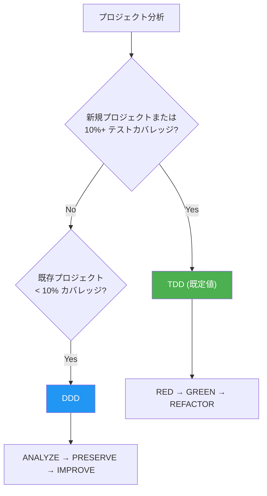

MoAI-ADK の利用中によく寄せられる質問と回答です。

---

## Q: `moai` と `/moai` は何が違うのですか?

完全に別のものです。最もよくある混同なので、最初に押さえておきましょう。

| | `moai` (ターミナル CLI) | `/moai` (スラッシュサブコマンド) |
|---|---|---|
| **実行場所** | ターミナルシェル | Claude Code のチャット入力 |
| **正体** | Go バイナリ | Claude Code のスキル呼び出し |
| **用途** | プロジェクト設定、テンプレート配布 | AI エージェント開発ワークフロー |
| **例** | `moai init my-project` | `/moai plan "認証機能"` |

- ターミナルで `moai plan` を実行しても動作しません — `/moai plan` は Claude Code の中でのみ有効です。
- Claude Code で `/moai init` を入力しても動作しません — `moai init` はターミナルコマンドです。

---

## Q: statusline のバージョン表示は何を意味しますか?

MoAI statusline はバージョン情報とアップデート通知を一緒に表示します:

```
🗿 v2.2.2 ⬆️ v2.2.5
```

- **`v2.2.2`**: 現在インストールされているバージョン
- **`⬆️ v2.2.5`**: アップデート可能な新バージョン

最新バージョンを利用中のときはバージョン番号のみ表示されます:

```
🗿 v2.2.5
```

**アップデート方法**: `moai update` を実行するとアップデート通知が消えます。


**参考**: Claude Code のビルトインバージョン表示(`🔅 v2.1.38`)とは異なります。MoAI の表示は MoAI-ADK のバージョンを追跡し、Claude Code は自身のバージョンを別途表示します。


---

## Q: statusline に表示されるセグメントをカスタマイズするには?

statusline は4つの表示プリセットとカスタム設定をサポートします:

| プリセット | 説明 |
|--------|------|
| **Full** (既定値) | 全8セグメントを表示 |
| **Compact** | Model + Context + Git Status + Branch のみ表示 |
| **Minimal** | Model + Context のみ表示 |
| **Custom** | 個別セグメントを選択 |

`moai init` または `moai update -c` ウィザードで設定するか、`.moai/config/sections/statusline.yaml` を直接編集します:

```yaml
statusline:
  preset: compact  # または full, minimal, custom
  segments:
    model: true
    context: true
    output_style: false
    directory: false
    git_status: true
    claude_version: false
    moai_version: false
    git_branch: true
```


詳細は [SPEC-STATUSLINE-001](https://github.com/modu-ai/moai-adk/blob/main/.moai/specs/SPEC-STATUSLINE-001/spec.md) を参照してください。


---

## Q: モデルポリシーはどう選べばよいですか?

MoAI-ADK は Claude Code のサブスクリプションプランに合わせて、エージェントに最適な AI モデルを割り当てます。プランの使用量制限内で品質を最大化するトークノミクスの仕組みです。

### ポリシーティアの比較

| ポリシー | プラン | 特徴 |
|------|--------|------|
| **High** | Max $200/月 | 最高品質 — 計画・監査に Opus を割り当て、最大スループット |
| **Medium** | Max $100/月 | 品質とコストのバランス |
| **Low** | Plus $20/月 | 経済的、Opus 非搭載 — Sonnet 中心の配分 |


**なぜ重要なのか?** Plus $20 プランは Opus を含みません。`Low` に設定するとすべてのエージェントが Opus なしで動作し、使用量制限エラーを防ぎます。上位プランでは中核ステップ (計画、監査) に Opus を、一般的な作業に軽量モデルを配分します。


### ティア別エージェントのモデル割り当て

**10エージェントのカタログ** (9 MoAI カスタム + 1 Anthropic ビルトイン `Explore`) のうち、MoAI カスタムエージェントはティアに応じてモデルが割り当てられます。かつての12個のアーカイブ済みエージェント (archived agents) は利用できません。

#### Manager Agents (5つ)

| エージェント | High | Medium | Low |
|---------|------|--------|-----|
| manager-spec | opus | opus | sonnet |
| manager-develop | opus | sonnet | sonnet |
| manager-docs | sonnet | haiku | haiku |
| manager-git | haiku | haiku | haiku |
| manager-design | sonnet | sonnet | sonnet |

#### Evaluator · Builder · Advisor Agents (4つ)

| エージェント | High | Medium | Low |
|---------|------|--------|-----|
| plan-auditor | opus | opus | sonnet |
| sync-auditor | opus | sonnet | sonnet |
| builder-harness | opus | sonnet | haiku |
| super-advisor | opus | opus | sonnet |

ビルトインの `Explore` はセッションモデルをそのまま使用します。

### 設定方法

```bash
# プロジェクト初期化時
moai init my-project          # 対話型ウィザードでモデルポリシーを選択

# 既存プロジェクトの再設定
moai update -c                # 設定ウィザードの再実行
```


既定のポリシーは `High` です。`moai update` の実行後、`moai update -c` でこの設定を構成するよう案内が表示されます。


---

## Q: "Allow external CLAUDE.md file imports?" という警告が表示されます

プロジェクトを開くとき、Claude Code が外部ファイル import に関するセキュリティプロンプトを表示することがあります:

```
External imports:
  /Users/<user>/.moai/config/sections/quality.yaml
  /Users/<user>/.moai/config/sections/user.yaml
  /Users/<user>/.moai/config/sections/language.yaml
```


**推奨アクション:** **"No, disable external imports"** を選択してください。


**理由:**
- プロジェクトの `.moai/config/sections/` にすでにこれらのファイルが存在します
- プロジェクト別の設定がグローバル設定より優先されます
- 必須設定はすでに CLAUDE.md のテキストに含まれています
- 外部 import を無効化するほうが安全で、機能に影響を与えません

**ファイルの説明:**
- `quality.yaml`: TRUST 5 フレームワークおよび開発方法論の設定
- `language.yaml`: 言語設定 (会話、コメント、コミット)
- `user.yaml`: ユーザー名 (任意、Co-Authored-By 表示用)

---

## Q: TDD と DDD 方法論の違いは何ですか?

MoAI-ADK v2.5.0+ は **二者択一の方法論選択** (TDD または DDD のみ) を採用しています。明確さと一貫性のために hybrid モードは削除されました。

### 方法論選択ガイド


```mermaid
flowchart TD
    A["プロジェクト分析"] --> B{"新規プロジェクトまたは<br/>10%+ テストカバレッジ?"}
    B -->|"Yes"| C["TDD (既定値)"]
    B -->|"No"| D{"既存プロジェクト<br/>< 10% カバレッジ?"}
    D -->|"Yes"| E["DDD"]
    C --> F["RED → GREEN → REFACTOR"]
    E --> G["ANALYZE → PRESERVE → IMPROVE"]

    style C fill:#4CAF50,color:#fff
    style E fill:#2196F3,color:#fff
```

### TDD 方法論 (既定値)

新規プロジェクトと機能開発に推奨される既定の方法論です。テストを先に書きます。

| ステップ | 説明 |
|------|------|
| **RED** | 期待する動作を定義する失敗テストを作成 |
| **GREEN** | テストに合格する最小限のコードを作成 |
| **REFACTOR** | テストを維持しながらコード品質を改善 |

ブラウンフィールドプロジェクト (既存コードベース) では、**RED 前の分析ステップ** が追加されます: テスト作成前に既存コードを読み、現在の動作を把握します。

### DDD 方法論 (テストカバレッジ < 10% の既存プロジェクト)

テストカバレッジが最小限の既存プロジェクトで、安全にリファクタリングするための方法論です。

```
ANALYZE   → 既存コードと依存関係の分析、ドメイン境界の特定
PRESERVE  → 特性テストの作成、現在の動作のスナップショット取得
IMPROVE   → テストで保護された状態での段階的改善
```

### 方法論選択表

| プロジェクト状態 | テストカバレッジ | 推奨方法論 | 理由 |
|--------------|---------------|-------------|------|
| 新規プロジェクト | N/A | TDD | テストファースト開発 |
| 既存プロジェクト | 50%+ | TDD | テスト基盤がある |
| 既存プロジェクト | 10-49% | TDD | テストを拡張可能 |
| 既存プロジェクト | < 10% | DDD | 段階的な特性テストが必要 |

### 設定方法

```bash
# プロジェクト初期化時に自動検出
moai init my-project          # --mode <ddd|tdd> フラグで指定可能

# 手動設定
# .moai/config/sections/quality.yaml を編集
development_mode: tdd         # または ddd
```


**参考:** v2.5.0 以前の hybrid モードは削除されました。現在は TDD または DDD のどちらかを明確に選択する必要があります。


---

## Q: 自分のコードに @MX タグがないのはなぜですか?

これは **完全に正常** です。@MX タグシステムは、AI が最初に注目すべき、最も危険で重要なコードだけをマークするように設計されています。

| 質問 | 回答 |
|------|------|
| タグがないと問題ですか? | **いいえ。** ほとんどのコードにはタグは不要です。 |
| タグはいつ追加されますか? | **高い fan_in** (呼び出し元 >= 3)、**複雑なロジック** (複雑度 >= 15)、**危険なパターン** (context のないゴルーチン) にのみ追加されます。 |
| どのプロジェクトも同様ですか? | **はい。** すべてのプロジェクトで、ほとんどのコードにはタグがありません。 |

### タグの優先度

| 優先度 | 条件 | タグの種類 |
|---------|------|----------|
| **P1 (致命的)** | fan_in >= 3 | `@MX:ANCHOR` |
| **P2 (危険)** | ゴルーチン、複雑度 >= 15 | `@MX:WARN` |
| **P3 (コンテキスト)** | マジック定数、godoc なし | `@MX:NOTE` |
| **P4 (欠落)** | テストファイルなし | `@MX:TODO` |

コードベースを @MX タグでスキャンするには:

```bash
/moai mx --all        # 全体スキャン
/moai mx --dry        # プレビュー
/moai mx --priority P1  # 致命的な項目のみ
```

---

## さらに質問がありますか?

- [GitHub Discussions](https://github.com/modu-ai/moai-adk/discussions) — 質問、アイデア、フィードバック
- [Issues](https://github.com/modu-ai/moai-adk/issues) — バグレポート、機能リクエスト
- [Discord コミュニティ](https://discord.gg/Z7E7Mdc5aN) — リアルタイム交流、Tips 共有
