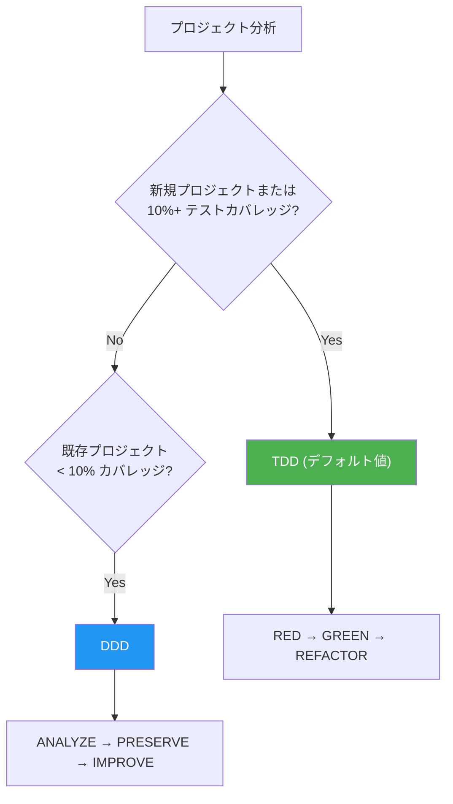

MoAI-ADK 使用中によくある質問と回答です。



---

## Q: `moai` と `/moai` は何が違いますか?

まったく別の 2 つです。最もよくある混同なので先に押さえます。

| | `moai` (ターミナル CLI) | `/moai` (スラッシュサブコマンド) |
|---|---|---|
| **実行場所** | ターミナルシェル | Claude Code の対話画面 |
| **正体** | Go バイナリ | Claude Code スキル呼び出し |
| **用途** | プロジェクト設定、テンプレート配布 | AI エージェント開発ワークフロー |
| **例** | `moai init my-project` | `/moai plan "認証機能"` |

- ターミナルで `moai plan` を実行しても動作しません — `/moai plan` は Claude Code の中でのみ有効です。
- Claude Code で `/moai init` と入力しても動作しません — `moai init` はターミナルコマンドです。

---

## Q: statusline のバージョン表示は何を意味しますか?

MoAI statusline はバージョン情報とアップデート通知を併せて表示します:

```
🗿 v2.2.2 ⬆️ v2.2.5
```

- **`v2.2.2`**: 現在インストールされているバージョン
- **`⬆️ v2.2.5`**: アップデート可能な新しいバージョン

最新バージョンを使用中のときはバージョン番号だけが表示されます:

```
🗿 v2.2.5
```

**アップデート方法**: `moai update` 実行時にアップデート通知が消えます。


**参考**: Claude Code のビルトインバージョン表示 (`🔅 v2.1.38`) とは異なります。MoAI の表示は MoAI-ADK のバージョンを追跡し、Claude Code は自身のバージョンを別途表示します。


---

## Q: statusline に表示されるセグメントをカスタマイズするには?

statusline は 4 つのディスプレイプリセットとカスタム設定をサポートします:

| プリセット | 説明 |
|--------|------|
| **Full** (デフォルト値) | すべての 8 セグメントを表示 |
| **Compact** | Model + Context + Git Status + Branch のみ表示 |
| **Minimal** | Model + Context のみ表示 |
| **Custom** | 個別セグメントを選択 |

`moai init` または `moai update -c` ウィザードで設定するか、`.moai/config/sections/statusline.yaml` を直接編集します:

```yaml
statusline:
  preset: compact  # または full, minimal, custom
  segments:
    model: true
    context: true
    output_style: false
    directory: false
    git_status: true
    claude_version: false
    moai_version: false
    git_branch: true
```


詳しい内容は [SPEC-STATUSLINE-001](https://github.com/modu-ai/moai-adk/blob/main/.moai/specs/SPEC-STATUSLINE-001/spec.md) を参照してください。


---

## Q: モデルポリシーをどう選びますか?

MoAI-ADK は Claude Code のサブスクリプション料金プランに合わせてエージェントに最適な AI モデルを割り当てます。料金プランの使用量制限内で品質を最大化するトークノミクス装置です。

### ティア比較

| ティア | 特徴 |
|------|------|
| **max** | 最高品質 — 計画・監査に Opus を割り当て、最大の推論深度 |
| **medium** (デフォルト値) | 品質とコストのバランス |
| **low** | 経済的 — Sonnet 中心の配分 |


**なぜ重要ですか?** `low` ティアは上位モデル (Opus) なしでもワークフロー全体が動作するよう設計されています。使用量制限エラーを防ぎながら核心的な作業を行えます。`max` ティアでは核心ステップ (計画、監査) に Opus を、一般作業に軽量モデルを割り当てます。


### ティア別エージェントモデル割り当て

**11 個のエージェントカタログ** (10 MoAI カスタム + 1 Anthropic ビルトイン `Explore`) のうち MoAI カスタムエージェントはティアに応じてモデルが割り当てられます。かつての 12 個の保管エージェント (archived agents) は利用できません。

#### Manager Agents (5 個)

| エージェント | max | medium | low |
|---------|-----|--------|-----|
| manager-spec | opus | opus | sonnet |
| manager-develop | opus | sonnet | sonnet |
| manager-docs | sonnet | sonnet | sonnet |
| manager-git | sonnet | sonnet | sonnet |
| manager-design | sonnet | sonnet | sonnet |

#### Evaluator · Builder · Advisor Agents (4 個)

| エージェント | max | medium | low |
|---------|-----|--------|-----|
| plan-auditor | opus | opus | sonnet |
| sync-auditor | opus | sonnet | sonnet |
| builder-harness | opus | sonnet | sonnet |
| super-advisor | opus | opus | sonnet |

e2e-tester とビルトインの `Explore` はセッションモデルをそのまま踏襲します (`model: inherit`)。

### 設定方法

```bash
# プロジェクト初期化時
moai init my-project          # 対話型ウィザードでモデルポリシー選択

# 既存プロジェクトの再設定
moai update -c                # 設定ウィザードの再実行
```


デフォルトティアは `medium` です。`moai update -c` で設定ウィザードを再実行して変更できます。


---

## Q: "Allow external CLAUDE.md file imports?" 警告が表示されます

プロジェクトを開くとき、Claude Code が外部ファイル import に関するセキュリティプロンプトを表示することがあります:

```
External imports:
  /Users/<user>/.moai/config/sections/quality.yaml
  /Users/<user>/.moai/config/sections/user.yaml
  /Users/<user>/.moai/config/sections/language.yaml
```


**推奨する対応:** **"No, disable external imports"** を選択してください。


**理由:**
- プロジェクトの `.moai/config/sections/` にすでにこれらのファイルが存在します
- プロジェクト別設定がグローバル設定より優先適用されます
- 必須設定はすでに CLAUDE.md テキストに含まれています
- 外部 import を無効化する方が安全で、機能に影響を与えません

**ファイルの説明:**
- `quality.yaml`: TRUST 5 フレームワークおよび開発方法論の設定
- `language.yaml`: 言語設定 (会話、コメント、コミット)
- `user.yaml`: ユーザー名 (オプション、Co-Authored-By 表示用)

---

## Q: TDD と DDD 方法論の違いは何ですか?

MoAI-ADK v2.5.0+ は **二値の方法論選択** (TDD または DDD のみ) を使います。明確性と一貫性のため hybrid モードは除去されました。

### 方法論選択ガイド


```mermaid
flowchart TD
    A["プロジェクト分析"] --> B{"新規プロジェクトまたは<br/>10%+ テストカバレッジ?"}
    B -->|"Yes"| C["TDD (デフォルト値)"]
    B -->|"No"| D{"既存プロジェクト<br/>< 10% カバレッジ?"}
    D -->|"Yes"| E["DDD"]
    C --> F["RED → GREEN → REFACTOR"]
    E --> G["ANALYZE → PRESERVE → IMPROVE"]

    style C fill:#4CAF50,color:#fff
    style E fill:#2196F3,color:#fff
```

### TDD 方法論 (デフォルト値)

新規プロジェクトと機能開発に推奨される基本の方法論です。テストを先に書きます。

| ステップ | 説明 |
|------|------|
| **RED** | 期待される動作を定義する失敗テストの作成 |
| **GREEN** | テストを通過する最小限のコードの作成 |
| **REFACTOR** | テストを維持しながらコード品質を改善 |

ブラウンフィールドプロジェクト (既存コードベース) では **RED 前の分析ステップ** が追加されます: テストを書く前に既存コードを読んで現在の動作を把握します。

### DDD 方法論 (テストカバレッジ < 10% の既存プロジェクト)

テストカバレッジが最小の既存プロジェクトで安全にリファクタリングするための方法論です。

```
ANALYZE   → 既存コードと依存性を分析、ドメイン境界を識別
PRESERVE  → 特性テストの作成、現在の動作のスナップショットを取得
IMPROVE   → テストで保護された状態で段階的に改善
```

### 方法論選択表

| プロジェクト状態 | テストカバレッジ | 推奨方法論 | 理由 |
|--------------|---------------|-------------|------|
| 新規プロジェクト | N/A | TDD | テスト優先開発 |
| 既存プロジェクト | 50%+ | TDD | テスト基盤がある |
| 既存プロジェクト | 10-49% | TDD | テスト拡張が可能 |
| 既存プロジェクト | < 10% | DDD | 段階的な特性テストが必要 |

### 設定方法

```bash
# プロジェクト初期化時に自動検出
moai init my-project          # --mode <ddd|tdd> フラグで指定可能

# 手動設定
# .moai/config/sections/quality.yaml を編集
development_mode: tdd         # または ddd
```


**参考:** v2.5.0 以前の hybrid モードは除去されました。今は TDD または DDD のいずれかを明確に選択する必要があります。


---

## Q: 自分のコードに @MX タグがない理由は?

これは **完全に正常** です。@MX タグシステムは AI が最初に注目すべき最も危険で重要なコードだけを表示するよう設計されています。

| 質問 | 回答 |
|------|------|
| タグがなければ問題ですか? | **いいえ。** ほとんどのコードにはタグが必要ありません。 |
| タグはいつ追加されますか? | **高い fan_in** (呼び出し元 >= 3)、**複雑なロジック** (複雑度 >= 15)、**危険なパターン** (context のない goroutine) にのみ追加されます。 |
| すべてのプロジェクトが似ていますか? | **はい。** すべてのプロジェクトでほとんどのコードにはタグがありません。 |

### タグの優先順位

| 優先順位 | 条件 | タグの種類 |
|---------|------|----------|
| **P1 (致命的)** | fan_in >= 3 | `@MX:ANCHOR` |
| **P2 (危険)** | goroutine、複雑度 >= 15 | `@MX:WARN` |
| **P3 (コンテキスト)** | マジック定数、godoc なし | `@MX:NOTE` |
| **P4 (欠落)** | テストファイルなし | `@MX:TODO` |

コードベースを @MX タグでスキャンするには:

```bash
/moai mx --all        # 全体スキャン
/moai mx --dry        # プレビュー
/moai mx --priority P1  # 致命的な項目のみ
```

---

## さらに質問がありますか?

- [GitHub Discussions](https://github.com/modu-ai/moai-adk/discussions) — 質問、アイデア、フィードバック
- [Issues](https://github.com/modu-ai/moai-adk/issues) — バグレポート、機能リクエスト
- [Discord コミュニティ](https://discord.gg/Z7E7Mdc5aN) — リアルタイムのやり取り、ヒント共有
