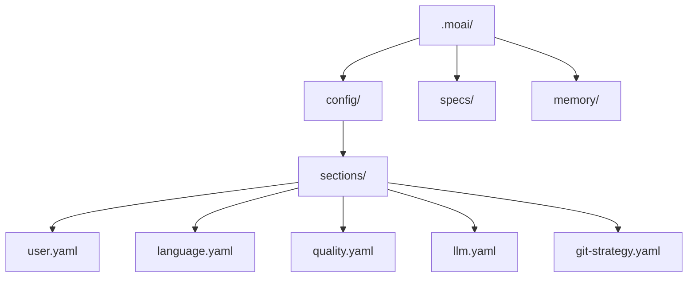

MoAI-ADK のインタラクティブな設定ウィザードで最初の設定を完了しましょう。言語、Git 自動化の範囲、モデルポリシー、ハーネスプロファイルを開発環境に合わせて構成します。ここで決めた値はすべて `.moai/config/sections/` 配下の YAML ファイルに保存されるので、後からいつでもファイルを直接直したりウィザードを再実行したりして変更できます。

## 設定ウィザードの開始

### 新規プロジェクトの作成

新しいプロジェクトを作成しながら初期化するには:

```bash
moai init my-project
```

このコマンドは `my-project` フォルダを作成し MoAI-ADK を初期化します。

### 既存フォルダへのインストール

既存プロジェクトに MoAI-ADK をインストールするには、該当フォルダに移動して実行してください:

```bash
cd my-existing-project
moai init
```


`moai init` は現在のフォルダにそのままインストールします。新規プロジェクトは `moai init <プロジェクト名>` で作成してください。


## ウィザードモード

初期化ウィザードは質問の深さに応じて 3 つのモードで動作します。

| モード | フラグ | 質問範囲 |
|------|--------|----------|
| **Quick** (デフォルト値) | (なし) | 核心設定のみ — 言語、名前、Git、モデルポリシー |
| **Standard** | `--standard` | Quick + Phase 1 質問 (project mode, harness profile, LSP, quality, design) |
| **Advanced** | `--advanced` | Standard + Phase 2 質問 (前提条件を満たす場合のみ) |

```bash
# 基本ウィザード (Quick)
moai init my-project

# Phase 1 質問を含む
moai init my-project --standard

# Phase 1 + Phase 2 質問を含む
moai init my-project --advanced
```

## Quick モード (デフォルト)

フラグなしで実行すると核心設定のみを尋ねます。ほとんどのユーザーに十分です。

### ステップ 1: 会話言語の選択

Claude が応答する言語を選択します。

```bash
? 会話言語を選択してください:
▸ English
  Korean (한국어)
  Japanese (日本語)
  Chinese (中文)
```

この設定は `.moai/config/sections/language.yaml` に保存されます。

### ステップ 2: 名前の入力

設定ファイルに使われるユーザー名です。Enter を押してスキップできます。

```bash
? 名前を入力: [名前]
```

### ステップ 3: Git 自動化モードの選択

Claude が行える Git 作業の範囲を設定します。

```bash
? Git 自動化モードを選択:
▸ Manual - AI がコミットやプッシュをしない
  Personal - AI がブランチ生成およびコミット可能
  Team - AI がブランチ生成、コミット、PR 生成が可能
```

- **Manual**: AI が Git 作業を行いません。すべてのコミットとプッシュはユーザーが自ら実行します。
- **Personal**: AI がブランチを生成しコミットできます。個人プロジェクトに適しています。
- **Team**: AI がブランチ生成、コミット、PR 生成まで行います。チーム協業ワークフローに最適化されています。


Git 設定は `.moai/config/sections/git-strategy.yaml` ファイルに保存されます。


### ステップ 4: Git プロバイダーの選択

プロジェクトの Git ホスティングプラットフォームを選択します。

```bash
? Git プロバイダーを選択:
▸ GitHub - GitHub.com
  GitLab - GitLab.com またはセルフホスト GitLab
```

### ステップ 5: コミットメッセージ言語

コミットメッセージ作成に使う言語を選択します。コードコメント言語と異なる設定にできます。

### ステップ 6: コードコメント言語

コードコメントに使う言語を選択します。ほとんどのプロジェクトでは英語を推奨します。

### ステップ 7: ドキュメント言語

ドキュメントファイルに使う言語を選択します。

### ステップ 8: パフォーマンスティア (モデルポリシー)

エージェントに割り当てる AI モデルティアを選択します — トークノミクスの核心設定です。

```bash
? パフォーマンスティアを選択:
▸ medium (推奨) - 品質とコストのバランス
  max - 最高品質、計画・監査に Opus 割り当て
  low - 経済的、Sonnet 中心の配分
```

| ティア | 特徴 |
|------|------|
| **max** | 最高品質 — 計画・監査に Opus 割り当て、最大の推論深度 |
| **medium** (デフォルト値) | 品質とコストのバランス |
| **low** | 経済的 — Sonnet 中心の配分 |

この設定は `.moai/config/sections/llm.yaml` の `performance_tier` フィールドに保存され、`profile` フィールド(プロファイルマトリクス列)の legacy エイリアスとして読み込まれます。`--profile max|medium|low` フラグで直接指定すると `profile` フィールドに保存されます。プロファイル別のエージェント model+effort マッピングは [プロファイルマトリクス](/ja/advanced/profile-matrix/) ページを参照してください。

## Standard モード (Phase 1 質問)

`--standard` フラグを与えると Quick モードのすべての質問に加えて Phase 1 質問が表示されます。

### project mode

プロジェクトの協業モードを選択します。

```bash
? Select project mode:
▸ Personal (Recommended) - Solo developer
  Team - Multi-developer setup
```

### harness evaluator profile

品質評価者のデフォルトプロファイルを選択します。

```bash
? Select default harness evaluator profile:
▸ default
  strict
  lenient
  frontend
```

### LSP integration

run ステップで言語サーバー診断を有効化するか選択します。デフォルト値は無効 (opt-in) です。

### quality gates

TRUST 5 品質ゲートの強制有無とカバレッジ例外の許可有無を選択します。

- **Enforce quality gates** (デフォルト値: Yes) — 品質ゲート失敗時に実装の進行を遮断
- **Allow coverage exemptions** (デフォルト値: No) — 特定のファイル/パッケージをカバレッジ対象から除外

### design workflow

MoAI デザインパイプラインと Claude Design 連携を有効化するか選択します。

- **Enable design workflow** (デフォルト値: Yes)
- **Enable Claude Design integration** (デフォルト値: Yes、design 有効化時のみ表示)

## Advanced モード (Phase 2 質問)

`--advanced` フラグは `--standard` を含み、追加で Phase 2 質問を表示します。Phase 2 質問は run ステップ完了などの前提条件が満たされた場合にのみ表示され、条件がなければ自動的にスキップされ案内メッセージが出力されます。

## 非対話型モード (CI/CD)

フラグですべての値を指定するとウィザードなしで初期化できます:

```bash
moai init my-project \
  --non-interactive \
  --project-mode personal \
  --profile medium \
  --harness-profile default \
  --enable-lsp=false \
  --enforce-quality
```

## 設定完了

すべてのステップを完了すると設定ファイルが生成されます:



## 設定の修正

### 手動修正

```bash
# ユーザー設定
vim .moai/config/sections/user.yaml

# 言語設定
vim .moai/config/sections/language.yaml

# モデルポリシー (パフォーマンスティア)
vim .moai/config/sections/llm.yaml

# 品質設定
vim .moai/config/sections/quality.yaml
```

### 再設定

設定ウィザードを再実行して構成を変更できます:

```bash
# 設定ウィザードの再実行 (推奨)
moai update -c
```


`moai update -c` コマンドは既存の設定を維持しながら変更したい項目だけを選択的に再設定できます。


## 設定の検証

設定が正しく構成されているか確認しましょう:

```bash
moai doctor
```

このコマンドは Git のインストール有無、プロジェクト構造 (`.moai/` フォルダ)、設定ファイル、言語別の開発ツールを検証します。`--verbose` で詳細を確認できます。

## 次のステップ

設定が完了したら [クイックスタート](./quickstart) ガイドに従って最初のプロジェクトを作成してみましょう。

```bash
moai --help
```
