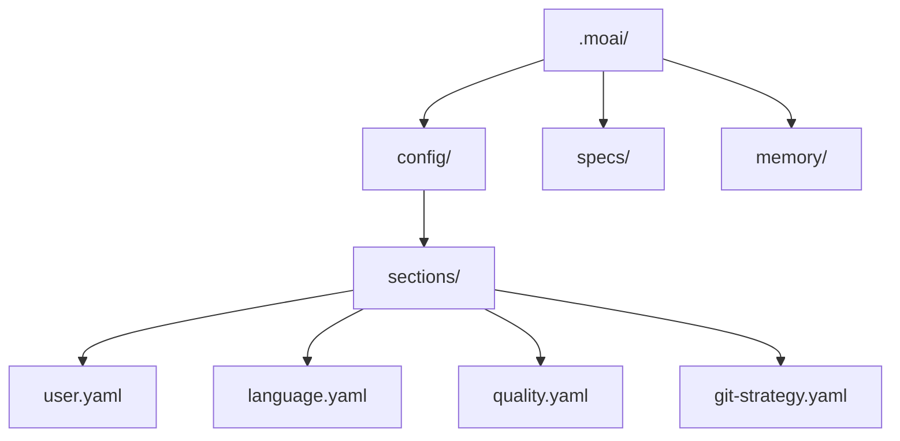
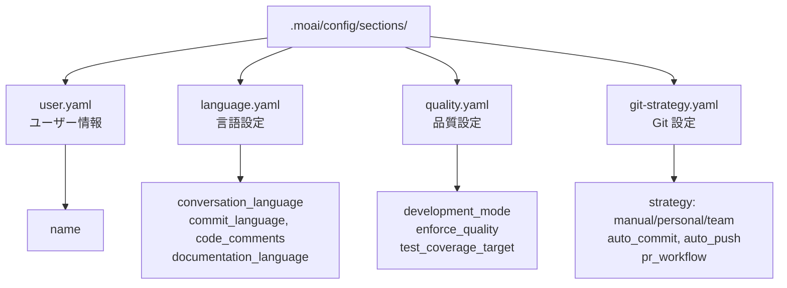

MoAI-ADK のインタラクティブ設定ウィザードで初期設定を完了しましょう。9つのステップを通じて、言語、Git 自動化の範囲、実行モードを開発環境に合わせて構成します。ここで決めた値はすべて `.moai/config/sections/` 配下の YAML ファイルに保存されるため、後からいつでもファイルを直接編集したり、ウィザードを再実行して変更できます。

## 設定ウィザードの開始

### 新規プロジェクトの作成

新しいプロジェクトを作成しながら初期化するには:

```bash
moai init my-project
```

このコマンドは `my-project` フォルダを作成し、MoAI-ADK を初期化します。

### 現在のフォルダにインストール

既存プロジェクトに MoAI-ADK をインストールするには、そのフォルダに移動してから実行します:

```bash
cd my-existing-project
moai init
```


`moai init` は現在のフォルダに直接インストールします。新規プロジェクトは `moai init <プロジェクト名>` で作成してください。


## 9ステップの設定プロセス

### ステップ 1: 会話言語の選択

Claude が応答する言語を選択します。

```bash
? 会話言語を選択してください:
▸ English - English
  Korean (한국어) - Korean
  Japanese (日本語) - Japanese
  Chinese (中文) - Chinese
```


言語選択は後から `.moai/config/sections/language.yaml` ファイルで変更できます。


### ステップ 2: 名前の入力

設定ファイルに使用されます。Enter を押してスキップできます。

```bash
? 名前を入力: [名前]
```

### ステップ 3: Git 自動化モードの選択

Claude が実行できる Git 操作の範囲を設定します。

```bash
? Git 自動化モードを選択:
▸ Manual - AI はコミットやプッシュを行わない
  Personal - AI がブランチ作成とコミットを実行可能
  Team - AI がブランチ作成、コミット、PR 作成まで実行可能
```

**Manual**: AI が Git 操作を実行しません。すべてのコミットとプッシュはユーザーが直接実行します。
**Personal**: AI がブランチを作成しコミットできます。個人プロジェクトに適しています。
**Team**: AI がブランチ作成、コミット、PR 作成まで実行します。チームコラボレーションのワークフローに最適化されています。


Git 設定は `.moai/config/sections/git-strategy.yaml` ファイルに保存されます。`moai update -c` コマンドでいつでも再設定できます。


### ステップ 4: Git プロバイダーの選択

プロジェクトの Git ホスティングプラットフォームを選択します。

```bash
? Git プロバイダーを選択:
▸ GitHub - GitHub.com
  GitLab - GitLab.com またはセルフホスト GitLab
```

### ステップ 5: Git コミットメッセージ言語の選択

コミットメッセージの作成に使用する言語を選択します。

```bash
? Git コミットメッセージ言語を選択:
▸ Korean (한국어) - 韓国語でコミット
  English - 英語でコミット
  Japanese (日本語) - 日本語でコミット
  Chinese (中文) - 中国語でコミット
```


コミットメッセージの言語は、コードコメントの言語とは別に設定できます。


### ステップ 6: コードコメント言語の選択

コードコメントに使用する言語を選択します。

```bash
? コードコメント言語を選択:
▸ Korean (한국어) - 韓国語でコメント
  English - 英語でコメント
  Japanese (日本語) - 日本語でコメント
  Chinese (中文) - 中国語でコメント
```


ほとんどのプロジェクトでは、コードコメントの言語として英語を使うことをおすすめします。


### ステップ 7: ドキュメント言語の選択

ドキュメントファイルに使用する言語を選択します。

```bash
? ドキュメント言語を選択:
▸ Korean (한국어) - 韓国語でドキュメント
  English - 英語でドキュメント
  Japanese (日本語) - 日本語でドキュメント
  Chinese (中文) - 中国語でドキュメント
```

### ステップ 8: Agent Teams 実行モードの選択

MoAI が Agent Teams (並列) または sub-agents (順次) を使用するように設定します。

```bash
? Agent Teams 実行モードを選択:
▸ Auto (推奨) - 作業の複雑さに基づくインテリジェントな選択
  Sub-agent (クラシック) - 従来の単一エージェントモード
  Team (実験的) - 並列 Agent Teams (実験的機能が必要)
```

**Auto**: 作業の複雑さに応じて自動的に最適なモードを選択します。ほとんどの場合に推奨されます。
**Sub-agent**: 単一のエージェントが順次作業を処理します。依存関係が強い作業に適しています。
**Team**: 複数の専門エージェントが並列で協業します。`CLAUDE_CODE_EXPERIMENTAL_AGENT_TEAMS=1` 環境変数が必要です。

### ステップ 9: チームメイト表示モードの選択

Agent チームメイトの表示方法を設定します。分割画面には tmux が必要です。

```bash
? チームメイト表示モードを選択:
▸ Auto (推奨) - tmux が利用可能なら tmux、なければ in-process (既定値)
  In-Process - 同じターミナルで実行 (どこでも動作)
  Tmux - tmux 分割画面 (tmux/iTerm2 が必要)
```

**Auto**: tmux のインストール有無を自動検出し、最適な表示モードを選択します。
**In-Process**: チームメイトの作業が同じターミナルウィンドウで実行されます。tmux なしでも動作します。
**Tmux**: tmux の分割画面でチームメイトの作業を視覚的に確認できます。

## 設定完了

すべてのステップを完了すると設定ファイルが生成されます:



生成された設定ファイルを確認してみましょう:

```bash
cat .moai/config/sections/user.yaml
```

## 設定の構造



## 設定の修正

設定はいつでも修正できます:

### 手動修正

```bash
# ユーザー設定
vim .moai/config/sections/user.yaml

# 言語設定
vim .moai/config/sections/language.yaml

# 品質設定
vim .moai/config/sections/quality.yaml

# Git 設定
vim .moai/config/sections/git-strategy.yaml
```

### 再設定

設定ウィザードを再実行して、すべての設定を再構成できます:

```bash
# 設定ウィザードの再実行 (推奨)
moai update -c

# または全体を初期化
moai init --reset
```


`moai update -c` コマンドは、既存の設定を維持しながら、変更したい項目だけを選択的に再設定できます。



`moai init --reset` オプションは既存の設定をすべて上書きします。重要な設定はバックアップしておいてください。


## 設定の検証

設定が正しく構成されているか確認しましょう:

```bash
moai doctor
```

このコマンドは以下を検証します:

- Git のインストール有無
- プロジェクト構造 (`.moai/` フォルダ)
- 設定ファイル (`.moai/config/config.yaml`)
- 言語別の開発ツール検出 (`--verbose` で詳細確認)

すべての項目が合格すると `All checks passed` メッセージが表示されます。不足しているツールがある場合は、`moai doctor --fix` で修正提案を受けられます。

## 次のステップ

設定が完了したら、[クイックスタート](./quickstart) ガイドに従って最初のプロジェクトを作成してみましょう。全コマンドとオプションはいつでも確認できます:

```bash
moai --help
```
