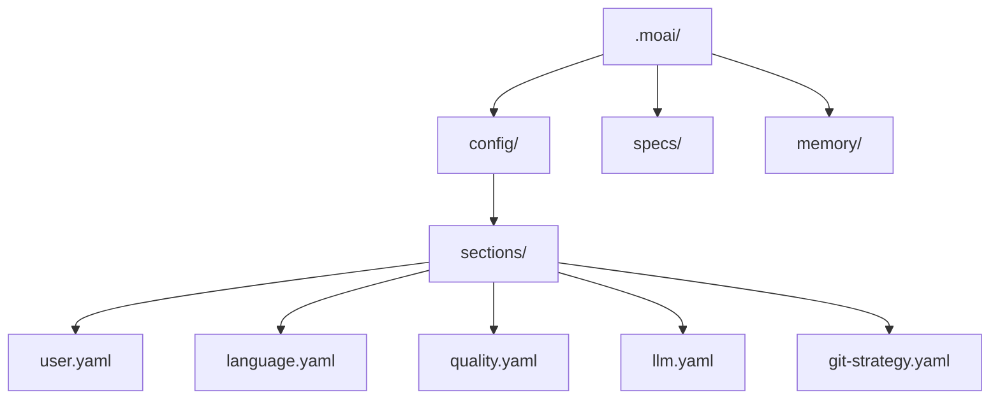

MoAI-ADK のインタラクティブな設定ウィザードで最初の設定を完了しましょう。言語、モデルポリシー、レポート形式、品質・ワークフロー設定を開発環境に合わせて構成します。ここで決めた値はすべて `.moai/config/sections/` 配下の YAML ファイルに保存されるので、後からいつでもファイルを直接直したりウィザードを再実行したりして変更できます。

## 設定ウィザードの開始

### 新規プロジェクトの作成

新しいプロジェクトを作成しながら初期化するには:

```bash
moai init my-project
```

このコマンドは `my-project` フォルダを作成し MoAI-ADK を初期化します。

### 既存フォルダへのインストール

既存プロジェクトに MoAI-ADK をインストールするには、該当フォルダに移動して実行してください:

```bash
cd my-existing-project
moai init
```


`moai init` は現在のフォルダにそのままインストールします。新規プロジェクトは `moai init <プロジェクト名>` で作成してください。


## ウィザードの構成

初期化ウィザードは常に同じ固定された 3 ページの流れで動作します — 質問範囲を広げたり狭めたりするモードフラグは存在せず、すべてのユーザーに同じ質問セットが表示されます。

| ページ | 質問 |
|------|------|
| **Page 1 — 基本** | 会話言語、名前、プロジェクト名 |
| **Page 2 — モデル & レポート** | パフォーマンスティア (モデルポリシー)、レポート形式 |
| **Page 3 — 品質 & ワークフロー** | LSP 統合、品質ゲート強制、プロジェクトモード、デザインワークフロー、Claude Design 連携 |

```bash
moai init my-project
```


Git 自動化モード・プロバイダーはウィザードでは尋ねません。`moai init` はリポジトリに既に設定されている Git リモートから自動検出します。後から Git 設定を変更するには `moai update --reconfigure` を実行してください — このパスでのみ別の Git 質問セット (自動化モード、プロバイダー、認証情報) が表示されます。


## Page 1 — 基本

### ステップ 1: 会話言語の選択

Claude が応答する言語を選択します。以降のすべての質問がこの言語で表示されます。

```bash
? 会話言語を選択してください:
▸ English
  Korean (한국어)
  Japanese (日本語)
  Chinese (中文)
```

この設定は `.moai/config/sections/language.yaml` に保存されます。

### ステップ 2: 名前の入力

設定ファイルに使われるユーザー名です。Enter を押してスキップできます。

```bash
? 名前を入力: [名前]
```

この設定は `.moai/config/sections/user.yaml` の `user.name` フィールドに保存されます。

### ステップ 3: プロジェクト名

プロジェクトの名前です。デフォルト値は現在のディレクトリ名です。

```bash
? プロジェクト名を入力: [my-project]
```

## Page 2 — モデル & レポート

### パフォーマンスティア (モデルポリシー)

エージェントに割り当てる AI モデルティアを選択します — トークノミクスの核心設定です。

```bash
? パフォーマンスティアを選択:
▸ Medium - Opus 5 (high~low) + Sonnet (low, single-shot rows only)
  High - Opus 5 (max~medium) + Sonnet (low, single-shot rows only)
  Low - Opus 5 (medium~low) + Sonnet (low, docs/e2e/single-shot rows)
```

| ティア | 特徴 |
|------|------|
| **High** | 最高品質 — 呼び出し頻度が最も低い 2 エージェントに `max` 推論深度 |
| **Medium** (デフォルト) | 品質とコストのバランス — コスト/スコア曲線の膝 |
| **Low** | タスクあたり最低コスト — エージェンティックなエージェントは Opus `low` effort へ |

この設定は `.moai/config/sections/llm.yaml` の `performance_tier` フィールドに保存され、`profile` フィールド(プロファイルマトリクス列)の legacy エイリアスとして読み込まれます。`--profile high|medium|low` フラグで直接指定すると `profile` フィールドに保存されます。プロファイル別のエージェント model+effort マッピングは [プロファイルマトリクス](/ja/advanced/profile-matrix/) ページを参照してください。

### レポート形式

レポートを HTML+Markdown で生成するか、Markdown のみで生成するかを選択します。

```bash
? レポート形式を選択:
▸ HTML + Markdown (推奨) - ブラウザで閲覧できる HTML レポートと Markdown を両方生成
  Markdown のみ - Markdown レポートのみ生成 (軽量、diff フレンドリー)
```

この設定は `.moai/config/sections/report.yaml` の `report.format` フィールドに保存されます。

## Page 3 — 品質 & ワークフロー

### LSP integration

run ステップで言語サーバー診断を有効化するか選択します。デフォルト値は **有効 (Yes)** で、無効にしたい場合は No と答えて opt-out できます。

この設定は `.moai/config/sections/lsp.yaml` の `lsp.enabled` フィールドに保存されます。

### quality gates

TRUST 5 品質ゲートの強制有無を選択します。

- **Enforce quality gates** (デフォルト値: Yes) — 品質ゲート失敗時に実装の進行を遮断

この設定は `.moai/config/sections/quality.yaml` の `constitution.enforce_quality` フィールドに保存されます。

### project mode

プロジェクトの協業モードを選択します。

```bash
? Select project mode:
▸ Personal (Recommended) - Solo developer
  Team - Multi-developer setup
```

この設定は `.moai/config/sections/project.yaml` の `project.mode` フィールドに保存されます。

### design workflow

MoAI デザインパイプラインと Claude Design 連携を有効化するか選択します。

- **Enable design workflow** (デフォルト値: Yes)
- **Enable Claude Design integration** (デフォルト値: Yes、design 有効化時のみ表示)

これらの設定は `.moai/config/sections/design.yaml` の `design.enabled` / `design.claude_design.enabled` フィールドに保存されます。

## 非対話型モード (CI/CD)

フラグですべての値を指定するとウィザードなしで初期化できます:

```bash
moai init my-project \
  --non-interactive \
  --project-mode personal \
  --profile medium \
  --enable-lsp=false \
  --enforce-quality
```

## 設定完了

すべてのステップを完了すると設定ファイルが生成されます:



## 設定の修正

### 手動修正

```bash
# ユーザー設定
vim .moai/config/sections/user.yaml

# 言語設定
vim .moai/config/sections/language.yaml

# モデルポリシー (パフォーマンスティア)
vim .moai/config/sections/llm.yaml

# 品質設定
vim .moai/config/sections/quality.yaml
```

### 再設定

設定ウィザードを再実行して構成を変更できます:

```bash
# 設定ウィザードの再実行 (推奨)
moai update -c
```


`moai update -c` コマンドは既存の設定を維持しながら変更したい項目だけを選択的に再設定できます。


## 設定の検証

設定が正しく構成されているか確認しましょう:

```bash
moai doctor
```

このコマンドは Git のインストール有無、プロジェクト構造 (`.moai/` フォルダ)、設定ファイル、言語別の開発ツールを検証します。`--verbose` で詳細を確認できます。

## 次のステップ

設定が完了したら [クイックスタート](./quickstart) ガイドに従って最初のプロジェクトを作成してみましょう。

```bash
moai --help
```
