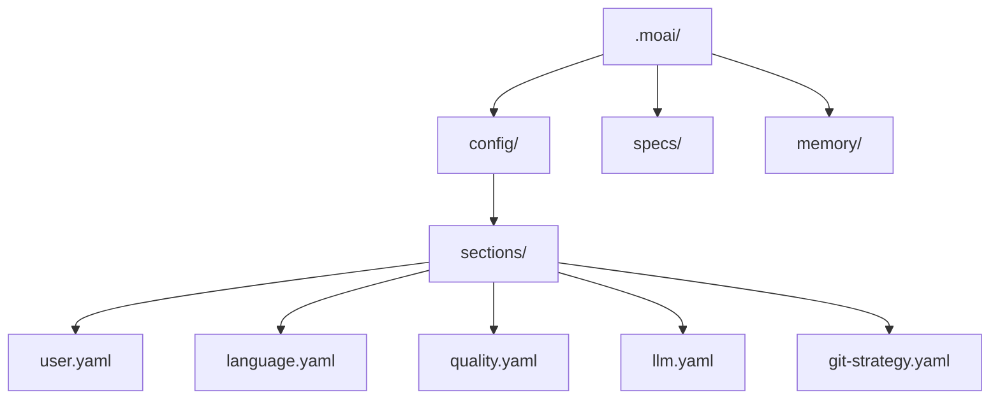

MoAI-ADK のインタラクティブな設定ウィザードで最初の設定を完了しましょう。ウィザードが尋ねるのは、人が選ぶ必要のある 5 つだけです — 会話言語、名前、デプロイするエージェントハーネス、セッションの権限モード、Jev の型付き判定を有効にするかどうか。それ以外の設定(モデルポリシー、レポート形式、品質ゲート、デザインワークフローなど)は推奨の既定値で保存され、必要なら後から変更できます。

設定の多くは `.moai/config/sections/` 配下の YAML ファイルに保存されます。ファイルごとに 1 つの関心事だけを受け持つので、値を変えるときはそのファイルだけを開けば済みます。セッションの権限モードだけは例外で、ユーザーレベルの Claude Code 設定に書き込まれます(下の Page 2 を参照)。

## 設定ウィザードの開始

### 新規プロジェクトの作成

新しいプロジェクトを作成しながら初期化するには:

```bash
moai init my-project
```

このコマンドは `my-project` フォルダを作成し MoAI-ADK を初期化します。

### 既存フォルダへのインストール

既存プロジェクトに MoAI-ADK をインストールするには、該当フォルダに移動して実行してください:

```bash
cd my-existing-project
moai init
```


`moai init` は現在のフォルダにそのままインストールします。新規プロジェクトは `moai init <プロジェクト名>` で作成してください。


## ウィザードの構成

初期化ウィザードは、モード選択なしで常に同じ流れで動作します。質問の範囲を広げたり狭めたりするフラグはなく、誰に対しても同じ質問を表示します。質問は 5 つで、3 ページに分かれています。画面上部の進行表示(`● ● ● ○ ○ 3 / 5`)はページではなく質問の数を数えます。

| ページ | 質問 |
|--------|------|
| **Page 1 — 基本** | 会話言語、名前 |
| **Page 2 — エージェントと自律性** | デプロイするエージェントハーネス、セッションの権限モード |
| **Page 3 — 判定機能** | Jev の型付き判定を有効にするか |

```bash
moai init my-project
```


Git 自動化モードとプロバイダーはウィザードでは尋ねません。`moai init` がリポジトリに既に設定されている Git リモートから自動で判断します。後から Git 設定を変えるには `moai update -c` (`--config`) を実行してください。Git 関連の質問(自動化モード、プロバイダー、認証情報)はこの経路でのみ表示されます。


## Page 1 — 基本

会話言語と名前の 2 つを決めます。どちらも既定値が入っているので、Enter を押すだけで先に進めます。

**会話言語** — MoAI が会話に使う言語です。選ぶとすぐにウィザードの画面もその言語に切り替わります。

```bash
? 会話言語を選択
▸ English
  Korean (한국어)
  Japanese (日本語)
  Chinese (中文)
```

この設定は `.moai/config/sections/language.yaml` に保存されます。

**名前** — MoAI があなたを呼ぶときの名前です。空のままにすると省略されます。

```bash
? お名前を入力: [名前]
```

この設定は `.moai/config/sections/user.yaml` の `user.name` フィールドに保存されます。


プロジェクト名は尋ねません。`moai init <プロジェクト名>` に渡した名前を使い、名前を渡さなければ現在のフォルダー名を使います。`--name` フラグで直接指定することもできます。


## Page 2 — エージェントと自律性

### エージェントハーネス

このプロジェクトにどのエージェントハーネスをデプロイして接続するかを選びます。選択によってプロジェクトルートに置かれるファイルが変わります。

```bash
? デプロイして接続するエージェントハーネスを選択
▸ Claude のみ (推奨) - .claude/ サーフェスと AGENTS.md をデプロイします (従来のデフォルト動作)
  Codex のみ         - AGENTS.md と Codex サーフェスのみデプロイ — .claude/ ツリー、CLAUDE.md、.mcp.json は作成されません
  Claude + Codex     - 同じ .claude/ デプロイに .codex/ 接続を追加し、.mcp.json のプロビジョニングを強制有効化
```

`--llm claude|gpt|both` フラグを指定すると、この回答よりフラグが優先されます。

### セッションの権限モード

Claude Code のセッションをどの権限モードで開始するかを選びます。

```bash
? セッションの権限モードを選択
▸ 編集を自動承認 (推奨) - ファイル編集は自動承認; その他のツールは確認
  自動モード            - 分類器の安全検査のもとでツール呼び出しを自動承認
  権限をバイパス        - すべてのプロンプトを省略; サンドボックス証明が必要 (Docker/gVisor 等)
```

この設定はプロジェクトの YAML ではなく、ユーザーレベルの Claude Code 設定(`defaultMode`)に書き込まれます。既定の「編集を自動承認」は `defaultMode: acceptEdits` になります。「権限をバイパス」はサンドボックス証明があり、キルスイッチがオフのときにだけ適用され、そうでなければ自動モードに下げて適用されます。`--autonomy-tier semi-auto|automatic|fully-autonomous` フラグを指定すると、この回答よりフラグが優先されます。

## Page 3 — 判定機能

### Jev の型付き判定

Jev は渡された状態について型付きの質問に答え、確率を返す機能です。判断そのものは行いません。

```bash
? Jev の型付き判定を有効にしますか？（任意・既定は無効）
```

既定値は**無効**です。有効にするとカード本文やリクエスト本文が外部ベンダーのサーバーへ送信されるので、それを踏まえて選んでください。この設定は `.moai/config/sections/workflow.yaml` の `workflow.jev.enabled` フィールドに保存されます。


この質問は `moai init` でだけ表示されます。`moai update -c` では尋ねないので、後から変えるには `moai web` の設定画面を開いてください。


## ウィザードが尋ねない設定

以下の値は尋ねずに既定値で保存されます。変えるにはフラグを指定するか、セットアップ後に `moai update -c` または `moai web` を使ってください。

| 項目 | 既定値 | 変更方法 |
|------|--------|----------|
| パフォーマンスティア(モデルポリシー) | Medium | `--model-policy` または `--profile`、`moai update -c` |
| レポート形式 | HTML + Markdown | `moai update -c` |
| LSP 統合 | オン | `--enable-lsp` |
| 品質ゲートの強制 | オン | `--enforce-quality` |
| デザインワークフロー・Claude Design 連携 | オン | `--enable-design` |
| Git 自動化モード・プロバイダー | リモートリポジトリの設定から判断 | `--git-mode`、`--git-provider`、`moai update -c` |

パフォーマンスティアごとのエージェント model+effort マッピングは [プロファイルマトリクス](/ja/advanced/profile-matrix/) ページを参照してください。

## 非対話型モード (CI/CD)

フラグですべての値を指定すると、ウィザードなしで初期化できます:

```bash
moai init my-project \
  --non-interactive \
  --llm claude \
  --autonomy-tier semi-auto \
  --profile medium \
  --enable-lsp=false \
  --enforce-quality
```

## 設定完了

すべてのステップを完了すると設定ファイルが生成されます:



インストールがスキルミラーを配備するときは、シンボリックリンクを優先します。リンクを作れない環境ではコピーで代用配備され、そのときは `moai init` の完了要約に代用の事実が併記されます — 知っておくべきは、コピーはリンクと違って元が変わっても自分では追従しない、その一点です。

## 設定の修正

### 手動修正

```bash
# ユーザー設定
vim .moai/config/sections/user.yaml

# 言語設定
vim .moai/config/sections/language.yaml

# モデルポリシー (パフォーマンスティア)
vim .moai/config/sections/llm.yaml

# 品質設定
vim .moai/config/sections/quality.yaml
```

### 再設定

設定ウィザードを再実行して構成を変更できます:

```bash
# 設定ウィザードの再実行 (推奨)
moai update -c
```


`moai update -c` コマンドは既存の設定を維持しながら変更したい項目だけを選択的に再設定できます。


## 設定の検証

設定が正しく構成されているか確認しましょう:

```bash
moai doctor
```

このコマンドは Git のインストール有無、プロジェクト構造 (`.moai/` フォルダ)、設定ファイル、言語別の開発ツールを検証します。`--verbose` で詳細を確認できます。

## 次のステップ

設定が完了したら [クイックスタート](./quickstart) ガイドに従って最初のプロジェクトを作成してみましょう。

```bash
moai --help
```
