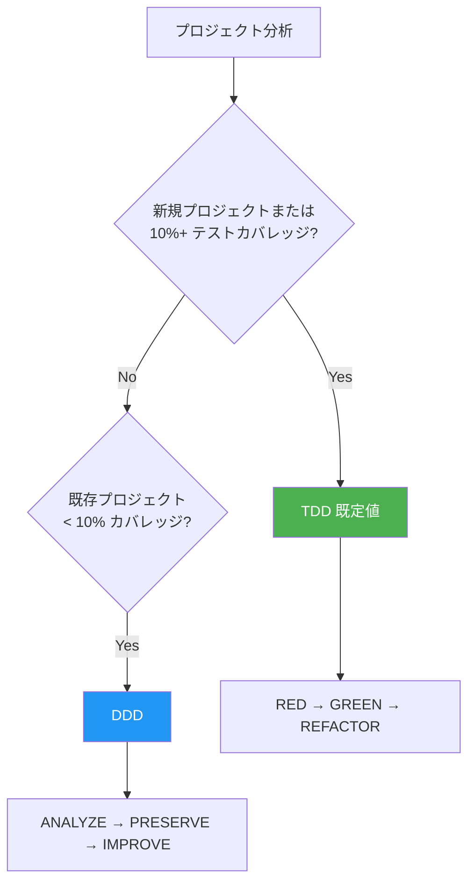
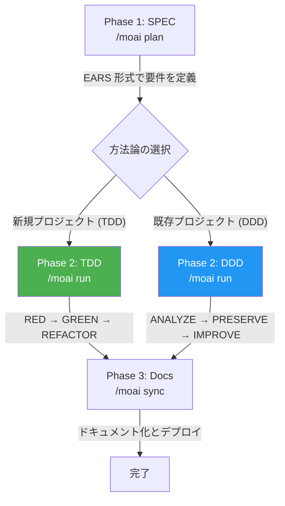

MoAI-ADK は **トークノミクス** (Token Economics) を目標とする Agentic Development Kit です。同じ品質のコードをより少ないトークンで、同じトークンでより高い品質を — モデル選択、推論の深さ、コンテキスト使用量をシステムが管理します。Go で書かれた単一バイナリなので、依存関係なしですぐに実行できます。

## 表記法の案内

このドキュメントでは、コードブロックのプレフィックスが実行環境を表します:

- **Claude Code** のチャット入力で入力するコマンド
  ```bash
  > /moai plan "機能の説明"
  ```

- **ターミナル** (Terminal) で入力するコマンド
  ```bash
  moai init my-project
  ```

## コアバリュー — 3つの柱

MoAI-ADK v3.0 の価値は3つの柱に要約されます。

| 柱 | 一言説明 | 代表ツール |
|------|-----------|----------|
| **トークノミクス** | コスト対品質を最大化するインテリジェントな資源配分 | 3層モデルポリシー · CG モード · Token Circuit Breaker |
| **エージェンティックループエンジニアリング** | ループが自ら働き、観察が蓄積されてハーネスが学習 | `/moai goal` · `/moai loop` · Analyze-First ルーティング |
| **エージェンティックハーネス** | コードを直接書く代わりにエージェントが働く環境を設計 | 11エージェント · SPEC 3-phase · TRUST 5 |

各柱の詳細は [コアコンセプト](/ja/core-concepts/) セクションで扱います。このドキュメントでは、始めるのに必要な分だけを見ていきます。

## コアコンセプト

MoAI-ADK は **SPEC ベースの TDD/DDD** 方法論を基盤とし、**TRUST 5** 品質フレームワークを通じてコード品質を保証します。

### SPEC とは? (やさしく理解する)

**SPEC** (Specification) は「AI と交わした対話をドキュメントとして残すこと」です。

**バイブコーディング** (Vibe Coding) の最大の問題は **コンテキストの喪失** です:

- AI と1時間議論した内容が、セッションが切れると **消えます**
- 翌日続きから作業するには **最初から説明し直す** 必要があります
- 複雑な機能ほど **意図と異なる結果** になります

**SPEC がこの問題を解決します:**

- 要件を **ファイルとして保存** し永久保存
- セッションが切れても SPEC を読むだけで **作業を継続** 可能
- EARS 形式で **曖昧さなく** 明確に定義
- 同じ説明を繰り返さないので **トークンも節約** できます


**一言要約:** 昨日 AI と議論した「JWT 認証 + 1時間の有効期限 + リフレッシュトークン」を今日また説明する必要はなく、`/moai run SPEC-AUTH-001` の1行ですぐに実装を開始できます!


### TDD とは? (やさしく理解する)

**TDD** (Test-Driven Development) は「テストを先に書いてから開発する方法」です。

試験問題づくりに例えると:

- **採点基準 (テスト) を先に書きます** — 機能がないので当然失敗
- **基準に合格する最小限のコードを書きます** — 必要な分だけ
- **より良いコードに磨き上げます** — テストが合格する状態を維持しながら改善

MoAI-ADK は **RED-GREEN-REFACTOR** サイクルでこのプロセスを自動化します:

| ステップ | 意味 | やること |
|------|------|--------|
| **RED** | 失敗 | まだ存在しない機能のテストを先に作成 |
| **GREEN** | 合格 | テストに合格する最小限のコードを作成 |
| **REFACTOR** | 改善 | テストを維持しながらコード品質を向上 |

### DDD とは? (やさしく理解する)

**DDD** (Domain-Driven Development) は「安全なコード改善の方法」です。

家のリフォームに例えると:

- **既存の家を壊さずに** 部屋を1つずつ改善します
- **リフォーム前に現在の状態を記録します** (= 特性テスト)
- **1部屋ずつ作業し、毎回確認します** (= 段階的改善)

MoAI-ADK は **ANALYZE-PRESERVE-IMPROVE** サイクルでこのプロセスを自動化します:

| ステップ | 意味 | やること |
|------|------|--------|
| **ANALYZE** | 分析 | 現在のコード構造と問題点を把握 |
| **PRESERVE** | 保存 | テストで現在の動作を記録 (セーフティネット) |
| **IMPROVE** | 改善 | テストに合格しながら少しずつ改善 |

### 開発方法論の選択

MoAI-ADK はプロジェクト状態に応じて最適な開発方法論を自動選択します。



| 方法論 | 対象 | サイクル |
|--------|------|--------|
| **TDD** | 新規プロジェクトまたは 10%+ カバレッジ | RED → GREEN → REFACTOR |
| **DDD** | 10% 未満カバレッジの既存プロジェクト | ANALYZE → PRESERVE → IMPROVE |


MoAI-ADK v2.5.0+ は二者択一の方法論選択 (TDD または DDD のみ) を採用しています。明確さと一貫性のために hybrid モードは削除されました。方法論は `moai init` 時に自動選択され、`.moai/config/sections/quality.yaml` の `development_mode` で変更できます。


### TRUST 5 品質フレームワーク

TRUST 5 は次の5つのコア原則に基づいています:

| 原則 | 説明 |
|------|------|
| **T**ested | 85% カバレッジ、特性テスト、動作の保存 |
| **R**eadable | 明確な命名規則、一貫したフォーマット |
| **U**nified | 統一されたスタイルガイド、自動フォーマット |
| **S**ecured | OWASP 準拠、セキュリティ検証、脆弱性分析 |
| **T**rackable | 構造化されたコミット、変更履歴の追跡 |

## Go Edition の特徴

MoAI-ADK は Python Edition を Go で完全に書き直し、性能と効率を最大化しました。

| 項目 | Python Edition | Go Edition |
|------|---------------|------------|
| 配布 | pip + venv + 依存関係 | **単一バイナリ**、依存関係なし |
| 起動時間 | ~800ms のインタプリタ起動 | **~5ms** のネイティブ実行 |
| 並行性 | asyncio / threading | **ネイティブ goroutines** |
| 型安全性 | ランタイム (mypy は任意) | **コンパイル時に強制** |
| クロスプラットフォーム | Python ランタイムが必要 | **ビルド済みバイナリ** (macOS, Linux, Windows) |

### 主要な数値 (v3.0 基準)

- **11個** のエージェントカタログ (10 MoAI カスタム + 1 Anthropic ビルトイン `Explore`)
- **27個** のスキル (template-managed)
- **36個** の CLI コマンド · **15種** の `/moai` サブコマンド
- **16個** のプログラミング言語をサポート
- **487個** の SPEC 文書を基盤に開発されたコードベース

## システム要件

| プラットフォーム | サポート環境 | 備考 |
|--------|----------|------|
| macOS | Terminal, iTerm2 | 完全サポート |
| Linux | Bash, Zsh | 完全サポート |
| Windows | **WSL (推奨)**, PowerShell 7.x+ | ネイティブ cmd.exe は非サポート |

**必須条件:**
- **Git** がすべてのプラットフォームにインストールされている必要があります
- **Windows ユーザー**: 最良の体験のために WSL (Windows Subsystem for Linux) の利用を推奨します

## 主な機能

### エージェントカタログ (11個)

MoAI オーケストレーターは直接実装せず、11個の専門エージェントに作業を委任します。計画と監査は分離されています — 作った本人は検査しません。

| カテゴリ | 数 | 主なエージェント |
|----------|------|--------------|
| **Manager** | 5個 | manager-spec, manager-develop, manager-docs, manager-git, manager-design |
| **Evaluator** | 2個 | plan-auditor, sync-auditor |
| **Builder** | 1個 | builder-harness |
| **Advisor** | 1個 | super-advisor (高推論アドバイザー) |
| **Specialist** | 1個 | e2e-specialist (ウェブ/モバイル/デスクトップの E2E テスト実行) |
| **ビルトイン** | 1個 | Explore (Anthropic 内蔵、読み取り専用のコード分析) |

### モデルポリシー (トークノミクス)

MoAI-ADK は Claude Code のサブスクリプションプランに合わせて、エージェントに最適な AI モデルを割り当てます。プランの使用量制限内で品質を最大化します — 計画・監査のような推論の重いステップには上位モデルを、反復作業には軽量モデルを割り当てます。

| ポリシー | プラン | 特徴 |
|------|--------|------|
| **High** | Max $200/月 | 最高品質 — 計画・監査に Opus を割り当て、最大スループット |
| **Medium** | Max $100/月 | 品質とコストのバランス |
| **Low** | Plus $20/月 | 経済的、Opus 非搭載 — Sonnet 中心の配分 |


Plus $20 プランは Opus を含みません。**Low** ポリシーを設定すれば、上位モデルなしでも使用量制限エラーなしにワークフロー全体が動作します。上位プランでは中核ステップ (計画、監査) に Opus を、一般的な作業に軽量モデルを配分します。


### 実行モードとオーケストレーション

自然言語のリクエストは **Analyze-First** ルーティングを経ます — どの言語でリクエストしても、まず意図を分析して適切なワークフローに接続します。オーケストレーターは作業の複雑さに応じて、順次サブエージェント (既定)、並列サブエージェントのファンアウト、動的ワークフローのいずれかを選択します。

```bash
/moai run SPEC-AUTH-001           # 複雑度に基づく自動選択
/moai run SPEC-AUTH-001 --solo    # 順次サブエージェントを強制
```


**v3.0 の変更**: かつての Agent Teams 静的オーケストレーション層は引退しました。`--team` を強制してもサブエージェントモードにフォールバックします。Claude Code のネイティブ teammate ランタイム — `moai cg` の tmux 分割ペイン — はそのまま維持されます。


### SPEC-First ワークフロー

MoAI-ADK は3段階の開発ワークフローに従います。Run フェーズの方法論はプロジェクト状態に応じて自動選択されます:



### エージェンティックループ

完了条件を宣言すると、ループが自ら働きます:

```text
/moai goal "すべてのテストが合格し lint がクリーンになるまで"   # 条件宣言型ループ
/moai loop                                              # 診断ベースの反復修正 (最大100回)
/moai fix                                               # シングルパスの自動修正
```

`/moai loop` は goal エンジン上のプリセットです — 診断ツールが見つけた課題キューをすべて空にするまで反復修正します。

### 推奨ワークフローチェーン

**新機能の開発:**
```
/moai plan → /moai run SPEC-XXX → /moai sync SPEC-XXX
```

**バグ修正:**
```
/moai fix (または /moai loop) → /moai review → /moai sync
```

**リファクタリング:**
```
/moai plan → /moai clean → /moai run SPEC-XXX → /moai review → /moai codemaps
```

**ドキュメント更新:**
```
/moai codemaps → /moai sync
```

## 多言語サポート

MoAI-ADK は次の4言語をサポートします:

- **韓国語** (Korean)
- **英語** (English)
- **日本語** (Japanese)
- **中国語** (Chinese)

インストールウィザードで希望する言語を選択するか、設定ファイルで直接変更できます。

## LSP 統合

**LSP** (Language Server Protocol) は、コードエディタと言語ツールの間の標準通信プロトコルです。コードエラー、型エラー、lint 結果をリアルタイムで検出し、即座にフィードバックを提供します。

**Ralph-Loop Style** は、LSP 診断結果をフィードバックループとして活用する自律ワークフローです。品質問題が検出されると修正エージェントを自動的に呼び出し、品質基準を達成するまで繰り返します。

MoAI-ADK は Ralph-Loop Style の LSP 統合を通じて自律ワークフローを提供します:

- **LSP ベースの完了自動検知**: コード品質状態をリアルタイムで監視
- **リアルタイム回帰検知**: 変更が既存機能に与える影響を即座に検知
- **自動完了条件**: 0 エラー、0 型エラー、85% カバレッジ達成時に自動的に完了処理


Ralph-Loop Style の LSP 統合は、開発ワークフローの品質ゲートを自動化し、手動介入なしでも高いコード品質を維持できるようにします。


## GLM でトークン節約 (50~70%)

GLM は Claude Code と完全互換の AI モデルです。**CG モード** で Claude リーダーと GLM チームメイトを組み合わせると、実装作業で **50~70% のトークンを節約** できます — トークノミクスの柱を代表する実戦ツールです。

### CG モード: Claude + GLM ハイブリッド

CG モードは、Claude がワークフロー全体をオーケストレーションし、実装作業はコストの低い GLM チームメイトが並列で処理する方式です。

| 役割 | モデル | 担当作業 |
|------|------|---------|
| **リーダー** | Claude | オーケストレーション、アーキテクチャ決定、コードレビュー |
| **チームメイト** | GLM | コード実装、テスト作成、ドキュメント化 |

| 作業タイプ | 推奨モード | 節約効果 |
|----------|----------|---------|
| 実装中心の SPEC (`/moai run`) | CG モード | **50~70% 節約** |
| コード生成、テスト、ドキュメント化 | CG モード | **50~70% 節約** |
| アーキテクチャ設計、セキュリティレビュー | Claude 専用 | 深い推論が必要 |

### GLM 切り替えコマンド

```bash
# GLM バックエンドに切り替え
moai glm

# GLM Worker モードを開始 (Claude リーダー + GLM チームメイト)
moai glm --team

# CG モード (Claude リーダー + GLM チームメイト、tmux 必須)
moai cg

# Claude バックエンドに復帰
moai cc
```


GLM アカウントをお持ちでない場合は [z.ai に登録 (追加10%割引)](https://z.ai/subscribe?ic=1NDV03BGWU) から登録できます。登録リンク経由の報酬は **MoAI オープンソース開発** に使われます。


## はじめる

MoAI-ADK の旅を始めるには、次のステップに従ってください:

1. **[インストール](/getting-started/installation)** - システムに MoAI-ADK をインストール
2. **[初期設定](/getting-started/init-wizard)** - インタラクティブ設定ウィザードを実行
3. **[クイックスタート](/getting-started/quickstart)** - 最初のプロジェクトを作成
4. **[コアコンセプト](/core-concepts/what-is-moai-adk)** - MoAI-ADK の深い理解

## 主なメリット

| メリット | 説明 |
|------|------|
| **品質保証** | TRUST 5 フレームワークで一貫した品質を維持 |
| **トークン効率** | モデルポリシー + CG モード + Token Circuit Breaker でコストをシステムが管理 |
| **生産性向上** | AI エージェントの自動化で開発時間を短縮 |
| **拡張可能** | モジュール型アーキテクチャとハーネスビルダーで柔軟に拡張 |
| **多言語** | 4言語をサポート |

## 追加リソース

- [GitHub リポジトリ](https://github.com/modu-ai/moai-adk)
- [ドキュメントサイト](https://adk.mo.ai.kr)
- [コミュニティフォーラム](https://github.com/modu-ai/moai-adk/discussions)

---

## 次のステップ

[インストールガイド](./installation) で MoAI-ADK のインストール方法を確認しましょう。
