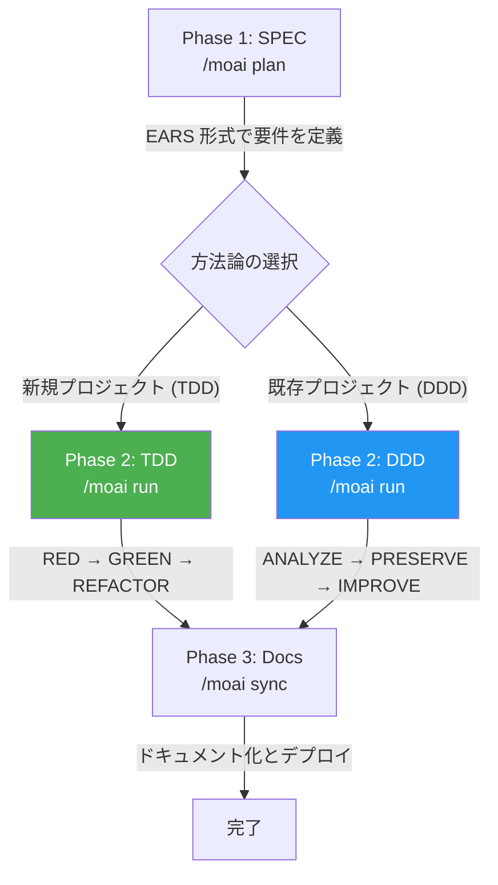

MoAI-ADK は、**コスト (トークノミクス)** · **自己改善 (エージェンティック · ループ · エンジニアリング)** · **品質統制 (エージェンティック · ハーネス)** の 3 つで Claude Code を包む Agentic Development Kit です。同じ品質のコードをより少ないトークンで作れます。完了条件を宣言するだけでループが自ら働き、その過程で積もった観察はハーネス学習の材料になります。「終わり」は SPEC 3 段階と TRUST 5 ゲートが証拠で判定します。モデルの選択も、推論の深さも、コンテキストの使用量も、システムが管理します。Go で書かれた単一バイナリなので、依存性なしにそのまま実行できます。

このページは、MoAI-ADK が何で、なぜこの形をしているのかをひとつの流れで紹介します。3 つの核心がそれぞれどんな問題に答えるのか、SPEC · TRUST 5 · CG モードのような用語がこの中のどこに位置するのか、そして初めて始めるときどこへ行けばよいのかまでを扱います。インストール手順と最初のプロジェクト実行は[インストール](/ja/getting-started/installation)と[クイックスタート](/ja/getting-started/quickstart)のページに任せ、ここでは「なぜ」に集中します。


## 表記の案内

このドキュメントでは、コードブロックの接頭辞が実行環境を表します:

- **Claude Code** の対話画面で入力するコマンド
  ```bash
  > /moai plan "機能の説明"
  ```

- **ターミナル** (Terminal) で入力するコマンド
  ```bash
  $ moai init my-project
  ```

## 3 つの核心価値

MoAI-ADK は Claude Code を **3 つの柱**で包む Agentic Development Kit です — コスト · 自己改善 · 品質統制。1 つの柱だけを押し進めると他が崩れます。コストだけ削れば品質が荒くなり、品質ゲートだけ立てれば同じ失敗が毎セッション繰り返され、自律ループだけ回れば 1 回の課金で上限を焼き切ります。3 つの柱が互いを支え合うのです。

### コスト — トークノミクス

同じ品質をより少ないトークンで。コストは単価ではなく**モデル配分**が決めます — DeepSWE ベンチマークでは、Opus の最も浅い推論が Sonnet の最も深い推論よりスコアが高いのにコストは 16 分の 1 でした。3 階層モデルポリシー · CG モード · プロンプトキャッシング · Token Circuit Breaker が、予算をシステムが管理します。

### 自己改善 — エージェンティック · ループ · エンジニアリング

ハーネスを回すほど賢くなります。完了条件を宣言するとループが自ら働き (`/moai goal` · `/moai loop`)、観察がルールとして積もって、次のセッションは同じ失敗を繰り返しません。

### 品質統制 — エージェンティック · ハーネス

「終わり」を証拠で判定します。SPEC 3 段階のライフサイクル + TRUST 5 ゲート + worktree 隔離で手戻り (最大のトークン無駄) を防ぎ、作った側が検査しないよう計画と監査を分離します。

各核心の詳しい内容は[核心概念](/ja/core-concepts/)セクションで扱います。

## v3.1 でより便利になった点

- **`/moai goal`** — 完了条件の宣言 1 行で、セッションが自律的に進行します。
- **カンバンモード** — 複数のセッションを同時に実行します。
- **BAS Navigator** — 3 段階のコードマップを自動同期します。
- **manager-lead** — SPEC 内の Tier L マイルストーンファンアウトに加え、カンバン・ファクトリーのリードセッションディスパッチも担う調整役です。
- **multi-model audit** — 複数モデルの交差検証でバイアスを捉えます。
- **autonomy tier** — 自律の段階を調整して、安全に回します。
- **profile matrix** — 12 エージェント × 3 プロファイルでモデルを割り当てます。

## 核心概念

MoAI-ADK は **SPEC ベースの TDD/DDD** 方法論に従い、**TRUST 5** 品質フレームワークでコード品質を保証します。

### SPEC とは? (やさしく理解する)

**SPEC** (Specification) は「AI と交わした対話をドキュメントとして残すこと」です。

**バイブコーディング** (Vibe Coding) の最大の問題は**文脈の喪失**です:

- AI と 1 時間かけて議論した内容が、セッションが切れると**消えます**
- 翌日続けて作業するには、**最初から説明し直す**必要があります
- 機能が複雑なほど、**意図と異なる結果**になります

**SPEC がこの問題を解決します:**

- 要件を**ファイルとして保存**して永久保全
- セッションが切れても SPEC を読めば**続きから作業**できる
- EARS 形式で**曖昧さなく**明確に定義
- 同じ説明を繰り返さないので**トークンも節約**できる


**ひとことで:** 昨日 AI と議論した「JWT 認証 + 1 時間の有効期限 + リフレッシュトークン」を今日また説明する必要はなく、`/moai run SPEC-AUTH-001` の 1 行ですぐ実装に取りかかれます!


### 方法論と品質基準

実装の進め方はプロジェクトの状態に応じて 2 つのうちの一方が自動で割り当てられ、成果物は共通の品質基準で検証されます。

| 名前 | いつ使うか | 詳しく |
|------|-----------|--------|
| **TDD** (Test-Driven Development) | 新規プロジェクトまたはテストカバレッジ 10% 以上 (デフォルト) | [SPEC ベース開発](/ja/core-concepts/spec-based-dev) |
| **DDD** (Domain-Driven Development) | テストカバレッジ 10% 未満の既存プロジェクト | [DDD](/ja/core-concepts/ddd) |
| **TRUST 5** | 方法論にかかわらずすべてのコード変更に適用 | [TRUST 5](/ja/core-concepts/trust-5) |


MoAI-ADK v2.5.0+ は TDD と DDD のどちらか 1 つだけを選びます。明確さと一貫性のために hybrid モードは廃止しました。方法論は `moai init` 時に自動で決まり、`.moai/config/sections/quality.yaml` の `development_mode` で変更できます。


## Go Edition の特徴

MoAI-ADK は Python Edition を Go で完全に書き直し、性能と効率を最大化しました。

| 項目 | Python Edition | Go Edition |
|------|---------------|------------|
| 配布 | pip + venv + 依存性 | **単一バイナリ**、依存性なし |
| 起動時間 | ~800ms のインタプリタ起動 | **~5ms** のネイティブ実行 |
| 並行性 | asyncio / threading | **ネイティブ goroutines** |
| 型安全性 | ランタイム (mypy は任意) | **コンパイル時に強制** |
| クロスプラットフォーム | Python ランタイムが必要 | **プリビルトバイナリ** (macOS, Linux, Windows) |

### 核心数値 (v3.0 基準)

- **11 個**のエージェントカタログ (MoAI カスタム 10 + Anthropic ビルトイン `Explore` 1)
- **31 個**のスキル (template-managed)
- **36 個**のターミナル CLI コマンド · **16 種**の `/moai` スラッシュサブコマンド
- **16 個**のプログラミング言語対応
- **543 個**の SPEC ドキュメントに基づいて開発されたコードベース

## システム要件

| プラットフォーム | 対応環境 | 備考 |
|--------|----------|------|
| macOS | Terminal, iTerm2 | 完全対応 |
| Linux | Bash, Zsh | 完全対応 |
| Windows | **WSL (推奨)**, PowerShell 7.x+ | ネイティブ cmd.exe は非対応 |

**必須条件:**
- **Git** がすべてのプラットフォームにインストールされている必要があります
- **Windows ユーザー**: 最もスムーズに使うには WSL (Windows Subsystem for Linux) を推奨します

## 主要機能

### エージェントカタログ (11 個)

MoAI オーケストレーターは自ら実装せず、11 個の専門エージェントに作業を委任します。計画と監査は分離されています。作った側が検査しません。

| カテゴリ | 数 | 主要エージェント |
|----------|------|--------------|
| **Manager** | 5 個 | manager-spec, manager-develop, manager-docs, manager-git, manager-design |
| **Evaluator** | 2 個 | plan-auditor, sync-auditor |
| **Builder** | 1 個 | builder-harness |
| **Advisor** | 1 個 | super-advisor (高推論の助言) |
| **Specialist** | 1 個 | e2e-tester (Web/モバイル/デスクトップの E2E テスト実行) |
| **ビルトイン** | 1 個 | Explore (Anthropic 内蔵、読み取り専用のコード分析) |

### モデルポリシー (トークノミクス)

MoAI-ADK は各エージェントに最適なモデルと推論の深さを割り当てます。目標は、料金プランの使用量上限の中で品質を最大限に引き上げることです。そのため、モデルクラスをより弱い側へ切り替える代わりに、同じ Opus の中で各エージェントの推論の深さだけを調整します。長く続くエージェンティック作業では、弱いモデルがステップをより多く消費して、課題あたりのコストがむしろ上がるためです。

| ティア | 特徴 |
|------|------|
| **high** | 最高品質 — 呼び出し頻度が最も低い 2 エージェントに `max` の推論の深さ |
| **medium** (デフォルト) | 品質とコストのバランス |
| **low** | 課題あたり最低コスト — エージェンティックなエージェントは Opus `low` effort まで下がり、Sonnet は単発の行のみ |


デフォルトのティアは **medium** です。ティアを調整してもモデルクラスは変わらず、各エージェントの Opus 推論の深さだけが変わります。`low` はエージェンティック行をすべて Opus `low` effort に保ち単発の行でのみ Sonnet を使い、`high` は呼び出し頻度が最も低い 2 エージェントを `max` effort に引き上げます。`--model-policy` フラグまたは初期化ウィザードで設定します。


### 実行モードとオーケストレーション

自然言語リクエストは **Analyze-First** ルーティングを通ります。どの言語でリクエストしても、まず意図を分析して適切なワークフローにつなぎます。オーケストレーターは作業の複雑度に応じて、順次サブエージェント (デフォルト)、並列サブエージェントのファンアウト、動的ワークフローのいずれかを選択します。

```bash
/moai run SPEC-AUTH-001           # 複雑度ベースの自動選択
/moai run SPEC-AUTH-001 --solo    # 順次サブエージェントを強制
```


**v3.0 の変更**: かつての Agent Teams 静的オーケストレーション階層は廃止されました。`--team` を強制してもサブエージェントモードにフォールバックします。Claude Code のネイティブ teammate ランタイム (`moai cg` の tmux 分割画面) はそのまま維持されます。


### SPEC-First ワークフロー

MoAI-ADK は 3 段階の開発ワークフローに従います。Run 段階の方法論はプロジェクトの状態に応じて自動選択されます:



### エージェンティックループ

完了条件を宣言すると、ループが自ら働きます:

```text
/moai goal "すべてのテストが通り lint がクリーンになるまで"   # 条件宣言型ループ
/moai loop                                              # 診断ベースの反復修正 (loop_prevention はデフォルト 100 回)
/moai fix                                               # 単一パスの自動修正
```

`/moai loop` は goal エンジンの上のプリセットです。診断ツールが見つけた課題キューを空にするまで反復修正します。

反復の上限は、異なる階層を受け持つ 2 つの設定がそれぞれ定めます。`workflow.loop_prevention.max_iterations` (デフォルト **100**) は個々の作業の診断修正ループの上限で、`workflow.agentic_loop.max_iterations` (デフォルト **10**) はパイプライン全体の完了ループの上限です。両者は別々の設定なので、値が異なっていても正常です。

### 推奨ワークフローチェーン

**新機能開発:**
```
/moai plan → /moai run SPEC-XXX → /moai sync SPEC-XXX
```

**バグ修正:**
```
/moai fix (または /moai loop) → /moai review → /moai sync
```

**リファクタリング:**
```
/moai plan → /moai clean → /moai run SPEC-XXX → /moai review → /moai codemaps
```

**ドキュメント更新:**
```
/moai codemaps → /moai sync
```

## 多言語対応

MoAI-ADK は次の 4 つの言語に対応します:

- **韓国語** (Korean)
- **英語** (English)
- **日本語** (Japanese)
- **中国語** (Chinese)

インストールウィザードで好みの言語を選ぶか、設定ファイルで直接変更できます。

## LSP 統合

**LSP** (Language Server Protocol) は、コードエディタと言語ツールの間の標準通信プロトコルです。コードエラー、型エラー、リント結果をリアルタイムで検出してすぐ知らせます。

**Ralph-Loop Style** は、LSP の診断結果をフィードバックループとして活用する自律ワークフローです。品質問題が検出されると修正エージェントを自動で呼び出し、品質基準を達成するまで反復します。

MoAI-ADK の Ralph-Loop Style LSP 統合は、次のように動作します:

- **LSP ベースの完了自動検出**: コード品質の状態をリアルタイムで監視
- **リアルタイムの回帰検出**: 変更が既存機能に与える影響を即時に検出
- **自動完了条件**: 0 エラー、0 型エラー、85% カバレッジ達成時に自動で完了処理


Ralph-Loop Style の LSP 統合は、開発ワークフローの品質ゲートを自動化し、人がいちいち手を下さなくてもコード品質を高く保ちます。


## CG モードでトークン節約 (50~70%)


**コスト (トークノミクス) の実践ツール:** z.ai GLM は Claude Code と完全互換の AI バックエンドです。**CG モード** (`moai cg`、tmux 必須) では Claude リーダーがオーケストレーション · アーキテクチャ決定 · コードレビューを担い、GLM チームメイトが実装 · テスト · ドキュメント化を並列に処理することで、実装中心の作業で**50~70% のトークンを節約**します。アーキテクチャ設計やセキュリティレビューのように深い推論が必要な場面では Claude 専用 (`moai cc`) を使います。

```bash
moai cc            # Claude 専用
moai glm           # GLM 専用
moai cg            # CG ハイブリッド (Claude リーダー + GLM チームメイト、tmux 必須)
```

GLM アカウントがない場合は [z.ai に登録 (追加 10% 割引)](https://z.ai/subscribe?ic=1NDV03BGWU)から登録してください。登録リンク経由の報酬は **MoAI オープンソース開発**に使われます。詳しいアーキテクチャとモデルポリシーは[マルチ LLM](/ja/multi-llm/)セクションを参照してください。


## 自己改善 — ループが自ら働き、ハーネスが学習する


**自己改善 (エージェンティック · ループ · エンジニアリング) の実践ツール:** 完了条件を宣言すると、条件が満たされるまでセッションが自ら働きます。`/moai goal "<条件>"` は条件宣言型の自律ループ、`/moai loop` は LSP 診断 · AST-grep · リンターが見つけた課題キューを空にするまでの反復修正 (パイプライン完了ループはデフォルト 10 回 — `agentic_loop.max_iterations`)、`/moai fix` は単一パスの自動修正です。ループが残した観察 (ユーザーの修正、失敗パターン、ルーティング決定) は、4 段階の学習はしご (観察 → ヒューリスティック → ルール → 自動更新、ユーザー承認ゲートの下) を通ってハーネス指針として積み上がります。だから次のセッションは前のセッションの失敗を繰り返しません。


## はじめる

MoAI-ADK を始めるには、次の順序で進めてください:

1. **[インストール](/ja/getting-started/installation)** - システムに MoAI-ADK をインストール
2. **[初期設定](/ja/getting-started/init-wizard)** - インタラクティブな設定ウィザードを実行
3. **[クイックスタート](/ja/getting-started/quickstart)** - 最初のプロジェクトを作成
4. **[核心概念](/ja/core-concepts/what-is-moai-adk)** - MoAI-ADK を深く理解

## 核心的な利点

| 利点 | 説明 |
|------|------|
| **品質保証** | TRUST 5 フレームワークで一貫した品質を維持 |
| **トークン効率** | モデルポリシー + CG モード + Token Circuit Breaker でコストをシステムが管理 |
| **生産性向上** | AI エージェントの自動化で開発時間を短縮 |
| **拡張可能** | モジュール型アーキテクチャとハーネスビルダーで柔軟に拡張 |
| **多言語** | 4 つの言語に対応 |

## 追加リソース

- [GitHub リポジトリ](https://github.com/modu-ai/moai-adk)
- [ドキュメントサイト](https://adk.mo.ai.kr)
- [GitHub Issues](https://github.com/modu-ai/moai-adk/issues)

---

## 次のステップ

[インストールガイド](/ja/getting-started/installation)で MoAI-ADK のインストール方法を確認しましょう。
