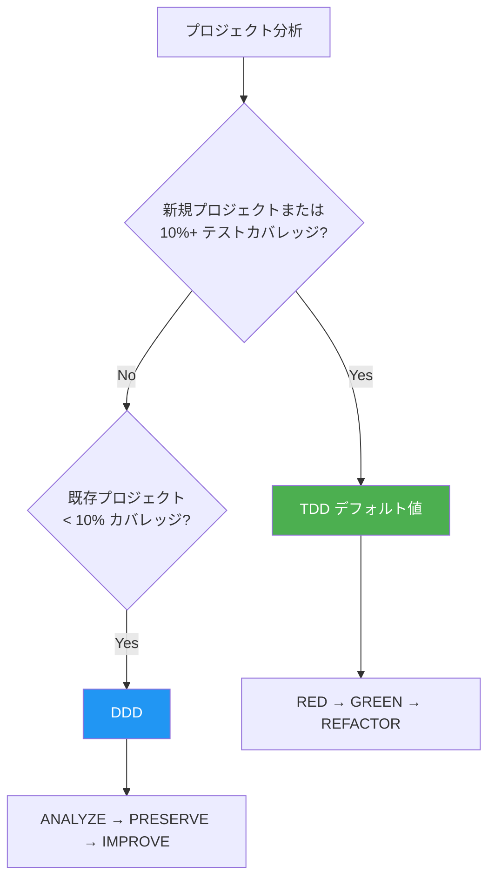
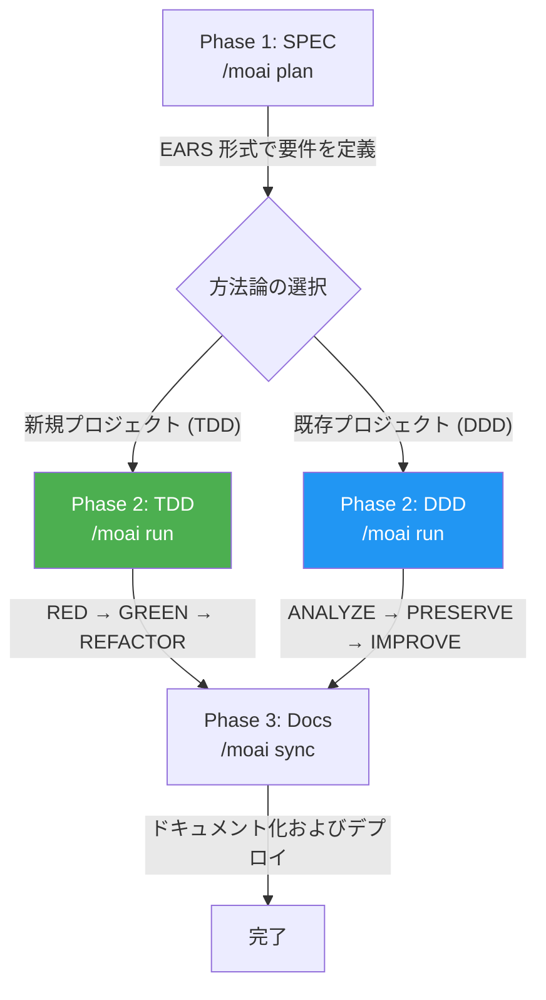

MoAI-ADK は **トークノミクス** (Token Economics) を目標とする Agentic Development Kit です。同じ品質のコードをより少ないトークンで、同じトークンでより高い品質を — モデル選択、推論深度、コンテキスト使用量をシステムが管理します。Go で書かれた単一バイナリなので、依存性なしですぐに実行できます。



## 表記法の案内

このドキュメントではコードブロックの接頭辞が実行環境を表します:

- **Claude Code** の対話画面で入力するコマンド
  ```bash
  > /moai plan "機能の説明"
  ```

- **ターミナル** (Terminal) で入力するコマンド
  ```bash
  moai init my-project
  ```

## 核心的な価値 — 3 つの柱

MoAI-ADK v3.0 の価値は 3 つの柱に要約されます。

| 柱 | 一行説明 | 代表的なツール |
|------|-----------|----------|
| **トークノミクス** | コスト対品質を最大化する知的な資源配分 | 3 階層モデルポリシー · CG モード · Token Circuit Breaker |
| **エージェンティックループエンジニアリング** | ループが自ら働き、観察が積み重なってハーネスが学習 | `/moai goal` · `/moai loop` · Analyze-First ルーティング |
| **エージェンティックハーネス** | コードを直接書く代わりにエージェントが働く環境を設計 | 11 個のエージェント · SPEC 3-phase · TRUST 5 |

各柱の詳しい内容は [核心概念](/ja/core-concepts/) セクションで扱います。このドキュメントでは開始に必要な分だけを見ていきます。

## 核心概念

MoAI-ADK は **SPEC ベースの TDD/DDD** 方法論を基盤とし、**TRUST 5** 品質フレームワークを通じてコード品質を保証します。

### SPEC とは? (やさしく理解する)

**SPEC** (Specification) は「AI と交わした対話をドキュメントに残すこと」です。

**バイブコーディング** (Vibe Coding) の最大の問題は **文脈の喪失** です:

- AI と 1 時間議論した内容がセッションが切れると **消えます**
- 翌日続けて作業するには **最初から説明し直す** 必要があります
- 複雑な機能ほど **意図と異なる結果** になります

**SPEC がこの問題を解決します:**

- 要件を **ファイルに保存** して永久保存
- セッションが切れても SPEC を読めば **続けて作業** 可能
- EARS 形式で **曖昧さなく** 明確に定義
- 同じ説明を繰り返さないので **トークンも節約** されます


**一行要約:** 昨日 AI と議論した「JWT 認証 + 1 時間有効期限 + リフレッシュトークン」を今日また説明する必要なく、`/moai run SPEC-AUTH-001` 一行ですぐに実装を開始します!


### TDD とは? (やさしく理解する)

**TDD** (Test-Driven Development) は「テストを先に書いて開発する方法」です。

試験問題作りにたとえると:

- **採点基準 (テスト) を先に書きます** — 機能がないので当然失敗
- **基準を通過する最小限のコードを書きます** — ちょうど必要な分だけ
- **より良いコードに整えます** — テストが通過する状態を維持しながら改善

MoAI-ADK は **RED-GREEN-REFACTOR** サイクルでこのプロセスを自動化します:

| ステップ | 意味 | やること |
|------|------|--------|
| **RED** | 失敗 | まだない機能のテストを先に書く |
| **GREEN** | 通過 | テストを通過する最小限のコードを書く |
| **REFACTOR** | 改善 | テストを維持しながらコード品質を向上 |

### DDD とは? (やさしく理解する)

**DDD** (Domain-Driven Development) は「安全なコード改善方法」です。

家のリモデリングにたとえると:

- **既存の家を壊さずに** 部屋を 1 つずつ改善します
- **リモデリング前に現在の状態を記録します** (= 特性化テスト)
- **1 部屋ずつ作業し、毎回確認します** (= 段階的な改善)

MoAI-ADK は **ANALYZE-PRESERVE-IMPROVE** サイクルでこのプロセスを自動化します:

| ステップ | 意味 | やること |
|------|------|--------|
| **ANALYZE** | 分析 | 現在のコード構造と問題点を把握 |
| **PRESERVE** | 保存 | テストで現在の動作を記録 (安全網) |
| **IMPROVE** | 改善 | テストを通過しながら少しずつ改善 |

### 開発方法論の選択

MoAI-ADK はプロジェクトの状態に応じて最適な開発方法論を自動選択します。



| 方法論 | 対象 | サイクル |
|--------|------|--------|
| **TDD** | 新規プロジェクトまたは 10%+ カバレッジ | RED → GREEN → REFACTOR |
| **DDD** | 10% 未満カバレッジの既存プロジェクト | ANALYZE → PRESERVE → IMPROVE |


MoAI-ADK v2.5.0+ は二値の方法論選択 (TDD または DDD のみ) を使います。明確性と一貫性のため hybrid モードは除去されました。方法論は `moai init` 時に自動選択され、`.moai/config/sections/quality.yaml` の `development_mode` で変更できます。


### TRUST 5 品質フレームワーク

TRUST 5 は次の 5 つの核心原則を基盤とします:

| 原則 | 説明 |
|------|------|
| **T**ested | 85% カバレッジ、特性化テスト、動作保存 |
| **R**eadable | 明確な命名規則、一貫したフォーマット |
| **U**nified | 統合されたスタイルガイド、自動フォーマット |
| **S**ecured | OWASP 準拠、セキュリティ検証、脆弱性分析 |
| **T**rackable | 構造化されたコミット、変更履歴の追跡 |

## Go Edition の特徴

MoAI-ADK は Python Edition を Go で完全に書き直し、性能と効率性を最大化しました。

| 項目 | Python Edition | Go Edition |
|------|---------------|------------|
| 配布 | pip + venv + 依存性 | **単一バイナリ**、依存性なし |
| 起動時間 | ~800ms インタプリタ起動 | **~5ms** ネイティブ実行 |
| 並行性 | asyncio / threading | **ネイティブ goroutines** |
| 型安全性 | ランタイム (mypy はオプション) | **コンパイル時に強制** |
| クロスプラットフォーム | Python ランタイムが必要 | **プリビルトバイナリ** (macOS, Linux, Windows) |

### 核心数値 (v3.0 基準)

- **11 個** のエージェントカタログ (10 MoAI カスタム + 1 Anthropic ビルトイン `Explore`)
- **27 個** のスキル (template-managed)
- **36 個** の CLI コマンド · **15 種** の `/moai` サブコマンド
- **16 個** のプログラミング言語対応
- **504 個** の SPEC ドキュメントを基に開発されたコードベース

## システム要件

| プラットフォーム | 対応環境 | 備考 |
|--------|----------|------|
| macOS | Terminal, iTerm2 | 完全対応 |
| Linux | Bash, Zsh | 完全対応 |
| Windows | **WSL (推奨)**, PowerShell 7.x+ | ネイティブ cmd.exe は非対応 |

**必須条件:**
- **Git** がすべてのプラットフォームにインストールされている必要があります
- **Windows ユーザー**: 最良の体験のため WSL (Windows Subsystem for Linux) の使用を推奨します

## 主要機能

### エージェントカタログ (11 個)

MoAI オーケストレーターは直接実装せず、11 個の専門エージェントに作業を委任します。計画と監査は分離されています — 作った人が検査しません。

| カテゴリ | 数量 | 主要エージェント |
|----------|------|--------------|
| **Manager** | 5 個 | manager-spec, manager-develop, manager-docs, manager-git, manager-design |
| **Evaluator** | 2 個 | plan-auditor, sync-auditor |
| **Builder** | 1 個 | builder-harness |
| **Advisor** | 1 個 | super-advisor (高推論の助言) |
| **Specialist** | 1 個 | e2e-tester (Web/モバイル/デスクトップの E2E テスト実行) |
| **ビルトイン** | 1 個 | Explore (Anthropic 内蔵、読み取り専用のコード分析) |

### モデルポリシー (トークノミクス)

MoAI-ADK は Claude Code のサブスクリプション料金プランに合わせてエージェントに最適な AI モデルを割り当てます。料金プランの使用量制限内で品質を最大化します — 計画・監査のように推論が重いステップには上位モデルを、反復作業には軽量モデルを割り当てます。

| ティア | 特徴 |
|------|------|
| **max** | 最高品質 — 計画・監査に Opus 割り当て、最大の推論深度 |
| **medium** (デフォルト値) | 品質とコストのバランス |
| **low** | 経済的 — Sonnet 中心の配分 |


デフォルトティアは **medium** です。`low` ティアは上位モデル (Opus) なしでもワークフロー全体が動作するよう設計されています。`max` ティアでは核心ステップ (計画、監査) に Opus を、一般作業に軽量モデルを割り当てます。`--model-policy` フラグまたは初期化ウィザードで設定します。


### 実行モードとオーケストレーション

自然言語リクエストは **Analyze-First** ルーティングを経ます — どの言語でリクエストしても意図を先に分析して適切なワークフローにつなげます。オーケストレーターは作業の複雑度に応じて順次サブエージェント (デフォルト)、並列サブエージェントのファンアウト、動的ワークフローのいずれかを選択します。

```bash
/moai run SPEC-AUTH-001           # 複雑度ベースの自動選択
/moai run SPEC-AUTH-001 --solo    # 順次サブエージェントを強制
```


**v3.0 の変更**: かつての Agent Teams 静的オーケストレーション階層は引退しました。`--team` を強制してもサブエージェントモードにフォールバックします。Claude Code のネイティブ teammate ランタイム — `moai cg` の tmux 分割画面 — はそのまま維持されます。


### SPEC-First ワークフロー

MoAI-ADK は 3 段階の開発ワークフローに従います。Run ステップの方法論はプロジェクトの状態に応じて自動選択されます:



### エージェンティックループ

完了条件を宣言するとループが自ら働きます:

```text
/moai goal "すべてのテストが通過し lint がクリーンになるまで"   # 条件宣言型ループ
/moai loop                                              # 診断ベースの反復修正 (最大 100 回)
/moai fix                                               # 単一パスの自動修正
```

`/moai loop` は goal エンジンの上のプリセットです — 診断ツールが見つけた課題キューを全部空にするまで反復修正します。

### 推奨ワークフローチェーン

**新機能開発:**
```
/moai plan → /moai run SPEC-XXX → /moai sync SPEC-XXX
```

**バグ修正:**
```
/moai fix (または /moai loop) → /moai review → /moai sync
```

**リファクタリング:**
```
/moai plan → /moai clean → /moai run SPEC-XXX → /moai review → /moai codemaps
```

**ドキュメント更新:**
```
/moai codemaps → /moai sync
```

## 多言語対応

MoAI-ADK は次の 4 つの言語に対応します:

- **韓国語** (Korean)
- **英語** (English)
- **日本語** (Japanese)
- **中国語** (Chinese)

インストールウィザードで好みの言語を選択するか、設定ファイルで直接変更できます。

## LSP 統合

**LSP** (Language Server Protocol) はコードエディタと言語ツールの間の標準通信プロトコルです。コードエラー、型エラー、リント結果をリアルタイムで検出して即座のフィードバックを提供します。

**Ralph-Loop Style** は LSP 診断結果をフィードバックループとして活用する自律ワークフローです。品質の問題が検出されると修正エージェントを自動呼び出しし、品質基準を達成するまで反復します。

MoAI-ADK は Ralph-Loop Style の LSP 統合を通じて自律ワークフローを提供します:

- **LSP ベースの完了自動検出**: コード品質の状態をリアルタイムでモニタリング
- **リアルタイムの回帰検出**: 変更が既存機能に与える影響を即座に検出
- **自動完了条件**: 0 エラー、0 型エラー、85% カバレッジ達成時に自動的に完了処理


Ralph-Loop Style の LSP 統合は開発ワークフローの品質ゲートを自動化し、手動介入なしでも高いコード品質を維持できるようにします。


## GLM でトークン節約 (50~70%)

GLM は Claude Code と完全互換の AI モデルです。**CG モード** で Claude リーダーと GLM チームメイトを組み合わせると、実装作業で **50~70% のトークンを節約** できます — トークノミクスの柱の代表的な実践ツールです。

### CG モード: Claude + GLM ハイブリッド

CG モードは Claude が全体のワークフローをオーケストレーションし、実装作業はコストの低い GLM チームメイトが並列で処理する方式です。

| 役割 | モデル | 担当作業 |
|------|------|---------|
| **リーダー** | Claude | オーケストレーション、アーキテクチャ決定、コードレビュー |
| **チームメイト** | GLM | コード実装、テスト作成、ドキュメント化 |

| 作業タイプ | 推奨モード | 節約効果 |
|----------|----------|---------|
| 実装中心の SPEC (`/moai run`) | CG モード | **50~70% 節約** |
| コード生成、テスト、ドキュメント化 | CG モード | **50~70% 節約** |
| アーキテクチャ設計、セキュリティレビュー | Claude 専用 | 深い推論が必要 |

### GLM 切替コマンド

```bash
# GLM バックエンドに切替 (GLM 単独)
moai glm

# CG モード (Claude リーダー + GLM チームメイト、tmux が必須)
moai cg

# Claude バックエンドに復帰
moai cc
```


GLM アカウントがなければ [z.ai に登録 (追加 10% 割引)](https://z.ai/subscribe?ic=1NDV03BGWU) で登録してください。登録リンクを通じた報酬は **MoAI オープンソース開発** に使われます。


## はじめる

MoAI-ADK の旅を始めるには次のステップに従ってください:

1. **[インストール](/getting-started/installation)** - システムに MoAI-ADK をインストール
2. **[初期設定](/getting-started/init-wizard)** - インタラクティブな設定ウィザードの実行
3. **[クイックスタート](/getting-started/quickstart)** - 最初のプロジェクトの作成
4. **[核心概念](/core-concepts/what-is-moai-adk)** - MoAI-ADK の深い理解

## 核心的な利点

| 利点 | 説明 |
|------|------|
| **品質保証** | TRUST 5 フレームワークで一貫した品質を維持 |
| **トークン効率** | モデルポリシー + CG モード + Token Circuit Breaker でコストをシステムが管理 |
| **生産性向上** | AI エージェントの自動化で開発時間を短縮 |
| **拡張可能** | モジュール型アーキテクチャとハーネスビルダーで柔軟に拡張 |
| **多言語** | 4 言語対応 |

## 追加リソース

- [GitHub リポジトリ](https://github.com/modu-ai/moai-adk)
- [ドキュメントサイト](https://adk.mo.ai.kr)
- [コミュニティフォーラム](https://github.com/modu-ai/moai-adk/discussions)

---

## 次のステップ

[インストールガイド](./installation) で MoAI-ADK のインストール方法を確認しましょう。
