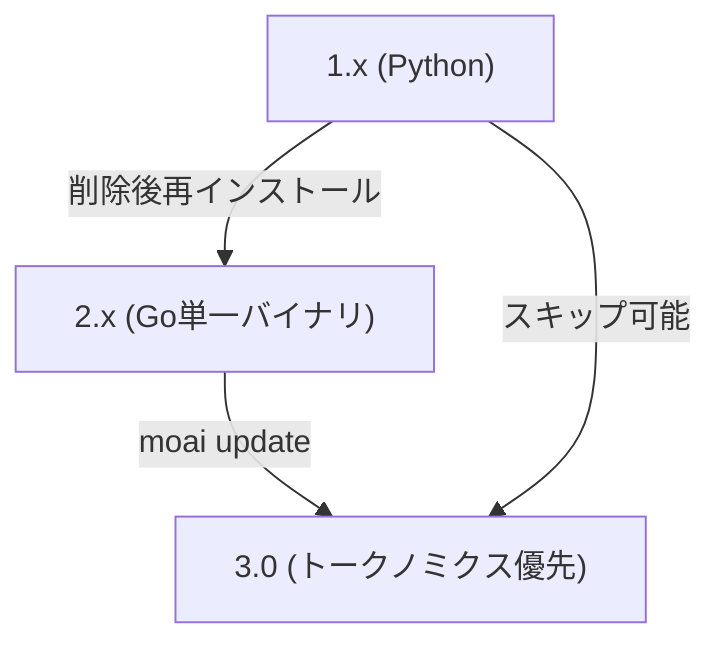

# マイグレーションガイド

MoAI-ADKは2度の大きな転換を経ました。(1) 1.x(Python)から2.x(Go単一バイナリ)、(2) 2.xから3.0(トークノミクス優先エージェントワークフロー)。このページは2つの転換を1つの流れに整理します。どこから来たかによって該当段落へジャンプしてください。

## 全体流れ



1.xユーザーは2.xを経ずに直接3.0へ上がれます。以下の1.x段落の削除手順を踏んだ後、[3.0インストール](#3-0-インストール)段落へ直接ジャンプしてください。

## 1.x (Python) ユーザー — 2.xへ


**MoAI-ADK 1.x (Python版)ユーザーは必ず先に既存バージョンを削除してください。** 1.xと2.xは同じ`moai`コマンドを使うため、既存バージョンが残っていると互いに衝突します。


### ステップ1: 既存1.xの削除

```bash
# uvでインストールした場合
uv tool uninstall moai-adk

# pipでインストールした場合
pip uninstall moai-adk
```

### ステップ2: 既存設定のバックアップ（オプション）

```bash
# 既存設定をバックアップしたい場合
cp -r ~/.moai ~/.moai-v1-backup
```

### ステップ3: 2.xのインストール

```bash
curl -fsSL https://adk.mo.ai.kr/install.sh | bash
```

### ステップ4: インストール確認

```bash
moai version
```

このステップを終えるとPythonランタイムと仮想環境はもう不要になります。2.xは単一のGoバイナリなので起動時間は約800msから5msに短縮され、ライセンスもGPL-3.0からApache-2.0に変わります。


**ライセンス変更**: MoAI-ADK 1.x(Python)はGPL-3.0、2.x(Go)からはApache-2.0です。商用利用・修正・配布が自由でソースコード公開の義務がありません。


### pip / uv衝突解決

pipとuvはパッケージを互いに異なる場所にインストールします。両方のツールを混ぜると`moai`コマンドが誤ったバージョンを実行する可能性があります。症状が現れたら完全に削除して再インストールしてください：

```bash
# 1. すべての既存バージョンを削除
uv tool uninstall moai-adk 2>/dev/null || true
pip uninstall moai-adk -y 2>/dev/null || true

# 2. 残ったバイナリの確認と削除
which moai && rm $(which moai) 2>/dev/null || true

# 3. 再インストール
curl -fsSL https://adk.mo.ai.kr/install.sh | bash

# 4. 確認
moai version
```

## 2.xユーザー — 3.0へ

3.0は2.xとの互換性を維持しながらトークノミクス優先へ転換した正式(GA)リリースです。ユーザーファイル（`.claude/`、`.moai/project/`、`.moai/specs/`）は自動的に保存されます。

### 3.0のインストール

既存プロジェクトはテンプレート同期を先に実行し、その後バイナリを上げます。

```bash
# 1. v3.0.0テンプレート同期（ユーザーファイル保存）
moai update

# 2. CLIバイナリアップグレード
moai update --binary

# 3. 確認
moai version    # v3.0.0を報告
```

新規プロジェクトやきれいな環境ではインストールスクリプト1行で十分です。

```bash
curl -fsSL https://adk.mo.ai.kr/install.sh | bash
```

Goが既にインストールされているなら`go install`も可能です。

```bash
go install github.com/modu-ai/moai-adk/cmd/moai@latest
```

### 3.0の主要な変更

3.0に上がることでエージェントカタログ・自律ループ・コスト統制が再構築されました。マイグレーションで最も頻繁に出くわす変更を整理します。

#### エージェントカタログ11個に統合

archivedエージェント名（`manager-strategy`、`expert-backend`、`researcher`など）が**spawn時に拒否**されます。代わりに (a) 11個の維持エージェントの1つを使うか、(b) ドメイン許可リストを入れた`Agent(general-purpose)`を場所ごとにspawnするパターンに変わります。

#### Agent Teams静的編成レイヤー retired

強制`--team` / `--mode team`は`MODE_TEAM_UNAVAILABLE`を出してサブエージェントモードへフォールバックします。ネイティブClaude Codeチームメイトランタイム（`moai cg` GLMフェイス、`worktree --team`）は影響を受けません。

#### Context7 MCP依存 retired

`mcp__context7__*`がすべての`allowed-tools`と設定askリストから削除されました。ライブラリドキュメント参照はWebSearch/WebFetchフォールバック戦略を使います。

#### `/moai e2e`多目的化

Web専用だったE2Eサブコマンドが廃止され、Web・モバイル・デスクトップを網羅するマルチプラットフォームサブシステム（`e2e-tester`エージェント主導）に再作られました。

#### プロファイルマトリックス導入 (3.0.1)

`plan_type × performance_tier` 2軸設計が**エージェントグループ別単一プロファイルマトリックス**（`max`/`medium`/`low`）に変わりました。`moai init --plan-type`はretiredし`moai init --profile <max|medium|low>`に代替されました。既存の`llm.yaml`（`plan_type` + `claude_models` + `performance_tier`）はエラーなしで読み込まれ正しいプロファイルに帰結されます — 次回保存時にretiredした鍵が整理されます。


**設定マイグレーションは自動です。** legacy `llm.yaml`がそのまま読み込まれ正しいプロファイルに変換されるので、設定ファイルを手作業で修正する必要がありません。


### v2 → v3クリーン再インストール関連の既知の問題

2.xから3.0に移る途中で報告された2つのregressionが3.0.0発表前後にすべて修正されました。

- **設定無限ループ(#1084)** — ユーザーが修正した`language.yaml` / `design.yaml`が毎実行ごとにデフォルト値に戻っていた問題。`system.yaml`の`v3.*`バージョンがv2指紋を回避するように修正されました。
- **テンプレート衝突ループ** — `.claude/rules/moai/design`が同時にretired経路とv3テンプレートに入っていてクリーン再インストールが無限に回る問題。retiredリストから当該項目を外し、ビルド時回帰ガードを追加しました。
- **retiredしたv2権限denyルール(#1101)** — v2時代の`deny`項目12個がアップグレードを経て生き残り、毎セッション開始時警告を出していた問題。3.0.1で1度のマイグレーションで整理されます。

最新の3.0.xバイナリを使っていればこれらの問題はすでに解決されています。

## スキップ — 1.xから3.0へ

1.xユーザーは2.xを経る必要なく3.0へ直接上がれます。

```bash
# 1. 既存Python版の削除
uv tool uninstall moai-adk 2>/dev/null || true
pip uninstall moai-adk -y 2>/dev/null || true
which moai && rm $(which moai) 2>/dev/null || true

# 2. (オプション)バックアップ
cp -r ~/.moai ~/.moai-v1-backup 2>/dev/null || true

# 3. 3.0のインストール
curl -fsSL https://adk.mo.ai.kr/install.sh | bash

# 4. 確認
moai version
```

ライセンスはGPL-3.0(1.x)からApache-2.0(2.x以上)に変わります。商用利用の制約がなくなります。

## アップグレード後の確認

バージョンを上げた後は以下を確認してください。

```bash
moai version      # 予想バージョン表示
moai doctor       # ハーネス・フック・設定健康点検
```

`moai doctor`が赤い項目を表示するなら、通常テンプレート同期が完全に終わっていません。`moai update`をもう一度実行すると大抵解決します。

## 削除

完全に削除するにはバイナリと設定ディレクトリを削除してください。

```bash
# バイナリ削除
rm "$(which moai)"

# 設定ディレクトリ削除（オプション）
rm -rf "$HOME/.moai"
```

## 次のステップ

- [インストール](/ja/getting-started/installation/) — OS別インストール詳細
- [初期設定ウィザード](/ja/getting-started/init-wizard/) — プロジェクト初期化
- [CLI概要](/ja/getting-started/cli/) — よく使うコマンド一巡り
