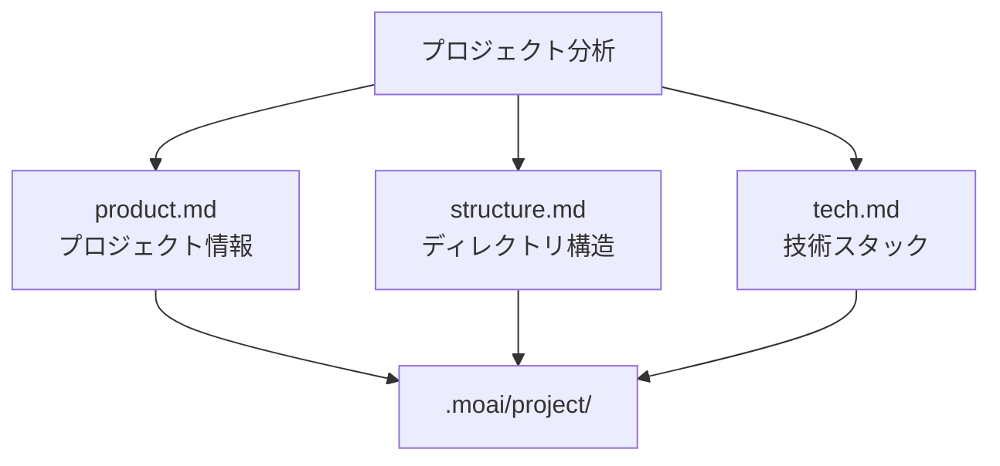
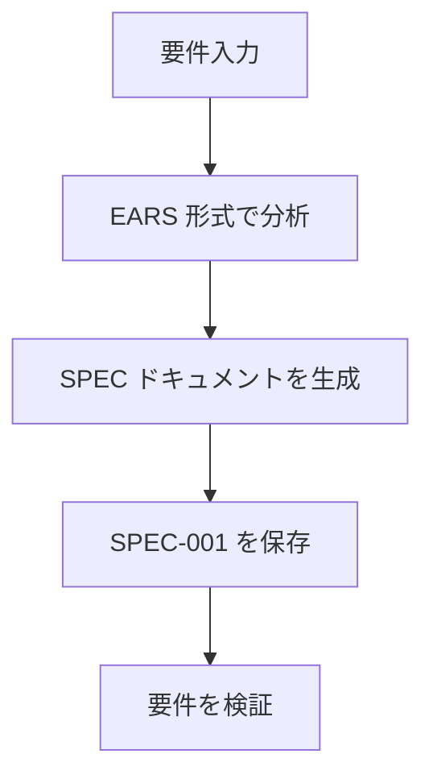
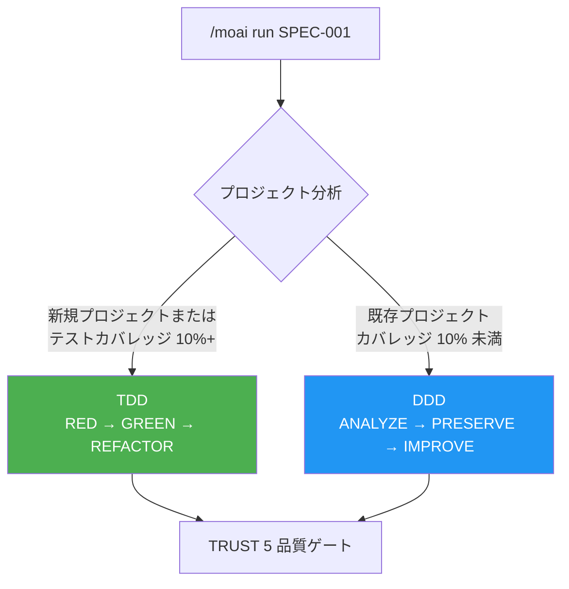
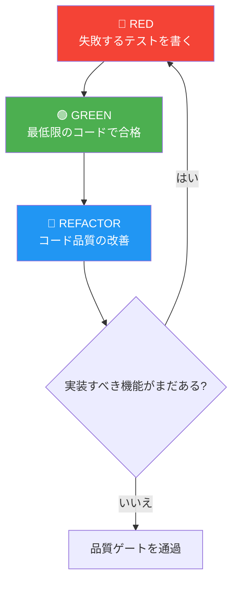
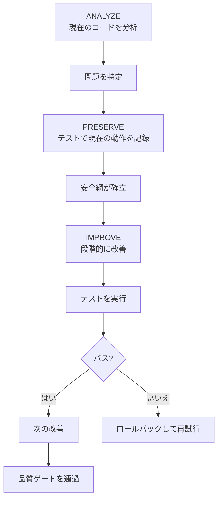
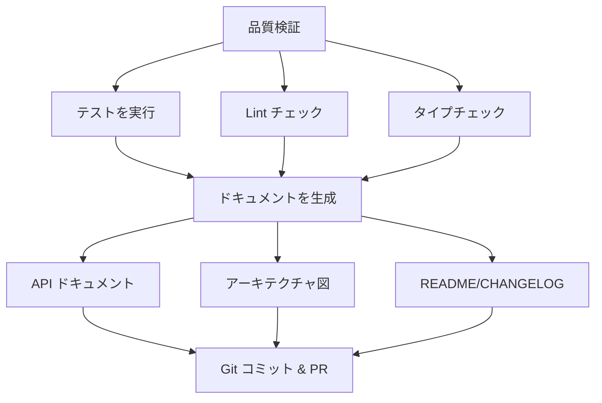
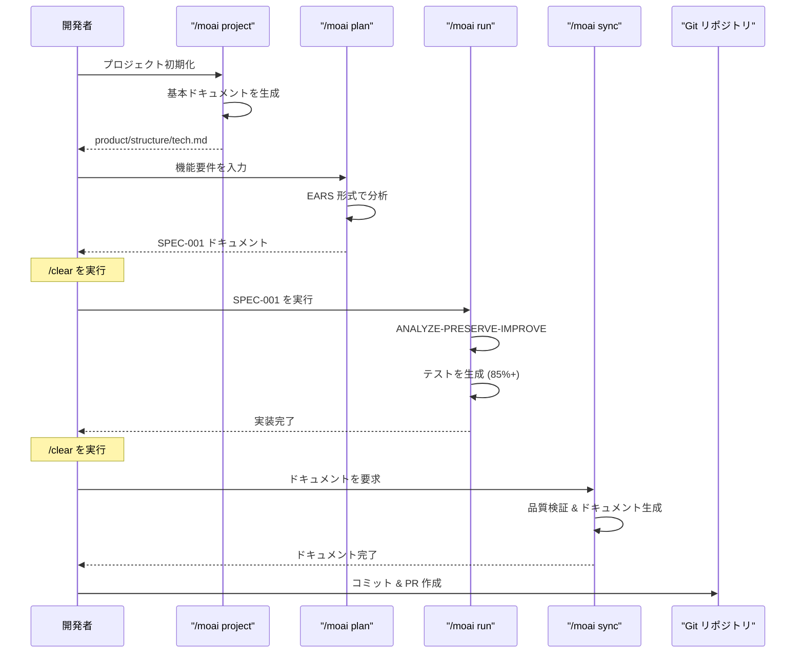
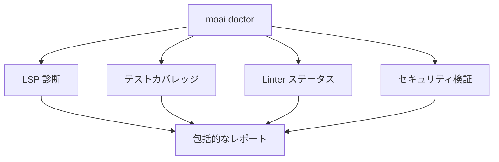

# クイックスタート

MoAI-ADK で最初のプロジェクトを作成し、開発ワークフローを体験します。

## 前提条件

開始する前に、以下が完了していることを確認してください:

- [x] MoAI-ADK がインストールされている ([インストールガイド](./installation))
- [x] 初期設定が完了している ([初期設定](./init-wizard))
- [x] GLM API キーを取得している

## 最初のプロジェクトを作成する

### ステップ 1: プロジェクトの初期化

`moai init` コマンドを使用して新しいプロジェクトを作成します:

```bash
moai init my-first-project
cd my-first-project
```

既存のプロジェクトで MoAI-ADK を初期化するには、そのフォルダーに移動して実行します:

```bash
cd existing-project
moai init
```

### ステップ 2: プロジェクトドキュメントの生成

基本的なプロジェクトドキュメントを生成します。このステップは Claude Code がプロジェクトを理解するために重要です。

```bash
> /moai project
```

このコマンドはプロジェクトを分析し、3 つのファイルを自動的に生成します:



| ファイル | 内容 |
|------|---------|
| **product.md** | プロジェクト名、説明、対象ユーザー、主な機能 |
| **structure.md** | ディレクトリツリー、フォルダーの目的、モジュール構成 |
| **tech.md** | 使用技術、フレームワーク、開発環境、ビルド/デプロイ設定 |


プロジェクトの初期セットアップ後や、構造が大きく変更されたときに `/moai project` を実行してください。


### ステップ 3: SPEC ドキュメントの作成

最初の機能の SPEC ドキュメントを作成します。EARS 形式を使用して明確な要件を定義します。


**SPEC が必要な理由?** 📝

**Vibe Coding** の最大の問題は **コンテキストの消失** です:

- AI でコーディングしていると、「待って、何をしようとしていたっけ?」という瞬間に遭遇します
- セッションが終了またはコンテキストが初期化されると、**以前議論した要件が消えてしまいます**
- 最終的に、説明を繰り返したり、意図とは異なるコードになったりします

**SPEC ドキュメントはこの問題を解決します:**

| 問題 | SPEC の解決策 |
|---------|---------------|
| コンテキストの消失 | **ファイルに保存すること**で要件を永続的に保持 |
| 曖昧な要件 | **EARS 形式**で明確に構造化 |
| コミュニケーションエラー | **受け入れ条件**で完了条件を指定 |
| 進捗を追跡できない | **SPEC ID** で作業単位を管理 |

**要約:** SPEC は「AI との会話を文書化すること」です。セッションが終了しても、SPEC ドキュメントを読むだけで作業を継続できます!


```bash
> /moai plan "ユーザー認証機能を実装"
```

このコマンドは以下を実行します:



生成された SPEC ドキュメントは `.moai/specs/SPEC-001/spec.md` に保存されます。


SPEC 作成後、トークンを節約するために必ず `/clear` を実行してください。


### ステップ 4: TDD/DDD 開発の実行

SPEC ドキュメントに基づいて開発方法論を選択して実装を進めます。

```bash
> /clear
> /moai run SPEC-001
```

MoAI-ADK はプロジェクトの状態に応じて最適な開発方法論を自動的に選択します。



---

#### TDD モード (新規プロジェクト / テストカバレッジ 10%+)


**TDD とは?** 📝

TDD は「試験問題を先に作ってから勉強すること」です:
- **テスト (採点基準) を先に書きます** — 機能がないので当然失敗します
- **テストに合格する最低限のコードを書きます** — ちょうど必要な分だけ
- **テストを維持しながらコードを改善します** — より良いコードに磨く

**ポイント:** コードよりもテストが先です!


**RED-GREEN-REFACTOR サイクル:**

| フェーズ | 意味 | やること |
|-------|---------|----------|
| 🔴 **RED** | 失敗 | まだない機能のテストを先に書く |
| 🟢 **GREEN** | 合格 | テストに合格する最低限のコードを書く |
| 🔵 **REFACTOR** | 改善 | テストを維持しながらコード品質を向上 |



---

#### DDD モード (既存プロジェクト / テストカバレッジ 10% 未満)


**DDD とは?** 🏠

DDD は「家のリフォーム」に似ています:
- **既存の家を壊さずに**、一度に一部屋を改善
- **リフォーム前に現状の写真を撮る** (= キャラクタリゼーションテスト)
- **一度に一部屋ず作業し、毎回確認** (= 段階的改善)

**ポイント:** 既存の動作を保持しながら安全に改善します!


**ANALYZE-PRESERVE-IMPROVE サイクル:**

| フェーズ | 例え | 実際の作業 |
|-------|---------|-------------|
| **ANALYZE** (分析) | 🔍 家の診断 | 現在のコード構造と問題を理解 |
| **PRESERVE** (保存) | 📸 現状の写真を撮る | キャラクタリゼーションテストで現在の動作を記録 |
| **IMPROVE** (改善) | 🔧 一部屋ずリフォーム | テストが通る状態で段階的に改善 |



---


`/moai run` は自動的に 85% 以上のテストカバレッジを目指します。開発方法論は `.moai/config/sections/quality.yaml` の `development_mode` から手動で変更できます。


**完了基準:**
- テストカバレッジ >= 85%
- 0 エラー、0 タイプエラー
- LSP ベースラインを達成

### ステップ 5: ドキュメントの同期

開発が完了したら、品質検証とドキュメントを自動生成します。

```bash
> /clear
> /moai sync SPEC-001
```

このコマンドは以下を実行します:



## 完全な開発ワークフロー



## 統合オートメーション: /moai

すべてのフェーズを一度に自動実行するには:

```bash
> /moai "ユーザー認証機能を実装"
```

MoAI は Plan → Run → Sync を自動実行し、並列探索で 3-4 倍速い分析を提供します。

```mermaid
flowchart TB
    A["/moai"] --> B[並列探索]
    B --> C["Explore Agent<br>コードベースを分析"]
    B --> D["Research Agent<br>技術ドキュメントを調査"]
    B --> E["Quality Agent<br>品質状態を評価]

    C --> F[統合分析]
    D --> F
    E --> F

    F --> G["Plan → Run → Sync を自動実行"]
```

## ワークフロー選択ガイド

| 状況 | 推奨コマンド | 理由 |
|-----------|---------------------|--------|
| 新しいプロジェクト | 最初に `/moai project` を実行 | 基本ドキュメントが必要 |
| シンプルな機能 | `/moai plan` + `/moai run` | 高速実行 |
| 複雑な機能 | `/moai` | 自動最適化 |
| 並列開発 | `--worktree` フラグを使用 | 独立した環境を保証 |

## 実用的な例

### 例 1: シンプルな API エンドポイント

```bash
# 1. プロジェクトドキュメントを生成 (初回のみ)
> /moai project

# 2. SPEC を作成
> /moai plan "ユーザーリスト API エンドポイントを実装"
> /clear

# 3. 実装
> /moai run SPEC-001
> /clear

# 4. ドキュメント & PR
> /moai sync SPEC-001
```

### 例 2: 複雑な機能 (MoAI を使用)

```bash
# プロジェクトドキュメントが存在する場合、MoAI で一度に実行
> /moai "JWT 認証ミドルウェアを実装"
```

### 例 3: 並列開発 (Worktree を使用)

```bash
# 独立した環境で並列開発
> /moai plan "決済システムを実装" --worktree
```

## ファイル構造の理解

標準的な MoAI-ADK プロジェクト構造:

```
my-first-project/
├── CLAUDE.md                        # Claude Code プロジェクトガイドライン
├── CLAUDE.local.md                  # プロジェクトローカル設定 (個人用)
├── .mcp.json                        # MCP サーバー設定
├── .claude/
│   ├── agents/                      # Claude Code エージェント定義
│   ├── commands/                    # スラッシュコマンド定義
│   ├── hooks/                       # フックスクリプト
│   ├── skills/                      # 再利用可能なスキル
│   └── rules/                       # プロジェクトルール
├── .moai/
│   ├── config/
│   │   └── sections/
│   │       ├── user.yaml            # ユーザー情報
│   │       ├── language.yaml        # 言語設定
│   │       ├── quality.yaml         # 品質ゲート設定
│   │       └── git-strategy.yaml    # Git 戦略設定
│   ├── project/
│   │   ├── product.md               # プロジェクト概要
│   │   ├── structure.md             # ディレクトリ構造
│   │   └── tech.md                  # 技術スタック
│   ├── specs/
│   │   └── SPEC-001/
│   │       └── spec.md              # 要件仕様
│   └── memory/
│       └── checkpoints/             # セッションチェックポイント
├── src/
│   └── [プロジェクトソースコード]
├── tests/
│   └── [テストファイル]
└── docs/
    └── [生成されたドキュメント]
```

## 品質チェック

開発中いつでも品質を確認できます:

```bash
moai doctor
```

このコマンドは以下を確認します:

- LSP 診断 (エラー、警告)
- テストカバレッジ
- Linter ステータス
- セキュリティ検証



## 役立つヒント

### トークン管理

大規模なプロジェクトでは、各フェーズ後に `/clear` を実行してトークンを節約します:

```bash
> /moai plan "複雑な機能を実装"
> /clear  # セッションをリセット
> /moai run SPEC-001
> /clear
> /moai sync SPEC-001
```

### バグ修正とオートメーション

```bash
# 自動修正
> /moai fix "テストの TypeError を修正"

# 完了まで繰り返し修正
> /moai loop "すべての linter 警告を修正"
```

---

## 次のステップ

[コアコンセプト](/core-concepts/what-is-moai-adk)で MoAI-ADK の高度な機能について学んでください。
