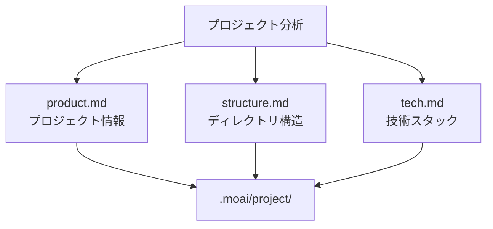
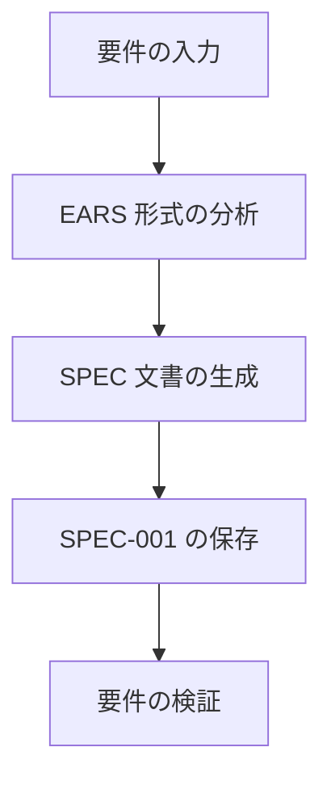
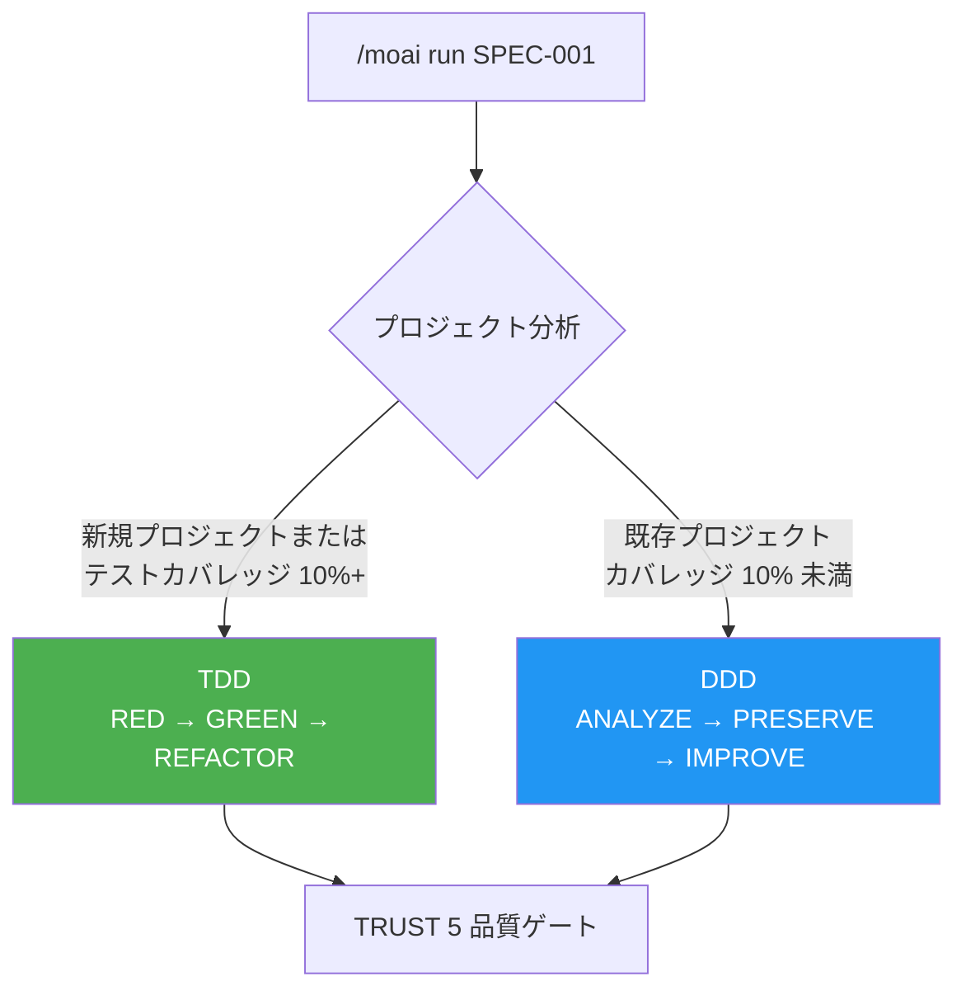
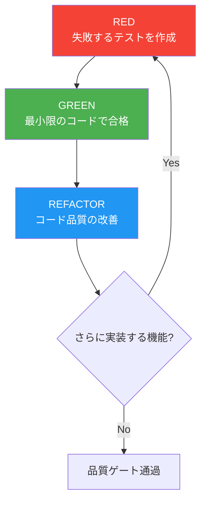
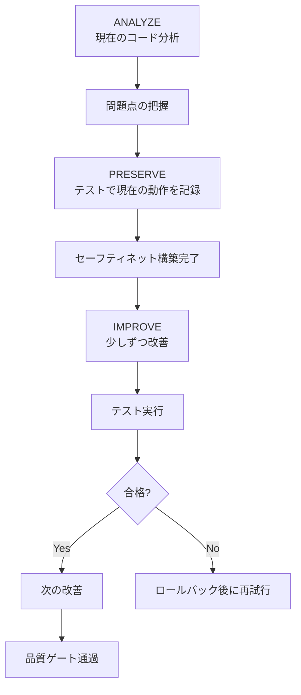
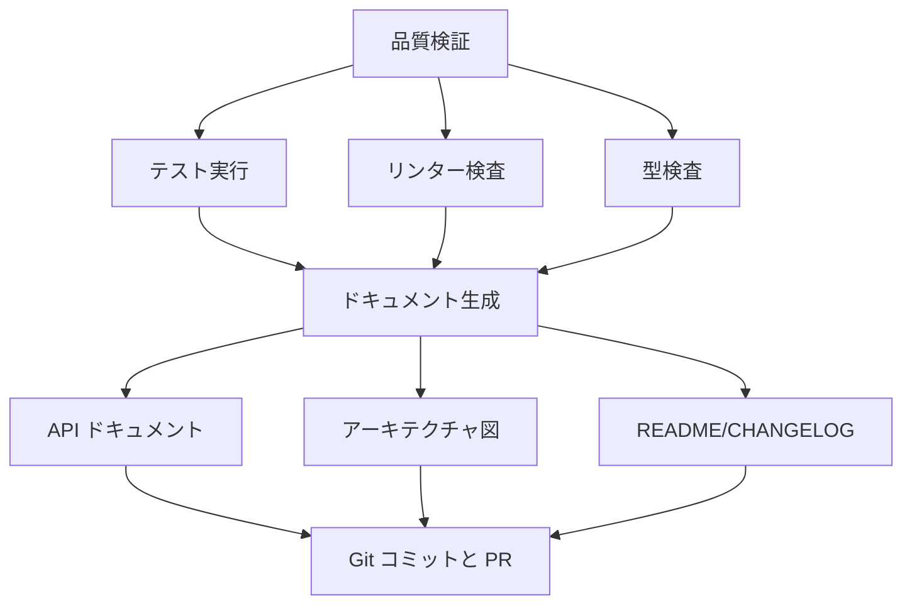
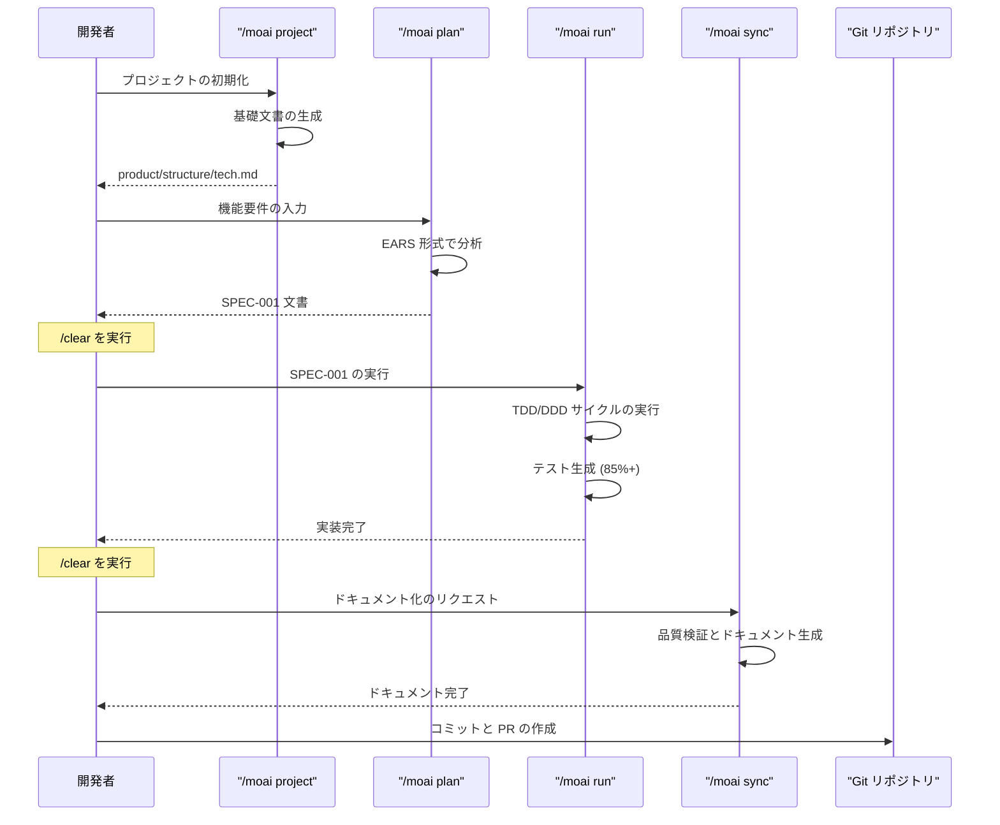
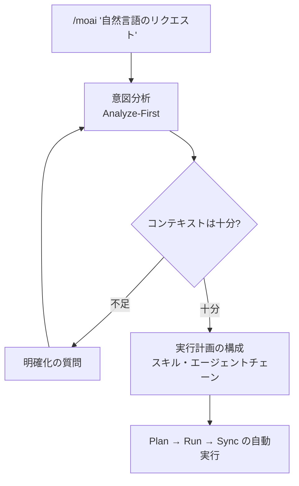
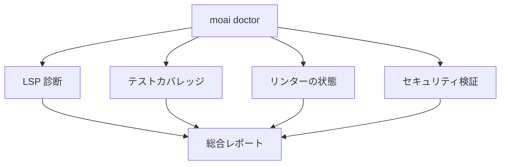

MoAI-ADK で最初のプロジェクトを作成し、開発ワークフローを体験してみましょう。このドキュメントに沿って進めると、SPEC 作成から実装、ドキュメント化まで1サイクルを完走できます。

## 事前準備

始める前に、以下が完了している必要があります:

- [x] MoAI-ADK のインストール ([インストールガイド](./installation))
- [x] 初期設定の完了 ([初期設定](./init-wizard))
- [ ] GLM API キーの取得 (任意 — CG モードでトークンコストを節約したい場合)

## 最初のプロジェクト作成

### ステップ 1: プロジェクトの初期化

新しいプロジェクトを作成するには `moai init` コマンドを使います:

```bash
moai init my-first-project
cd my-first-project
```

既存プロジェクトで MoAI-ADK を初期化するには、そのフォルダに移動してから実行します:

```bash
cd existing-project
moai init
```

### ステップ 2: プロジェクト文書の生成

プロジェクトの基礎文書を生成します。このステップは Claude Code がプロジェクトを理解するために必須です — 毎セッションでプロジェクト構造を説明する代わりに、エージェントがこの文書を読みます。

```bash
> /moai project
```

このコマンドはプロジェクトを分析し、次の3ファイルを自動生成します:


```mermaid
flowchart TB
    A["プロジェクト分析"] --> B["product.md<br>プロジェクト情報"]
    A --> C["structure.md<br>ディレクトリ構造"]
    A --> D["tech.md<br>技術スタック"]

    B --> E[".moai/project/"]
    C --> E
    D --> E
```

| ファイル | 内容 |
|------|------|
| **product.md** | プロジェクト名、説明、ターゲットユーザー、コア機能 |
| **structure.md** | ディレクトリツリー、主要フォルダの目的、モジュール構成 |
| **tech.md** | 使用技術、フレームワーク、開発環境、ビルド/デプロイ設定 |


`/moai project` はプロジェクトの初期設定後、または構造が大きく変わった後に実行してください。プロジェクト文書と一緒に、プロジェクト専用のハーネスも自動的に構成されます。


### ステップ 3: SPEC 文書の生成

最初の機能に対する SPEC 文書を生成します。EARS 形式を使って明確な要件を定義します。


**なぜ SPEC が必要なのか?**

**バイブコーディング** (Vibe Coding) の最大の問題は **コンテキストの喪失** です:

- AI と対話しながらコーディングしていると、「さっき何をしようとしてたんだっけ?」という瞬間が訪れます
- セッションが切れたりコンテキストが初期化されると、**以前議論した要件が消えます**
- 結局同じ説明を繰り返すか、意図と異なるコードが作られます

**SPEC 文書がこの問題を解決します:**

| 問題 | SPEC の解決方法 |
|------|-----------------|
| コンテキストの喪失 | 要件を **ファイルとして保存** し永久保存 |
| 曖昧な要件 | **EARS 形式** で明確に構造化 |
| コミュニケーションエラー | **受け入れ基準** で完了条件を明示 |
| 進捗の追跡不能 | **SPEC ID** で作業単位を管理 |

**一言要約:** SPEC は「AI と交わした対話をドキュメントとして残すこと」です。セッションが切れても SPEC 文書を読むだけで作業を再開できます — 同じ説明を繰り返さないのでトークンも節約できます。


```bash
> /moai plan "ユーザー認証機能の実装"
```

このコマンドは次を実行します:


```mermaid
flowchart TB
    A["要件の入力"] --> B["EARS 形式の分析"]
    B --> C["SPEC 文書の生成"]
    C --> D["SPEC-001 の保存"]
    D --> E["要件の検証"]
```

生成された SPEC 文書は `.moai/specs/SPEC-001/spec.md` に保存されます。


SPEC 生成後は `/clear` コマンドでコンテキストを空にしてください。決定事項はすでに SPEC ファイルに残っているので、対話履歴を維持する理由がありません — トークン節約の基本です。


### ステップ 4: TDD/DDD 開発の実行

SPEC 文書をもとに実装を進めます。

```bash
> /clear
> /moai run SPEC-001
```

MoAI-ADK はプロジェクト状態に応じて、最適な開発方法論を自動的に選択します。


```mermaid
flowchart TD
    A["/moai run SPEC-001"] --> B{"プロジェクト分析"}
    B -->|"新規プロジェクトまたは<br/>テストカバレッジ 10%+"| C["TDD<br/>RED → GREEN → REFACTOR"]
    B -->|"既存プロジェクト<br/>カバレッジ 10% 未満"| D["DDD<br/>ANALYZE → PRESERVE → IMPROVE"]
    C --> E["TRUST 5 品質ゲート"]
    D --> E
    style C fill:#4CAF50,color:#fff
    style D fill:#2196F3,color:#fff
```

---

#### TDD モード (新規プロジェクト / テストカバレッジ 10%+)


**TDD とは?**

TDD は「試験問題を先に作ってから勉強すること」です:
- **テスト (採点基準) を先に書きます** — 機能がないので当然失敗
- **テストに合格する最小限のコードを書きます** — 必要な分だけ
- **テストを維持しながらコードを改善します** — より良いコードに磨き上げる

**ポイント:** コードよりテストが先です!


**RED-GREEN-REFACTOR サイクル:**

| ステップ | 意味 | やること |
|------|------|--------|
| **RED** | 失敗 | まだ存在しない機能のテストを先に作成 |
| **GREEN** | 合格 | テストに合格する最小限のコードを作成 |
| **REFACTOR** | 改善 | テストを維持しながらコード品質を向上 |


```mermaid
flowchart TD
    A["RED<br/>失敗するテストを作成"] --> B["GREEN<br/>最小限のコードで合格"]
    B --> C["REFACTOR<br/>コード品質の改善"]
    C --> D{"さらに実装する機能?"}
    D -->|Yes| A
    D -->|No| E["品質ゲート通過"]
    style A fill:#f44336,color:#fff
    style B fill:#4CAF50,color:#fff
    style C fill:#2196F3,color:#fff
```

---

#### DDD モード (既存プロジェクト / テストカバレッジ 10% 未満)


**DDD とは?**

DDD は「家のリフォーム」に似ています:
- **既存の家を壊さずに** 部屋を1つずつ改善します
- **リフォーム前に現在の状態を写真に撮っておきます** (= 特性テスト)
- **1部屋ずつ作業し、毎回確認します** (= 段階的改善)

**ポイント:** 既存の動作を保存しながら安全に改善します!


**ANALYZE-PRESERVE-IMPROVE サイクル:**

| ステップ | 例え | 実際の作業 |
|------|------|----------|
| **ANALYZE** (分析) | 家の点検 | 現在のコード構造と問題点を把握 |
| **PRESERVE** (保存) | 現在の状態を撮影 | 特性テストで現在の動作を記録 |
| **IMPROVE** (改善) | 部屋を1つずつリフォーム | テストに合格しながら少しずつ改善 |


```mermaid
flowchart TD
    A["ANALYZE<br/>現在のコード分析"] --> B["問題点の把握"]
    B --> C["PRESERVE<br/>テストで現在の動作を記録"]
    C --> D["セーフティネット構築完了"]
    D --> E["IMPROVE<br/>少しずつ改善"]
    E --> F["テスト実行"]
    F --> G{"合格?"}
    G -->|Yes| H["次の改善"]
    G -->|No| I["ロールバック後に再試行"]
    H --> J["品質ゲート通過"]
```

---


`/moai run` は自動的に 85% 以上のテストカバレッジを目標に開発します。開発方法論は `.moai/config/sections/quality.yaml` の `development_mode` で手動変更できます。


**完了条件:**
- テストカバレッジ >= 85%
- 0 errors, 0 type errors
- LSP ベースラインの達成

完了判定は感覚ではなく証拠で行われます — 受け入れ基準の一つひとつがタスクとして登録され、テストが合格して初めてチェックされます。

### ステップ 5: ドキュメント同期

開発が完了したら、品質検証とドキュメントを自動生成します。

```bash
> /clear
> /moai sync SPEC-001
```

このコマンドは次を実行します:


```mermaid
graph TD
    A["品質検証"] --> B["テスト実行"]
    A --> C["リンター検査"]
    A --> D["型検査"]

    B --> E["ドキュメント生成"]
    C --> E
    D --> E

    E --> F["API ドキュメント"]
    E --> G["アーキテクチャ図"]
    E --> H["README/CHANGELOG"]

    F --> I["Git コミットと PR"]
    G --> I
    H --> I
```

## 開発ワークフロー全体


```mermaid
sequenceDiagram
    participant Dev as 開発者
    participant Project as "/moai project"
    participant Plan as "/moai plan"
    participant Run as "/moai run"
    participant Sync as "/moai sync"
    participant Git as "Git リポジトリ"

    Dev->>Project: プロジェクトの初期化
    Project->>Project: 基礎文書の生成
    Project-->>Dev: product/structure/tech.md

    Dev->>Plan: 機能要件の入力
    Plan->>Plan: EARS 形式で分析
    Plan-->>Dev: SPEC-001 文書

    Note over Dev: /clear を実行

    Dev->>Run: SPEC-001 の実行
    Run->>Run: TDD/DDD サイクルの実行
    Run->>Run: テスト生成 (85%+)
    Run-->>Dev: 実装完了

    Note over Dev: /clear を実行

    Dev->>Sync: ドキュメント化のリクエスト
    Sync->>Sync: 品質検証とドキュメント生成
    Sync-->>Dev: ドキュメント完了

    Dev->>Git: コミットと PR の作成
```

## 統合自動化: /moai

すべてのステップを一度に自動実行するには、自然言語でリクエストしてください:

```bash
> /moai "ユーザー認証機能の実装"
```

リクエストは **Analyze-First** ルーティングを経ます — どの言語でリクエストしても、まず意図を分析し、コンテキストが不足していれば質問で補完した後、Plan → Run → Sync パイプラインを自動的に実行します。


```mermaid
flowchart TB
    A["/moai '自然言語のリクエスト'"] --> B["意図分析<br>Analyze-First"]
    B --> C{"コンテキストは十分?"}
    C -->|"不足"| D["明確化の質問"]
    D --> B
    C -->|"十分"| E["実行計画の構成<br>スキル・エージェントチェーン"]
    E --> F["Plan → Run → Sync の自動実行"]
```

## ワークフロー選択ガイド

| 状況 | 推奨コマンド | 理由 |
|------|-----------|------|
| 新規プロジェクト | `/moai project` を先に実行 | 基礎文書が必須 |
| シンプルな機能 | `/moai plan` + `/moai run` | 迅速な実行 |
| 複雑な機能 | `/moai` | 自動最適化 |
| 並列開発 | `--worktree` フラグを使用 | 独立環境の保証 |

## 実践例

### 例 1: シンプルな API エンドポイント

```bash
# 1. プロジェクト文書の生成 (初回のみ)
> /moai project

# 2. SPEC の生成
> /moai plan "ユーザー一覧取得 API エンドポイントの実装"
> /clear

# 3. 実装
> /moai run SPEC-001
> /clear

# 4. ドキュメント化と PR
> /moai sync SPEC-001
```

### 例 2: 複雑な機能 (自然言語の自動化)

```bash
# プロジェクト文書がすでにあれば、自然言語で一括実行
> /moai "JWT 認証ミドルウェアの実装"
```

### 例 3: 並列開発 (Worktree の使用)

```bash
# 独立した環境で並列開発
> /moai plan "決済システムの実装" --worktree
```

## ファイル構造を理解する

MoAI-ADK プロジェクトの標準構造:

```
my-first-project/
├── CLAUDE.md                        # Claude Code プロジェクト指針
├── CLAUDE.local.md                  # プロジェクトローカル設定 (個人用)
├── .mcp.json                        # MCP サーバー設定
├── .claude/
│   ├── agents/                      # Claude Code エージェント定義
│   ├── commands/                    # スラッシュコマンド定義
│   ├── hooks/                       # フックスクリプト
│   ├── skills/                      # 再利用可能なスキル
│   └── rules/                       # プロジェクトルール
├── .moai/
│   ├── config/
│   │   └── sections/
│   │       ├── user.yaml            # ユーザー情報
│   │       ├── language.yaml        # 言語設定
│   │       ├── quality.yaml         # 品質ゲート設定
│   │       └── git-strategy.yaml    # Git 戦略設定
│   ├── project/
│   │   ├── product.md               # プロジェクト概要
│   │   ├── structure.md             # ディレクトリ構造
│   │   └── tech.md                  # 技術スタック
│   ├── specs/
│   │   └── SPEC-001/
│   │       └── spec.md              # 要件仕様書
│   └── memory/
│       └── checkpoints/             # セッションチェックポイント
├── src/
│   └── [プロジェクトのソースコード]
├── tests/
│   └── [テストファイル]
└── docs/
    └── [生成されたドキュメント]
```

## 品質確認

開発中いつでも品質を確認できます:

```bash
moai doctor
```

このコマンドは次を確認します:

- LSP 診断 (エラー、警告)
- テストカバレッジ
- リンターの状態
- セキュリティ検証


```mermaid
graph TD
    A["moai doctor"] --> B["LSP 診断"]
    A --> C["テストカバレッジ"]
    A --> D["リンターの状態"]
    A --> E["セキュリティ検証"]

    B --> F["総合レポート"]
    C --> F
    D --> F
    E --> F
```

## 便利なヒント

### トークン管理

各ステップ後に `/clear` を実行してコンテキストを空にしましょう。決定事項は SPEC と `progress.md` にファイルとして残っているので、対話履歴なしでも次のステップを続けられます:

```bash
> /moai plan "複雑な機能の実装"
> /clear  # セッションの初期化
> /moai run SPEC-001
> /clear
> /moai sync SPEC-001
```

### バグ修正と自動化

```bash
# 自動修正 (シングルパス)
> /moai fix "テストで発生する TypeError の修正"

# 反復修正 (完了するまで)
> /moai loop "すべてのリンター警告の修正"

# 完了条件宣言型ループ
> /moai goal "go test ./... exits 0; すべての lint 警告を解消"
```

---

## 次のステップ

[コアコンセプト](/core-concepts/what-is-moai-adk) で MoAI-ADK の高度な機能を確認しましょう。
