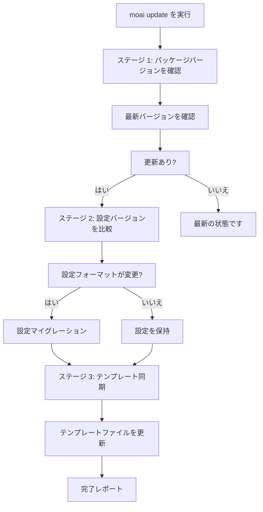
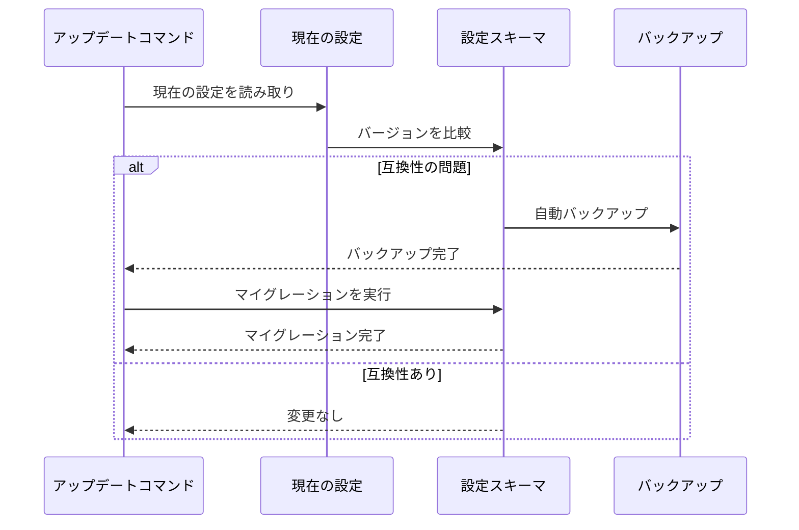
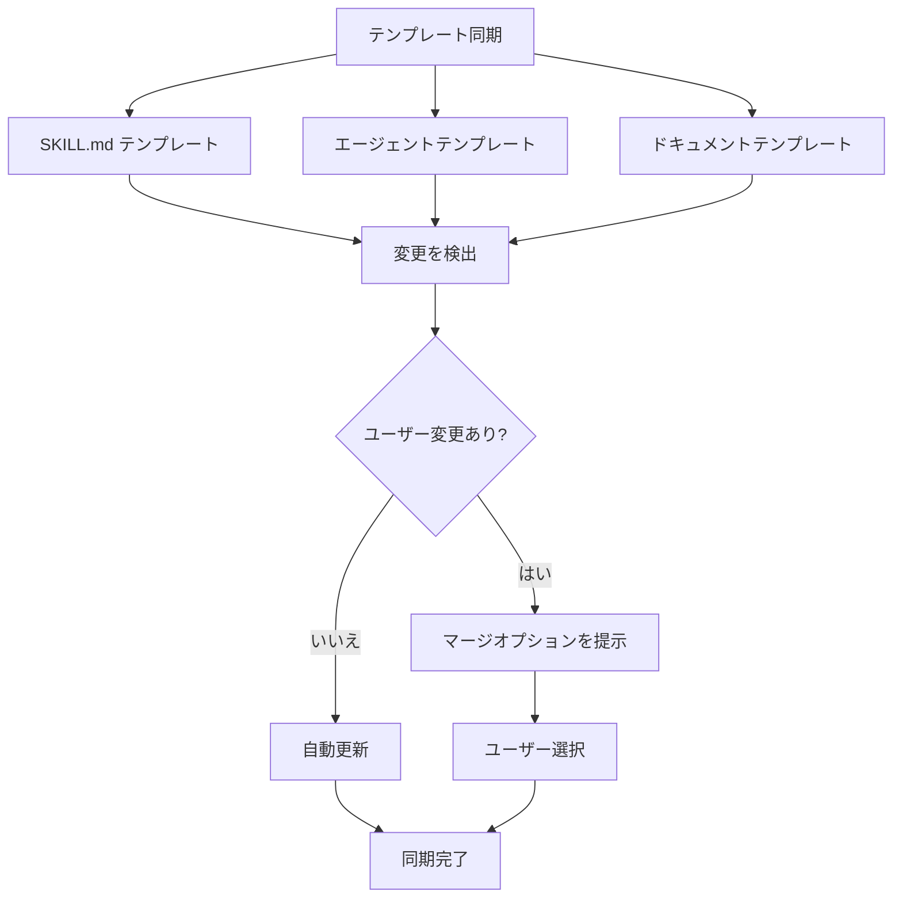

MoAI-ADK を最新の状態に保ち、スマートアップデートワークフローで円滑なアップグレードを行います。

## アップデートコマンド

MoAI-ADK を最新バージョンにアップデートするには:

```bash
moai update
```

このコマンドは 3 段階のスマートアップデートワークフローを実行します。

## 3 段階スマートアップデートワークフロー



### ステージ 1: パッケージバージョンの確認

まず、現在インストールされているバージョンと GitHub Releases の最新バージョンを比較します。

```bash
# 現在のバージョンを確認
moai --version

# 利用可能なアップデートを確認
moai update --check-only
```

**確認項目:**

- 現在インストールされているバージョン
- GitHub Releases の最新バージョン
- 変更ログ (新機能、バグ修正、互換性)

**出力例:**

```
Current version: 1.2.0
Latest version: 1.3.0

Release notes:
- Add new expert-performance agent
- Improve token optimization
- Fix SPEC validation issues

Update available! Run 'moai update' to upgrade.
```

### ステージ 2: 設定バージョンの比較

設定ファイルの形式と互換性を確認します。



**確認ファイル:**

- `.moai/config/sections/user.yaml`
- `.moai/config/sections/language.yaml`
- `.moai/config/sections/quality.yaml`

**マイグレーション例:**

```yaml
# 古い設定 (v1.2.0)
development_mode: ddd
test_coverage_target: 85

# 新しい設定 (v1.3.0)
development_mode: ddd
test_coverage_target: 85
ddd_settings:
  require_existing_tests: true
  characterization_tests: true
```


`.moai/config/` の設定ファイルはマイグレーション前に常にバックアップされます。


### ステージ 3: テンプレート同期

プロジェクトテンプレートと基本ファイルを最新バージョンに同期します。



**同期ファイル:**

- `.moai/templates/` - プロジェクトテンプレート
- `.claude/skills/` - スキルテンプレート
- `.claude/agents/` - エージェントテンプレート


ユーザーが変更したテンプレートファイルは保持され、新しいバージョンでマージオプションが提示されます。


## アップデートオプション

### 動作モード

| コマンド | バイナリ更新 | テンプレート同期 |
|---------|-------------|---------------|
| `moai update` | O | O |
| `moai update --binary` | O | X |
| `moai update --templates-only` | X | O |

### バイナリのみ更新

MoAI-ADKバイナリのみを更新し、テンプレートは同期しません:

```bash
$ moai update --binary
```

**使用場合:**
- テンプレートを手動で変更した場合
- テンプレート同期をスキップしたい場合
- バイナリ更新のみが必要な場合

### テンプレートのみ同期

テンプレートのみを同期し、バイナリは更新しません:

```bash
$ moai update --templates-only
```

**使用場合:**
- 最新のスキルとエージェントテンプレートを適用
- バイナリバージョンを維持しながらテンプレートのみを更新
- 複数プロジェクトでテンプレート同期が必要な場合

### 更新のみ確認

実際のアップデートなしで利用可能なバージョンを確認:

```bash
$ moai update --check-only
```

### 自動アップデート

確認なしで自動的にアップデート:

```bash
$ moai update --yes
```

### 特定バージョン

特定のバージョンにアップデート:

```bash
$ moai update --version 1.2.0
```

### バックアップ保持

アップデート失敗時の復元用にバックアップを保持:

```bash
$ moai update --keep-backup
```

## アップデート後の手順

### ステップ 1: バージョンを確認

```bash
moai --version
```

### ステップ 2: 設定を検証

```bash
moai doctor
```

### ステップ 3: 新機能を確認

```bash
moai --help
```

新しく追加されたコマンドやオプションを確認します。

## トラブルシューティング

### 問題: アップデート失敗

```bash
Error: Update failed - permission denied
```

**解決策:**

```bash
# curl で手動再インストール
curl -fsSL https://raw.githubusercontent.com/modu-ai/moai-adk/main/install.sh | bash

# または特定バージョンを再インストール
moai update --version <VERSION>
```

### 問題: 設定マイグレーションエラー

```bash
Error: Config migration failed
```

**解決策:**

```bash
# バックアップから復元
cp -r .moai/config.bak .moai/config

# 手動マイグレーション
vim .moai/config/sections/quality.yaml
```

### 問題: テンプレートの競合

```bash
Warning: Template conflicts detected
```

**解決策:**

```bash
# 自動マージ (ユーザー変更を保持)
$ moai update --merge

# 手動マージ (バックアップを保持、マージガイドを作成)
$ moai update --manual

# 強制アップデート (バックアップなし)
$ moai update --force
```

## 個人設定の管理

MoAI-ADK をアップデートすると、**CLAUDE.md** と **settings.json** は新しいバージョンで上書きされます。個人的な変更がある場合は、以下のように管理します。

### .local ファイルの使用

個人設定を別のファイルに保存して、アップデート時の上書きを防ぎます:

| ファイル | 場所 | 目的 |
|------|----------|---------|
| `CLAUDE.md` | プロジェクトルート | MoAI-ADK 管理 (アップデート時に変更) |
| `settings.json` | `.claude/` | MoAI-ADK 管理 (アップデート時に変更) |
| `CLAUDE.local.md` | プロジェクトルート | ✅ プロジェクト個人設定 (アップデートの影響なし) |
| `.claude/settings.local.json` | プロジェクト | ✅ プロジェクト個人設定 (アップデートの影響なし) |

**個人設定例 (プロジェクトローカル):**

```markdown
# CLAUDE.local.md

## ユーザー情報

- 名前: John Developer
- 役割: シニアソフトウェアエンジニア
- 専門分野: バックエンド開発、DevOps

## 開発設定

- 言語: Python、TypeScript
- フレームワーク: FastAPI、React
- テスト: pytest、Jest
- ドキュメント: Markdown、OpenAPI
```

**個人設定例 (settings):**

```json
// .claude/settings.local.json
{
  "env": {
    "ANTHROPIC_AUTH_TOKEN": "YOUR-API-KEY",
    "ANTHROPIC_BASE_URL": "https://api.z.ai/api/anthropic",
    "ANTHROPIC_DEFAULT_HAIKU_MODEL": "glm-4.7-flashx",
    "ANTHROPIC_DEFAULT_SONNET_MODEL": "glm-4.7",
    "ANTHROPIC_DEFAULT_OPUS_MODEL": "glm-4.7"
  },
  "permissions": {
    "allow": [
      "Bash(bun run typecheck:*)",
      "Bash(bun install)",
      "Bash(bun run build)"
    ]
  },
  "enabledMcpjsonServers": [
    "context7"
  ],
  "companyAnnouncements": [
    "🗿 MoAI-ADK: 28個の専門エージェント + 52個のSkillsでSPEC-First DDD",
    "⚡ /moai: ワンストップ Plan→Run→Sync 自動化（インテリジェントルーティング）",
    "🌳 moai worktree: 隔離されたワークツリー環境で並列SPEC開発",
    "🤖 Expert Agents (8): backend, frontend, security, devops, debug, performance, refactoring, testing",
    "🤖 Manager Agents (8): git, spec, ddd, tdd, docs, quality, project, strategy",
    "🤖 Builder Agents (3): agent, skill, plugin",
    "🤖 Team Agents (8, 実験的): researcher, analyst, architect, designer, backend-dev, frontend-dev, tester, quality",
    "📋 ワークフロー: /moai plan (SPEC) → /moai run (DDD) → /moai sync (Docs)",
    "🚀 オプション: --team (並列Agent Teams)、--ultrathink (Sequential Thinking MCPで深い分析)、--loop (反復自動修正)",
    "✅ 品質: TRUST 5 + 85%+ カバレッジ + Ralph Engine (LSP + AST-grep)",
    "🔄 Git戦略: 3-Mode (Manual/Personal/Team) + Smart Merge設定更新",
    "📚 ヒント: moai update --templates-only で最新のskillsとagentsを同期",
    "📚 ヒント: moai worktree new SPEC-XXX で並列開発用のworktreeを作成",
    "⚙️ moai update -c: モデル可用性設定 (high/medium/low) - Claudeプラン別モデル構成",
    "💡 ハイブリッドモード: PlanはClaude (Opus/Sonnet)、Run/SyncはGLM-5でコスト削減",
    "💡 並列開発: ターミナル1はClaude、ターミナル2+は 'moai glm && claude' で並列実行",
    "💎 GLM-5スポンサー: z.aiパートナーシップ - コスト効率の高いAIで同等のパフォーマンス"
  ],
  "_meta": {
    "description": "User-specific Claude Code settings (gitignored - never commit)",
    "created_at": "2026-01-27T18:15:26.175926Z",
    "note": "Edit this file to customize your local development environment"
  }
}
```


**設定優先順位:** Local > Project > User > Enterprise<br />
<code>settings.local.json</code> はプロジェクト設定を上書きします。


### moai フォルダー構造

MoAI-ADK は以下のフォルダーのファイルのみを管理します:

```
.claude/
├── agents/
│   └── moai/                # MoAI-ADK エージェント (アップデート対象)
│
├── hooks/
│   └── moai/                # MoAI-ADK フックスクリプト (アップデート対象)
│
├── skills/
│   ├── moai-*               # MoAI-ADK スキル (moai- プレフィックス、アップデート対象)
│   │
│   └── my-skills/           # ✅ 個人スキル (アップデートなし)
│
└── rules/
    └── moai/                # ルールファイル (moai 管理)
        ├── core/            # コア原則と憲法
        ├── development/     # 開発ガイドラインと標準
        ├── languages/       # 言語別ルール (16 言語)
        └── workflow/        # ワークフロー段階定義
```

**命名規則:**

| タイプ | 場所 | アップデートの影響 |
|------|----------|---------------|
| **エージェント** | `agents/moai/` | ⚠️ **アップデート時に変更** |
| **フック** | `hooks/moai/` | ⚠️ **アップデート時に変更** |
| **スキル** | `skills/moai-*` | ⚠️ **アップデート時に変更** |
| **ルール** | `rules/moai/` | ⚠️ **アップデート時に変更** |
| **個人エージェント** | `agents/my-agents/` | ✅ **アップデートの影響なし** |
| **個人スキル** | `skills/my-skills/` | ✅ **アップデートの影響なし** |


**重要:** `moai-*` プレフィックスを持つスキルは MoAI-ADK によって管理されます。個人の追加や変更には `my-*` フォルダーまたは別のプレフィックスを使用してください。



**重要:** `moai/` フォルダーのファイルはアップデート時に上書きされる可能性があります。個人の追加や変更には別のフォルダーを使用してください。


### ファイルの整理方法

```bash
# 個人エージェントを移動 (例)
mv .claude/agents/my-agent.md .claude/my-agents/

# 個人スキルを移動 (例)
mv .claude/skills/my-skill.md .claude/my-skills/
```

### 変更ログ

最近の変更については [GitHub Releases](https://github.com/modu-ai/moai-adk/releases) を確認してください。

## ロールバック

アップデート後に問題が発生した場合、以前のバージョンにロールバックできます:

```bash
# 特定バージョンにロールバック
moai update --version 1.2.0

# またはバックアップから復元
cp -r .moai/config.bak .moai/config
```


ロールバック前に作業をコミットしてください。


## 次のステップ

アップデート完了後:

1. **[変更ログを確認](/getting-started/update)** - 新機能を学ぶ
2. **[コアコンセプト](/core-concepts/what-is-moai-adk)** - 新しいエージェントと機能をマスターする
3. **[クイックスタート](/getting-started/quickstart)** - プロジェクトに新機能を適用する

---

定期的にアップデートして、MoAI-ADK の最新機能と改善を活用してください!
