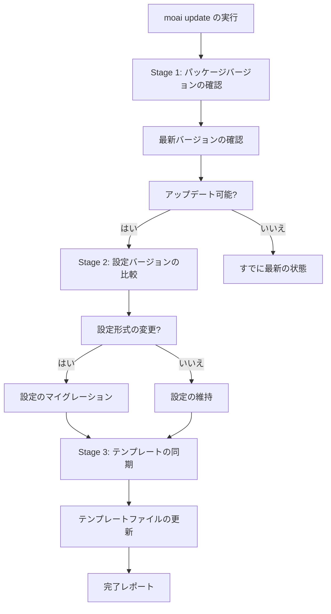
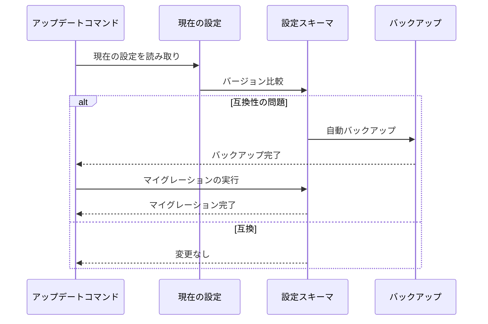
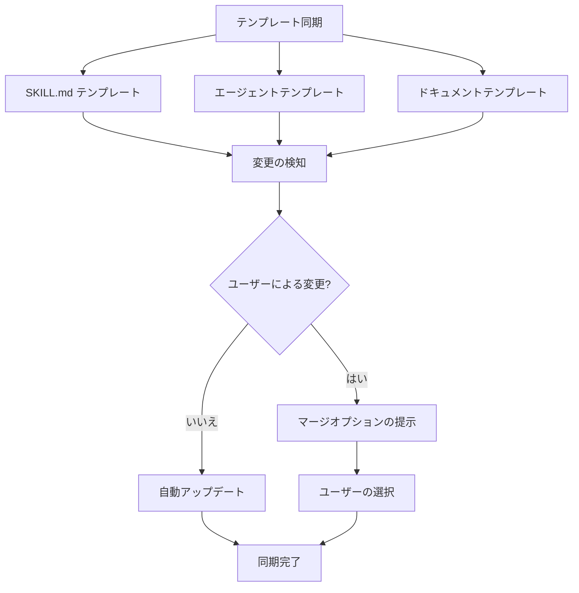

MoAI-ADK を最新バージョンに保つ方法を案内します。`moai update` 1つでバイナリとテンプレートが一緒に更新され、ユーザーが作成したカスタム資産は自動的に保存されます。

## アップデートコマンド

MoAI-ADK を最新バージョンにアップデートするには:

```bash
moai update
```

このコマンドは3段階のスマートアップデートワークフローを実行します。

## 3段階スマートアップデートワークフロー


```mermaid
flowchart TD
    A[moai update の実行] --> B[Stage 1: パッケージバージョンの確認]
    B --> C[最新バージョンの確認]
    C --> D[アップデート可能?]

    D -->|はい| E[Stage 2: 設定バージョンの比較]
    D -->|いいえ| F[すでに最新の状態]

    E --> G[設定形式の変更?]
    G -->|はい| H[設定のマイグレーション]
    G -->|いいえ| I[設定の維持]

    H --> J[Stage 3: テンプレートの同期]
    I --> J

    J --> K[テンプレートファイルの更新]
    K --> L[完了レポート]
```

### Stage 1: パッケージバージョンの確認

まず、現在インストールされているバージョンと GitHub Releases の最新バージョンを比較します。

```bash
# 現在のバージョンを確認
moai --version

# 利用可能なアップデートを確認
moai update --check-only
```

**確認項目:**

- 現在インストールされているバージョン
- GitHub Releases の最新バージョン
- 変更ログ (新機能、バグ修正、互換性)

**出力例:**

```
Current version: 1.2.0
Latest version: 1.3.0

Release notes:
- Add new manager-develop agent
- Improve token optimization
- Fix SPEC validation issues

Update available! Run 'moai update' to upgrade.
```

### チェックサムの必須検証 (Mandatory Checksum Verification) {#checksum-verification}

v2.20.0-rc1 から、`moai update` のバイナリダウンロードは **チェックサム検証を回避できません**。リリースの `checksums.txt` のダウンロードが失敗するか、パースが失敗すると、sentinel error `ErrChecksumUnavailable` を返してアップデートフローを **abort** します — バイナリのダウンロードを試みません。

#### Retry ポリシー

`checksums.txt` のダウンロードは **3回の retry** を指数バックオフで試行します:

| 試行 | 待機時間 |
|------|-----------|
| 1回目 (即時) | 0s |
| 2回目 retry | 2s 待機 |
| 3回目 retry | 4s 待機 |
| 追加 retry なし | 合計 ~6s 待機後に失敗 |

(内部実装: base delay 2s × 2^(attempt-1) の指数バックオフ、defense-in-depth として checker と updater の両段階で empty checksum を遮断)

すべての retry が失敗すると、次のようなメッセージが出力されます:

```
error: checksum unavailable: persistent retry failure after 3 attempts
```

**`--skip-checksum` のような回避オプションは存在しません** (CWE-345 の意図されたポリシー)。

#### 失敗時の復旧手順

1. **ネットワーク接続の確認**:
   ```bash
   curl -I https://github.com/modu-ai/moai-adk/releases/latest
   ```
2. **Proxy / firewall の確認** — GitHub release asset ドメイン (`github.com`, `objects.githubusercontent.com`) の許可状況
3. **一時的な GitHub CDN 障害の可能性** — しばらくしてから再試行
4. **手動バイナリインストール** (恒久的な遮断時):
   ```bash
   curl -fsSL https://raw.githubusercontent.com/modu-ai/moai-adk/main/install.sh | bash
   ```
   手動インストール時はユーザーが自ら完全性を検証するため、自動アップデートと同等の保護のために GitHub Release の `checksums.txt` を別途確認することを推奨します。

詳細な脅威モデル、実装場所、点検手順は [セキュリティノート — CWE-345](/ja/advanced/security-notes/#cwe-345) を参照してください。

### Stage 2: 設定バージョンの比較

設定ファイルの形式と互換性を検査します。


```mermaid
sequenceDiagram
    participant Update as アップデートコマンド
    participant Current as 現在の設定
    participant Schema as 設定スキーマ
    participant Backup as バックアップ

    Update->>Current: 現在の設定を読み取り
    Current->>Schema: バージョン比較
    alt 互換性の問題
        Schema->>Backup: 自動バックアップ
        Backup-->>Update: バックアップ完了
        Update->>Schema: マイグレーションの実行
        Schema-->>Update: マイグレーション完了
    else 互換
        Schema-->>Update: 変更なし
    end
```

**検査ファイル:**

- `.moai/config/sections/user.yaml`
- `.moai/config/sections/language.yaml`
- `.moai/config/sections/quality.yaml`

**マイグレーション例:**

```yaml
# 以前の設定 (v1.2.0)
development_mode: ddd
test_coverage_target: 85

# 新しい設定 (v1.3.0)
development_mode: ddd
test_coverage_target: 85
ddd_settings:
  require_existing_tests: true
  characterization_tests: true
```


設定のマイグレーション前には、常に `.moai/config/` ディレクトリがバックアップされます。


### Stage 3: テンプレートの同期

プロジェクトテンプレートと基本ファイルを最新バージョンに同期します。


```mermaid
graph TD
    A[テンプレート同期] --> B[SKILL.md テンプレート]
    A --> C[エージェントテンプレート]
    A --> D[ドキュメントテンプレート]

    B --> E[変更の検知]
    C --> E
    D --> E

    E --> F{ユーザーによる変更?}

    F -->|いいえ| G[自動アップデート]
    F -->|はい| H[マージオプションの提示]

    G --> I[同期完了]
    H --> J[ユーザーの選択]
    J --> I
```

**同期ファイル:**

- `.moai/templates/` - プロジェクトテンプレート
- `.claude/skills/` - スキルテンプレート
- `.claude/agents/` - エージェントテンプレート


ユーザーが修正したテンプレートファイルは保存され、新バージョンとのマージオプションが提供されます。


## アップデートオプション

### 動作方式

| コマンド | バイナリアップデート | テンプレート同期 |
|--------|-------------------|---------------|
| `moai update` | O | O |
| `moai update --binary` | O | X |
| `moai update --templates-only` | X | O |

### バイナリのみのアップデート

MoAI-ADK バイナリのみアップデートし、テンプレートは同期しません:

```bash
$ moai update --binary
```

**使用ケース:**
- テンプレートを直接修正した場合
- テンプレート同期をスキップしたいとき
- 素早いバイナリアップデートだけが必要なとき

### テンプレートのみの同期

テンプレートのみ同期し、バイナリはアップデートしません:

```bash
$ moai update --templates-only
```

**使用ケース:**
- 最新のスキルとエージェントテンプレートの適用
- バイナリバージョンを維持しながらテンプレートのみ更新
- 複数のプロジェクトでテンプレート同期が必要なとき

### チェックのみ (Check Only)

実際のアップデートなしに、利用可能なバージョンを確認します:

```bash
$ moai update --check-only
```

### 自動アップデート

確認なしに自動でアップデートを進めます:

```bash
$ moai update --yes
```

### 特定バージョン

特定バージョンにアップデートします:

```bash
$ moai update --version 1.2.0
```

### バックアップの保存

アップデート失敗時の復旧のためにバックアップを保存します:

```bash
$ moai update --keep-backup
```

## アップデート後の手順

### ステップ 1: バージョン確認

```bash
moai --version
```

### ステップ 2: 設定の検証

```bash
moai doctor
```

### ステップ 3: 新機能の確認

```bash
moai --help
```

新しく追加されたコマンドやオプションを確認してください。

## トラブルシューティング

### 問題: アップデート失敗

```bash
Error: Update failed - permission denied
```

**解決方法:**

```bash
# curl を使って手動で再インストール
curl -fsSL https://raw.githubusercontent.com/modu-ai/moai-adk/main/install.sh | bash

# または特定バージョンで再インストール
moai update --version <VERSION>
```

### 問題: 設定マイグレーションのエラー

```bash
Error: Config migration failed
```

**解決方法:**

```bash
# バックアップから復元
cp -r .moai/config.bak .moai/config

# 手動でマイグレーション
vim .moai/config/sections/quality.yaml
```

### 問題: テンプレートの衝突

```bash
Warning: Template conflicts detected
```

**解決方法:**

```bash
# 自動マージ (ユーザーの変更を保存)
$ moai update --merge

# 手動マージ (バックアップ保存、マージガイド生成)
$ moai update --manual

# 強制アップデート (バックアップなし)
$ moai update --force
```

## 個人設定の管理

MoAI-ADK のアップデート時、**CLAUDE.md** と **settings.json** は新バージョンで上書きされます。個人的な修正がある場合は、次のように管理してください。

### .local ファイルの使用

個人設定は別ファイルに保存して、アップデート時の上書きを防ぎましょう:

| ファイル | 場所 | 用途 |
|------|------|------|
| `CLAUDE.md` | プロジェクトルート | MoAI-ADK 管理 (アップデート時に変更) |
| `settings.json` | `.claude/` | MoAI-ADK 管理 (アップデート時に変更) |
| `CLAUDE.local.md` | プロジェクトルート |  プロジェクト個人設定 (アップデートの影響なし) |
| `.claude/settings.local.json` | プロジェクト |  プロジェクト個人設定 (アップデートの影響なし) |

**個人設定の例 (プロジェクトローカル):**

```markdown
# CLAUDE.local.md

## ユーザー情報

- Name: John Developer
- Role: Senior Software Engineer
- Expertise: Backend Development, DevOps

## 開発の好み

- 言語: Python, TypeScript
- フレームワーク: FastAPI, React
- テスト: pytest, Jest
- ドキュメント: Markdown, OpenAPI
```

**個人設定の例 (settings):**

```json
// .claude/settings.local.json
{
  "env": {
    "ANTHROPIC_AUTH_TOKEN": "YOUR-API-KEY",
    "ANTHROPIC_BASE_URL": "https://api.z.ai/api/anthropic"
  },
  "permissions": {
    "allow": [
      "Bash(bun run typecheck:*)",
      "Bash(bun install)",
      "Bash(bun run build)"
    ]
  },
  "enabledMcpjsonServers": [
    "context7"
  ],
  "_meta": {
    "description": "User-specific Claude Code settings (gitignored - never commit)",
    "note": "Edit this file to customize your local development environment"
  }
}
```


**設定の優先順位:** Local > Project > User > Enterprise<br />
<code>settings.local.json</code> がプロジェクト設定をオーバーライドします。


### moai フォルダ構造

MoAI-ADK は次のフォルダ内のファイルのみを管理します:

```
.claude/
├── agents/
│   ├── moai/                # MoAI-ADK エージェント (アップデート対象)
│   └── harness/             # ユーザーハーネスエージェント (アップデート対象外、保存)
│
├── hooks/
│   └── moai/                # MoAI-ADK フックスクリプト (アップデート対象)
│
├── skills/
│   ├── moai-*               # MoAI-ADK スキル (moai- prefix、アップデート対象)
│   │
│   └── hns-*                # ユーザー作成スキル (アップデート対象外、保存)
│
└── rules/
    └── moai/                # ルールファイル (moai 管理)
        ├── core/            # Core principles and constitution
        ├── development/     # Development guidelines and standards
        ├── languages/       # Language-specific rules (16 languages)
        └── workflow/        # Workflow phase definitions
```

**命名規則:**

| 種類 | 場所 | アップデートの影響 |
|------|------|--------------|
| **エージェント** | `agents/moai/` |  **アップデート時に変更** |
| **フック** | `hooks/moai/` |  **アップデート時に変更** |
| **スキル** | `skills/moai-*` |  **アップデート時に変更** |
| **ルール** | `rules/moai/` |  **アップデート時に変更** |
| **ユーザーエージェント** | `agents/harness/` |  **アップデートの影響なし (保存)** |
| **ユーザースキル** | `skills/hns-*` (レガシー `harness-*`、`my-*` を含む) |  **アップデートの影響なし (保存)** |


**重要:** <code>moai-*</code> prefix を持つスキルは MoAI-ADK が管理し、アップデート時に上書きされます。自作のスキルには <code>hns-*</code> prefix (ユーザー所有の名前空間) を、エージェントには <code>.claude/agents/harness/</code> ディレクトリを使ってください。詳しいポリシーは [ハーネスの名前空間ポリシー](/ja/core-concepts/harness-engineering/#ハーネスの名前空間ポリシー-template-managed-vs-user-owned) を参照してください。


### ファイルの整理方法

```bash
# 個人エージェントの移動 (例)
mv .claude/agents/moai/my-agent.md .claude/agents/harness/

# 個人スキルの名前変更 (例: hns- prefix の付与)
mv .claude/skills/my-skill .claude/skills/hns-my-skill
```

### 変更ログ

最近の変更内容は [GitHub Releases](https://github.com/modu-ai/moai-adk/releases) を確認してください。

## ロールバック

アップデート後に問題が発生した場合、以前のバージョンにロールバックできます:

```bash
# 特定バージョンにロールバック
moai update --version 1.2.0

# またはバックアップから復元
cp -r .moai/config.bak .moai/config
```


ロールバック前に現在の作業をコミットしてください。


## 次のステップ

アップデートを完了したら:

1. **[変更ログの確認](/getting-started/update)** - 新機能を学習
2. **[コアコンセプト](/core-concepts/what-is-moai-adk)** - 新しいエージェントと機能の習得
3. **[クイックスタート](/getting-started/quickstart)** - プロジェクトへの新機能の適用

---

定期的にアップデートして、MoAI-ADK の最新機能と改善を活用しましょう!
