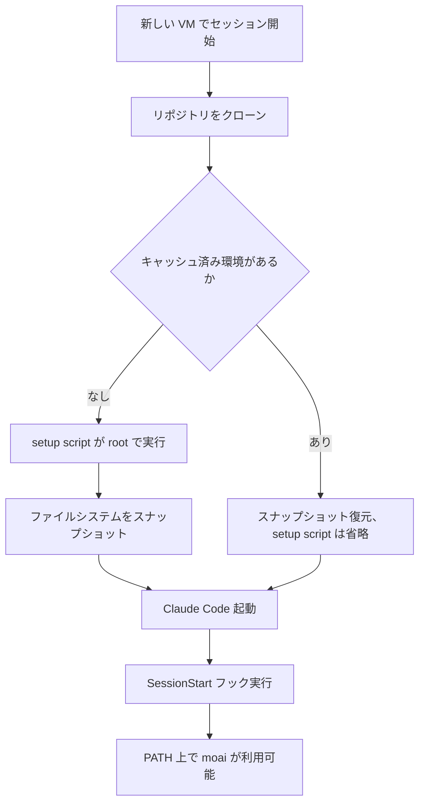

クラウドセッションは、Anthropic が管理する VM 上でリポジトリを新しくクローンして始まります。
MoAI-ADK がリポジトリに置くもの — `CLAUDE.md`、`.claude/settings.json` とそこに配線されたフック、
`.claude/rules/`、`.claude/skills/`、`.claude/agents/`、`.claude/commands/`、`.mcp.json` — は
そのクローンにすべて含まれます。含まれないものが一つだけあります。`moai` バイナリです。
自分のマシンにしかなく、リポジトリに入ったことがないからです。

この一つの欠落を埋めるのが本ガイドです。バイナリがなければ `.claude/settings.json` に配線された
フックは失敗し、`moai` コマンドは見つからず、`.mcp.json` が宣言する MCP サーバーは起動しません。
あれば、クラウドセッションはローカルセッションと同じように動きます。

## レシピ

[claude.ai/code](https://claude.ai/code) で環境設定ダイアログを開き、**Setup script** 欄に
次を貼り付けます。

```bash
#!/bin/bash
curl -fsSL https://raw.githubusercontent.com/modu-ai/moai-adk/main/install.sh \
  | bash -s -- --install-dir /usr/local/bin || true
moai --version || true
```

この短いスクリプトでは三つの点が要になります。いずれも「当然に見える書き方」が失敗するため
そうなっています。

**インストーラを `adk.mo.ai.kr` ではなく `raw.githubusercontent.com` から取得します。** README に
ある `curl -fsSL https://adk.mo.ai.kr/install.sh | bash` は自分のマシン向けです。クラウドセッションの
既定ネットワーク等級 **Trusted** は決められたドメインのみを許可し、`adk.mo.ai.kr` はその一覧に
ありません。GitHub はあります — `github.com`、`raw.githubusercontent.com`、
`objects.githubusercontent.com`、`release-assets.githubusercontent.com` がいずれも到達可能で、
スクリプトとそれがダウンロードするリリース資産の両方をカバーします。
`raw.githubusercontent.com` が返すファイルは、リポジトリ直下の `install.sh` と同一です。

**`--install-dir` は環境変数ではなくフラグで渡します。** インストーラは引数を解析する際に
`INSTALL_DIR` を空にするため、`INSTALL_DIR=/usr/local/bin bash` は黙って無視され、バイナリは
別の場所に置かれます。既定に任せると VM では `$GOPATH/bin` か `~/.local/bin` が選ばれますが、
どちらもセッションの `PATH` にある保証がありません。`/usr/local/bin` にはあります。

**`|| true` が終了コードを守ります。** 終了コードが 0 でない setup script はセッションの起動
そのものを失敗させます。つまりインストール中の一時的なネットワーク不調が、「moai のないセッション」
ではなく「セッションを開けない状態」を生みます。後続の `moai --version` は導入された版を setup
ログに残すためのもので、同じ理由で同じガードを付けます。

## `go install` を使わない理由

Go 利用者に最も自然な書き方は動きません。誰かが半日を費やさないよう、失敗の形をそのまま
記しておきます。

```bash
go install github.com/modu-ai/moai-adk/cmd/moai@latest
# go: module github.com/modu-ai/moai-adk@latest found (v1.14.5),
#     but does not contain package github.com/modu-ai/moai-adk/cmd/moai
```

モジュールパスが `/v3` サフィックスのない `github.com/modu-ai/moai-adk` である一方、Go の
セマンティックインポートバージョニングはメジャー 2 以上にそのサフィックスを要求します。
そのため `@latest` は、サフィックスなしのパスが持ちうる最新タグ `v1.14.5` — `cmd/moai` が
生まれるはるか前 — に解決されます。v3 リリースを名指ししても拒否されます。

```bash
go install github.com/modu-ai/moai-adk/cmd/moai@v3.1.3
# go: invalid version: module contains a go.mod file, so module path must match
#     major version ("github.com/modu-ai/moai-adk/v3")
```

`@main` はビルドできます。ブランチから作られる疑似バージョンはメジャーバージョン規則を
回避するためです。ただしクラウド環境には推奨しません。理由は三つ — バイナリを取得する代わりに
ツリー全体をコンパイルし（暖まったローカルマシンで 1 分 42 秒、インストーラは約 2 秒）、VM の Go が
このモジュールの `go` ディレクティブを満たすほど新しい必要があり、生成されたバイナリには版の
スタンプがないため `moai version` がリリースではなくコンパイル既定値を報告します。後から
「これは何版か」に答えられなくなります。

## 実行順序



setup script は Claude Code の起動前に一度だけ実行されます。その後 Anthropic がファイルシステムを
スナップショットし、以降のセッションの出発点として再利用するため、インストール費用はセッション
ごとではなく一度だけです。スナップショットはディスクに書かれたもの（バイナリを含む）を残し、
単に動いていただけのものは失います。

スクリプトを変更したとき、環境の許可ネットワークホストを変更したとき、そしてスナップショットが
およそ 7 日で期限切れになったときに再実行されます。この周期のため、レシピは特定の版を固定せず
最新リリースを導入します — 再構築のたびに現在の版を拾います。固定したい場合はフラグを足します。

```bash
curl -fsSL https://raw.githubusercontent.com/modu-ai/moai-adk/main/install.sh \
  | bash -s -- --install-dir /usr/local/bin --version 3.1.2 || true
```


setup script はキャッシュが構築されるよう、およそ 5 分以内に終える必要があります。インストーラは
ビルド済みバイナリをダウンロードして数秒で完了するため、残りの予算はプロジェクトが必要とする
他の作業に使えます。


## 確認

クラウドセッションで Claude に次を実行してもらいます。普通のシェルコマンドなので、Claude が
代わりに走らせます。

```bash
which moai              # /usr/local/bin/moai
moai --version          # setup script が導入したリリース
moai doctor             # MCP 配線を含む環境点検
```

`which moai` が空なら、setup script が実行されなかった（キャッシュ済み環境では省略されます）か、
失敗したのに `|| true` がそのエラーを飲み込んだかのどちらかです。スクリプトを修正し（どの編集でも
キャッシュは無効化されます）、新しいセッションを開始して setup ログを読んでください。

## 本ガイドが扱わないこと

環境ダイアログは setup script と環境変数を平文で保持し、その環境を使う人なら誰でも読めます。
専用のシークレットストアはまだありません。このレシピは資格情報を必要とせず、資格情報を運ぶよう
拡張すべきでもありません。プロジェクトが `GH_TOKEN` を必要とする場合、セッションの GitHub
プロキシがトークンなしで `gh` を認証します。
