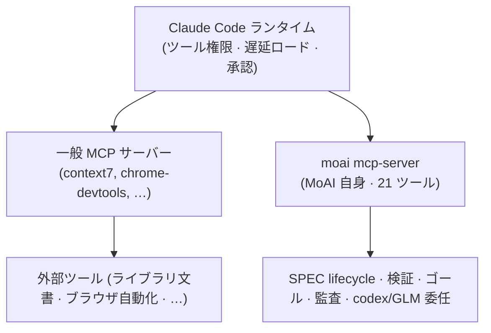

# MCP サーバー

MoAI-ADK は Claude Code の MCP エコシステムの上に乗り、さらにその上に**独自の MCP サーバー**を1つ載せます。バイナリ1つ（`moai mcp-server`）が stdio ローカルサーバーとして動作し、SPEC ライフサイクル監査、検証スナップショット、ゴールエンジン、クロスモデル監査、codex·GLM 委任など、MoAI-ADK 固有の21個のツールを Claude Code ランタイムに公開します。


[**Claude Code 一般 MCP**](/ja/claude-code/extensibility/mcp)はプラットフォーム自身の MCP（Model Context Protocol）統合を扱います — USB ポートの比喩、サーバー登録、転送タイプ、`/mcp` コマンド、OAuth 認証、遅延ロードの原理。

この文書はその上に乗った**MoAI 自身の MCP サーバー**を扱います。2つの表面は同じコア規則を共有しますが、扱う主体が異なります。


## 同じコア、2つの表面

Claude Code の MCP エコシステムと MoAI の独自 MCP サーバーは、互いに別個のサーバーでありながら、**同一の運用原則**の上に置かれます。3つのコア規則を共有します。

| コア規則 | 意味 |
|-----------|------|
| **MCP-over-CLI** | 同じ機能を CLI と MCP ツールの両方に公開しつつ、エージェントの `tools:` リストに MCP ツールがあれば CLI より MCP を優先する。構造化出力、shell-quoting の回避、サブエージェントでの低レイテンシという利点がある。 |
| **遅延ロード** | MCP ツール定義はデフォルトで遅延ロードされる。普段は短いメタデータだけをコンテキストに置き、実際の呼び出し時に `ToolSearch` でスキーマを読み込む。 |
| **権限ゲート** | MCP ツールは Claude の一般ツールと同じ権限ゲートを通る。初回呼び出し時に承認プロンプトがメインセッションに表示され、許可すれば以降の同じツールは再び問わない。 |



ここでの要点は、「MoAI は MCP をプロビジョニングしない」という主張が**半分だけの真実**だという点です。外部 MCP サーバー（context7, playwright など）をデフォルトでプロビジョニングしないのは正しいです。しかし MoAI 自身のサーバー1つは `moai init` の時点で default-on で入ります。このサーバーこそが、MoAI の21ツールカタログが Claude Code に届く通路です。

## .mcp.json プロビジョニング

`moai init` はプロジェクトルートに `.mcp.json`（project scope）を生成し、その中に**正確に1つのアクティブエントリ**を置きます — 自身の `moai` ローカル stdio サーバーです。

```json
{
  "mcpServers": {
    "moai": {
      "command": "moai",
      "args": ["mcp-server"]
    }
  },
  "staggeredStartup": {
    "enabled": true,
    "delayMs": 500,
    "connectionTimeout": 15000
  }
}
```

`staggeredStartup` はサーバーが順次起動するように調整する Claude Code ランタイムのフィールドです。サーバーが複数あるとき同時起動の競合（race）を防ぎます。

### 4つの documented-but-disabled エントリ

配布デフォルトは `moai` サーバー1つだけがアクティブです。4つの外部サーバーは文書に記録されていますが無効状態で、`moai mcp add <名前>` コマンドで有効にします。

| サーバー | 用途 | 有効化 |
|------|------|--------|
| `context7` | 最新ライブラリ公式文書の照会 (resolve-library-id, get-library-docs) | `moai mcp add context7` |
| `chrome-devtools` | ヘッドレスブラウザ自動化 | `moai mcp add chrome-devtools` |
| `playwright` | ブラウザ自動化 + E2E テスト | `moai mcp add playwright` |
| `ast-grep` | 構造的コード検索とリファクタリング | `moai mcp add ast-grep` |

### 中立性契約

`.mcp.json` は git-tracked ファイルです。そのため「秘密を載せるエントリ、資格情報が必要なエントリ、中立性検査に失敗するエントリ」は**禁止**されます。すべての環境変数値は `${VAR}` リテラルで書きます — Claude Code ランタイムが実際の値を展開し、解釈された秘密が git-tracked な `.mcp.json` に直列化されません。

```json
{
  "remote-needs-auth": {
    "type": "http",
    "url": "https://mcp.example.com/sse",
    "headers": {
      "Authorization": "Bearer ${MY_API_KEY}"
    }
  }
}
```

`${MY_API_KEY}` はランタイムが環境変数から埋めます。ファイル自体にはリテラル文字列しか残らないため、秘密がリポジトリに公開されません。

### atomic-RWM 管理

ユーザーが直接 `.mcp.json` を手編集しません。`moai mcp add|remove|list` CLI がファイルを管理し、この CLI は atomic-RWM シーム（flock ファイルロック + compare-retry + バックアップ後書き込み + idempotent-skip）で動作します。2つのセッションが同時に編集しても、一方の変更がもう一方を上書きしません。

## 21-ツールカタログ

`moai mcp-server` が公開する21個のツールは6つのグループに分かれます。呼び出し時点ではすべて `mcp__moai__` 接頭辞が付きます。

### SPEC ライフサイクル

| ツール | 目的 | 消費エージェント | CLI 等価物 |
|------|------|---------------|------------|
| `mcp__moai__spec_progress` | SPEC 文書リスト + frontmatter 照会 | manager-spec, manager-docs | `moai spec list` |
| `mcp__moai__spec_audit` | SPEC ライフサイクル監査（時代分類 + ドリフト） | manager-spec, manager-docs, plan-auditor, super-advisor | `moai spec audit` |
| `mcp__moai__spec_drift` | 現代時代 V3R6 ドリフト発見 | manager-spec, plan-auditor | `moai spec audit` (drift ビュー) |

plan-phase（manager-spec が新しい SPEC を執筆するとき、時代分類とドリフト確認）と sync-phase（manager-docs がライフサイクル終結を検証するとき）で使われます。plan-auditor は `spec_audit` / `spec_drift` で plan-phase の懐疑的検討を行います。

### 検証スナップショット

| ツール | 目的 | 消費エージェント | CLI 等価物 |
|------|------|---------------|------------|
| `mcp__moai__verify_snapshot` | キーごとの検証スナップショット読み取り/記録 | manager-develop | `moai verify check` |
| `mcp__moai__verify_trend` | キーごとの検証履歴推移 | manager-develop, sync-auditor, super-advisor | `moai verify check` |

manager-develop が run-phase の自己検証（継ぎ目 §E）で使い、sync-auditor と super-advisor は推移を検討します。`verify_snapshot` は HEAD ダイジェストをキーとするスナップショットを読み取るか記録し、`verify_trend` は収束判断のための履歴を明らかにします。

### ゴール + セッション（自律ループ）

| ツール | 目的 | 消費エージェント | CLI 等価物 |
|------|------|---------------|------------|
| `mcp__moai__goal_arm` | 条件宣言ゴール武装 | **オーケストレータ メインセッション専用**（いかなるエージェントにも配線されない） | `moai goal arm` / `/moai goal` |
| `mcp__moai__goal_status` | 武装されたゴール状態読み取り | manager-develop, manager-kanban | `moai goal status` |
| `mcp__moai__session_list` | アクティブな moai セッション一覧 | manager-kanban | `moai session list` |

`goal_arm` はオーケストレータ専用です — 自律ループの武装はオーケストレータの関心事なので、エージェントの中からは呼び出しません。平坦階層の武装表面を保つための設計です。`goal_status` は manager-develop / manager-kanban が武装された条件の進行を読むチャネルで、`session_list` は manager-kanban がファンアウト前に同一チェックアウトの同時セッションを検出する競合緩和の手段です。

### クロスモデル監査（第二の意見）

| ツール | 目的 | 消費エージェント | CLI 等価物 |
|------|------|---------------|------------|
| `mcp__moai__audit_multi` | 多重監査者収束（claude + codex + glm） | plan-auditor, sync-auditor | — （MCP 専用の収束エントリポイント） |
| `mcp__moai__codex_audit` | codex バックエンド単一監査（ネイティブ/敵対的） | plan-auditor, sync-auditor | — |
| `mcp__moai__glm_audit` | GLM (z.ai) バックエンド単一監査 | plan-auditor, sync-auditor | — |
| `mcp__moai__audit_cache` | plan-audit PASS キャッシュ（compute_hash / lookup / store、プロセス間共有） | sync-auditor | `moai audit cache` |

単一バックエンド監査モードはプロジェクトの `audit_model` 設定で決まります: `codex+glm`（デフォルト、`audit_multi` で収束）| `glm` | `codex` | `none`（Claude 単独、バックエンド呼び出しなし）。すべてのバックエンドは fail-open です — 利用不可なバックエンドは `inconclusive` を返し、Go error ではありません。

### codex 委任（バックグラウンドジョブ）

| ツール | 目的 | 消費エージェント | CLI 等価物 |
|------|------|---------------|------------|
| `mcp__moai__codex_task` | コーディング/調査ジョブを codex に委譲（同期またはバックグラウンド） | super-advisor | `moai codex task` |
| `mcp__moai__codex_setup` | ローカル codex インストール検出（LookPath + バージョン + 認証） | super-advisor | `moai codex setup` |
| `mcp__moai__codex_job_status` | バックグラウンド codex ジョブ状態/記録読み取り | super-advisor | `moai codex job status` |
| `mcp__moai__codex_job_result` | バックグラウンド codex ジョブ出力読み取り | super-advisor | `moai codex job result` |
| `mcp__moai__codex_job_cancel` | 実行中のバックグラウンド codex ジョブ中断 | super-advisor | `moai codex job cancel` |

codex 委任ツール群は super-advisor に配線されています — 随時の高推論相談エージェントがバックグラウンドのクロスモデル委譲の自然な消費者だからです。`codex_task` でジョブを委譲し、`codex_job_status` / `codex_job_result` で完了をポーリングし、`codex_job_cancel` で中断します。codex は選択的（optional）です — 欠落や利用不可なら fail-open な `inconclusive` を返し、hard error ではありません。

### GLM 委任（バックグラウンドジョブ）

| ツール | 目的 | 消費エージェント | CLI 等価物 |
|------|------|---------------|------------|
| `mcp__moai__glm_task` | ジョブ(任意のプロンプト)を GLM(z.ai) に委譲（同期またはバックグラウンド） | super-advisor | — （該当 CLI なし） |
| `mcp__moai__glm_job_status` | バックグラウンド GLM ジョブの状態/記録読み取り | super-advisor | — |
| `mcp__moai__glm_job_result` | バックグラウンド GLM ジョブの出力読み取り | super-advisor | — |
| `mcp__moai__glm_job_cancel` | 実行中のバックグラウンド GLM ジョブの中断 | super-advisor | — |

GLM 委任ツール群は codex 委任と同じ形で super-advisor に配線されています。`glm_task` は `background` が偽なら完了したテキストをそのまま返し、真なら即座にジョブ ID を返します(以降は `glm_job_status`·`glm_job_result`·`glm_job_cancel` で観察・中断)。応答トークン上限は `max_tokens` で上書きでき、既定の上限値はサーバー側で定められています。バックグラウンドジョブはサーバープロセスの中で生きるため、プロセスが終われば一緒に終わります。GLM も選択的です — キーがないか z.ai に届かなければ構造化された fail-open 結果を返すだけで、ツールエラーではありません。

### MCP-over-CLI 規則

エージェントの `tools:` リストに MCP ツールがあれば CLI より MCP 経路を優先します。両経路は背後で**同じ実装**を実行します。MCP 経路が有利な理由は3つあります:

- 構造化された出力を返す（パースが不要）
- shell-quoting のリスクを避ける
- サブエージェントで Bash が制限されうる環境で低レイテンシで動作する

CLI は MCP ツールが `tools:` リストにないとき、またはメインセッションで CLI 形式がより自然なときだけ使います。

## 認証

### GLM (z.ai)

GLM セッション（`moai glm` または `moai cg` の GLM パネル）で実行すると、ウェブ検索とウェブ照会が組み込みの `WebSearch` / `WebFetch` の代わりに z.ai MCP ツールへルーティングされます。認証は `~/.moai/.env.glm` から読み込まれます。

z.ai MCP サーバー（`zai-mcp-server`, `web_search_prime`, `web_reader`）はデフォルトで無効で、GLM セッションで `moai glm tools enable` で有効にします。GLM セッションでのルーティング規則は[マルチ LLM バックエンド](/ja/multi-llm/)を参照してください。

### codex

codex 監査 / 委任ツール（`codex_audit`, `codex_task` など）は `~/.codex/auth.json` から認証資格を読み取ります。codex は**選択的**です — 認証ファイルがない、または codex がインストールされていなければ、該当ツールは `inconclusive` を返して続行します。エージェントの作業が codex の可用性に縛られない設計です。

### すべてのバックエンドは fail-open

GLM、codex、Claude — 3つのバックエンドはすべて fail-open 原則に従います。利用不可なバックエンドは `inconclusive` を返すだけで、Go error を起こしません。1つのバックエンドが欠けても残りで監査が収束し、どのバックエンドもなければ Claude 単独で動作します（`audit_model: none`）。

## バックグラウンドジョブ進行追跡

codex·GLM 委任ツールのうち `codex_task` と `glm_task` は `background: true` でバックグラウンドジョブを開始できます。この場合ジョブが終わるまで待たず、即座にジョブ ID を返します。

進行状況は2つのツールでポーリングします (下は codex の例 — GLM は `glm_job_*` が同じ役割を担います):

```text
codex_task(background=true) ──▶ ジョブ ID 返却
       │
       ├── codex_job_status(ジョブ ID) ──▶ 実行中 / 完了 / 失敗
       │
       └── codex_job_result(ジョブ ID) ──▶ 完了時に出力読み取り

必要なら codex_job_cancel(ジョブ ID) ──▶ 中断
```

MCP コンソール（ウェブコンソール）でツールごとの設定と認証状態を確認できます。コンソール機能の詳細は[ウェブコンソール](/ja/advanced/moai-web-console)を参照してください。

## 遅延ロードと ToolSearch

MoAI 自身の MCP サーバーも Claude Code 一般 MCP と同じ遅延ロード原則に従います。ツール定義全体をコンテキストに常時ロードするとコンテキストウィンドウがすぐに埋まるため、普段は短いメタデータだけを置き、実際の呼び出し時にスキーマを読み込みます。

遅延ツールを呼び出すには、まず `ToolSearch` でスキーマをアクティブコンテキストに読み込む必要があります。

```text
ツールが必要になる ──▶ {スキーマがコンテキストにあるか?}
                           │
                    ┌──────┴──────┐
                    いいえ          はい
                    │              │
            ToolSearch で         ツール呼び出し
            スキーマ先行ロード
                    │
                    └──▶ ツール呼び出し
```

この手順を飛ばすと、ツール呼び出しは検証エラーで拒否されます。遅延ロードの原理に関する背景説明は [Claude Code 一般 MCP](/ja/claude-code/extensibility/mcp) 文書の「遅延ロードと Tool Search」節を参照してください。

## 関連文書

- [Claude Code 一般 MCP](/ja/claude-code/extensibility/mcp) — プラットフォーム自身の MCP 統合（USB ポートの比喩、サーバー登録、転送タイプ、`/mcp` コマンド）
- [マルチ LLM バックエンド](/ja/multi-llm/) — Claude × GLM マルチバックエンド運用 · GLM セッションでウェブ検索/照会が z.ai MCP ツールへルーティングされる規則
- [クロスモデル監査](/ja/advanced/multi-model-audit) — 多重監査者収束メカニズム
- [ウェブコンソール](/ja/advanced/moai-web-console) — MCP ツールごとの設定と認証表面
